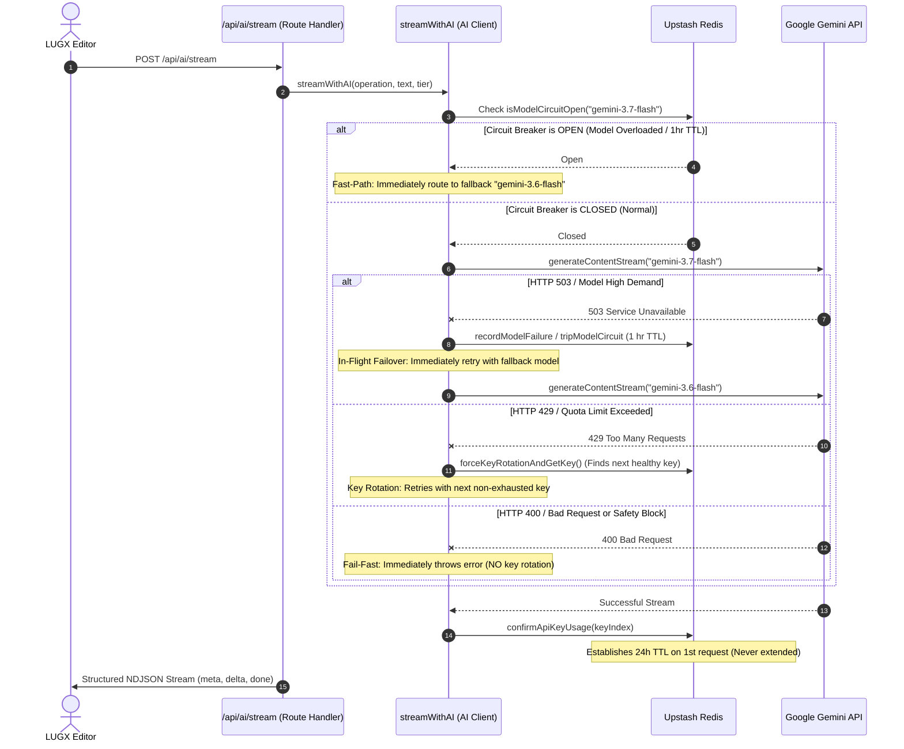

# AI Key Rotation, Model Fallback & Resilient Streaming Architecture in LUGX

## 1. Executive Summary

This document describes the architectural design, failover mechanics, 24-hour fixed quota lifecycle, Redis-backed state management for Google Gemini API key rotation, Distributed Circuit Breaker (Model Failover), and real-time streaming in LUGX.

---

## 2. Distributed Circuit Breaker & Multi-Tier Model Failover

### 2.1 Model Declaration Hierarchy (`src/config/models.config.json`)
All AI models (primary and fallback) are strictly declared within `src/config/models.config.json` per operation and subscription tier:

```json
{
  "correct": {
    "free": "gemini-3.7-flash",
    "pro": "gemini-3.7-flash",
    "ultra": "gemini-3.7-flash",
    "fallback": {
      "free": "gemini-3.6-flash",
      "pro": "gemini-3.6-flash",
      "ultra": "gemini-3.6-flash"
    },
    "temperature": 0.1,
    "topP": 0.75
  },
  "improve": { ... },
  "summarize": { ... },
  "toPrompt": { ... },
  "translate": { ... }
}
```

---

## 3. Dual-Layer Failover & 24-Hour Key Rotation Mechanics



---

## 4. Key Components & Responsibilities

### 4.1 Key Rotation Engine (`src/lib/ai/key-rotation.ts`)
* **Multi-Key Pool**: Dynamically aggregates all valid keys (`GEMINI_KEY_1` to `GEMINI_KEY_20`).
* **Fixed 24-Hour Quota Lifecycle**:
  - `gemini:usage_count:{index}`: When the key receives its first request (`count === 1`), a 24-hour TTL (86,400s) is established.
  - **Zero TTL Extension:** Subsequent requests (`count > 1`) do not reset or extend the TTL.
  - **No Forced Resets:** When rotating, existing counter values are preserved without zeroing (`redis.set(usageKey, 0)` is strictly forbidden).
* **Pool Exhaustion & Cooldown Tracking**:
  - If all keys reach 20 requests in their active 24h cycle, the system calculates `minRemainingTTL = min(TTL_i)` and raises `AllKeysExhaustedError`.
* **Error Classification & Fail-Fast**:
  - **Rotatable:** `401`, `403`, `429`, `500`, `502`, `503`, `504`, Transient Network Resets.
  - **Non-Rotatable (Fail-Fast):** `400` (Bad Request / Prompt Format / Safety Violations).
* **Zero Key & Prompt Leakage:** Logs only abstract indices (`Key #1 (2/8)`) without printing raw credentials or prompts.

### 4.2 In-Flight Deduplication & Double-Click Protection
* **Client Mutex (`useAIStream`):** Rejects concurrent duplicate clicks if a stream is already active in `reserved`, `streaming`, or `committing` state.
* **Server Race Recovery (`reserveAndUpdateUsage`):** If concurrent duplicate requests race on the same `operationId`, the duplicate request catches the unique constraint collision, automatically reverses its speculative increment on `schema.usage`, and returns the winner's reservation.

### 4.3 AI Client (`src/lib/ai/client.ts`)
* **Zero-Latency Fast-Path**: Directly routes to the fallback model when the primary model's circuit breaker is open.
* **In-Flight 503 Failover**: Seamlessly switches from primary to fallback in the active request without exposing errors to the user.
* **Stream Abort & Disconnect Protection**: Transmits `AbortSignal` to the client stream and triggers server-side auto-refund on cancellation.

### 4.4 NDJSON Stream Route (`src/app/api/ai/stream/route.ts`)
* **Resilient Framing**: Delivers `meta`, `delta`, and `done` frames.
* **Graceful Fault Trapping**: Emits NDJSON `error` events for mid-stream disruptions.
* **Automated Server-Side Refund**: Invokes `refundAIReservation` on socket disconnect (`req.signal.aborted` or `cancel()`).

---

## 5. Verification & Test Evidence

Fully tested and validated via automated test suites:
- `src/lib/ai/key-rotation.test.ts` (34 tests): 24h fixed window, no blind resets, cooldown estimation, error classification.
- `src/lib/ai/client.test.ts` (28 tests): Model configuration, fast-path circuit breaker, in-flight 503 failover, streaming.
- `src/server/actions/ai-ops.integrity.test.ts` (6 tests on real PostgreSQL): Concurrency races, single charge on duplicates, cross-midnight safety, blind refund rejection.
- `src/server/actions/ai-ops.refund.test.ts` (5 tests on real PostgreSQL): Bounded subtraction, underflow safety, quota restoration.
- `src/test/ai-stream-session.test.ts` (10 tests): User manual edit protection, state machine integrity.
