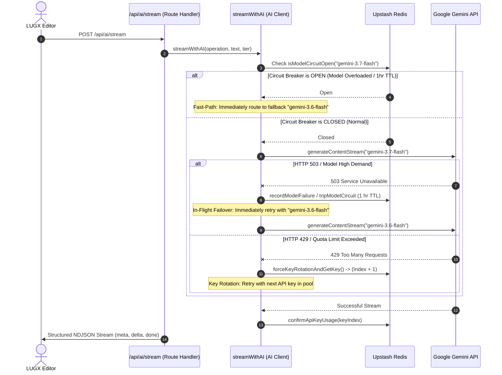

# AI Key Rotation, Model Fallback & Resilient Streaming Architecture in LUGX

## 1. Executive Summary

This document describes the architectural design, failover mechanics, and Redis-backed state management for Google Gemini API key rotation, Distributed Circuit Breaker (Model Failover), and real-time streaming in LUGX.

---

## 2. Distributed Circuit Breaker & Multi-Tier Model Failover

### 2.1 Model Declaration Hierarchy (`src/config/models.config.json`)
All AI models (primary and fallback) are strictly declared within `src/config/models.config.json` per operation and subscription tier:

```json
{
  "correct": {
    "free": "gemini-3.7-flash",
    "pro": "gemini-3.7-flash",
    "ultra": "gemini-3.7-flash",
    "fallback": {
      "free": "gemini-3.6-flash",
      "pro": "gemini-3.6-flash",
      "ultra": "gemini-3.6-flash"
    },
    "temperature": 0.1,
    "topP": 0.75
  },
  "improve": { ... },
  "summarize": { ... },
  "toPrompt": { ... },
  "translate": { ... }
}
```

---

## 3. Dual-Layer Failover Mechanics



---

## 4. Key Components & Responsibilities

### 4.1 Key Rotation & Circuit Breaker Engine (`src/lib/ai/key-rotation.ts`)
* **Multi-Key Pool**: Dynamically aggregates all valid keys (`GEMINI_KEY_1` to `GEMINI_KEY_20`).
* **Redis State Tracking**:
  - `gemini:current_key_index`: Active key index.
  - `gemini:usage_count:{index}`: Usage counter per key (capped at 20 with 1h TTL).
  - `gemini:circuit_breaker:{modelName}`: Distributed Circuit Breaker flag (`"open"` with 1-hour TTL).
* **Error Classification**:
  - `429 Too Many Requests`: Triggers Key Rotation.
  - `503 Service Unavailable` / `High Demand`: Triggers Model Circuit Breaker & Fallback.

### 4.2 AI Client (`src/lib/ai/client.ts`)
* **Zero-Latency Fast-Path**: Directly routes to the fallback model when the primary model's circuit breaker is open.
* **In-Flight 503 Failover**: Seamlessly switches from primary to fallback in the active request without exposing errors to the user.
* **Unhandled Rejection Silencing**: Attaches `.catch()` to SDK stream response promises.

### 4.3 NDJSON Stream Route (`src/app/api/ai/stream/route.ts`)
* **Resilient Framing**: Delivers `meta`, `delta`, and `done` frames.
* **Graceful Fault Trapping**: Emits NDJSON `error` events for mid-stream disruptions.
* **Automated Refund**: Invokes `refundAIReservation` on aborts or server-side stream failures.

---

## 5. Verification & Testing

* **Unit Tests**: `src/lib/ai/client.test.ts` & `src/lib/ai/key-rotation.test.ts` (64 tests passed).
* **Live Integration**: `src/test/ai-live-e2e.test.ts` (Validates live streaming, text enhancement, and Redis persistence).
