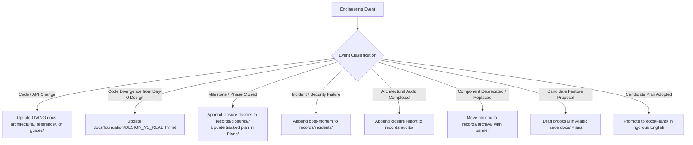
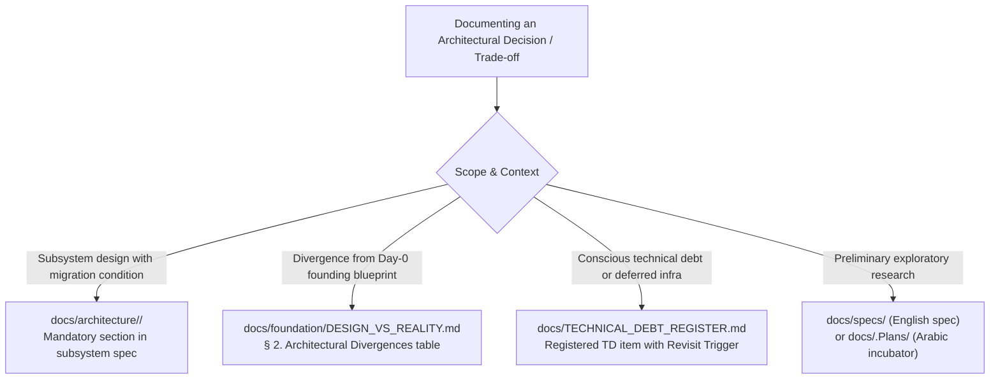

# Documentation Guidelines & Governance

This is the binding policy for creating, updating, and retiring documentation
under `docs/`. Operational enforcement directives additionally live in the local
agent rules (`.agents/rules/docs-governance.md`) and take precedence during
execution sessions.

---

## 1. Single Source of Truth Rule

**The source code and its tests are the sole authority.** When any document
contradicts the code, the document is wrong by definition and must be corrected
— never the reverse. Every factual claim in a living document must be traceable
to a source file, route, migration, or test.

---

## 2. Directory Layout & Nested Subdirectories

| Folder | Content & Scope | Lifecycle & Modification Bounds |
| :--- | :--- | :--- |
| `docs/` (root) | `README.md` (master index), `DOCUMENTATION_GUIDELINES.md`, `CHANGELOG.md`, `TECHNICAL_DEBT_REGISTER.md` | Living root registers — must track repository structural state |
| `architecture/` | Subsystem designs organized by functional domains (`sync/`, `ai/`, `security/`) | **LIVING SPEC:** Mandatory updates when module architectures or data flows change |
| `reference/` | Living API references, client hooks, and testing isolation contracts (`sync-api.md`, `ui-streaming-readiness.md`, `test-database-isolation.md`) | **LIVING CONTRACT:** Mandatory updates on endpoint, schema, status code, or isolation rule changes |
| `specs/` | Design blueprints and technical requirement specifications (`ai-key-rotation-and-resilience.md`, `offline-sync-blueprint.md`, `ui-streaming-requirements.md`) | **DESIGN BLUEPRINT:** Updated ahead of major redesigns; never used for post-implementation logs |
| `guides/` | Operational developer guides organized by domain (`billing/`, `editor/`, `ai/`) | **LIVING GUIDE:** Updated to keep developer onboarding and operational steps reproducible |
| `Plans/` | **Tracked Execution Plans (English):** Official roadmaps and technical execution plans tracked in Git for completed or active milestones | **TRACKED PLANS:** Living during execution, permanent milestone plan once closed |
| `.Plans/` | **Internal Planning Incubator (Arabic):** Untracked in Git (`.gitignore`); workspace for drafting, evaluating, and incubating future candidate roadmaps in Arabic before adoption | **INTERNAL INCUBATOR:** Freely mutable draft workspace; untracked in Git |
| `records/` | Engineering records, incident post-mortems, and official milestone closures: | **PERMANENT HISTORY (Append-Only):** Never rewritten retroactively |
| ├── `incidents/` | Post-mortem root-cause analyses and remediation designs (`test-database-safety.md`) | Permanent incident record |
| ├── `audits/` | Architectural verification audit closure records (`W10-Final-Closure-Round.md`) | Permanent audit record |
| ├── `closures/` | Phase closure dossiers organized by milestone bundles (Phases 1–6, 11–15, 16, 17–20, extensions) | Historical milestone closures |
| └── `archive/` | Superseded development session logs and legacy snapshots (`legacy-milestones`, `sync-system-legacy-snapshot.md`) | Historical archive |
| `foundation/` (Day-0 artifacts) | Founding pre-implementation design record (PRD, initial architecture, UI/UX guidelines, system prompts). **Preserved verbatim** as the foundational baseline against which `DESIGN_VS_REALITY.md` measures architectural evolution and code divergence | **IMMUTABLE DAY-0 BASELINE:** Strictly read-only; never edited or extended |
| `foundation/DESIGN_VS_REALITY.md` | **Living Reality Reconciler & Divergence Auditor:** The sole active reconciliation document inside `foundation/` bridging founding theory with active code | **LIVING RECONCILER (Explicit Exemption):** Must be updated whenever active code diverges from or reaffirms Day-0 foundational designs |

---

## 3. Permissible Modification Boundaries Matrix

| Directory / Target | Classification | Permitted Modifications | Strict Prohibitions |
| :--- | :--- | :--- | :--- |
| `docs/foundation/` (Day-0) | `IMMUTABLE BASELINE` | None. Pure read-only historical Day-0 baseline. | Any edits to PRD, system architecture, or subscription plans. |
| `docs/foundation/DESIGN_VS_REALITY.md` | `LIVING RECONCILER` | Synchronizing architectural divergence, preserved continuities, and active runtime realities. | Freezing into an immutable record; allowing divergence drift against active code. |
| `docs/records/` | `PERMANENT HISTORY` | Appending new incident reports, audits, phase closures, or archiving deprecated files with banners. | Editing past test figures, rewriting historical session narratives, or deleting past records. |
| `docs/architecture/` | `LIVING SPEC` | Updating sequence flows, component interactions, and state machines to match active code. | Allowing architectural documentation to contradict active code. |
| `docs/reference/` | `LIVING CONTRACT` | Updating endpoint schemas, status codes, query parameters, hook interfaces, and isolation guards. | Dumping milestone closure reports or historical logs (which belong in `records/closures/`). |
| `docs/guides/` | `LIVING GUIDE` | Updating setup sequences, configuration steps, and operational workflows. | Documenting unverified, non-reproducible manual instructions. |
| `docs/specs/` | `DESIGN BLUEPRINT` | Updating technical requirements prior to major implementation work. | Treating specs as operational work logs. |
| `docs/Plans/` | `TRACKED PLANS` | Maintaining and adding rigorous English execution plans for active or completed milestones. | Storing unapproved drafts or Arabic incubator notes. |
| `docs/.Plans/` | `INTERNAL INCUBATOR` | Drafting, incubating, and evaluating future candidate plans in Arabic. | Tracking in Git (must remain in `.gitignore`), or treating as approved plans. |
| `src/**` | `CODE EXCLUSIVE` | TypeScript source and test files only. | **Strictly prohibited:** Creating or keeping any `README.md` or markdown files in `src/`. |

---

## 4. Operational Trigger-Action Guide (When to Do What)



### Operational Scenarios:
1. **Source Code or Interface Modification:**
   - Immediately trace and update the corresponding living document in `architecture/` (for structural/data-flow changes), `reference/` (for API, hook, or schema contracts), or `guides/` (for setup or developer usage).
2. **Divergence from Founding Day-0 Design:**
   - Update `docs/foundation/DESIGN_VS_REALITY.md` to document the divergence rationale, active implementation path, and verified verification source. Never alter the founding Day-0 files themselves.
3. **Milestone or Phase Completion:**
   - Compile a closure dossier and save it in the appropriate bundle under `docs/records/closures/<bundle>/`. Update the corresponding technical execution plan in `docs/Plans/`.
4. **Production Incident or Concurrency Failure:**
   - Author a root-cause forensic report and remediation design in `docs/records/incidents/`.
5. **Architectural Verification Audit:**
   - Document the comprehensive audit results in `docs/records/audits/`.
6. **Component Deprecation or Replacement:**
   - Move the obsolete living document to `docs/records/archive/` and prepend a point-in-time archival banner directing readers to the active replacement. Do not delete historical technical context.
7. **Future Feature Incubation:**
   - Create and iterate on candidate proposals in Arabic inside `docs/.Plans/`. Keep the directory untracked in `.gitignore`.
8. **Plan Adoption for Execution:**
   - Translate, synthesize, and promote the plan into a formal English execution plan in `docs/Plans/` following the high-rigor standard of `TECHNICAL_EXECUTION_PLAN.md`.

---

## 5. Architectural Decisions, Trade-offs & Migration Triggers

Any architectural choice involving trade-offs, alternative libraries, or deferred complexity must be formally documented within one of four designated tiers:



### Four-Tier Trade-off Classification Matrix

| Tier | Decision Classification | Target Location | Required Content & Invariants | Codebase Precedents |
| :--- | :--- | :--- | :--- | :--- |
| **Tier 1: Subsystem Specs** | Selecting a library, protocol, or state machine for a specific component, specifying the boundary condition for replacing it. | `docs/architecture/<domain>/<feature>.md` | Must include sections:<br>• `## Architectural Decisions & Trade-offs`<br>• `## Alternative Architectures & Migration Triggers`<br>Specifying the chosen architecture, discarded options, trade-off matrix, and the explicit **Migration Trigger**. | • Choosing **Diff3** over **CRDTs (Yjs)**: Diff3 is optimal for single-user multi-device sync; trigger to migrate to CRDTs is multi-user simultaneous real-time collaboration.<br>• Choosing **CodeMirror 6** over **Monaco/TipTap**: Lightweight extensibility. |
| **Tier 2: Foundational Divergence** | Replacing or abandoning an architectural choice originally specified in the Day-0 foundational blueprint (`docs/foundation/`). | `docs/foundation/DESIGN_VS_REALITY.md` | Add/update entry in `§ 2. Architectural Divergences` table with columns: `Founding design`, `Current reality`, and `Architectural Rationale`. | • Replacing **TipTap** with **CodeMirror 6**.<br>• Dropping **Supabase Storage** for **Neon BYTEA + IndexedDB** to support zero-knowledge encryption. |
| **Tier 3: Accepted Debt & Deferred Decisions** | Pragmatic compromises accepting performance constraints, operational limitations, or deferred infrastructure to optimize delivery velocity. | `docs/TECHNICAL_DEBT_REGISTER.md` | Register a new `TD-XX` item with:<br>• `Original Debt / Trade-off`<br>• `Decision Owner & Rationale`<br>• `Conditions to Revisit / Reverse` | • Using **Upstash Redis REST** over persistent WebSockets/TCP to prevent resource leaks in stateless serverless runtimes.<br>• Declining **files_audit** trigger tables to conserve Neon write IOPS (TD-03). |
| **Tier 4: Pre-implementation Exploration** | Comparative analysis evaluating candidate libraries, algorithms, or protocols prior to implementation. | `docs/specs/` (English)<br>or `docs/.Plans/` (Arabic) | Full evaluation matrix comparing complexity, latency, memory footprint, and security posture. | • Cryptographic benchmark evaluation between **PBKDF2 via Web Worker** vs. **WASM Argon2id**. |

### Standard Trade-off Documentation Template

When documenting a trade-off within any living architectural document in `docs/architecture/`, adhere to this template:

```markdown
## Architectural Decisions & Trade-offs

### Decision: [Title of Decision — e.g., Choosing Diff3 over CRDTs for Offline Sync]

- **Context:** [Problem definition and operational constraints]
- **Chosen Architecture:** [Selected library, pattern, or protocol]
- **Rejected Alternatives:** [Discarded libraries or approaches]
- **Trade-off Analysis:**
  | Evaluation Criteria | Chosen Solution ([Choice]) | Alternative ([Discarded]) |
  | :--- | :--- | :--- |
  | Implementation Complexity | Low / Deterministic | High |
  | Memory / Storage Overhead | Minimal | High (tombstones / history) |
  | Conflict Resolution Model | Operational LWW + 3-Way Merge | Continuous Convergence |

- **Migration Trigger (When to Switch):**
  [Exact quantitative, technical, or product condition that mandates migrating to the alternative].
```

---

## 6. Decision Policy: Create vs. Update vs. Merge

### Creating a NEW documentation file is FORBIDDEN unless ALL of the following hold:
1. A **major change** occurred in a software module.
2. That change is **not directly related to any existing documentation file**
   in the current sections.
In every other case, the relevant existing file MUST be edited exclusively —
no new files.

### Creating a NEW folder or main section is FORBIDDEN unless BOTH hold:
1. An entirely new infrastructure or technical system is being established
   whose tasks do not fall under any existing folder.
2. **Explicit prior approval from the user** has been obtained before the
   folder or section is adopted.

### Structure synchronization (mandatory):
- The approved design standards and the exact current organizational structure
  are documented in [`README.md`](./README.md).
- Whenever any folder is renamed or a new section is created, `README.md`
  MUST be updated **immediately** to reflect the latest structure.
- After any code change, all affected files MUST be traced and inspected to
  update any numbers, references, or technical documentation impacted by the
  change — fully synchronized within the same change.

### MERGE / RETIRE when:
1. Two files cover >60% overlapping scope — merge into the stronger one and
   leave a redirect note in `records/` if the merged content had historical value.
2. A documented component was deleted from the codebase: move the file to
   `records/` with a "Superseded/Removed" banner rather than deleting it outright,
   unless it contains no historical value.

---

## 7. Evidence Discipline (Mandatory)

Any published metric must be reproducible:

- Test counts / pass rates require: **date + branch or commit SHA + the exact
  command run** (e.g., `npx vitest run`), and ideally the raw output.
- Performance figures require methodology (dataset size, environment, iterations)
  or must be labeled *"historical observation — unbenchmarked"*.
- Never publish bare totals ("225 tests passing") as current truth; prefer
  "as of `<date>`" phrasing plus a verification command.
- Static counts (`grep`) are approximations; runtime output wins.

Historical documents that cannot be re-verified receive a point-in-time banner:

```markdown
> **Point-in-time record (<date>).** Metrics below reflect the repository state
> at that date; re-run `<command>` for current numbers.
```

---

## 8. Linking Rules

- **Relative links only.** Absolute paths (`file:///`, `/Users/...`, `D:\...`)
  are forbidden inside `docs/`.
- Link between related documents using their post-restructure locations, e.g.
  from this folder: [`SYNC_API`](./reference/sync-api.md); from a subfolder
  such as `architecture/` the same target is `../reference/sync-api.md`
  (paths inside link parentheses must start with `./` or `../`).
- Prefer linking to symbols/functions over line numbers; line references rot silently.
- References into `src/` use relative paths such as `../../src/lib/sync/sync-manager.ts`.

---

## 9. Document Template (Clean Markdown Standards)

```markdown
# <Title>

<One-paragraph scope statement>

---
## 1. Overview & Objectives
## 2. Architecture / Contract                  <!-- tables + mermaid preferred -->
## 3. Implementation Details                   <!-- anchored to src/ files -->
## 4. Architectural Decisions & Trade-offs     <!-- comparison matrix + rationales -->
## 5. Alternative Architectures & Triggers     <!-- explicit migration thresholds -->
## 6. Verification & Test Evidence             <!-- evidence-discipline rules apply -->
## 7. Related Documentation                    <!-- relative links -->
```

Conventions: English only; one H1 per file; fenced code blocks with language
tags; tables for matrices; mermaid for flows/state machines; no orphan sections.

---

## 10. Review Cadence

1. **With every code PR:** docs describing touched modules must be updated or
   the PR explains why no update is needed.
2. **With every release:** bump `CHANGELOG.md`; re-check `TECHNICAL_DEBT_REGISTER.md`
   entries; verify all index links in `README.md` resolve.
3. **Quarterly audit:** spot-check `reference/` contracts against routes
   (response shapes, status codes, rate limits) and `architecture/` diagrams
   against implementations.

---

## 11. Prohibitions & Core Invariants

- **Immutability of Records & The DESIGN_VS_REALITY Exemption:** Do not modify `records/` content retroactively (banners at the top only). Do not modify founding Day-0 files under `docs/foundation/`—with the **sole explicit exemption** of `docs/foundation/DESIGN_VS_REALITY.md`, which is a living reconciliation document required to co-evolve with the code.
- **Code Directory Purity:** Do not create or retain any `README.md` or markdown documentation files inside source directories (`src/**`). All platform documentation must reside within `docs/`.
- Do not delete documentation sections without demonstrating they no longer map to existing code.
- Do not document planned behavior as if implemented — label it *planned* and link the tracking item.
- Do not copy test counts between documents; cite the owning record instead.
