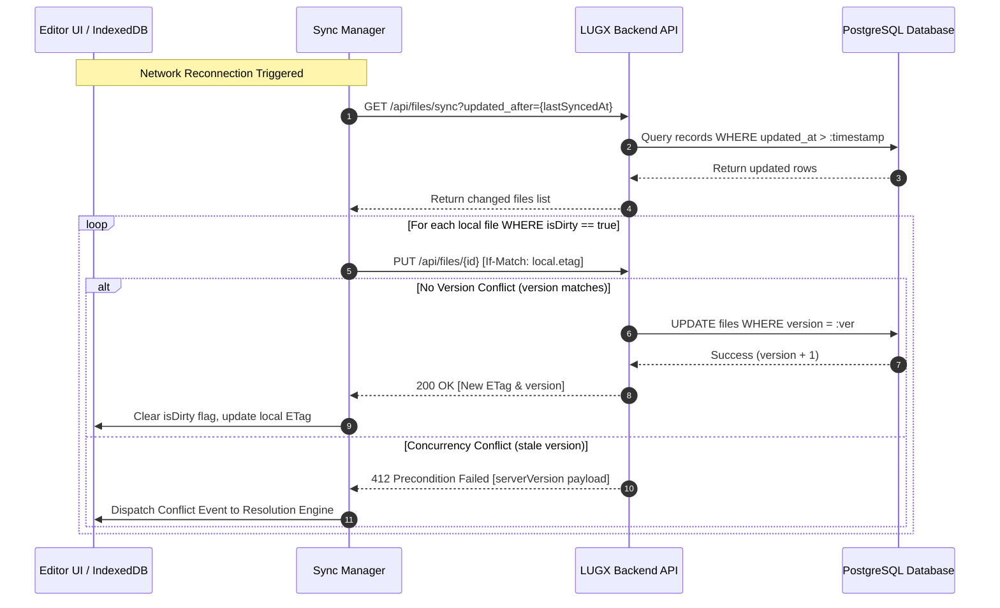

# Architectural Blueprint: Enhanced Offline-First Synchronization System

This document outlines the technical architecture, protocol specifications, data models, and implementation roadmap for an enterprise-grade, offline-first synchronization engine for LUGX. The system guarantees zero data loss, optimistic user interactions, resilient network failure recovery, and deterministic multi-device conflict resolution.

---

## Phase 1: Local Storage Engine & State Architecture

### 1.1 IndexedDB Storage Engine

The client storage layer is implemented on top of the browser's native **IndexedDB API** under the database name `lugx_sync_db` (or `textai_db`) with transactional schema versioning. The engine utilizes three specialized Object Stores:

1. **`files`**: Stores complete document snapshots and local synchronization state.
2. **`operations`**: Append-only log recording granular editing mutations (Operation Log) to enable delta sync and operational transformations.
3. **`sync_metadata`**: Persists synchronization checkpoints, pagination cursors, and server ETags.

### 1.2 Data Schemas

```typescript
/**
 * Represents a local file document in IndexedDB
 */
export interface LocalFileRecord {
  id: string;
  title: string;
  content: string;
  etag: string;
  version: number;
  lastModified: number;    // Unix timestamp (ms)
  lastSyncedAt: number;    // Unix timestamp (ms)
  isDirty: boolean;        // Indicates uncommitted local changes
  isDeleted: boolean;      // Local soft-delete marker
}

/**
 * Granular mutation entry for operational tracking
 */
export interface OperationLogEntry {
  id: string;
  fileId: string;
  operationType: 'insert' | 'delete' | 'update';
  position: number;
  content: string;
  timestamp: number;
  synced: boolean;
}

/**
 * Global synchronization state metadata
 */
export interface SyncMetadataRecord {
  key: string;             // e.g., 'global_sync_state' | 'file_checkpoint_{id}'
  lastSyncTimestamp: number;
  lastServerCursor?: string;
  syncInProgress: boolean;
}
```

---

## Phase 2: Connectivity & Network Resilience Layer

### 2.1 Connectivity Detection & Adaptive Backoff

- **Network Monitoring:** Utilizes the `Navigator.onLine` API combined with window event listeners for `online` and `offline` states.
- **Exponential Backoff with Jitter:** When network requests fail due to transient disconnections or 5xx server errors, retries are scheduled with exponential backoff:
  $$\text{Delay}(n) = \min\left(\text{InitialDelay} \times 2^{n} + \text{jitter}, \text{MaxDelay}\right)$$
  - Initial Attempt: Immediate (0s)
  - 1st Retry: 2s ± 200ms
  - 2nd Retry: 4s ± 400ms
  - 3rd Retry: 8s ± 800ms
  - Max Cap: 60s

### 2.2 Service Worker & Background Sync API

For progressive web app (PWA) offline durability:
1. Register a Service Worker during application bootstrap.
2. When offline mutations occur, register a one-shot background synchronization tag:
   ```javascript
   if ('serviceWorker' in navigator && 'SyncManager' in window) {
     const registration = await navigator.serviceWorker.ready;
     await registration.sync.register('sync-pending-files');
   }
   ```
3. The Service Worker intercepts the `sync` event, drains the pending queue from IndexedDB, and transmits updates to the backend even if the user has navigated away from the application tab.

---

## Phase 3: Client-Server Synchronization Protocol

### 3.1 REST API Endpoint Specifications

#### 1. Batch Incremental Pull
- **Endpoint:** `GET /api/files/sync`
- **Query Parameters:**
  - `updated_after`: ISO 8601 string or Unix timestamp.
  - `limit`: Integer (default: 50, max: 100).
  - `cursor`: Opaque pagination string.
- **Response (`200 OK`):**
  ```json
  {
    "files": [
      {
        "id": "file_uuid",
        "title": "Document Title",
        "content": "Full markdown content...",
        "etag": "W/\"v3-c269996\"",
        "version": 3,
        "updatedAt": "2026-08-16T18:00:00.000Z",
        "deletedAt": null
      }
    ],
    "hasMore": false,
    "nextCursor": null
  }
  ```

#### 2. Conditional Single Document Fetch
- **Endpoint:** `GET /api/files/{id}`
- **Headers:** `If-None-Match: "W/\"v3-c269996\""`
- **Response:**
  - `304 Not Modified`: Local version is fresh; payload body is empty.
  - `200 OK`: Server contains newer version; returns full document payload with updated `ETag`.

#### 3. Version-Guarded Update
- **Endpoint:** `PUT /api/files/{id}`
- **Headers:** `If-Match: "W/\"v3-c269996\""`
- **Request Body:**
  ```json
  {
    "content": "Updated content...",
    "version": 3,
    "operations": []
  }
  ```
- **Response:**
  - `200 OK`: Successfully committed. Returns updated record and new `ETag`.
  - `412 Precondition Failed`: Concurrency conflict detected. Returns current server state.

---

### 3.2 Bidirectional Synchronization Workflow



---

## Phase 4: Conflict Resolution Engine

### 4.1 Conflict Detection & Payload Model

When a `412 Precondition Failed` response is received, the client receives a structured conflict payload:

```typescript
export interface ConcurrencyConflict {
  fileId: string;
  localVersion: {
    content: string;
    etag: string;
    version: number;
    lastModified: number;
  };
  serverVersion: {
    content: string;
    etag: string;
    version: number;
    updatedAt: string;
  };
  operations: OperationLogEntry[];
}
```

### 4.2 Automated 3-Way Merge Strategy

1. **Diff Analysis:** Use text differencing algorithms (e.g., `diff-match-patch`) to compare:
   - Base Version (Common ancestor at last sync)
   - Local Snapshot (Current dirty editor state)
   - Server Snapshot (Current remote database state)
2. **Non-Overlapping Mutations:** If local edits and remote edits occur in distinct, non-overlapping line ranges, execute an automated **Three-Way Merge** and persist the unified document. Display a non-intrusive toast notification: *"Document automatically synchronized with remote updates."*
3. **Overlapping / Contradictory Mutations:** If edits overlap on identical line ranges, halt automated merge and trigger the Interactive Conflict Resolution Interface.

### 4.3 Manual Resolution UI Specifications

The interactive resolution modal provides:
- **Split Diff View:** Side-by-side visual comparison (Left: Local Uncommitted, Right: Remote Server State).
- **Line Highlighting:** Green (insertions), Red (deletions), Yellow (overlapping conflicts).
- **Quick Action Triggers:**
  - `Accept Local`: Overwrite remote state with local changes (advancing version counter).
  - `Accept Server`: Discard uncommitted local edits and pull remote state.
  - `Interactive Editor`: Inline merge editor with interactive chunk-by-chunk acceptance buttons and real-time preview.

---

## Phase 5: Advanced Performance & UX Optimizations

### 5.1 Delta Synchronization (RFC 6902 JSON Patch)

For large documents (>100 KB), transmitting full text strings on every keystroke debounce creates unnecessary bandwidth overhead.
- Compute granular JSON Patches representing text diffs:
  ```json
  [
    { "op": "replace", "path": "/paragraphs/4", "value": "Refined paragraph text." },
    { "op": "add", "path": "/paragraphs/5", "value": "Appended conclusion." }
  ]
  ```
- The backend applies the operations atomically within a database transaction.

### 5.2 Optimistic UI & Visual State Indicators

- All user edits are saved immediately to local IndexedDB and reflected in the editor canvas within 0ms.
- Visual badge indicators on file items:
  - 🟢 **Synced:** All local mutations successfully committed to the database.
  - 🟡 **Pending Sync (Dirty):** Saved locally; awaiting network transmission.
  - 🔴 **Conflict / Sync Error:** Network rejection or concurrent collision requiring user attention.

### 5.3 Priority Queue Management

The synchronization worker processes pending items through a prioritized task queue:
- **Priority 1 (Critical):** The document currently active and open in the active editor tab.
- **Priority 2 (High):** Modified dirty documents awaiting upload.
- **Priority 3 (Background):** Stale document validation and cache warming.

---

## Phase 6: Security, Storage Quota & Telemetry

### 6.1 Client-Side Encryption (Web Crypto API)

For users with sensitive enterprise documents:
- Content can be encrypted client-side using `AES-GCM 256-bit` before saving to IndexedDB:
  ```typescript
  async function encryptContent(plainText: string, cryptoKey: CryptoKey): Promise<{ cipher: ArrayBuffer; iv: Uint8Array }> {
    const iv = window.crypto.getRandomValues(new Uint8Array(12));
    const encoded = new TextEncoder().encode(plainText);
    const cipher = await window.crypto.subtle.encrypt(
      { name: "AES-GCM", iv },
      cryptoKey,
      encoded
    );
    return { cipher, iv };
  }
  ```

### 6.2 Browser Storage Quota Management

- Monitor local storage limits periodically using `navigator.storage.estimate()`.
- When local storage utilization exceeds 80%:
  1. Purge locally cached soft-deleted files.
  2. Compact the `operations` log by coalescing historical operations older than 7 days into baseline snapshots.
  3. Display a storage optimization warning to the user if capacity remains constrained.

### 6.3 Telemetry & Observability

Collect client-side performance metrics without logging private user text:
- Round-trip synchronization latency (P50, P95, P99).
- Synchronization success/failure ratios.
- Average payload compression ratios and delta sync sizes.

---

## Phase 7: Edge Case Handling & Fallback Matrix

| Failure Scenario | Recovery Mechanism |
|---|---|
| **Background Sync Unavailable** | Fallback to adaptive client-side polling every 30 seconds when online. |
| **IndexedDB Blocked / Disabled** | Fallback to memory cache + `localStorage` with a storage capacity notification. |
| **Catastrophic Merge Failure** | Prevent data loss by preserving local changes in a `.conflict.backup` file in IndexedDB before pulling remote state. |
| **Clock Drift / Stale Timestamps** | Rely strictly on monotonic integer `version` counters and server-generated timestamps rather than client clock. |

---

## Implementation Roadmap & Milestone Schedule

| Phase | Milestone Description | Target Deliverables |
|:---:|---|---|
| **M1** | Local Storage Infrastructure | IndexedDB wrapper, schema definitions, migration versioning, and operation logs. |
| **M2** | REST Sync API & ETag Endpoints | `GET /api/files/sync`, conditional `GET`/`PUT` endpoints with SQL version guards. |
| **M3** | Network Layer & Background Sync | Connectivity listeners, Service Worker sync registration, and exponential backoff. |
| **M4** | Conflict Engine & 3-Way Merge | Diff computation, automated merge resolution, and 412 conflict handler. |
| **M5** | Manual Conflict Resolution UI | Side-by-side diff modal, line-by-line acceptance controls, and live editor preview. |
| **M6** | Delta Sync & Optimistic UI | RFC 6902 JSON patch implementation and editor UI status badges. |
| **M7** | Security & Quota Controls | Web Crypto AES-GCM encryption and `navigator.storage` quota management. |
| **M8** | E2E Concurrency & Resilience Tests | Automated multi-tab race condition test harness and network drop simulation. |

---

*Authored and standardized for the LUGX Distributed Architecture Specification.*