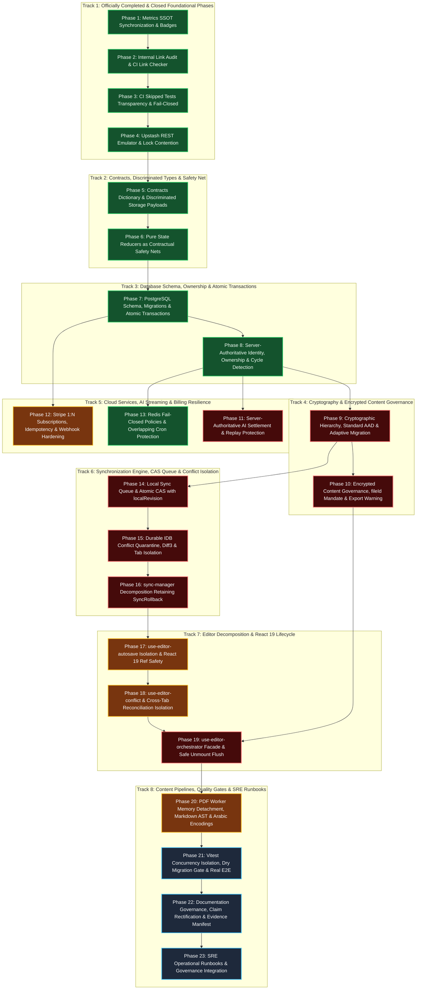

# Comprehensive Technical Remediation and Hardening Plan (Unified Strategic Single-Responsibility Path)

> **Status:** 🟢 Active (Phases 1–8 Closed, Phases 9–23 Planned)  
> **Supersedes:** [`docs/records/archive/core-hardening-pre-stage-2-plan.md`](../records/archive/core-hardening-pre-stage-2-plan.md)  
> **Target Scope:** 100% Remediation of all 183 Audit Findings ([`docs/records/audits/unified-security-and-engineering-audit.md`](../records/audits/unified-security-and-engineering-audit.md))  
> **Baseline Suite Integrity:** 869 unit/contract/vault tests passing, 94 live integration tests passing, zero regression tolerance.

---

## 1. Purpose & Architectural Vision of the Unified Strategic Path

This document serves as the **authoritative, centralized technical remediation and core hardening plan** for the LUGX Platform. It synthesizes and formalizes the complete strategic integration of two foundational roadmaps:

1. **The Pre-Stage 2 Core Hardening Plan:** Retaining and verifying the completed foundational milestones (Phases 1–4), while isolating system decomposition, encrypted content governance, and operational runbooks.
2. **The Comprehensive Technical Execution Plan:** Directly remediating 100% of the 183 security, reliability, and architectural audit findings through approved architectural trade-offs: Lean CAS, server-authoritative AI settlement, adaptive dual-try vault migration, discriminated storage payloads, and Stripe 1:N multi-subscription modeling.

### Strict Enforcement of the Single Responsibility Principle (SRP)

To prevent cross-system regressions and maintain mathematical isolation across multi-session execution, **the roadmap is decomposed into 23 strictly isolated engineering phases**. Each phase carries exactly one indivisible architectural responsibility:

- **Absolute Engineering Focus:** Every phase targets one isolated subsystem without bundling unrelated modules.
- **Risk Containment & Regression Prevention:** Changes can be verified independently against the baseline test suite without cascading side effects.
- **Deterministic Accountability:** Every single finding among the 183 audit defects (`LUGX-001` through `LUGX-183`) is directly mapped to a specific responsible phase.
- **Verifiable Milestone Closures:** Each phase terminates with a dedicated, evidence-backed closure dossier and zero non-runnable tests.

---

## 2. Governing Principles & Approved Engineering Trade-offs

1. **Server-Authoritative Identity & Financial Entitlements:**
   - Permissions, user identity, financial deductions, and tier validations are derived strictly from the authenticated server session (`getUser()`).
   - All financial primitives and refund methods are purged from client-callable `"use server"` actions and restricted to internal modules marked `import "server-only"`.
2. **Decoupling Financial Settlement from Document State:**
   - The server commits AI quota holds immediately upon the `{ type: "done" }` terminal frame or post-TTFT client disconnection. Accepting the AI modification in the editor follows an independent document persistence path that verifies hold completion without requiring an active pending hold.
3. **Lean Optimistic Concurrency with Local Revision Counter (`localRevision`):**
   - Implements a Compare-And-Swap (CAS) guard in IndexedDB via a monotonic `localRevision: number` to eliminate lost updates during in-flight network requests, providing a lightweight, deterministic alternative to complex distributed state machines.
4. **Pure State Reducers as Contractual Safety Nets:**
   - Transition logic across synchronization, quotas, and subscriptions is extracted into pure, side-effect-free reducer functions `(currentState, event) => nextState` and verified with 100% deterministic unit contract tests prior to refactoring complex orchestrators.
5. **Discriminated Union for Storage & Memory Hygiene:**
   - Enforces `DocumentStoragePayload` as a discriminated union to mathematically eliminate ambiguous encryption states at compile time. Unmount flush guards prevent plaintext persistence under encryption flags when vaults are locked.
6. **Adaptive Dual-Try Vault Migration (LUGX-005 Resolution):**
   - Vault seed recovery unwrap attempts the standard context `lugx:v1:recovery:userId` first, gracefully falling back to legacy `vault:seed:userId`, and immediately re-encrypting with the standard context upon success to ensure zero user lockout.
7. **Stripe 1:N Multi-Subscription Architecture:**
   - Subscriptions are indexed by `stripe_subscription_id`, user tiers are dynamically resolved to `MAX(active_tier)`, and transient webhook processing errors return `HTTP 500 Internal Server Error` to leverage Stripe's automated exponential retry mechanism.
8. **Retention of Existing Rollback Primitives:**
   - Retains the battle-tested rollback implementation in `src/lib/sync/rollback.ts` (304 lines) and directly connects it to the slim coordinator, eliminating redundant reimplementations.
9. **Unified Database Architecture & Strict Anti-Dispersal Mandate:**
   - All PostgreSQL Drizzle schema models, database client factories, ACID transaction pool drivers, and sequential DDL migrations are strictly consolidated under a single authoritative subsystem (`src/server/db/`).
   - Scattering schemas or migrations across disparate directories (such as legacy `src/lib/db/` or multiple migration folders) is permanently prohibited.
   - Drizzle configuration (`drizzle.config.ts`, `drizzle.config.test.ts`) and all runtime callers must bind directly to `src/server/db/schema/index.ts` and `src/server/db/migrations/`.

---

## 3. Strategic Dependency Map (23 Isolated SRP Phases)



---

## 4. Officially Completed and Closed Phases Register (Phases 1–8: COMPLETED ✅)

The foundational and core hardening phases of the initiative have been executed, verified, and officially closed with permanent dossiers:

| Phase                                                         | Core Responsibility & Architectural Deliverables                                                                                                                                                          | Authoritative Dossier / Verification Anchors                                                                                                                                                                       |    Status    |
| :------------------------------------------------------------ | :-------------------------------------------------------------------------------------------------------------------------------------------------------------------------------------------------------- | :----------------------------------------------------------------------------------------------------------------------------------------------------------------------------------------------------------------- | :----------: |
| **Phase 1: Metrics SSOT Synchronization**                     | Automated test count extraction into `docs/METRICS.json` and synchronized `README.md`, Technical Debt Register, and spec claims to true counts (820 tests across 67 files).                               | [`scripts/sync-doc-metrics.mjs`](../../scripts/sync-doc-metrics.mjs)<br>[`docs/METRICS.json`](../METRICS.json)                                                                                                     | ✅ COMPLETED |
| **Phase 2: Internal Link Audit & CI Link Checker**            | Audited all Markdown links, fixed 11 broken relative paths, replaced URL-encoded anchors with standard kebab-case, and integrated link validation in CI Stage 1.                                          | [`scripts/check-markdown-links.mjs`](../../scripts/check-markdown-links.mjs)<br>CI Stage 1 Quality Gate                                                                                                            | ✅ COMPLETED |
| **Phase 3: CI Skipped Tests Transparency & Fail-Closed**      | Implemented transparent reporting of skipped tests via `$GITHUB_STEP_SUMMARY` and enforced strict `Fail-Closed: exit 1` release gates when secrets are missing.                                           | [`docs/records/closures/core-hardening/phase-03-ci-skipped-tests-and-release-gate-closure.md`](../records/closures/core-hardening/phase-03-ci-skipped-tests-and-release-gate-closure.md)                           | ✅ COMPLETED |
| **Phase 4: Upstash REST Emulator & Lock Contention**          | Built an in-memory `node:http` Upstash REST emulator for tests, validated concurrent lock contention, simulated high latency (>1500ms), and verified PostgreSQL ledger fail-open fallback.                | [`docs/records/closures/core-hardening/phase-04-redis-integration-and-lock-contention-closure.md`](../records/closures/core-hardening/phase-04-redis-integration-and-lock-contention-closure.md)                   | ✅ COMPLETED |
| **Phase 5: Contracts Dictionary & Discriminated Storage**     | Standardized runtime contracts, RFC 7807 problem details, and discriminated storage union `DocumentStoragePayload` preventing unencrypted content leaks.                                                  | [`docs/records/closures/core-hardening/phase-05-contracts-dictionary-and-discriminated-storage-closure.md`](../records/closures/core-hardening/phase-05-contracts-dictionary-and-discriminated-storage-closure.md) | ✅ COMPLETED |
| **Phase 6: Pure State Reducers as Contractual Safety Nets**   | Isolated state transition logic across sync, webhooks, and AI quotas into side-effect-free pure reducers with deterministic transition matrices.                                                          | [`docs/records/closures/core-hardening/phase-06-pure-state-reducers-closure.md`](../records/closures/core-hardening/phase-06-pure-state-reducers-closure.md)                                                       | ✅ COMPLETED |
| **Phase 7: PostgreSQL Schema, Migrations & Transactions**     | Unified database architecture strictly under `src/server/db/`, eliminated legacy `src/lib/db/`, applied migrations 0001–0011, and enforced interactive transactions.                                      | [`docs/records/closures/core-hardening/phase-07-schema-migrations-and-atomic-transactions-closure.md`](../records/closures/core-hardening/phase-07-schema-migrations-and-atomic-transactions-closure.md)           | ✅ COMPLETED |
| **Phase 8: Identity Boundaries, Ownership & Cycle Detection** | Server-authoritative session guards (`requireAuthenticatedUser`, `requireOwnedFile`), unbounded cycle detection in `moveFile`, copy depth limits, optimistic locking on deletions, and test route shield. | [`docs/records/closures/core-hardening/phase-08-identity-ownership-and-cycle-detection-closure.md`](../records/closures/core-hardening/phase-08-identity-ownership-and-cycle-detection-closure.md)                 | ✅ COMPLETED |

---

## 5. Detailed Technical Specifications of Remaining Execution Phases (Phases 5–23)

---

### [Phase 5: Contracts Dictionary & Discriminated Storage Payloads] — Status: ✅ COMPLETED

> **Execution Origin:** Independent Remediation Plan - Group 1  
> **Single Responsibility (SRP):** Standardize runtime data contracts, shared types, and discriminated storage payloads without introducing procedural or transition logic.

#### Technical Objective

Establish a centralized data contracts dictionary enforcing compile-time and runtime distinction between plaintext and encrypted content via `DocumentStoragePayload`, standardize RFC 7807 problem details error responses, and define explicit synchronization and AI request contracts.

#### Audit Findings Remediated

`LUGX-004, LUGX-019, LUGX-048, LUGX-067, LUGX-070, LUGX-071, LUGX-085, LUGX-115, LUGX-116, LUGX-119, LUGX-174, LUGX-175, LUGX-176, LUGX-181`

#### Targeted Files

- `src/types/storage-payload.ts` (new)
- `src/types/problem-details.ts` (new)
- `src/types/sync-contracts.ts` (update)
- `src/types/ai-contracts.ts` (update)

#### Direct Implementation Actions

1. **Define Strict Discriminated Storage Payload:**
   ```ts
   export type DocumentStoragePayload =
     | {
         type: "plaintext";
         content: string;
         isEncrypted: false;
         encryptionMetadata: null;
       }
     | {
         type: "encrypted";
         ciphertextBase64: string;
         isEncrypted: true;
         encryptionMetadata: FileEncryptionMetadata;
       };
   ```
2. **Standardize RFC 7807 Problem Details:** Define `ProblemDetails` interface with `type`, `title`, `status`, `detail`, `instance`, `correlationId`, and optional `retryAfterSeconds`.
3. **Formalize Sync Operation Contracts:** Add `localRevision: number`, `sentRevision?: number`, and `baseVersion: number`.
4. **Formalize AI Fingerprint Contracts:** Add `requestHash: string` and `operationId: string`.
5. **Runtime Zod Validation:** Implement runtime schemas to parse inbound/outbound payloads and reject unexpected properties.

#### Acceptance Criteria

- TypeScript compilation fails if a `plaintext` payload is instantiated with `isEncrypted: true`.
- Problem detail payloads lacking RFC 7807 mandatory attributes are rejected by Zod schemas.

---

### [Phase 6: Pure State Reducers as Contractual Safety Nets] — Status: ✅ COMPLETED

> **Execution Origin:** Core Hardening Plan - Phase 6  
> **Single Responsibility (SRP):** Extract and freeze deterministic, side-effect-free state transition functions `(state, event) => nextState` to serve as verified contracts before refactoring complex orchestrators.

#### Technical Objective

Convert state transition logic across synchronization, subscriptions, and quota settlement into pure reducers isolated from I/O, network, or storage APIs, backed by 100% deterministic unit tests.

#### Audit Findings Remediated

Contractual regression prevention for: `LUGX-001, LUGX-003, LUGX-010, LUGX-025, LUGX-036, LUGX-040, LUGX-115, LUGX-135`

#### Targeted Files

- `src/lib/sync/sync-state-reducer.ts` (new)
- `src/lib/stripe/webhook-event-reducer.ts` (new)
- `src/lib/ai/quota-settlement-reducer.ts` (new)
- `src/test/contracts/state-machines-contracts.test.ts` (new)

#### Direct Implementation Actions

1. **Pure Sync State Reducer (`sync-state-reducer.ts`):** Define states `idle | syncing | conflict | error`, encode valid state transitions, and reject invalid transitions (e.g., `idle` to `conflict` without network response).
2. **Pure Stripe Event Reducer (`webhook-event-reducer.ts`):** Define subscription states `trialing | active | past_due | canceled | incomplete` and prevent backward transitions from terminal states.
3. **Pure Quota Settlement Reducer (`quota-settlement-reducer.ts`):** Calculate difference between reserved and consumed words, outputting `{ toCommit: number, toRefund: number }`.
4. **Exhaustive Contract Tests (`state-machines-contracts.test.ts`):** Test all transition permutations with zero external mocks.

#### Acceptance Criteria

- Reducers contain zero calls to `fetch`, `Date.now()`, or external storage APIs.
- 100% transition matrix verification passed.

---

### [Phase 7: PostgreSQL Schema, Migrations & Atomic Transactions] — Status: ✅ COMPLETED

> **Execution Origin:** Independent Remediation Plan - Group 2  
> **Single Responsibility (SRP):** Unify database architecture strictly under `src/server/db/`, harden PostgreSQL modular schemas, enforce unique constraints, mandate interactive transactions for multi-row mutations, and completely purge the legacy `src/lib/db/` directory.

#### Technical Objective

Consolidate all database schemas, client factories, transactional drivers, and migrations into a single cohesive subsystem under `src/server/db/`, eliminating scattered database locations across `src/lib/db`. Establish the database as the sole source of truth for financial transactions, quotas, and document metadata, executing related mutations within atomic `db.transaction()` blocks to eliminate split-brain states.

#### Audit Findings Remediated

`LUGX-025, LUGX-026, LUGX-027, LUGX-030, LUGX-031, LUGX-068, LUGX-069, LUGX-072, LUGX-073, LUGX-074, LUGX-075, LUGX-076, LUGX-135, LUGX-141, LUGX-142, LUGX-143, LUGX-144, LUGX-146, LUGX-148, LUGX-149`

#### Targeted Files (`src/server/db/` Exclusively)

- `src/server/db/schema/*` (`subscriptions.ts`, `ai-reservations.ts`, `files.ts`, `users.ts`, `usage.ts`, `subscription-events.ts`, `vault.ts`, `index.ts`)
- `src/server/db/client.ts`
- `src/server/db/transactional.ts`
- `src/server/db/index.ts`
- Drizzle migrations in `src/server/db/migrations/*` (11 DDL migrations)

#### Direct Implementation Actions

1. **Architectural Unification, Schema/Migration Consolidation & Legacy Purge:**
   - Consolidate all database components strictly under `src/server/db/` to permanently eliminate schema and migration scattering across the codebase:
     - Modular schemas consolidated in `src/server/db/schema/` (8 modules: `users.ts`, `subscriptions.ts`, `files.ts`, `ai-reservations.ts`, `usage.ts`, `subscription-events.ts`, `vault.ts`, and barrel `index.ts`).
     - All 11 sequential DDL migrations consolidated under `src/server/db/migrations/` (`0001_add_sync_fields.sql` through `0011_schema_hardening_and_indexes.sql`).
     - Database clients and drivers unified in `src/server/db/client.ts`, `src/server/db/transactional.ts`, and authoritative barrel `src/server/db/index.ts`.
     - Drizzle configurations (`drizzle.config.ts`, `drizzle.config.test.ts`) bound directly to `src/server/db/schema/index.ts` and `src/server/db/migrations/`.
   - Completely purge legacy `src/lib/db/` from disk and git tracking, redirecting all 48 caller modules to `@/server/db` and `@/server/db/schema`. Extract shared storage types (`FileEncryptionMetadata`) to `src/types/storage-payload.ts` ensuring clean server/client boundary separation.
2. **Subscriptions Schema Hardening:** Shift uniqueness from `userId` to `stripe_subscription_id`, add foreign key cascade to `users(id)`, and index `tier`, `status`, and `user_id`.
3. **AI Reservations Schema Hardening:** Add composite unique constraint `UNIQUE (user_id, operation_id)` and add `request_hash varchar(64) NOT NULL`.
4. **Interactive Atomic Transactions:** Wrap reservation creation, quota deduction, and balance updates within `await targetDb.transaction(async (tx) => { ... })`.
5. **Deterministic Migration Application:** Execute sequential raw SQL migrations (0001 through 0011) and verify schema equality across both main and test Neon databases via `node scripts/verify-migrations.mjs [--main]`.

#### Acceptance Criteria

- Complete absence of `src/lib/db/` on disk and zero remaining imports of `@/lib/db`.
- All schema definitions reside strictly under `src/server/db/schema/` and all migrations strictly under `src/server/db/migrations/` with zero dispersion.
- Inserting duplicate reservations with identical `(user_id, operation_id)` fails with unique constraint violation.
- Simulated transaction exceptions trigger a complete rollback with zero partial writes.
- 100% of migrations (0001 to 0011) applied and verified on both test and main database branches.

---

### [Phase 8: Server-Authoritative Identity, Ownership & Cycle Detection] — Status: ✅ COMPLETED

> **Execution Origin:** Independent Remediation Plan - Group 3  
> **Single Responsibility (SRP):** Enforce server-authoritative authentication and resource ownership, secure folder hierarchies against cycles, and isolate test endpoints.

#### Technical Objective

Eliminate client-provided identity parameters, validate ownership exclusively from authenticated server sessions, prevent circular folder hierarchies, and restrict test endpoints to non-production environments.

#### Audit Findings Remediated

`LUGX-006, LUGX-031, LUGX-063, LUGX-067, LUGX-068, LUGX-070, LUGX-071, LUGX-072, LUGX-073, LUGX-074, LUGX-077, LUGX-085, LUGX-115, LUGX-134, LUGX-136, LUGX-137, LUGX-138, LUGX-139, LUGX-140`

#### Targeted Files

- `src/server/auth/session.ts`
- `src/server/actions/files.ts`
- `src/server/actions/folders.ts`
- `src/app/api/files/*`
- `src/app/api/test/*`

#### Direct Implementation Actions

1. **Mandatory Guard Primitives:** Implement `requireAuthenticatedUser()` (returns 401 on missing session) and `requireOwnedFile(fileId)` (returns 404/403 on mismatch).
2. **Purge Client Parameters:** Remove `userId` and `userTier` arguments from Server Actions; resolve them internally from the verified session.
3. **Folder Move Cycle Detection:** Implement recursive parent traversal during folder moves to prevent a folder from becoming a descendant of itself or another user's folder.
4. **Server-Side Optimistic Locking:** Require `If-Match` or `expectedVersion` in mutation requests, responding with `412 Precondition Failed` upon mismatch.
5. **Test Route Isolation:** Add build-time guard in `src/app/api/test/*` returning 404 when `process.env.NODE_ENV === "production"`.

#### Acceptance Criteria

- Cross-tenant file modification attempts return 403/404.
- Circular folder moves are rejected immediately.

---

### [Phase 9: Cryptographic Hierarchy, Standard AAD & Adaptive Migration] — Status: ✅ COMPLETED

> **Execution Origin:** Independent Remediation Plan - Group 4  
> **Single Responsibility (SRP):** Fix core cryptographic workflows, standardize AAD formats, resolve seed phrase recovery mismatch (LUGX-005) via adaptive migration, and enforce WebCrypto memory hygiene.

#### Technical Objective

Eliminate AAD context mismatch during recovery phrase unwrapping through dual-try migration, isolate master keys in non-extractable `CryptoKey` objects, and audit BIP-39 wordlists.

#### Audit Findings Remediated

`LUGX-004, LUGX-005, LUGX-015, LUGX-016, LUGX-017, LUGX-018, LUGX-019, LUGX-024, LUGX-035, LUGX-042, LUGX-043, LUGX-044, LUGX-048, LUGX-062, LUGX-063, LUGX-064, LUGX-065, LUGX-066, LUGX-070, LUGX-071, LUGX-084, LUGX-085, LUGX-102, LUGX-103, LUGX-104, LUGX-105, LUGX-106, LUGX-107, LUGX-124, LUGX-125, LUGX-126, LUGX-127, LUGX-128, LUGX-129, LUGX-130, LUGX-131, LUGX-132, LUGX-133`

#### Targeted Files

- `src/lib/crypto/aad.ts`
- `src/lib/vault/recovery.ts`
- `src/lib/vault/vault-manager.ts`
- `src/lib/crypto/bip39-wordlist.ts`
- `src/lib/crypto/key-derivation.ts`

#### Direct Implementation Actions

1. **Standardize AAD Format:** Enforce canonical structure `lugx:v1:<domain>:<userId>[:<fileId>]`.
2. **Adaptive Dual-Try Recovery Migration:** Attempt unwrap using canonical context `lugx:v1:recovery:${userId}`; on MAC error, attempt legacy `vault:seed:${userId}`. On legacy success, immediately re-encrypt using canonical context and persist.
3. **Audit BIP-39 Wordlist:** Verify wordlist contains exactly 2048 standard English words and purge non-standard entries.
4. **Key Isolation & Memory Hygiene:** Deprecate `getMasterKeyRaw` exposing raw buffers; use `withMasterKey<T>` context wrapper checking `lockEpoch`.
5. **HKDF-SHA-256 for Subkeys:** Restrict heavy PBKDF2 to initial PIN unlock, using HKDF for document and search index subkeys.

#### Acceptance Criteria

- Legacy vaults wrapped with `vault:seed:` successfully unwrap and re-wrap under the canonical context automatically.
- Modified AAD context or mismatched user ID triggers cryptographic decryption failure.

---

### [Phase 10: Encrypted Content Governance, fileId Mandate & Export Warning] — Status: ✅ COMPLETED

> **Execution Origin:** Core Hardening Plan - Phase 5  
> **Single Responsibility (SRP):** Enforce strict contractual gates across AI streaming and export services to prevent unauthorized decryption or transmission of encrypted content.

#### Technical Objective

Block data leakage of encrypted documents by making `fileId` mandatory on AI streaming endpoints, verifying user consent server-side, and prompting explicit confirmation before plaintext export.

#### Audit Findings Remediated

`LUGX-004, LUGX-017, LUGX-018, LUGX-019, LUGX-024, LUGX-084, LUGX-085, LUGX-124`

#### Targeted Files

- `src/app/api/ai/stream/route.ts`
- `src/components/export/export-warning-modal.tsx` (new)
- `src/lib/export/export-service.ts`
- `src/server/db/schema/vault.ts`

#### Direct Implementation Actions

1. **Mandatory `fileId` on AI Streaming:** Require `fileId` in request body; reject missing fields with `400 Bad Request` and code `MISSING_FILE_ID`.
2. **Server-Side Encrypted File Guard:** Query database for file status: if `isEncrypted = true`, verify `allowAIOnEncryptedFiles` in `userVaultProfiles`. If false, reject with `403 Forbidden` (`AI_PROHIBITED_ON_ENCRYPTED_FILES`).
3. **Plaintext Export Confirmation Modal:** Implement `ExportWarningModal` triggered on exporting encrypted documents, requiring explicit user confirmation before writing decrypted content to disk.

#### Acceptance Criteria

- Requests to `/api/ai/stream` without `fileId` return 400.
- AI requests targeting encrypted files with disabled permissions return 403.
- Plaintext export triggers warning modal.

---

### [Phase 11: Server-Authoritative AI Settlement & Replay Protection] — Status: ✅ COMPLETED

> **Execution Origin:** Independent Remediation Plan - Group 5  
> **Single Responsibility (SRP):** Make AI quota settlement strictly server-authoritative, eliminate client refund/commit actions, and enforce request fingerprinting.

#### Technical Objective

Transition AI quota lifecycle into a deterministic server-driven state machine that commits tokens upon stream completion or disconnection, decoupled from editor document acceptance, and hardened against CJK/Base64 quota evasion.

#### Audit Findings Remediated

`LUGX-001, LUGX-002, LUGX-006, LUGX-007, LUGX-008, LUGX-009, LUGX-021, LUGX-029, LUGX-030, LUGX-031, LUGX-032, LUGX-033, LUGX-067, LUGX-115, LUGX-116, LUGX-117, LUGX-118, LUGX-119, LUGX-120, LUGX-121, LUGX-122, LUGX-123, LUGX-135, LUGX-148`

#### Targeted Files

- `src/server/actions/ai-commit.ts` (delete/purge)
- `src/server/services/ai-settlement-service.ts` (new - server-only)
- `src/app/api/ai/stream/route.ts`
- `src/hooks/use-ai-stream.ts`
- `src/lib/ai/gemini-client.ts`

#### Direct Implementation Actions

1. **Purge Client Financial Actions:** Remove client exports of `refundAIReservation` and `commitAIReservation`, consolidating financial operations in `ai-settlement-service.ts`.
2. **Server-Side Stream Settlement:** Commit reservation upon stream completion (`{ type: "done" }`) or post-TTFT client disconnection. On pre-TTFT upstream failure, server automatically refunds the hold.
3. **Decouple Document Acceptance:** Accepting AI suggestions executes standard document save; validation checks hold completion without requiring open state.
4. **Replay Protection via Request Hash:** Compute `request_hash = sha256(userId + ":" + operation + ":" + fileId + ":" + text)`; reject duplicate requests with mismatched payload as `409 Conflict`.
5. **Secure Unit Calculation (CJK / Base64):** Apply `effectiveUnits = Math.max(countWords(text), Math.ceil(text.length / 6))`.
6. **Rotate Gemini Keys on HTTP 400:** Treat HTTP 400 invalid key responses as authentication failures triggering immediate key rotation.

#### Acceptance Criteria

- Client has zero direct endpoints to trigger refunds.
- Disconnecting after first token commits consumed tokens on server.
- CJK payloads calculate units proportionally to character length.

---

### [Phase 12: Stripe 1:N Subscriptions, Idempotency & Webhook Hardening] — Status: ✅ COMPLETED

> **Execution Origin:** Independent Remediation Plan - Group 6  
> **Single Responsibility (SRP):** Support 1:N subscriptions per user, dynamically derive user tiers, and return HTTP 500 on transient webhook errors to mandate retries.

#### Technical Objective

Harden Stripe webhook ingestion to respond with 500 on transient failures, enable multiple active subscriptions per user account, and derive tier from the highest active entitlement.

#### Audit Findings Remediated

`LUGX-025, LUGX-026, LUGX-027, LUGX-068, LUGX-069, LUGX-134, LUGX-135, LUGX-141, LUGX-145, LUGX-148, LUGX-149`

#### Targeted Files

- `src/app/api/billing/webhook/route.ts`
- `src/app/api/stripe/webhook/route.ts`
- `src/server/services/billing-service.ts`
- `src/server/actions/subscription-actions.ts`
- `src/server/db/schema/subscriptions.ts`
- `src/server/db/migrations/0012_add_paused_to_subscription_status.sql`
- `src/lib/stripe/config.ts`
- `src/lib/stripe/webhook-event-reducer.ts`

#### Direct Implementation Actions Completed

1. **Strict Webhook Error Handling (LUGX-025, LUGX-148):** Eliminated error swallowing. Webhook immediately returns HTTP 500 on transient database disconnects/unhandled errors to mandate Stripe retries, and returns HTTP 503 (`Retry-After: 5`) on lock contention. Returns HTTP 200 ONLY on successful commit or genuine idempotent duplicates.
2. **1:N Multi-Subscription Tracking & MAX(tier) Derivation (LUGX-027):** Implemented authoritative `BillingService.calculateEffectiveTier` computing `MAX(tier)` among active/trialing subscriptions (`ultra: 2 > pro: 1 > free: 0`). When Ultra subscription is canceled, user remains Pro if an active Pro subscription is held.
3. **Grace Period Preservation (LUGX-026):** Preserved tier on initial `invoice.payment_failed` by updating status to `past_due` without immediate tier wipe, allowing smart retry windows.
4. **Multi-Source User Resolution (LUGX-141):** Resolved user ID through prioritized waterfall: `metadata.userId` -> `subscription_details.metadata.userId` -> `users.stripeCustomerId` index -> existing subscription record.
5. **Paused Status & Price ID Derivation (LUGX-068, LUGX-069):** Added `'paused'` enum value in DDL migration `0012` and treated it as non-terminal in reducer. Derived tier from price ID via `getTierFromPriceId`.
6. **Customer Portal Session (LUGX-149):** Implemented `BillingService.createCustomerPortalSession`.

#### Acceptance Criteria & Verification Evidence

- Webhook unit tests: 18/18 passing (`src/test/api/stripe-webhook.test.ts`), verifying 500 retry mandate on DB crash, Price ID derivation, and non-terminal paused status.
- Domain unit tests: 16/16 passing (`src/test/server/billing-service.test.ts`), verifying `MAX(tier)` with concurrent subscriptions and cancellation retention.
- Live Neon DB integration tests: 7/7 passing (`src/test/api/stripe-webhook.live.test.ts`), proving real 1:N persistence and dynamic `MAX(tier)` recalculation on live Postgres branch.
- Zero TypeScript errors (`tsc --noEmit`), zero lint errors (`npm run lint`), and 100% markdown link integrity.

---

### [Phase 13: Redis Fail-Closed Policies & Overlapping Cron Protection] — Status: ✅ COMPLETED

> **Execution Origin:** Independent Remediation Plan - Group 7  
> **Single Responsibility (SRP):** Enforce fail-closed policies on Redis outages, ensure CI compatibility, prevent overlapping cron job execution, and enforce hermetic test isolation.  
> **Authoritative Dossier:** [`docs/records/closures/core-hardening/phase-13-redis-fail-closed-and-cron-overlap-closure.md`](../records/closures/core-hardening/phase-13-redis-fail-closed-and-cron-overlap-closure.md)

#### Technical Objective

Protect system resources during Redis outages by transitioning rate limiting on sensitive tiers to fail-closed behavior, providing an Upstash REST proxy container for CI Stage 4, locking maintenance cron jobs against overlapping execution, and guaranteeing hermetic isolation between unit and live database tests.

#### Audit Findings Remediated

`LUGX-079, LUGX-093, LUGX-095, LUGX-096, LUGX-097, LUGX-108, LUGX-120, LUGX-121, LUGX-148, LUGX-176`

#### Targeted Files

- `src/lib/redis.ts`
- `src/lib/rate-limit.ts`
- `src/lib/cron/lock.ts`
- `src/app/api/cron/expire-reservations/route.ts`
- `src/app/api/cron/purge-deleted/route.ts`
- `.github/workflows/cron.yml`
- `.github/workflows/ci.yml`
- `src/test/load-test-env.ts`
- `src/test/infrastructure/redis-mock-server.ts`
- `src/test/infrastructure/rate-limit.test.ts`
- `src/test/infrastructure/cron-expire-reservations.test.ts`
- `src/test/infrastructure/cron-overlap.test.ts`

#### Direct Implementation Actions Completed

1. **Per-Tier Fail-Closed & Conditional ZADD Limiting (LUGX-079, LUGX-148):** Configured explicit per-tier policies in `RATE_LIMITS`: `fail-closed` for sensitive routes (`AI_STREAM`, `AUTH`) emitting HTTP 503 (`Retry-After: 10`), and `fail-open` for offline continuity (`SYNC_API`, `FILE_API`). Re-ordered sliding window evaluation to check count before calling `zadd`, preventing retry lock traps. Added `isRedisConfigured()` preventing DNS timeouts to placeholder domains.
2. **CI Upstash REST Compatibility & Protocol Translation (LUGX-093):** Deployed `hiett/serverless-redis-http:latest` service container in CI Stage 4 on port 8079 translating HTTP REST requests from `@upstash/redis` to Redis RESP commands over TCP. Upgraded in-process `UpstashHttpMockServer` with full Sorted Set primitives (`zadd`, `zcard`, `zremrangebyscore`, `zcount`).
3. **Distributed Cron Lock & Overlap Protection (LUGX-096, LUGX-120):** Implemented `acquireCronLock` in `src/lib/cron/lock.ts` utilizing atomic Redis `SET ... NX EX` with in-memory TTL fallback. Guarded `/api/cron/expire-reservations` and `/api/cron/purge-deleted` with exclusive distributed locks, safely skipping overlapping executions with HTTP 200 `{ success: true, skipped: true }`. Exported `POST = GET` on `purge-deleted`. Decoupled GitHub Actions cron jobs with `--fail-with-body` and backlog drain loop.
4. **Hermetic Test Isolation & Worker Concurrency Regulation:** Configured `loadTestEnv()` to strictly ignore `.env.local` during unit test runs (`VITEST_LIVE: 'false'`) and enforce dummy placeholders. Configured `maxWorkers: 3` on local Windows environments to eliminate worker spawn timeouts.

#### Acceptance Criteria & Verification Evidence

- Rate limit suite: 11/11 tests passing (`src/test/infrastructure/rate-limit.test.ts`), confirming HTTP 503 on unconfigured/unreachable Redis for `AI_STREAM` and `AUTH`, HTTP 200 fail-open for sync, and zero token addition on rejected requests.
- Cron overlap suite: 4/4 tests passing (`src/test/infrastructure/cron-overlap.test.ts`), confirming concurrent runs skip safely with HTTP 200 `{ skipped: true }` and reject unauthorized requests with HTTP 401.
- Unit suite integrity: 78 test suites, 957 tests passing 100% with zero regressions.
- Live Neon DB integration: 21 test suites, 119 tests passing 100% on isolated test branch.
- Zero TypeScript errors (`tsc --noEmit`), zero ESLint errors (`npm run lint`), and 100% link validity (`check-markdown-links.mjs`).

---

### [Phase 14: Local Sync Queue & Atomic CAS with localRevision] — Status: ✅ COMPLETED

> **Execution Origin:** Independent Remediation Plan - Group 8  
> **Single Responsibility (SRP):** Implement Lean CAS concurrency control in IndexedDB via monotonic `localRevision` to eliminate lost updates during in-flight network requests.

#### Technical Objective

Provide atomic concurrency control in IndexedDB ensuring local mutations made while a sync request is in flight are preserved and marked dirty upon sync completion.

#### Audit Findings Remediated

`LUGX-003, LUGX-009, LUGX-010, LUGX-011, LUGX-012, LUGX-013, LUGX-014, LUGX-020, LUGX-034, LUGX-036, LUGX-037, LUGX-038, LUGX-039, LUGX-040, LUGX-041, LUGX-046, LUGX-089, LUGX-098, LUGX-099, LUGX-100, LUGX-101, LUGX-105, LUGX-109, LUGX-110, LUGX-111, LUGX-112, LUGX-113, LUGX-114`

#### Targeted Files

- `src/lib/sync/idb-types.ts`
- `src/lib/sync/indexeddb.ts`
- `src/lib/sync/coalescing.ts`
- `src/hooks/use-sync.ts`
- `src/lib/sync/sync-manager.ts`
- `src/test/sync/sync-cas-concurrency.test.ts`
- `src/test/sync/sync-manager.test.ts`

#### Direct Implementation Actions Completed

1. **Monotonic `localRevision` & Operation Tracking (LUGX-010):** Added `localRevision?: number` to `IDBFile` and `sentRevision?: number` to `IDBOperation`. Enhanced `useSync.saveLocal` to monotonically increment `localRevision` on every local edit, binding each edit to the coalesced operation.
2. **Atomic Lean CAS on Push Completion (LUGX-010, LUGX-011):** Implemented Lean CAS check in `IndexedDBManager.commitFileAndOperationSync` and `markFileClean`:
   - If `file.localRevision === sentRevision`: atomically sets `isDirty = false`, updates `etag`, `version`, and `baseSnapshot`.
   - If `file.localRevision > sentRevision`: user performed edits while the request was in-flight. Retains **`isDirty = true`**, updates server `version` and base snapshot etag/version without overwriting dirty content, guaranteeing the subsequent sync cycle pushes the newer edits.
3. **Strict Operation Coalescing Module (LUGX-040):** Extracted `src/lib/sync/coalescing.ts` with pure `canCoalesce` and `coalesceOperations` functions. Restricts coalescing strictly to operations in `queued` status. Prohibits coalescing into actively `syncing` operations (eliminating in-flight mutation races) and prohibits inheriting `conflict`, `failed`, or `dead_letter` states.
4. **Non-Destructive Push Failure Resilience (LUGX-013):** Excised `rollback.rollback` calls from network push error handlers in `processSingleOperation` and `pushFile`. Network failures preserve current local dirty state and schedule backoff retry without wiping user edits.

#### Acceptance Criteria & Verification Evidence

- 9/9 tests passing in `src/test/sync/sync-cas-concurrency.test.ts`, confirming Lean CAS clean commits, in-flight mutation protection, strict queued-only coalescing, and non-destructive push failure handling.
- Zero regressions across core sync suites: `sync-indexeddb.test.ts` (14/14), `sync-manager.test.ts` (36/36), `sync-rollback.test.ts` (22/22), `use-sync.test.ts` (14/14), `contracts.test.ts` (20/20).
- 0 TypeScript errors (`tsc --noEmit`), 0 ESLint errors (`npm run lint`), 100% doc metrics synchronization (79 suites / 966 tests), and 100% link validity.

---

### [Phase 15: Durable IDB Conflict Quarantine, Diff3 & Tab Isolation] — Status: ✅ COMPLETED

> **Execution Origin:** Independent Remediation Plan - Group 9  
> **Single Responsibility (SRP):** Persist conflict state durably in IndexedDB against auto-pull overwrites, correct Diff3 edge cases, and isolate cross-tab channels by user ID.

#### Technical Objective

Prevent conflict state loss during page reloads or periodic background pulls, fix line duplication in Myers 3-way merge on decrypted text, and scope BroadcastChannel by `userId`.

#### Audit Findings Remediated

`LUGX-003, LUGX-010, LUGX-011, LUGX-012, LUGX-013, LUGX-014, LUGX-020, LUGX-022, LUGX-036, LUGX-037, LUGX-038, LUGX-045, LUGX-047, LUGX-049, LUGX-050, LUGX-051, LUGX-052, LUGX-089, LUGX-098, LUGX-099, LUGX-109, LUGX-110, LUGX-112, LUGX-150`

#### Targeted Files

- `src/lib/sync/conflict-resolver.ts`
- `src/lib/sync/diff3.ts`
- `src/lib/sync/tab-sync.ts`
- `src/lib/idb/conflict-store.ts`

#### Direct Implementation Actions

1. **Durable Quarantine:** On HTTP 412, record file in IndexedDB with `syncStatus = 'conflict'`. Update `pullFile` to strictly avoid overwriting files in `conflict` state.
2. **Myers 3-Way Merge Hardening:** Execute merge strictly on decrypted plaintext, handling repeated blank lines without content erasure.
3. **User-Scoped Tab Channels:** Name broadcast channels `lugx_sync_${userId}` to isolate multi-tenant tab sessions.

#### Acceptance Criteria

- Conflicted files retain conflict state across browser reloads.
- 3-way merge on files with repeated blank lines preserves content.

---

### [Phase 16: sync-manager Decomposition Retaining SyncRollback] — Status: ⏳ PLANNED

> **Execution Origin:** Core Hardening Plan - Phase 7  
> **Single Responsibility (SRP):** Decompose the monolithic `sync-manager.ts` (1,834 lines) into specialized workers while retaining and delegating directly to `rollback.ts` (304 lines).

#### Technical Objective

Reduce `sync-manager.ts` into a lightweight coordinator (<350 lines) backed by dedicated queue workers and encrypted conflict stores, preserving `src/lib/sync/rollback.ts` without rewriting.

#### Audit Findings Remediated

Structural architectural support for: `LUGX-003, LUGX-010–014, LUGX-036–046, LUGX-050, LUGX-051, LUGX-052, LUGX-098–101, LUGX-110–114`

#### Targeted Files

- `src/lib/sync/sync-manager.ts` (decomposed & reduced)
- `src/lib/sync/sync-queue-worker.ts` (new - ~450 lines)
- `src/lib/sync/sync-encrypted-conflict-store.ts` (new - ~250 lines)
- `src/lib/sync/rollback.ts` (retained & directly linked - 304 lines)

#### Direct Implementation Actions

1. **Extract Queue Worker (`sync-queue-worker.ts`):** Move queue consumption, backoff scheduling, and network retries.
2. **Extract Encrypted Conflict Store (`sync-encrypted-conflict-store.ts`):** Manage conflicts awaiting vault unlock.
3. **Direct Delegation to `SyncRollback`:** Retain `src/lib/sync/rollback.ts` and delegate rollback/checkpoint operations directly.
4. **Reduce `sync-manager.ts` (<350 lines):** Maintain public method signatures to ensure zero consumer breakage.

#### Acceptance Criteria

- All sync unit and integration tests (`src/test/sync/*`) pass with 100% success rate.
- `sync-manager.ts` file length reduced under 350 lines.

---

### [Phase 17: use-editor-autosave Isolation & React 19 Ref Safety] — Status: ⏳ PLANNED

> **Execution Origin:** Core Hardening Plan - Phase 8  
> **Single Responsibility (SRP):** Extract autosave debounce timers, pending dirtiness, and write lock logic into an isolated hook conforming to React 19 rules.

#### Technical Objective

Decouple autosave orchestration from `use-editor-orchestrator.ts` into `use-editor-autosave.ts`, eliminating `ref.current` reads during render in compliance with React 19.

#### Audit Findings Remediated

`LUGX-004, LUGX-020, LUGX-047, LUGX-048, LUGX-054, LUGX-055, LUGX-056, LUGX-057`

#### Targeted Files

- `src/hooks/use-editor-autosave.ts` (new)
- `src/test/editor/use-editor-autosave.test.ts` (new)

#### Direct Implementation Actions

1. **Autosave Hook:** Manage debounce timers, track `isDirty`, and maintain a write lock during AI token streaming.
2. **React 19 Conformance:** Eliminate `ref.current` access during rendering, moving state inspection to event handlers and `useEffect`.

#### Acceptance Criteria

- Unit tests verify document saves after debounce expiry and suppresses saves while write lock is engaged.

---

### [Phase 18: use-editor-conflict & Cross-Tab Reconciliation Isolation] — Status: ⏳ PLANNED

> **Execution Origin:** Core Hardening Plan - Phase 9  
> **Single Responsibility (SRP):** Extract cross-tab conflict listening, dialog state management, and reconciliation choices into an isolated hook.

#### Technical Objective

Decouple conflict dialog state and cross-tab sync resolution from the central editor orchestrator into `use-editor-conflict.ts`.

#### Audit Findings Remediated

`LUGX-010, LUGX-013, LUGX-020, LUGX-049, LUGX-051, LUGX-053`

#### Targeted Files

- `src/hooks/use-editor-conflict.ts` (new)
- `src/test/editor/use-editor-conflict.test.ts` (new)

#### Direct Implementation Actions

1. **Conflict Hook:** Listen to `BroadcastChannel` sync notifications, handle HTTP 412 events, and manage `ConflictDialog` visibility.
2. **Resolution Options:** Provide handlers for selecting local version, remote version, or applying 3-way merge.

#### Acceptance Criteria

- Conflict hook triggers dialog state upon receiving 412 event in isolated unit tests.

---

### [Phase 19: use-editor-orchestrator Facade & Safe Unmount Flush] — Status: ⏳ PLANNED

> **Execution Origin:** Core Hardening Plan - Phase 10 + Remediation Plan - Group 10  
> **Single Responsibility (SRP):** Refactor `use-editor-orchestrator.ts` into a slim Facade (<350 lines), enforce safe unmount flushing, and prevent empty editor mounting.

#### Technical Objective

Transform the orchestrator into a lightweight composition layer, preventing unencrypted document flushes during unmount when the vault is locked and preventing empty editor mounts from erasing documents.

#### Audit Findings Remediated

`LUGX-004, LUGX-015, LUGX-016, LUGX-017, LUGX-018, LUGX-019, LUGX-021, LUGX-023, LUGX-035, LUGX-042, LUGX-043, LUGX-044, LUGX-047, LUGX-048, LUGX-049, LUGX-051, LUGX-053, LUGX-054, LUGX-055, LUGX-056, LUGX-057, LUGX-062, LUGX-065, LUGX-066, LUGX-084, LUGX-085, LUGX-102, LUGX-103, LUGX-104, LUGX-105, LUGX-106, LUGX-107, LUGX-124, LUGX-125, LUGX-126, LUGX-127, LUGX-128, LUGX-129, LUGX-130, LUGX-131, LUGX-132, LUGX-133`

#### Targeted Files

- `src/hooks/use-editor-orchestrator.ts` (facade refactor)
- `src/components/editor/markdown-editor.tsx`
- `src/lib/sync/crypto-gateway.ts`

#### Direct Implementation Actions

1. **Safe Unmount Flush Guard:** On unmount with pending changes:
   - If encrypted and key available: encrypt immediately via `SyncCryptoGateway.encryptOutbound` with fresh IV.
   - If key unavailable: retain in ephemeral memory cache; **strictly forbid saving plaintext marked as encrypted to IDB or pushing to server**.
2. **Prevent Empty Editor Mount (`LUGX-023`):** Require content decryption confirmation before mounting editor to prevent empty content from overwriting server state.
3. **Slim Facade Composition (<350 lines):** Combine `use-editor-autosave` and `use-editor-conflict`, preserving `UseEditorOrchestratorReturn`.

#### Acceptance Criteria

- Unmounting an encrypted document without keys leaves zero plaintext in IndexedDB or network requests.
- Locking and unlocking vault preserves document content without erasure.

---

### [Phase 20: PDF Worker Memory Detachment, Markdown AST & Arabic Encodings] — Status: ⏳ PLANNED

> **Execution Origin:** Independent Remediation Plan - Group 11  
> **Single Responsibility (SRP):** Prevent `ArrayBuffer` detachment errors in PDF parsing, preserve code blocks during Markdown stripping via AST, and support Windows-1256 encodings.

#### Technical Objective

Fix PDF worker crashes caused by detached buffers, replace regex markdown stripping with AST parsing, and handle legacy Arabic Windows-1256 encoded text files.

#### Audit Findings Remediated

`LUGX-018, LUGX-020, LUGX-058, LUGX-059, LUGX-060, LUGX-061, LUGX-150, LUGX-151, LUGX-152, LUGX-153, LUGX-154, LUGX-155, LUGX-156, LUGX-157, LUGX-158, LUGX-159, LUGX-160, LUGX-170, LUGX-171, LUGX-172, LUGX-173`

#### Targeted Files

- `src/workers/pdf.worker.ts`
- `src/lib/parser/markdown-strip.ts`
- `src/lib/import/text-decoder.ts`
- `next.config.mjs`

#### Direct Implementation Actions

1. **PDF Worker ArrayBuffer Protection:** Clone buffers before transferring across worker boundaries to eliminate `DataCloneError`.
2. **AST-Based Markdown Stripper:** Parse Markdown using AST to preserve code blocks and variable names with underscores (`snake_case`).
3. **Legacy Arabic Encodings:** Support automatic detection of Windows-1256 encoding using `TextDecoder` to eliminate replacement character (`\uFFFD`) corruption.
4. **Body Size Limit:** Configure `serverActions.bodySizeLimit: '10mb'` in `next.config.mjs`.

#### Acceptance Criteria

- Parsing corrupted or large PDFs fails gracefully without worker crashes.
- Stripping markdown from documents containing `var_name` preserves text structure.

---

### [Phase 21: Vitest Concurrency Isolation, Dry Migration Gate & Real E2E] — Status: ⏳ PLANNED

> **Execution Origin:** Independent Remediation Plan - Group 12  
> **Single Responsibility (SRP):** Enforce sequential test execution for database safety, implement dry migration drift gates in CI, and validate real E2E user flows.

#### Technical Objective

Eliminate cross-test database collision by configuring sequential test file execution in Vitest, establish a read-only migration drift gate in CI, and audit Playwright E2E tests against synthetic mocking.

#### Audit Findings Remediated

`LUGX-028, LUGX-076, LUGX-077, LUGX-078, LUGX-086, LUGX-088, LUGX-091, LUGX-092, LUGX-093, LUGX-094, LUGX-095, LUGX-096, LUGX-097, LUGX-137, LUGX-145, LUGX-146, LUGX-147, LUGX-159, LUGX-169, LUGX-178, LUGX-179, LUGX-180, LUGX-181, LUGX-182`

#### Targeted Files

- `vitest.config.mts`
- `.github/workflows/ci.yml`
- `playwright.config.ts`
- `scripts/verify-migrations.mjs`

#### Direct Implementation Actions

1. **Vitest Sequential Execution:** Configure `fileParallelism: false` in `vitest.config.mts` for live database test suites.
2. **Strict Dry Migration CI Gate:** Forbid `--force` in CI migrations; verify clean schema state via `git status --porcelain` exiting with code 1 upon uncommitted migrations.
3. **Real Browser E2E Tests:** Ensure Playwright scenarios test real DOM and network transitions rather than injecting synthetic database states.

#### Acceptance Criteria

- Live database test suite executes with zero flaky errors.
- Schema changes without generated migration files fail CI immediately.

---

### [Phase 22: Documentation Governance, Claim Rectification & Evidence Manifest] — Status: ⏳ PLANNED

> **Execution Origin:** Independent Remediation Plan - Group 13  
> **Single Responsibility (SRP):** Rectify unverified claims in `docs/`, synchronize documentation contracts with code reality, and compile the final evidence manifest.

#### Technical Objective

Audit documentation across `docs/` to eliminate unverified performance claims, update API contracts to match Zod and RFC 7807 schemas, and compile the comprehensive Evidence Manifest.

#### Audit Findings Remediated

`LUGX-030, LUGX-035, LUGX-058, LUGX-079, LUGX-080, LUGX-081, LUGX-082, LUGX-083, LUGX-084, LUGX-085, LUGX-086, LUGX-087, LUGX-088, LUGX-089, LUGX-090, LUGX-159, LUGX-160, LUGX-161, LUGX-162, LUGX-163, LUGX-164, LUGX-165, LUGX-166, LUGX-167, LUGX-168, LUGX-169, LUGX-170, LUGX-171, LUGX-172, LUGX-173, LUGX-174, LUGX-175, LUGX-176, LUGX-177, LUGX-181, LUGX-183`

#### Targeted Files

- `docs/TECHNICAL_DEBT_REGISTER.md`
- `docs/foundation/DESIGN_VS_REALITY.md`
- `docs/reference/*`
- `docs/guides/*`

#### Direct Implementation Actions

1. **Rectify Documentation Claims:** Align statements regarding zero plaintext, fail-closed behavior, and test counts with code facts.
2. **Synchronize Contracts:** Update `docs/reference/` schemas to match RFC 7807 and updated Zod structures.
3. **Update Living Reconciler:** Record all architectural reconciliations in `docs/foundation/DESIGN_VS_REALITY.md`.

#### Acceptance Criteria

- `npm run lint:links` scans all Markdown files with zero broken links.
- Technical documentation contains zero contradictions with active TypeScript types.

---

### [Phase 23: SRE Operational Runbooks & Governance Integration] — Status: ⏳ PLANNED

> **Execution Origin:** Core Hardening Plan - Phase 11  
> **Single Responsibility (SRP):** Create the approved `docs/guides/operations/` directory and author 6 comprehensive incident response runbooks.

#### Technical Objective

Attain Day-2 operational readiness by producing 6 detailed emergency runbooks covering critical infrastructure failures and updating governance documentation.

#### Audit Findings Remediated

Operational mitigation for: `LUGX-025–027, LUGX-030, LUGX-035, LUGX-078, LUGX-079, LUGX-093, LUGX-120, LUGX-121, LUGX-148`

#### Targeted Files

- `docs/guides/operations/stripe-reconciliation-runbook.md` (new)
- `docs/guides/operations/redis-outage-runbook.md` (new)
- `docs/guides/operations/neon-database-runbook.md` (new)
- `docs/guides/operations/ai-keys-rotation-runbook.md` (new)
- `docs/guides/operations/vault-disaster-recovery-runbook.md` (new)
- `docs/guides/operations/cron-backlog-runbook.md` (new)
- `docs/DOCUMENTATION_GUIDELINES.md` & `docs/README.md` (governance updates)

#### Direct Implementation Actions

1. **Establish Operations Directory:** Create `docs/guides/operations/` under approved documentation governance.
2. **Author Comprehensive Incident Runbooks:**
   - **Stripe Reconciliation:** Investigating failed webhooks, reconciling missed payments, manual tier overrides.
   - **Redis Outage Emergency:** Managing fail-closed transitions, restoring locks, routing traffic during Upstash outages.
   - **Neon Database SRE:** Connection pool exhaustion mitigation, point-in-time recovery, backup validation.
   - **AI Keys Rotation:** Emergency Gemini API key replacement, quota exhaustion incident handling.
   - **Vault Disaster Recovery:** Restoring access via BIP-39 recovery phrases, handling legacy AAD migration.
   - **Cron Task Backlog:** Clearing stalled jobs and safely executing catch-up tasks.

#### Acceptance Criteria

- All 6 operational runbooks are complete, peer-reviewed, and pass link validation.

---

## 6. 100% Traceability & Coverage Matrix (Findings LUGX-001 through LUGX-183)

| Execution Phase (SRP) | Isolated Scope & Architectural Responsibility                     | Remediated Audit Findings (183 Consolidated Defects)                                                                                                                                                                    |
| :-------------------- | :---------------------------------------------------------------- | :---------------------------------------------------------------------------------------------------------------------------------------------------------------------------------------------------------------------- |
| **Phase 5**           | Contracts Dictionary & Discriminated Storage Payloads             | `LUGX-004, 019, 048, 067, 070, 071, 085, 115, 116, 119, 174, 175, 176, 181`                                                                                                                                             |
| **Phase 6**           | Pure State Reducers as Contractual Safety Nets                    | Deterministic regression prevention: `LUGX-001, 003, 010, 025, 036, 040, 115, 135`                                                                                                                                      |
| **Phase 7**           | PostgreSQL Schema, Migrations & Atomic Transactions               | `LUGX-025, 026, 027, 030, 031, 068, 069, 072, 073, 074, 075, 076, 135, 141, 142, 143, 144, 146, 148, 149`                                                                                                               |
| **Phase 8**           | Server-Authoritative Identity, Ownership & Cycle Detection        | `LUGX-006, 031, 063, 067, 068, 070, 071, 072, 073, 074, 077, 085, 115, 134, 136, 137, 138, 139, 140`                                                                                                                    |
| **Phase 9**           | Cryptographic Hierarchy, Standard AAD & Adaptive Migration        | `LUGX-004, 005, 015, 016, 017, 018, 019, 024, 035, 042, 043, 044, 048, 062, 063, 064, 065, 066, 070, 071, 084, 085, 102, 103, 104, 105, 106, 107, 124, 125, 126, 127, 128, 129, 130, 131, 132, 133`                     |
| **Phase 10**          | Encrypted Content Governance, fileId Mandate & Export Warning     | `LUGX-004, 017, 018, 019, 024, 084, 085, 124`                                                                                                                                                                           |
| **Phase 11**          | Server-Authoritative AI Settlement & Replay Protection            | `LUGX-001, 002, 006, 007, 008, 009, 021, 029, 030, 031, 032, 033, 067, 115, 116, 117, 118, 119, 120, 121, 122, 123, 135, 148`                                                                                           |
| **Phase 12**          | Stripe 1:N Subscriptions, Idempotency & Webhook Hardening         | `LUGX-025, 026, 027, 068, 069, 134, 135, 141, 145, 148, 149`                                                                                                                                                            |
| **Phase 13**          | Redis Fail-Closed Policies & Overlapping Cron Protection          | `LUGX-079, 093, 095, 096, 097, 108, 120, 121, 148, 176`                                                                                                                                                                 |
| **Phase 14**          | Local Sync Queue & Atomic CAS with localRevision                  | `LUGX-003, 009, 010, 011, 012, 013, 014, 020, 034, 036, 037, 038, 039, 040, 041, 046, 089, 098, 099, 100, 101, 105, 109, 110, 111, 112, 113, 114`                                                                       |
| **Phase 15**          | Durable IDB Conflict Quarantine, Diff3 & Tab Isolation            | `LUGX-003, 010, 011, 012, 013, 014, 020, 022, 036, 037, 038, 045, 047, 049, 050, 051, 052, 089, 098, 099, 109, 110, 112, 150`                                                                                           |
| **Phase 16**          | sync-manager Decomposition Retaining SyncRollback                 | Architectural refactoring: `LUGX-003, 010–014, 036–046, 050, 051, 052, 098–101, 110–114`                                                                                                                                |
| **Phase 17**          | use-editor-autosave Isolation & React 19 Ref Safety               | `LUGX-004, 020, 047, 048, 054, 055, 056, 057`                                                                                                                                                                           |
| **Phase 18**          | use-editor-conflict & Cross-Tab Reconciliation Isolation          | `LUGX-010, 013, 020, 049, 051, 053`                                                                                                                                                                                     |
| **Phase 19**          | use-editor-orchestrator Facade & Safe Unmount Flush               | `LUGX-004, 015, 016, 017, 018, 019, 021, 023, 035, 042, 043, 044, 047, 048, 049, 051, 053, 054, 055, 056, 057, 062, 065, 066, 084, 085, 102, 103, 104, 105, 106, 107, 124, 125, 126, 127, 128, 129, 130, 131, 132, 133` |
| **Phase 20**          | PDF Worker Memory Detachment, Markdown AST & Arabic Encodings     | `LUGX-018, 020, 058, 059, 060, 061, 150, 151, 152, 153, 154, 155, 156, 157, 158, 159, 160, 170, 171, 172, 173`                                                                                                          |
| **Phase 21**          | Vitest Concurrency Isolation, Dry Migration Gate & Real E2E       | `LUGX-028, 076, 077, 078, 086, 088, 091, 092, 093, 094, 095, 096, 097, 137, 145, 146, 147, 159, 169, 178, 179, 180, 181, 182`                                                                                           |
| **Phase 22**          | Documentation Governance, Claim Rectification & Evidence Manifest | `LUGX-030, 035, 058, 079, 080–090, 159–177, 181, 183`                                                                                                                                                                   |
| **Phase 23**          | SRE Operational Runbooks & Governance Integration                 | Operational resilience: `LUGX-025–027, 030, 035, 078, 079, 093, 120, 121, 148`                                                                                                                                          |

---

## 7. Acceptance Criteria & Final Milestone Closure Gates

The Comprehensive Technical Remediation Plan qualifies for full milestone closure and validates production readiness for Stage 2 when all of the following conditions are met:

1. **100% Audit Finding Remediation:** Every defect from `LUGX-001` through `LUGX-183` is remediated with verifiable automated test evidence.
2. **Single Responsibility Principle Compliance:** Each of the 23 phases is executed in an isolated session with strictly scoped file changes.
3. **Zero Test Regressions:** 100% of existing unit, contract, and live integration tests continue passing with zero regressions throughout decomposition.
4. **Monolithic Architecture Decomposition:**
   - `sync-manager.ts` reduced from 1,834 lines to a slim coordinator (<350 lines) delegating directly to `rollback.ts` (304 lines).
   - `use-editor-orchestrator.ts` reduced from 1,670 lines to a slim Facade (<350 lines) composing React 19 hooks without breaking `UseEditorOrchestratorReturn`.
5. **Deterministic Financial Settlement & Zero Crypto Leakage:**
   - Server commits AI token holds upon `{ type: "done" }` or post-TTFT disconnection; client-side refund primitives completely purged.
   - Plaintext content is never persisted under encryption flags in IndexedDB or pushed to server endpoints.
   - `fileId` is strictly enforced on AI streaming routes; warning modals gate encrypted document export.
6. **Robust Billing & Operational Readiness:**
   - Stripe webhook processing returns HTTP 500 on transient failures to ensure retry delivery; 1:N multi-subscriptions resolve dynamically.
   - `docs/guides/operations/` contains 6 comprehensive, verified SRE incident response runbooks.
