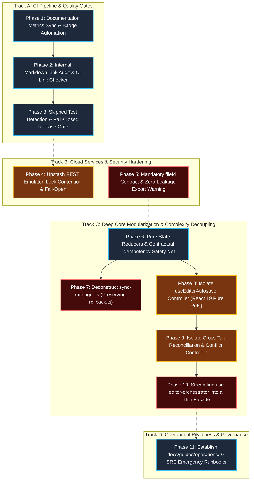

# Core Hardening Pre-Stage 2 Technical Execution Plan (LUGX Platform)

**Plan Identifier:** `PLAN-CORE-HARDENING-PRE-STAGE-2`  
**Operational Status:** 🟡 ACTIVE (Phase 1 Closed; Phases 2–11 Planned)  
**Reference Document:** Internal Incubator Blueprint (`docs/.Plans/خطة تصليد النواة ما قبل المرحلة الثانية من المشروع.md`)  
**Core Objective:** Establish deterministic engineering gates, eliminate documentation drift, decouple monolithic sync and editor state controllers into isolated single-responsibility modules, enforce fail-closed CI and zero-leakage security boundaries, and provide operational SRE runbooks ahead of Stage 2 platform scaling while unconditionally preserving a zero-regression baseline (820 passing unit tests across 67 test files).

An architectural planning blueprint structured into 11 discrete, isolated engineering phases. Each monolithic or high-complexity subsystem is decoupled within a dedicated, isolated phase to guarantee deterministic execution accuracy and prevent regressions across the verified test suite (820/820 passing tests across 67 test files). This plan incorporates all approved architectural improvements, including explicit user authorization for establishing the operational runbooks directory and updating documentation governance.

---

## 1. Architectural Hierarchy & Phase Dependency Graph

---

## 2. Priority Distribution Matrix & Isolated Phases

| Approved Priority | Allocated Execution Phases | Engineering Scope & Architectural Enhancements |
| :--- | :--- | :--- |
| **1. Documentation Metrics Synchronization** | **Phase 1** | Automating test metrics extraction into `docs/METRICS.json` and synchronizing `TECHNICAL_DEBT_REGISTER.md` and database isolation specifications to match active reality (820 tests across 67 files). |
| **2. Link Auditing & CI Validation** | **Phase 2** | Correcting 11 broken/malformed links, replacing encoded URL paths (`%20`, `%28`) with standard Markdown paths, and embedding a deterministic link checker in `CI Stage 1`. |
| **3. Skipped Test Visibility & Fail-Closed Gate** | **Phase 3** | Exporting `$GITHUB_STEP_SUMMARY` reports and enforcing fail-closed mode (`exit 1`) on release tags and main branches when secrets are missing. |
| **4. Redis Integration & Lock Contention** | **Phase 4** | Building a lightweight Upstash HTTP REST protocol emulator via `node:http`, testing concurrent distributed lock contention, network delays (>1500ms), and safe fallback to PostgreSQL ACID Ledger. |
| **5. Encrypted Content Governance & Zero-Leakage** | **Phase 5** | Enforcing mandatory `fileId` contract on `/api/ai/stream` to prevent bypassing vault encryption checks, and adding `ExportWarningModal` confirmation before exporting encrypted files as plaintext. |
| **6. Complexity Decoupling & Subsystem Modularization** | **Phases 6, 7, 8, 9, 10** | **Dedicated isolated phase for each major subsystem:** - **Phase 6:** Pure state machine reducers and contractual testing safety net prior to refactoring. - **Phase 7:** Deconstructing `sync-manager.ts` (1,834 lines) while strictly preserving `rollback.ts` (304 lines) and extracting queue workers and encrypted conflict stores. - **Phase 8:** Extracting `use-editor-autosave.ts` with strict adherence to React 19 pure ref rules. - **Phase 9:** Extracting `use-editor-conflict.ts` for cross-tab multi-window synchronization and 3-way merge handling. - **Phase 10:** Transforming `use-editor-orchestrator.ts` into a lightweight facade coordinator (<350 lines) preserving the public `UseEditorOrchestratorReturn` contract. |
| **7. Operational Runbooks & Governance Update** | **Phase 11** | Creating `docs/guides/operations/` (under explicit user authorization), updating `docs/DOCUMENTATION_GUIDELINES.md` and `docs/README.md` to classify under `LIVING GUIDE (OPERATIONAL RUNBOOK)`, and authoring 6 comprehensive SRE runbooks (Stripe, Redis, Neon, Gemini, Vault, Cron). |

---

## 3. Detailed Breakdown of the 11 Execution Phases

### [Phase 1: Documentation Metrics Sync, Badge Automation & Technical Debt Register] — Status: ✅ COMPLETED

#### Technical Objective
Eliminate documentation drift entirely, automate deterministic extraction of test counts and suite metrics directly from the Vitest JSON execution report, and update `README.md`, `TECHNICAL_DEBT_REGISTER.md`, and isolation specifications to match active reality (820 tests across 67 test files).

#### Concrete Execution Steps
- **Step 1:** Author a lightweight, bounded Node.js script `scripts/sync-doc-metrics.mjs` that consumes Vitest JSON test reports.
- **Step 2:** Generate the centralized Single Source of Truth (SSOT) contract `docs/METRICS.json` containing exact counts: `unitSuites: 67`, `unitTests: 820`, `liveSuites: 19`, `liveTests: 89`, `e2eSpecs: 14`, `e2eTests: 15`.
- **Step 3:** Synchronize `docs/TECHNICAL_DEBT_REGISTER.md` across lines 61, 97, 117, and 128 to replace legacy numbers (812 and 797) with the active count 820.
- **Step 4:** Synchronize `docs/reference/test-database-isolation.md` (line 135) and `docs/architecture/sync/editor-sync-orchestration.md` (line 440) to reflect 820 passing tests.
- **Step 5:** Wire the verification check into `Stage 1` of `.github/workflows/ci.yml`.

#### Exception & Edge Case Handling
- Test run failure during report generation: Script immediately exits with non-zero code, preventing partial or corrupt file writes.
- Merge conflicts on `docs/METRICS.json`: CI test report serves as the immutable, authoritative source of truth.

#### Closure Verifications
- Execute `node scripts/sync-doc-metrics.mjs --check` and verify 100% metrics consistency.
- Manual audit of updated files confirming all numeric references across `docs/` match `METRICS.json`.

---

### [Phase 2: Internal Markdown Link Audit & CI Link Checker] — Status: ✅ COMPLETED

#### Technical Objective
Remediate all 11 broken or malformed Markdown links across repository documentation, replace encoded URL paths (`%20`, `%28`, `%29`) with standard filesystem-compatible Markdown paths, eliminate placeholder dummy links (`[text](url)`), and integrate a deterministic local link checker into the CI pipeline.

#### Concrete Execution Steps
- **Step 1:** Correct links in `README.md` and `docs/README.md` pointing to `docs/foundation/` files containing whitespace and parentheses by using standard decoded relative paths compatible with local file systems and code editors.
- **Step 2:** Fix the 4 placeholder dummy links in `docs/guides/editor/data-export-guide.md` (`[alt](url)`, `[text](url)`, `[Link\](url)`).
- **Step 3:** Write a deterministic link validation script `scripts/check-markdown-links.mjs` verifying target file existence across all 76 Markdown files, strictly excluding external URLs (`http://` and `https://`) to prevent CI failure from network instability.
- **Step 4:** Embed the link checker into `.github/workflows/ci.yml` under `Stage 1: Quality & Security Gate`.

#### Exception & Edge Case Handling
- Anchor links (`#heading-anchor`): Verify file existence first, bypassing complex dynamic anchor slugs when ambiguous.
- External web links (`http://`, `https://`): Explicitly bypass external URLs during local link checks to isolate CI from third-party network outages.

#### Closure Verifications
- Execute `node scripts/check-markdown-links.mjs` and confirm `0 broken links` across all 76 Markdown files in the repository.
- Successfully pass `Stage 1` in the CI pipeline with the link verification step active.

---

### [Phase 3: Skipped Test Detection & Fail-Closed Release Gate] — Status: ⏳ PLANNED

#### Technical Objective
Eliminate the silent skip vulnerability (`Silent Skip with Exit 0`) in Playwright E2E and Live Smoke CI stages, generate transparent markdown summaries in `$GITHUB_STEP_SUMMARY`, and enforce strict fail-closed termination (`exit 1`) for release tags and main branch pushes when required cloud credentials or test secrets are missing.

#### Concrete Execution Steps
- **Step 1:** Modify Stage 6 in `.github/workflows/ci.yml` to export a transparent markdown table to `$GITHUB_STEP_SUMMARY` detailing executed test counts and secret availability status.
- **Step 2:** Modify Stage 7 in `.github/workflows/ci.yml` to record Live Smoke test execution status in `$GITHUB_STEP_SUMMARY`.
- **Step 3:** Implement progressive gating logic in CI: if the workflow runs under a `release` context, push to `main`, or manual dispatch `workflow_dispatch` with `run_live_smoke: true`, absent secrets mandate immediate `exit 1` failure blocking release deployment, while permitting conditional bypass with warning notices for untrusted `pull_request` forks.
- **Step 4:** Document release gating policies and CI stage requirements in `docs/reference/ci-pipeline.md`.

#### Exception & Edge Case Handling
- External fork Pull Requests: Allow graceful skip with an explicit warning banner (`WARNING: E2E skipped due to missing secrets`) without failing isolated PR validation.
- Release Tag or Main Branch push: Trigger immediate hard failure (`exit 1`) if any browser or live cloud test suite is skipped.

#### Closure Verifications
- Run local simulation of `$GITHUB_STEP_SUMMARY` generation to verify table rendering.
- Verify fail-closed enforcement triggers correctly when simulating a release run without configured secrets.

---

### [Phase 4: Upstash REST Emulator, Lock Contention & Fail-Open Verification] — Status: ⏳ PLANNED

#### Technical Objective
Bridge the protocol gap between the Upstash HTTP REST client and the standard TCP Redis container in CI, construct a lightweight in-memory HTTP REST emulator via `node:http`, and author a dedicated integration test suite verifying standard lock operations, parallel lock contention, timeout degradation (>1500ms), and safe fail-open fallback to the PostgreSQL ACID Ledger.

#### Concrete Execution Steps
- **Step 1:** Implement an in-memory Upstash REST Mock Server using `node:http` within the test harness handling `/pipeline`, `/set`, `/get`, and `/del` commands along with `nx` and `ex` parameters.
- **Step 2:** Author a dedicated integration test suite `src/test/infrastructure/redis-live-integration.test.ts`.
- **Step 3:** Verify **Redis Healthy** path: Validate setting, reading, and releasing distributed lock key `stripe:lock:${eventId}` with `nx: true` and `ex: 30`.
- **Step 4:** Verify **Lock Contention** path: Dispatch concurrent identical requests with the same `eventId` and assert that the second request is dropped with `deduplicated: true` at the Redis tier prior to consuming database connections.
- **Step 5:** Verify **Timeout & Fail-Open** path: Simulate network latency exceeding 1500ms and verify seamless fail-open fallback to the `PostgreSQL ACID Ledger` without throwing unhandled exceptions.

#### Exception & Edge Case Handling
- Total Redis network disconnection: Application safely falls back to PostgreSQL idempotency path while logging a structured warning.
- Processing duration exceeds lock TTL (30s): PostgreSQL transactional unique constraints guarantee deduplication even if the Redis lock expires.

#### Closure Verifications
- Execute `npx vitest run src/test/infrastructure/redis-live-integration.test.ts` and verify 100% pass rate across Healthy, Contention, and Timeout paths.

---

### [Phase 5: Mandatory fileId Contract & Zero-Leakage Export Warning] — Status: ⏳ PLANNED

#### Technical Objective
Close the security bypass vector in `/api/ai/stream` by enforcing a **mandatory `fileId` contract**, preventing unauthenticated AI streaming of vault-encrypted documents when `allowAIOnEncryptedFiles = false`, and introduce a confirmation modal (`ExportWarningModal`) warning users prior to exporting encrypted files as plaintext.

#### Concrete Execution Steps
- **Step 1:** Modify `src/app/api/ai/stream/route.ts` to enforce `fileId` as an obligatory string parameter; reject requests missing `fileId` immediately with HTTP 400 `MISSING_FILE_ID` prior to quota reservation or model invocation.
- **Step 2:** Enforce file ownership and encryption status: if `isEncrypted: true`, query `allowAIOnEncryptedFiles` in `userVaultProfiles`; reject requests with HTTP 403 `AI_PROHIBITED_ON_ENCRYPTED_FILES` if AI access is disabled.
- **Step 3:** Update `src/hooks/use-ai-stream.ts` and `use-editor-orchestrator.ts` to guarantee passing a valid `fileId`, and update all test fixtures invoking AI streaming (`src/test/ai/ai-stream-parser.test.ts`, `src/test/ai/ai-stream-completion-terminality.test.ts`) with valid `fileId` parameters.
- **Step 4:** Construct `ExportWarningModal` in `src/components/editor/export-warning-modal.tsx` and integrate with `export-button.tsx` and `src/app/workspace/editor/[fileId]/page.tsx` to prompt users before saving decrypted plaintext to disk.
- **Step 5:** Author security integration test suite `src/test/vault/vault-leak-prevention.integration.test.ts`.

#### Exception & Edge Case Handling
- User explicitly enables `allowAIOnEncryptedFiles: true`: Permit streaming while enforcing re-encryption prior to database persistence via `ai-commit.ts`.
- Export attempt while vault is locked: Disable export button in UI and block export action.

#### Closure Verifications
- Execute `npx vitest run src/test/vault/vault-leak-prevention.integration.test.ts` and confirm all bypass vectors and unauthenticated streaming requests are blocked.
- UI tests verify confirmation modal appears before exporting encrypted files.

---

### [Phase 6: Pure State Reducers & Contractual Idempotency Safety Net] — Status: ⏳ PLANNED

#### Technical Objective
Isolate and formally define mathematical boundaries for core state machines (Sync Status Transitions, AI Quota Lifecycle, Stripe Webhook Events) by extracting pure state reducers decoupled from I/O and databases, secured by exhaustive contract tests to serve as an **obligatory safety net** before refactoring subsystems in Phases 7, 8, 9, and 10.

#### Concrete Execution Steps
- **Step 1:** Extract pure sync state machine into `src/lib/sync/sync-state-reducer.ts` as a pure function: `(currentStatus, event) => nextStatus` enforcing permitted transitions across 8 statuses and rejecting invalid transitions.
- **Step 2:** Extract quota settlement mathematics from `src/server/actions/ai-ops.ts` into a pure function `calculateQuotaSettlement(...)` computing deltas and refunds without external dependencies.
- **Step 3:** Extract Stripe subscription state machine into `src/lib/stripe/webhook-event-reducer.ts` covering 8 subscription states and preventing invalid reverse transitions from `canceled`.
- **Step 4:** Author exhaustive contract test suite `src/test/contracts/state-machines-contracts.test.ts` covering full transition matrices.

#### Exception & Edge Case Handling
- Undefined event received: Retain current status and emit a structured warning without throwing unhandled exceptions.
- Duplicate identical event received: Reducer returns identical state without side effects (pure idempotency).

#### Closure Verifications
- Execute `npx vitest run src/test/contracts/state-machines-contracts.test.ts` and pass 100% of contract test cases.
- Confirm zero regressions across existing test baseline (820 tests).

---

### [Phase 7: Deconstruct sync-manager.ts (Preserving rollback.ts)] — Status: ⏳ PLANNED

#### Technical Objective
Deconstruct the monolithic `src/lib/sync/sync-manager.ts` (1,834 lines) into decoupled, specialized modules by separating queue worker processing and encrypted conflict management, while **strictly preserving the existing verified rollback engine `src/lib/sync/rollback.ts` (304 lines)**, maintaining complete backward compatibility of the public `SyncManager` API.

#### Concrete Execution Steps
- **Step 1:** Extract queue worker processing, concurrency push, and exponential backoff into `src/lib/sync/sync-queue-worker.ts` (~450 lines).
- **Step 2:** Extract encrypted conflict management and reactive `SessionKeyStore` subscription into `src/lib/sync/sync-encrypted-conflict-store.ts` (~250 lines).
- **Step 3:** Delegate rollback and checkpointing operations in `sync-manager.ts` directly to the existing `SyncRollback` class in `src/lib/sync/rollback.ts` without introducing duplicate coordinator logic.
- **Step 4:** Refactor `src/lib/sync/sync-manager.ts` into a thin central coordinator (<350 lines) binding `SyncQueueWorker`, `SyncCryptoGateway`, `SyncRollback`, and `SyncEncryptedConflictStore`.
- **Step 5:** Preserve complete public API compatibility for `SyncManager` to prevent breaking downstream UI callers or tests.

#### Exception & Edge Case Handling
- Network disconnection during queue drain: Persist uncommitted operations in IndexedDB without re-dispatching committed items.
- Inbound ciphertext decryption failure: Quarantine operation immediately with status `conflict_locked` without halting remaining queue items.

#### Closure Verifications
- Execute full sync test suite: `npx vitest run src/test/sync/*` (including `sync-manager.test.ts`, `sync-parallel.test.ts`, `sync-rollback.test.ts`) and confirm 100% pass rate.

---

### [Phase 8: Isolate useEditorAutosave Controller (React 19 Pure Refs)] — Status: ⏳ PLANNED

#### Technical Objective
Extract autosave timers, debounce and suspension gates, dirty state tracking, and write lock guards from the monolithic orchestrator into an isolated hook: `use-editor-autosave.ts`, strictly enforcing React 19 render purity rules by eliminating `ref.current` reads during render phase.

#### Concrete Execution Steps
- **Step 1:** Construct dedicated hook `src/hooks/editor/use-editor-autosave.ts` exclusively managing the autosave lifecycle.
- **Step 2:** Isolate suspension guards for AI streaming (`isAIStreaming`), quota reservation (`isReserving`), and sync conflict (`hasConflict`).
- **Step 3:** Encapsulate `beforeunload` tab departure guards preventing unsaved data loss within the dedicated hook.
- **Step 4:** Enforce React 19 compliance by eliminating `ref.current` reads in render phase, utilizing accessor getters or `useEffect` hooks.
- **Step 5:** Author unit test suite `src/test/editor/use-editor-autosave.test.ts` verifying debounce and suspension mechanics.

#### Exception & Edge Case Handling
- User edits during AI streaming: Abort AI stream immediately, release write lock, and activate autosave timer to persist user input without data loss.
- Network save failure: Retain `dirty: true` state and reschedule save attempt without overwriting document or freezing UI.

#### Closure Verifications
- Pass all unit tests in `src/test/editor/use-editor-autosave.test.ts`.
- Confirm no unauthorized background saves occur during simulated AI streaming.

---

### [Phase 9: Isolate Cross-Tab Reconciliation & Conflict Controller] — Status: ⏳ PLANNED

#### Technical Objective
Extract remote reconciliation, multi-tab `BroadcastChannel` synchronization, HTTP 412 conflict handling, and `ConflictDialog` 3-way merge integration into an isolated controller: `use-editor-conflict.ts`, fully conforming to React 19 standards.

#### Concrete Execution Steps
- **Step 1:** Construct dedicated hook `src/hooks/editor/use-editor-conflict.ts` managing all conflict and reconciliation flows.
- **Step 2:** Isolate `subscribeCrossTabSync` subscriptions and `broadcastCrossTabEvent` dispatching, routing external tab updates to the controller.
- **Step 3:** Wire user conflict resolution choices (`keep_local`, `keep_remote`, `merge_3way`) to deterministic dispatchers updating CodeMirror and IndexedDB.
- **Step 4:** Author dedicated test suite `src/test/editor/use-editor-conflict.test.ts`.

#### Exception & Edge Case Handling
- Remote update arrives for locally unmodified document: Apply update cleanly to CodeMirror without showing false conflict dialogs.
- Encrypted file update arrives while vault is locked in current tab: Flag as pending encrypted conflict and prevent editor state corruption.

#### Closure Verifications
- Pass all unit and integration tests in `src/test/editor/use-editor-conflict.test.ts`.
- Verify integration between `ConflictDialog` and 3-way merge pipeline.

---

### [Phase 10: Streamline use-editor-orchestrator into a Thin Facade] — Status: ⏳ PLANNED

#### Technical Objective
Refactor the central orchestrator `src/hooks/use-editor-orchestrator.ts` following extraction of controllers in Phases 8 and 9, transforming it from a 1,670-line monolith into a lightweight facade coordinator (<350 lines) wiring extracted controllers with `MarkdownEditor`.

#### Concrete Execution Steps
- **Step 1:** Integrate `useEditorAutosave` and `useEditorConflict` inside `use-editor-orchestrator.ts`.
- **Step 2:** Extract text direction logic (`TextDirectionMode`) and local preferences into `use-editor-direction.ts`.
- **Step 3:** Clean up legacy refs, debounce timers, and state variables, restricting the orchestrator's role to initializing `EditorAdapter` and event routing.
- **Step 4:** Unconditionally preserve the public `UseEditorOrchestratorReturn` contract to ensure zero modifications are required in `src/app/workspace/editor/[fileId]/page.tsx`.

#### Exception & Edge Case Handling
- Editor initialization during network offline state: Enable local editing mode without awaiting server response.
- File switching in workspace: Clean up previous controller references and reinitialize for new document without memory leaks.

#### Closure Verifications
- Execute all editor test suites: `npx vitest run src/test/editor/*` and confirm 100% pass rate.
- Execute Playwright E2E browser tests to verify end-to-end editing and sync flows in a real browser.

---

### [Phase 11: Establish docs/guides/operations/ & SRE Emergency Runbooks] — Status: ⏳ PLANNED

#### Technical Objective
Establish a dedicated directory for operational runbooks `docs/guides/operations/` **(under explicit user authorization)**, update repository governance documents `docs/DOCUMENTATION_GUIDELINES.md` and `docs/README.md` to classify the directory under `LIVING GUIDE (OPERATIONAL RUNBOOK)`, and author 6 comprehensive SRE emergency response runbooks.

#### Concrete Execution Steps
- **Step 1:** Create directory `docs/guides/operations/`.
- **Step 2:** Update governance document `docs/DOCUMENTATION_GUIDELINES.md`:
  - Add `operations/` to Section 2 (Structural Directory Table) as a dedicated domain for Day-2 operations and SRE incident response runbooks.
  - Add `docs/guides/operations/` to Section 3 (Permitted Modifications Matrix) classified as `LIVING GUIDE (OPERATIONAL RUNBOOK)` allowing verified triage steps and diagnostic queries while strictly prohibiting speculative procedures.
- **Step 3:** Update master index `docs/README.md` to document the operational runbooks directory and contents.
- **Step 4:** Author Stripe subscription and webhook failure runbook: `docs/guides/operations/stripe-reconciliation-runbook.md`.
- **Step 5:** Author Upstash Redis outage and lock degradation runbook: `docs/guides/operations/redis-outage-runbook.md`.
- **Step 6:** Author Neon database pool exhaustion and connection drop runbook: `docs/guides/operations/neon-database-runbook.md`.
- **Step 7:** Author Gemini AI key rotation and quota exhaustion runbook: `docs/guides/operations/ai-keys-rotation-runbook.md`.
- **Step 8:** Author Zero-Knowledge vault disaster recovery runbook: `docs/guides/operations/vault-disaster-recovery-runbook.md`.
- **Step 9:** Author Cron backlog and unreleased reservation clearing runbook: `docs/guides/operations/cron-backlog-runbook.md`.

#### Exception & Edge Case Handling
- User lost 12-word BIP-39 mnemonic recovery seed: Document mathematical impossibility of recovery and procedures for creating a new vault profile.
- Total cloud AI API outage: Document procedures for toggling automated maintenance mode for AI streaming routes.

#### Closure Verifications
- Audit all links, commands, and schemas in runbooks against `docs-governance.md` and `DOCUMENTATION_GUIDELINES.md`.
- Pass link checker `node scripts/check-markdown-links.mjs` with 100% valid links.
