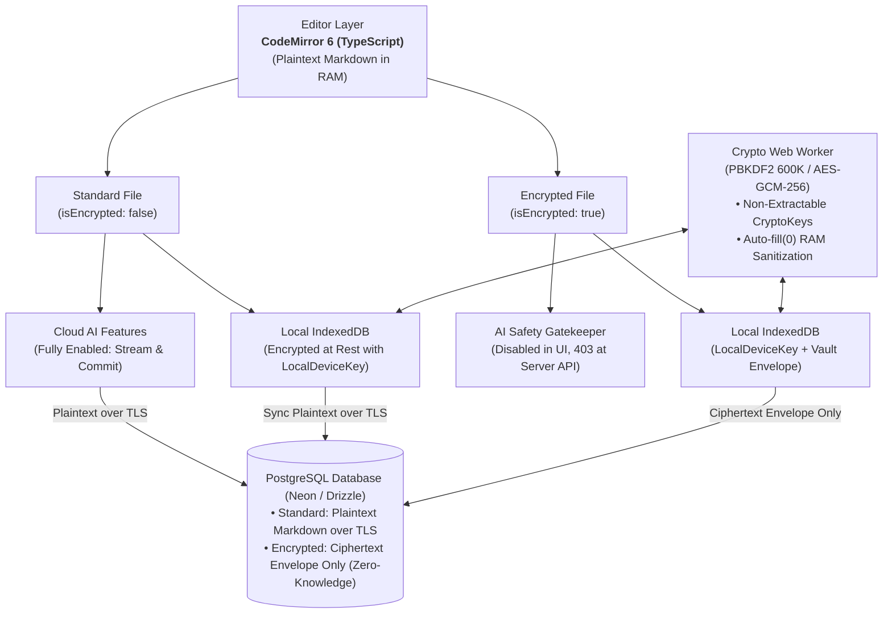
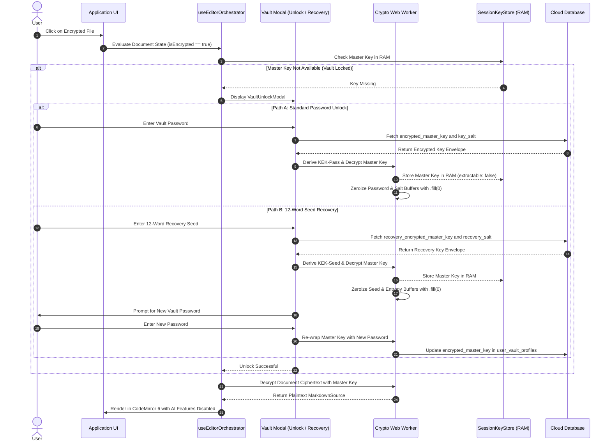
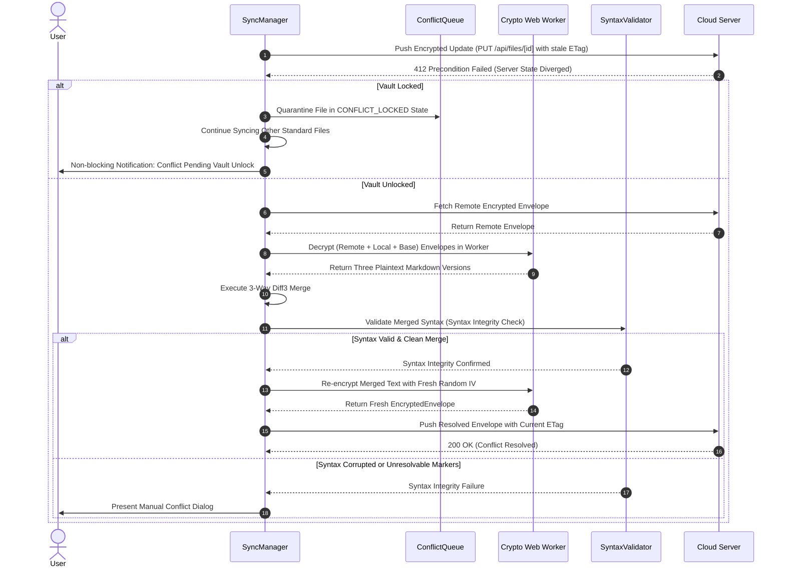

# Dual-Tier Hybrid Encryption & Client-Side Zero-Knowledge Vault Plan

## 1. Approved Architectural Summary

This execution plan implements a **Dual-Tier Hybrid Encryption** architecture for the **LUGX** web application (TypeScript / Next.js / React 19). It incorporates the three core architectural enhancements: post-merge syntax integrity validation, conflict queue isolation during locked vault states, and multi-layered defensive memory sanitization.

1. **Always-On Local At-Rest Encryption**: Transparent client-side encryption of all local `IndexedDB` records using a device-bound key (`LocalDeviceKey`) requiring zero user interaction.
2. **Zero-Knowledge Cloud Vault**: End-to-end authenticated client-side encryption for files designated as encrypted (`isEncrypted = true`) using `AES-GCM-256` bound with Additional Authenticated Data (`AAD(userId, fileId)`).
3. **Dual-Wrapped Key Hierarchy & 12-Word Recovery Seed**: The independent master key ($K_{\text{master}}$) is wrapped twice: first with a user-defined vault password Key Encryption Key ($KEK_{\text{pass}}$), and second with a 12-word BIP-39 recovery seed Key Encryption Key ($KEK_{\text{seed}}$). This enables complete account recovery and password resetting without requiring bulk file re-encryption.
4. **Zero-Prompt on Login**: Standard authentication occurs seamlessly without prompting for vault credentials; unlock modals appear strictly upon explicit access to encrypted files or upon requesting encryption of an unencrypted document.
5. **Dynamic File Conversion Engine**: Supports atomic document conversion between standard and encrypted states, prompting for vault creation or unlock when necessary.
6. **Isolated Crypto Web Worker & Defensive Memory Sanitization**:
   - Heavy cryptographic derivations (`PBKDF2-HMAC-SHA256` with `600,000` iterations) and symmetric transformations run in a dedicated background `Crypto Web Worker`.
   - Cryptographic keys are generated as non-extractable (`extractable: false`), and sensitive intermediate byte buffers are zeroized immediately (`.fill(0)`) in volatile RAM.
7. **Non-Blocking Sync & Conflict Isolation**:
   - When a 412 conflict occurs on an encrypted file while the vault is locked, the document is quarantined into a `CONFLICT_LOCKED` queue, allowing standard file synchronization to proceed without interruption.
   - Upon unlocking, the engine decrypts payloads, performs a 3-way `diff3` merge, validates Markdown structural integrity (`Syntax Integrity Check`), and re-encrypts the merged output with a fresh random `IV`.
8. **Dual-Layer AI Safety Gatekeeper**: Complete blocking of AI streaming and commit endpoints for encrypted files at both the UI layer (controls disabled with security badges) and server boundary (HTTP `403 Forbidden`).

---

## 2. System Architecture Diagrams

### 2.1. General Hybrid Architecture & Data Flow



---

### 2.2. Vault Unlock & Recovery Sequence



---

### 2.3. Encrypted Diff3 & Conflict Isolation Flow



---

## 3. TypeScript Types & Database Schemas

### 3.1. Cryptographic Interfaces (`src/lib/sync/types/vault.ts`)

```typescript
export interface EncryptedEnvelope {
  readonly version: 1;
  readonly algorithm: 'AES-GCM-256';
  readonly keyId: string;
  readonly iv: string;            // Base64 (12-byte CSPRNG)
  readonly salt: string;          // Base64 (16 bytes)
  readonly ciphertext: string;    // Base64 (Ciphertext + 16-byte Auth Tag)
  readonly kdfIterations: number; // 600,000
}

export interface UserVaultProfile {
  readonly userId: string;
  readonly encryptedMasterKey: string;
  readonly recoveryEncryptedMasterKey: string;
  readonly keySalt: string;
  readonly recoverySalt: string;
  readonly kdfIterations: number;
  readonly keyVersion: number;
  readonly createdAt: Date;
  readonly updatedAt: Date;
}

export interface VaultState {
  readonly isInitialized: boolean;
  readonly isUnlocked: boolean;
  readonly keyVersion: number;
}

export type EncryptedSyncStatus = 
  | 'SYNCED' 
  | 'SYNCING' 
  | 'PENDING_UPLOAD' 
  | 'CONFLICT_LOCKED'      // Quarantined awaiting vault unlock for decryption
  | 'CONFLICT_MANUAL';     // Routed to manual resolution upon syntax failure

export interface PendingEncryptedConflict {
  readonly fileId: string;
  readonly remoteEnvelope: EncryptedEnvelope;
  readonly baseEnvelope: EncryptedEnvelope;
  readonly localEnvelope: EncryptedEnvelope;
  readonly remoteEtag: string;
  readonly detectedAt: Date;
}

export interface SyntaxValidationResult {
  readonly isValid: boolean;
  readonly sanitizedContent: string;
  readonly syntaxErrors?: string[];
}
```

### 3.2. Drizzle Database Schema (`src/lib/db/schema.ts`)

```typescript
import { pgTable, uuid, text, boolean, integer, jsonb, timestamp } from 'drizzle-orm/pg-core';

// 1. Vault profile and dual-wrapped key management
export const userVaultProfiles = pgTable('user_vault_profiles', {
  userId: uuid('user_id').primaryKey().notNull(), // Bound to auth.users
  encryptedMasterKey: text('encrypted_master_key').notNull(), // Wrapped via Password KEK
  recoveryEncryptedMasterKey: text('recovery_encrypted_master_key').notNull(), // Wrapped via Seed KEK
  keySalt: text('key_salt').notNull(), // Cryptographic Salt for Password KDF
  recoverySalt: text('recovery_salt').notNull(), // Cryptographic Salt for Seed KDF
  kdfIterations: integer('kdf_iterations').default(600000).notNull(),
  keyVersion: integer('key_version').default(1).notNull(),
  createdAt: timestamp('created_at').defaultNow().notNull(),
  updatedAt: timestamp('updated_at').defaultNow().notNull(),
});

// 2. File metadata extensions supporting client-side encryption
export const files = pgTable('files', {
  id: uuid('id').defaultRandom().primaryKey(),
  userId: uuid('user_id').notNull(),
  title: text('title').notNull(),
  content: text('content').notNull(), // Plaintext Markdown OR EncryptedEnvelope JSON
  isEncrypted: boolean('is_encrypted').default(false).notNull(),
  encryptionMetadata: jsonb('encryption_metadata').$type<{
    version: number;
    algorithm: string;
    keyId: string;
    salt: string;
    iv: string;
  }>(),
  version: integer('version').default(1).notNull(),
  etag: text('etag').notNull(),
  createdAt: timestamp('created_at').defaultNow().notNull(),
  updatedAt: timestamp('updated_at').defaultNow().notNull(),
});
```

---

## 4. Five-Phase Implementation Plan

---

### Phase 1: Isolated Crypto Worker, Defensive RAM Sanitization & Key Management

#### Technical Objective
Implement an isolated, high-performance cryptographic engine via the `Web Crypto API` executing entirely inside a dedicated background `Crypto Web Worker`. Enforce non-exportable key handles (`extractable: false`) and automatic volatile buffer zeroization (`.fill(0)`).

#### Targeted Files and Components
- `src/lib/workers/crypto.worker.ts` (Web Worker implementation with zeroization handlers).
- `src/lib/sync/crypto-worker-bridge.ts` (Typed asynchronous RPC bridge via `postMessage`).
- `src/lib/sync/encryption.ts` (Unified cryptographic interface and abstractions).
- `src/lib/sync/session-key-store.ts` (Volatile in-memory key repository with inactivity timeout).
- `src/lib/sync/mnemonic.ts` (12-word BIP-39 English mnemonic generator and checksum validator).

#### Direct Implementation Steps
1. **Crypto Web Worker Construction (`crypto.worker.ts`)**:
   - Implement `PBKDF2-HMAC-SHA256` key derivation with `600,000` iterations.
   - Implement `AES-GCM-256` authenticated encryption/decryption enforcing `AAD` structured as `${userId}:${fileId}`.
   - Secure random generation of 12-byte IVs and 16-byte salts using CSPRNG.
   - **Defensive Memory Sanitization:** Always import keys with `extractable: false`, and wipe all byte buffers containing passwords, salts, or mnemonic entropy via `.fill(0)` immediately upon completion.
2. **Typed Communication Bridge (`crypto-worker-bridge.ts`)**:
   - Build a Promise-based RPC layer managing message dispatch, response matching, and worker error handling without main-thread jank (maintaining 60fps).
3. **Session Key Store (`session-key-store.ts`)**:
   - Manage in-memory handles for `LocalDeviceKey` and `VaultMasterKey`.
   - Implement configurable inactivity timer triggering automatic vault locking.
   - Implement `purgeKeys()` to zeroize and discard key references on lock or logout.
4. **Mnemonic Validation Engine (`mnemonic.ts`)**:
   - Derive 128-bit entropy into 12 BIP-39 words with checksum verification; wipe raw entropy buffers post-derivation.

#### Exception & Error Handling
- **Authentication Tag Mismatch:** Throw `InvalidCiphertextOrKeyError`; immediately zeroize working buffers and return zero partial plaintext.
- **AAD Tampering:** Throw `AADIntegrityError` if document ID or user ID in AAD does not match envelope origin.

#### Closure Gate
Cryptographic derivation executes with zero UI thread freezing (0ms main-thread lag), and 100% of temporary secret buffers pass memory sanitization assertions.

---

### Phase 2: Database Schema Migrations & Transparent Encrypted IndexedDB

#### Technical Objective
Upgrade the PostgreSQL database schema via Drizzle to store vault profiles and dual-wrapped keys, and wrap local `IndexedDB` operations with transparent at-rest encryption via `LocalDeviceKey`.

#### Targeted Files and Components
- `src/lib/db/schema.ts` and `src/lib/db/migrations/0008_hybrid_vault_schema.sql`.
- `src/lib/sync/idb-types.ts` (Table schemas supporting encrypted records).
- `src/lib/sync/indexeddb.ts` (Encrypted read/write interceptors).

#### Direct Implementation Steps
1. **Database Migrations**:
   - Deploy `user_vault_profiles` table with dual wrapped key columns (`encryptedMasterKey` and `recoveryEncryptedMasterKey`).
   - Add `is_encrypted` (default `false`) and `encryption_metadata` columns to `files`.
2. **Local Storage Contract Updates (`idb-types.ts`)**:
   - Update `IDBFile`, snapshots, and pending operations to accommodate encryption status and envelope payloads.
3. **IndexedDB Transparent Interception (`indexeddb.ts`)**:
   - Wrap `saveFile` and `getFile`: encrypt `content` transparently with `LocalDeviceKey` before committing to IndexedDB, decrypting on retrieval.
   - Encrypt dirty queue items and snapshots to ensure zero plaintext Markdown persists on client disk.

#### Exception & Error Handling
- **Legacy Record Migration:** Detect legacy unencrypted records in `IndexedDB` and transparently encrypt them with the device key upon first access.
- **Local Record Corruption:** Isolate corrupted records and initiate conditional server re-fetch without crashing the database engine.

#### Closure Gate
Drizzle migrations apply cleanly without type errors, and browser disk inspection confirms zero plaintext document strings at rest.

---

### Phase 3: Vault UI Components, Editor Orchestrator & Dynamic File Conversion Engine

#### Technical Objective
Build vault interface modals (creation, unlock, recovery), integrate `useEditorOrchestrator` for on-demand lazy unlocking, and implement atomic file conversion between standard and encrypted states.

#### Targeted Files and Components
- `src/components/vault/create-vault-modal.tsx` (Vault setup with 3-word mnemonic challenge).
- `src/components/vault/vault-unlock-modal.tsx` (Password unlock with tabbed seed recovery).
- `src/components/vault/recovery-phrase-modal.tsx` (12-word display and copy modal).
- `src/hooks/use-editor-orchestrator.ts` (Document lifecycle and vault lock integration).
- `src/server/actions/file-ops.ts` (Server Action for atomic encryption toggling).
- `src/components/files/file-context-menu.tsx` and sidebar (Vault status icons and menu options).

#### Direct Implementation Steps
1. **Vault Modals**:
   - `CreateVaultModal`: Password input, 12-word BIP-39 generation, and interactive verification requiring selection of 3 random words before activation.
   - `VaultUnlockModal`: Lightweight modal triggered upon accessing locked encrypted files, supporting password entry or switching to recovery seed mode.
2. **Editor Orchestration Integration (`use-editor-orchestrator.ts`)**:
   - When loading an encrypted file (`isEncrypted == true`):
     1. Verify `sessionKeyStore.hasMasterKey()`.
     2. If absent, suspend editor mounting and present `VaultUnlockModal`.
     3. Upon unlock, decrypt payload via worker and pass plaintext Markdown to CodeMirror.
3. **Dynamic Conversion Engine (`file-ops.ts`)**:
   - **Encrypt File (`encryptFile`)**: Ensure vault exists (or prompt creation), verify vault is unlocked, encrypt document via `AES-GCM-256`, set `isEncrypted: true`, and update UI icon to 🔒.
   - **Decrypt File (`decryptFile`)**: Require unlocked vault, decrypt content, set `isEncrypted: false`, remove encryption metadata, and update UI icon to 📄.

#### Exception & Error Handling
- **Modal Dismissal Without Unlock:** Cancel document load cleanly and route user to workspace root without throwing errors.
- **Incorrect Password Entry:** Display localized error feedback, retain locked state, and prevent data corruption.

#### Closure Gate
Zero-prompt login verified for standard files, dynamic conversion executes bidirectionally, and decrypted content renders accurately in CodeMirror.

---

### Phase 4: AI Safety Gatekeepers, Non-Blocking Sync with Conflict Isolation & Syntax Integrity

#### Technical Objective
Enforce double-layer AI blocking on encrypted files, and adapt synchronization to isolate encrypted conflicts during locked states while enforcing syntax integrity validation on 3-way merges.

#### Targeted Files and Components
- `src/components/editor/ai-toolbar.tsx` and `src/hooks/use-ai-stream.ts` (UI gating).
- `src/app/api/ai/stream/route.ts` and `src/server/actions/ai-commit.ts` (Server 403 enforcement).
- `src/lib/sync/sync-manager.ts` (Non-blocking sync and conflict queue isolation).
- `src/lib/sync/conflict-resolver.ts` (Client-side encrypted merge resolution).
- `src/lib/sync/syntax-validator.ts` (Markdown structural integrity validator).
- `src/lib/sync/etag-generator.ts` (Encrypted envelope ETag computation).

#### Direct Implementation Steps
1. **AI Safety Gatekeeper**:
   - **UI Layer:** Hide `AIToolbar`, disable AI keyboard shortcuts, and render protective security badge on encrypted documents.
   - **Server Layer:** Validate `isEncrypted` in `/api/ai/stream` and `ai-commit.ts`; immediately return `403 Forbidden` (`AI_PROHIBITED_ON_ENCRYPTED_FILES`) if invoked on encrypted files.
2. **Deterministic ETag Computation**:
   - Standard Files: $ETag = \text{SHA-256}(\text{normalizeMarkdownSource}(\text{content}))$.
   - Encrypted Files: $ETag = \text{SHA-256}(\text{Serialized EncryptedEnvelope JSON})$.
3. **Conflict Isolation During Locked States**:
   - Upon encountering HTTP 412 on an encrypted file while the vault is locked:
     1. Quarantine file into `PendingEncryptedConflict` queue with status `CONFLICT_LOCKED`.
     2. Continue syncing remaining standard files without interruption.
     3. Emit non-intrusive notification indicating an encrypted conflict requires vault unlock.
4. **3-Way Merge with Syntax Integrity Validation**:
   - Upon unlocking vault:
     1. Fetch remote envelope; decrypt remote, local, and base snapshots in RAM.
     2. Execute 3-way `diff3` text merge.
     3. Pass merged text to `syntax-validator.ts` verifying unclosed code fences and intact table structures.
     4. If valid: Re-encrypt with fresh random IV and push to server.
     5. If invalid: Mark as `CONFLICT_MANUAL` and present side-by-side comparison modal.

#### Exception & Error Handling
- **Server Communication Interruption:** Backoff with exponential delay while retaining encrypted envelope in local queue.

#### Closure Gate
Direct AI API requests on encrypted files fail with 403, standard files continue syncing during `CONFLICT_LOCKED` events, and 3-way merges preserve Markdown syntax.

---

### Phase 5: Hardened Verification, Security Auditing & Closure Test Matrix

#### Technical Objective
Execute comprehensive test matrix (Unit, Integration, E2E) in Vitest, audit logs to verify zero sensitive data leakage, and confirm all three core architectural enhancements.

#### Targeted Files and Components
- `src/test/vault/vault-crypto.test.ts`
- `src/test/vault/vault-recovery.test.ts`
- `src/test/parsers/file-conversion.test.ts`
- `src/test/ai/ai-gatekeeper.test.ts`
- `src/test/sync/sync-encrypted-conflict.test.ts`
- `src/lib/sync/error-handler.ts` and `src/lib/sync/performance-monitor.ts`

#### Closure Test Matrix

| # | Test Category | Verification Scenario | Mandated Closure Criteria |
| :---: | :--- | :--- | :--- |
| **1** | **Lazy-Unlock & Login** | Authenticate user; browse and modify standard files. | Standard documents open immediately with zero vault prompts (Zero-Prompt on Login). |
| **2** | **First Encrypt Setup** | User without vault requests encryption on standard file. | `CreateVaultModal` appears; 12-word seed generated; 3-word challenge passed; file encrypted. |
| **3** | **Vault Activation** | Access encrypted file while vault is locked. | `VaultUnlockModal` displays requesting vault password. |
| **4** | **Seed Recovery Flow** | Reset password via 12-word recovery seed. | Master key decrypted; `encrypted_master_key` re-wrapped; all files accessible without re-encryption. |
| **5** | **RAM Sanitization** | Inspect memory buffers post-decryption and on lock. | Keys have `extractable: false`; intermediate buffer zeroization via `.fill(0)` verified. |
| **6** | **AI Hard Block (UI/API)** | Trigger AI stream via UI shortcut or direct API request. | Toolbar disabled; server endpoint returns HTTP `403 Forbidden`. |
| **7** | **Worker Offloading** | Monitor main thread during 600K PBKDF2 derivation. | UI thread retains stable 60fps with zero UI freeze (0ms lag). |
| **8** | **Conflict Isolation** | Trigger 412 on encrypted file while vault is locked. | Encrypted file enters `CONFLICT_LOCKED`; standard file sync proceeds uninterrupted. |
| **9** | **Syntax-Safe Diff3 Merge** | Unlock vault and resolve conflict via `diff3`. | Passes `SyntaxIntegrityCheck`; re-encrypts with fresh IV; updates remote ETag. |
| **10** | **Log Sanitation** | Inspect error logs and telemetry during failed operations. | Zero document plaintext, master keys, or passwords present in logs or metrics. |

#### Final Phase 16 Closure Standard
The **Zero-Knowledge Vault Subsystem (Phase 16)** is declared **`CLOSED`** only when:
- 100% of the 10 matrix tests pass without skip or warning.
- Zero key or plaintext leakage exists in logs, error payloads, or database records.
- Editor runtime, sync engine, and AI features on standard documents remain completely unaffected.
