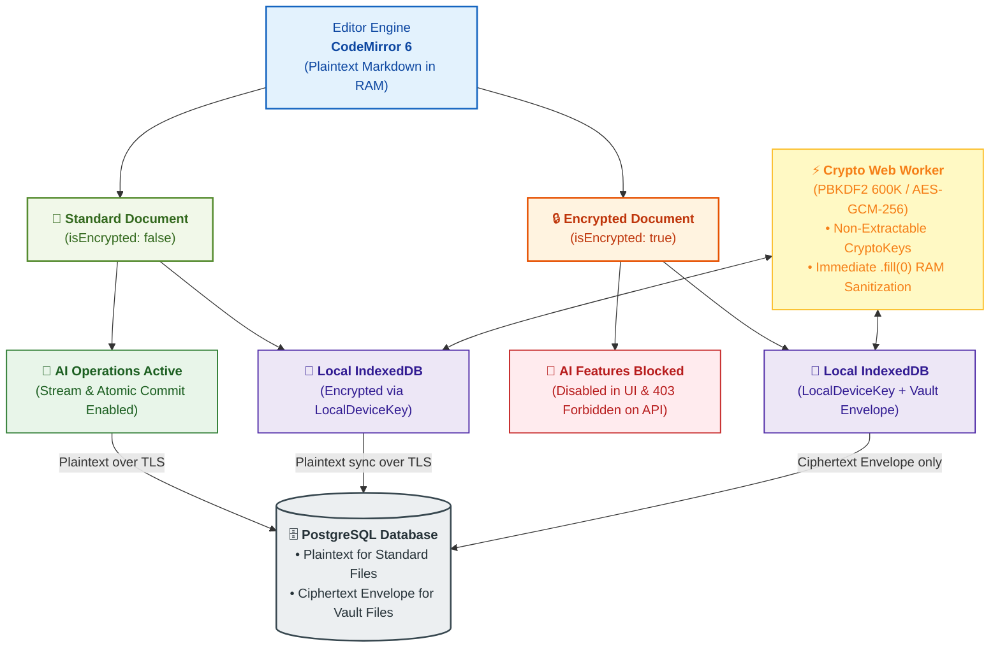
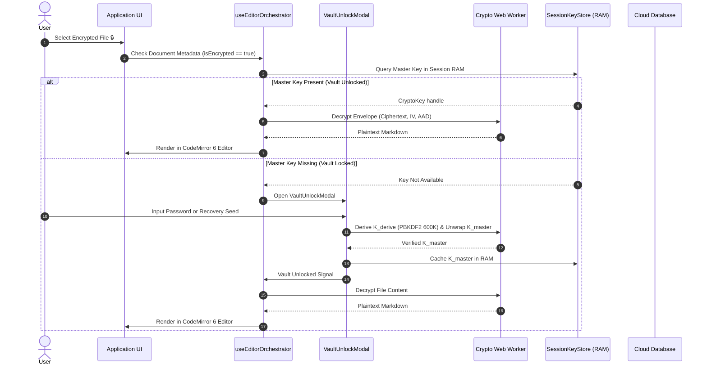

# Zero-Knowledge Cloud Vault & Dual-Tier Hybrid Encryption Plan

Status: ✅ CLOSED (100% Implemented & Verified) · Roadmap: Phase 16 · Reference: [`docs/reference/phase-16/`](../reference/phase-16/)

---

## 1. Architectural Summary

The Dual-Tier Hybrid Encryption architecture in LUGX provides client-side Zero-Knowledge encryption for sensitive documents while maintaining an offline-first experience on TypeScript and React 19 / Next.js:

1. **Always-On Local At-Rest Encryption**: Transparent client-side encryption of all `IndexedDB` tables using an ephemeral device key (`LocalDeviceKey`) without user intervention.
2. **Zero-Knowledge Cloud Vault**: End-to-end client-side encryption for documents flagged with `isEncrypted: true` using `AES-GCM-256` bound to authenticated additional data: `AAD = "vault:file:${userId}:${fileId}"`.
3. **Dual Wrapping & 12-Word BIP-39 Recovery Seed**: The independent Master Key ($K_{\text{master}}$) is wrapped twice: once with the user's vault password, and once with a 12-word BIP-39 recovery seed. This enables password resets and key recovery without re-encrypting existing files.
4. **Zero-Prompt on Login**: Standard application login completes seamlessly without prompting for a vault password. The unlock modal appears strictly upon accessing an encrypted document or encrypting an existing file.
5. **Dynamic Atomic File Conversion**: Instant conversion between plaintext and encrypted states, verifying vault unlock or initiating vault setup on the user's first encrypted file.
6. **Crypto Web Worker & Defensive RAM Sanitization**: Key derivation (`PBKDF2-SHA256` with 600,000 iterations) and symmetric operations are isolated to a background Web Worker (`src/lib/workers/crypto.worker.ts`). CryptoKey handles are non-extractable (`extractable: false`), and intermediate Uint8Array buffers are immediately zeroed via `.fill(0)`.
7. **Non-Blocking Sync & Conflict Isolation**: When a cloud conflict occurs on an encrypted file while the vault is locked, the document transitions to `CONFLICT_LOCKED` without impeding sync for plaintext files. Once unlocked, a 3-way Diff3 merge executes with structural syntax integrity checks before re-encrypting with a fresh IV.
8. **AI Safety Gatekeeper**: Complete dual-layer suppression of AI streaming, prompt inspection, and server routes for encrypted documents (HTTP `403 Forbidden`).

---

## 2. System Architecture Diagrams

### 2.1 Hybrid Data Flow

---

### 2.2 Vault Unlock & Recovery Sequence

---

## 3. Milestones Breakdown & Verification Status

### Milestone 1: Cryptographic Core & Worker Offloading — Status: ✅ CLOSED
- Offloaded PBKDF2 600,000 iterations to Web Worker (`src/lib/workers/crypto.worker.ts`).
- Non-extractable Web Crypto keys with strict in-memory buffer sanitization (`.fill(0)`).
- Documented in [`docs/reference/phase-16/vault-phase-1-crypto-core-closure.md`](../reference/phase-16/vault-phase-1-crypto-core-closure.md).

### Milestone 2: IndexedDB Local Storage & Sync Protocol — Status: ✅ CLOSED
- Local transparent encryption via `LocalDeviceKey`.
- Handled `CONFLICT_LOCKED` sync state without blocking plaintext file synchronization.
- Documented in [`docs/reference/phase-16/vault-phase-2-idb-and-sync-closure.md`](../reference/phase-16/vault-phase-2-idb-and-sync-closure.md).

### Milestone 3: UI Surfaces & Lifecycle Conversion — Status: ✅ CLOSED
- Modal interfaces for creation, unlock, PIN setup, and BIP-39 recovery seed verification (`src/components/vault/`).
- Seamless bidirectional plaintext/ciphertext conversion engine.
- Documented in [`docs/reference/phase-16/vault-phase-3-ui-and-conversion-closure.md`](../reference/phase-16/vault-phase-3-ui-and-conversion-closure.md).

### Milestone 4: AI Safety Gatekeeper & End-to-End Hardening — Status: ✅ CLOSED
- Enforced HTTP 403 on `/api/ai/stream` for encrypted documents.
- Suppressed all AI UI controls when active file is encrypted.
- Documented in [`docs/reference/phase-16/vault-phase-4-ai-safety-and-e2e-closure.md`](../reference/phase-16/vault-phase-4-ai-safety-and-e2e-closure.md).

### Milestone 5: Verification & Production Audit — Status: ✅ CLOSED
- Complete cryptographic suite verification, memory leak testing, and recovery drill validation.
- Documented in [`docs/reference/phase-16/vault-phase-5-verification-and-production-audit-closure.md`](../reference/phase-16/vault-phase-5-verification-and-production-audit-closure.md).
