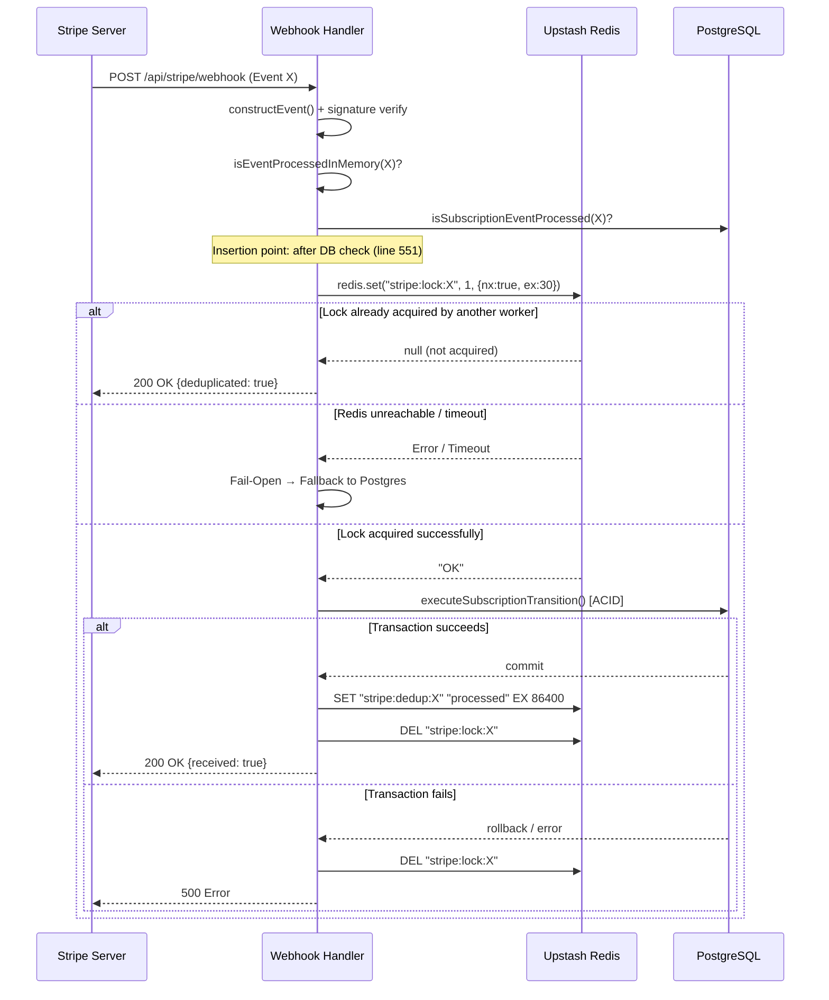

# Engineering Technical Execution Plan: Production Hardening & Remediation (M6)

**Plan Identifier:** `PLAN-M6-PROD-HARDENING`  
**Operational Status:** ✅ CLOSED (Fully Implemented & Verified in v1.31.2)  
**Reference:** Architectural ground-truth audit `AUDIT-M6-DEEP-REALITY-CHECK` matching LUGX codebase, supplemented by `M6-CODE-VERIFICATION-AUDIT` against active source code.  
**Core Objective:** Remediate critical operational and security failure modes across synchronized cryptographic memory, distributed financial webhook events, and quarantined sync conflict governance, establishing deterministic production verification gates and preserving a zero-regression baseline (`0 errors`, 820 passing tests).

---

## 1. System Invariants & Non-Negotiables

All architectural implementations in Milestone M6 strictly enforce the following non-negotiable guarantees:

1. **Fail-Closed Database Guard:** Mandatory enforcement prohibiting integration test execution unless `DATABASE_URL === TEST_DATABASE_URL` and blocking all hosts specified in `TEST_DB_FORBIDDEN_HOSTS` via `src/test/test-db-guard.ts` through `assertSafeTestDatabaseUrl()`. The mechanism is dynamic rather than bound to a static hardcoded endpoint ID, allowing seamless branch switching across isolated Neon branches without code modifications.

2. **Volatile RAM-Only Encryption Secrets & Instant Key Sanitization:** Cryptographic keys are maintained as raw `Uint8Array` exclusively in volatile RAM-only memory—an intentional architectural design enabling key transfer to the Web Worker via `postMessage` (since `CryptoKey` instances cannot be transferred across worker boundaries). Sensitive buffers must be wiped immediately via `wipeBuffer()` → `.fill(0)` within `purgeMasterKey()` and `purgeLocalDeviceKey()`, with synchronous multi-tab broadcast of `vault_locked` upon lock or signout.

3. **Strict Financial Event Idempotency & Safe Concurrency Lock:** Preservation of the verified 613-line ACID transactional handler in `src/app/api/stripe/webhook/route.ts`, augmented with a short-lived Upstash Redis in-flight lock (`stripe:lock:${eventId}`) that safely drops concurrent duplicate deliveries without swallowing legitimate retries on transient database failures.

4. **Zero Regressions Baseline:** Unconditional maintenance of `npx tsc --noEmit` with zero errors (`0 errors`) and 100% pass rate across the Vitest test suite (67 test suites, 820 passing tests). `npx tsc --noEmit` is executed after each phase as an intermediate gate, not merely at the final milestone closure.

5. **Protected Documentation Paths Immunity:** Prohibition of modifying any document within `docs/foundation/` or `docs/records/`, strictly adhering to `docs-governance.md`.

---

## 2. System Architecture Flows

```mermaid
graph TD
    subgraph P21["Phase 21: Distributed Safe Webhook Lock"]
        A1["Incoming Stripe Event"] --> B1{"Deduplication Guard<br/>In-Memory + DB Check"}
        B1 -- "Duplicate" --> X1["Return 200 OK + duplicate: true"]
        B1 -- "New Event" --> C1{"Upstash Redis Lock<br/>redis.set(lockKey, 1, {nx: true, ex: 30})"}
        C1 -- "Locked (In-Flight)" --> D1["Return 200 OK + deduplicated: true"]
        C1 -- "Redis Outage" --> E1["Fail-Open: Fallback to Postgres"]
        C1 -- "Acquired" --> F1["Execute Postgres ACID Transaction"]
        F1 -- "Success" --> G1["SET stripe:dedup:id EX 86400<br/>DEL stripe:lock:id"]
        F1 -- "Failure" --> H1["DEL stripe:lock:id immediately<br/>Return 500 for Retry"]
    end

    subgraph P22["Phase 22: Synchronized Cross-Tab RAM Purge"]
        A2["Vault Lock / User Logout / Inactivity"] --> B2["sessionKeyStore.lock(true) / purgeKeys(true)"]
        B2 --> C2["Wipe Key Buffer via wipeBuffer → .fill(0)"]
        C2 --> D2["Broadcast vault_locked via BroadcastChannel"]
        D2 --> E2["Instant Reception in Sibling Tabs"]
        E2 --> F2["sessionKeyStore.lock(false) locally<br/>Wipe Local RAM without Re-broadcasting"]
    end

    subgraph P23["Phase 23: Encrypted Conflict Quarantine Governance"]
        A3["Quarantined Remote Conflict (HTTP 412)"] --> B3["Isolate in pendingEncryptedConflicts<br/>Bounded Queue (Max 100) + detectedAt"]
        B3 --> C3["getQuarantineDiagnostics()<br/>Detect Stale Conflicts > 24h"]
        B3 --> D3["discardPendingEncryptedConflict(fileId)<br/>Purge RAM + Checkpoints + IDB Operations"]
    end
```



### Phase 21 Sequence Diagram (Stripe → Redis → Postgres)



---

## [Phase 21: Distributed Safe Webhook Lock & Atomic Deduplication] — Status: ✅ CLOSED

### Technical Objective
Intercept concurrent duplicate delivery attempts of identical Stripe webhook events across serverless cloud runtimes before exhausting PostgreSQL connections, while guaranteeing that legitimate retries are not swallowed during transient database network failures.

### Code-Grounded Vulnerability Analysis
The webhook handler in `src/app/api/stripe/webhook/route.ts` relied on a two-tier deduplication check:
- **Tier 1:** `isEventProcessedInMemory()` — ephemeral `Set<string>` in `src/lib/stripe/webhook-dedupe.ts` (FIFO eviction at 10,000 entries).
- **Tier 2:** `isSubscriptionEventProcessed()` — database query against `subscription_events` backed by `UNIQUE INDEX idx_subscription_events_event_id`.

**The Concurrency Vulnerability:** When two duplicate events arrive concurrently for the first time, both pass Tier 1 and Tier 2 simultaneously and enter `executeSubscriptionTransition`. Both execute database transactions concurrently, consuming two Postgres connections and relying solely on the database `UNIQUE INDEX` constraint to reject one. Under high load or burst traffic, this exhausts connection pools and causes unnecessary database lock contention.

### Direct Implementation Steps

- **Step 1:** Import the centralized Redis client from `@/lib/redis` in `src/app/api/stripe/webhook/route.ts`:
  ```typescript
  import { redis } from "@/lib/redis";
  ```
  > **Technical Note:** The Redis client uses the Upstash Redis REST SDK (`@upstash/redis`) rather than persistent socket connections (`ioredis`), making all calls non-blocking and HTTP-compatible for edge runtimes.

- **Step 2:** Add an in-flight distributed lock layer (In-Flight Concurrency Guard) at the **exact location: after `isProcessedInDb` (line 551) and before `switch (event.type)` (line 556)**:
  ```typescript
  // L1.5 — In-Flight Distributed Lock (Upstash Redis REST API)
  const lockKey = `stripe:lock:${eventId}`;
  let lockAcquired = false;
  try {
    const lockResult = await redis.set(lockKey, "1", { nx: true, ex: 30 });
    if (lockResult === null) {
      // Another worker is processing this exact event right now
      return NextResponse.json({ received: true, deduplicated: true });
    }
    lockAcquired = true;
  } catch (redisError) {
    // Fail-Open: Redis unreachable → fall through to Postgres ACID guard
    console.warn(
      "[WEBHOOK] Redis lock unavailable, falling back to DB idempotency:",
      redisError,
    );
  }
  ```
  > **Insertion Rationale:** The lock protects only events that have cleared the initial deduplication gates—eliminating lock overhead on already-known duplicates.

- **Step 3:** Implement Fail-Open resilience: Wrapped in `try/catch` around the Redis call, allowing graceful fallback to PostgreSQL ACID constraints upon any Redis outage.

- **Step 4:** Implement Fail-Release on handler error: Update the terminal catch block (lines 605-610) to release the lock immediately upon failure:
  ```typescript
  } catch (error) {
    console.error('Error in webhook handler:', error);
    if (lockAcquired) {
      await redis.del(lockKey).catch(() => {}); // Best-effort release
    }
    return NextResponse.json({ error: 'Webhook handler failed' }, { status: 500 });
  }
  ```

- **Step 5:** Record durable deduplication cache after successful transaction: Once `mutationMeta.success` succeeds (after line 601), record the durable key to accelerate duplicate rejection on subsequent retries:
  ```typescript
  if (mutationMeta.success) {
    markEventProcessedInMemory(eventId);
    if (lockAcquired) {
      try {
        await redis.set(`stripe:dedup:${eventId}`, "processed", { ex: 86400 });
        await redis.del(lockKey);
      } catch {
        /* non-critical: DB is authoritative */
      }
    }
  }
  ```
  > **Architectural Note:** The `stripe:dedup` key is an **acceleration cache layer** and not the sole atomicity guarantee; PostgreSQL's `subscription_events` with `UNIQUE INDEX idx_subscription_events_event_id` remains the authoritative source of truth.

- **Step 6:** Add `stripe:dedup` check as an L1.5 deduplication gate immediately after the DB check and before acquiring the lock:
  ```typescript
  try {
    const dedupResult = await redis.get(`stripe:dedup:${eventId}`);
    if (dedupResult === "processed") {
      markEventProcessedInMemory(eventId);
      return NextResponse.json({ received: true, duplicate: true });
    }
  } catch {
    /* Fail-Open: skip Redis dedup check */
  }
  ```

- **Step 7:** Update the test suite `src/test/api/stripe-webhook.test.ts` with explicit `@/lib/redis` mocks:
  ```typescript
  vi.mock("@/lib/redis", () => ({
    redis: {
      set: vi.fn(async () => "OK"),
      get: vi.fn(async () => null),
      del: vi.fn(async () => 1),
    },
  }));
  ```
  And verify test scenarios:
  - Successful lock acquisition → processing continues.
  - Lock busy (`set` returns `null`) → returns `{ deduplicated: true }`.
  - Redis outage (`set` throws) → Fail-Open → processing continues via Postgres.
  - Lock released on transaction failure (Fail-Release).
  - `stripe:dedup` populated on successful transaction.

- **Step 8 (Observability):** Add structured logging for deduplicated requests:
  ```typescript
  console.log(`[WEBHOOK] Deduplicated by Redis lock: ${eventId}`);
  ```

### Exception & Edge Case Handling
- **Redis Outage (Timeout / Unreachable):** The handler instantly bypasses the lock (Fail-Open) and relies on Postgres's unique constraint `idx_subscription_events_event_id` without service disruption.
- **Postgres Transaction Failure (DB Error / Timeout):** The temporary lock is immediately purged via `redis.del()` and HTTP 500 is returned, prompting Stripe to retry via exponential backoff.
- **Sub-millisecond Simultaneous Event Arrival:** The first request acquires the lock atomically (`SET NX`), while the second receives an instant HTTP 200 `{ deduplicated: true }`, preventing DB pool exhaustion.
- **Redelivery of Succeeded Event:** Detected by `stripe:dedup:${eventId}` (Redis L1.5) or `subscription_events` (DB L2), returning HTTP 200 `{ duplicate: true }`.

### Intermediate Post-Phase Gate
```powershell
npx tsc --noEmit
```
Verified zero TypeScript compilation errors.

### Closure Tests
- Unit Suite: `npx vitest run src/test/api/stripe-webhook.test.ts` passing 100% of scenarios including lock acquisition, busy-lock rejection, Fail-Open, Fail-Release, and dedup cache.
- Live Neon Test:
  ```powershell
  npm run test:live -- src/test/api/stripe-webhook.live.test.ts
  ```
  Verified transactional atomicity on isolated database branch.

---

## [Phase 22: Synchronous Cross-Tab Volatile Memory Sanitization] — Status: ✅ CLOSED

### Technical Objective
Eliminate cryptographic key residue in background browser tabs when the vault is locked or the user signs out in any window, ensuring immediate volatile RAM sanitization (`.fill(0)`) across all open browser contexts.

### Code-Grounded Vulnerability Analysis
- `SessionKeyStore.lock()` (lines 201-207 in `src/lib/sync/session-key-store.ts`) called `purgeMasterKey()` and notified local listeners **only** via `notifyListeners(false)`—without broadcasting over `BroadcastChannel`.
- Broadcasting `vault_locked` was handled strictly by UI hooks (`use-editor-orchestrator.ts`). Automated lock mechanisms (e.g., inactivity auto-lock in `isUnlocked()` line 155) failed to broadcast the lock event.
- `SessionKeyStore` maintained no connection to `cross-tab-sync.ts`.

### Dependency Risk Analysis
> **Verification:** Integrating `cross-tab-sync.ts` into `session-key-store.ts` required validation to prevent circular imports. Dependency chains:
> `session-key-store.ts` → `crypto-worker-bridge.ts` → `crypto-utils.ts`  
> `cross-tab-sync.ts` → `@/lib/db/schema` (type-only import)  
>
> **Verdict:** Zero circular dependency. `cross-tab-sync.ts` does not import `session-key-store.ts`. Import is fully safe.

### Direct Implementation Steps

- **Step 1:** Connect `SessionKeyStore` to `src/lib/sync/cross-tab-sync.ts` by importing `broadcastCrossTabEvent`, `subscribeCrossTabSync`, and `currentTabId`:
  ```typescript
  import {
    broadcastCrossTabEvent,
    subscribeCrossTabSync,
    currentTabId,
  } from "./cross-tab-sync";
  ```

- **Step 2:** In the `SessionKeyStore` constructor (`src/lib/sync/session-key-store.ts`):
  - Register automatic subscription via `subscribeCrossTabSync` (when `typeof window !== 'undefined'`).
  - Upon receiving `vault_locked` from another tab (`senderTabId !== currentTabId`), invoke `this.lock(false)` locally to wipe buffers immediately with `.fill(0)` and notify local listeners without re-broadcasting.
  ```typescript
  constructor(config: SessionKeyStoreConfig = {}) {
    if (config.inactivityTimeoutMs !== undefined) {
      this.inactivityTimeoutMs = config.inactivityTimeoutMs;
    }
    // Cross-tab vault lock synchronization
    if (typeof window !== 'undefined') {
      this._unsubCrossTab = subscribeCrossTabSync((event) => {
        if (event.type === 'vault_locked') {
          this.lock(false); // Purge locally without re-broadcasting
        }
      });
    }
  }
  ```

- **Step 3:** Update the `lock(broadcast = true)` method signature in `SessionKeyStore`:
  ```typescript
  public lock(broadcast = true): void {
    const wasUnlocked = this.masterKey !== null || this.masterKeyRaw !== null;
    this.purgeMasterKey();
    if (wasUnlocked) {
      this.notifyListeners(false);
      if (broadcast && typeof window !== 'undefined') {
        broadcastCrossTabEvent({ type: 'vault_locked' });
      }
    }
  }
  ```
  > **Contract Compatibility:** The default parameter `broadcast = true` ensures full backward compatibility. Existing callers automatically broadcast without caller modification.

- **Step 4:** Update the `purgeKeys(broadcast = true)` method signature in `SessionKeyStore`:
  ```typescript
  public purgeKeys(broadcast = true): void {
    const wasUnlocked = this.masterKey !== null || this.masterKeyRaw !== null;
    this.purgeMasterKey();
    this.purgeLocalDeviceKey();
    if (wasUnlocked) {
      this.notifyListeners(false);
      if (broadcast && typeof window !== 'undefined') {
        broadcastCrossTabEvent({ type: 'vault_locked' });
      }
    }
  }
  ```

- **Step 5:** Update the `event.type === "vault_locked"` listener in `src/hooks/use-editor-orchestrator.ts` (lines 1263-1271):
  - Add `sessionKeyStore.lock(false)` immediately to sanitize volatile RAM in the active tab before updating UI states:
  ```typescript
  if (event.type === "vault_locked") {
    // 1. Purge RAM immediately (no re-broadcast)
    sessionKeyStore.lock(false);
    // 2. Update UI state
    if (isEncryptedRef.current) {
      setIsVaultLocked(true);
      setIsUnlockModalOpen(true);
      setHydration("vault_locked");
      if (adapterRef.current) {
        adapterRef.current.setEditable(false);
      }
    }
    return;
  }
  ```

- **Step 5.1 (Silent Inactivity Lock Coverage):** When the inactivity timer expires during `isUnlocked()` (lines 153-158), `this.lock()` is triggered. With the default `broadcast = true`, silent timeout locks now automatically broadcast `vault_locked` across all tabs.

- **Step 6:** Strictly preserve the 60-minute default inactivity timeout (`60 * 60 * 1000` ms) in `SessionKeyStore` to maintain the existing test contract in `src/test/vault/vault-orchestration.test.ts:479-483`, while allowing optional custom timeouts via `SessionKeyStoreConfig`.

### Exception & Edge Case Handling
- **Server-Side Rendering (SSR / Node.js / Tests):** Guarded by `typeof window !== 'undefined'`, preventing execution of browser-specific APIs in headless environments.
- **Browsers Lacking BroadcastChannel:** `SessionKeyStore` falls back gracefully to local timers and window listeners without breaking the UI.
- **Local Tab Sender Isolation:** Handled by `senderTabId !== currentTabId` inside `subscribeCrossTabSync`, preventing local feedback echo loops.
- **Background Idle Tab Lock:** When an idle tab expires its timer, it invokes `lock(true)` → `broadcastCrossTabEvent`. All active foreground tabs immediately wipe RAM and lock the vault interface.

### Intermediate Post-Phase Gate
```powershell
npx tsc --noEmit
npx madge --circular src/lib/sync/session-key-store.ts
```
Verified zero TypeScript compilation errors and zero circular dependencies.

### Closure Tests
- Dedicated tests in `src/test/vault/vault-crypto.test.ts`:
  - Multi-tab simulation verifying `vault_locked` reception.
  - Verification of 100% key buffer zeroing via `.fill(0)`.
  - Echo-loop prevention test confirming `lock(false)` does not re-broadcast.
  - Verification that silent locks in `isUnlocked()` broadcast across tabs.
- Full orchestration suite: `npx vitest run src/test/vault/vault-orchestration.test.ts` passing 100% including the default 60-minute timeout contract.

---

## [Phase 23: Encrypted Conflict Quarantine Governance & Backpressure Bounds] — Status: ✅ CLOSED

### Technical Objective
Equip the synchronization engine with diagnostic visibility and administrative control over quarantined encrypted conflicts (`CONFLICT_LOCKED`), preventing unbounded queue backpressure when the vault remains locked for extended durations, and providing safe discard mechanisms alongside strict queue capacity limits.

### Code-Grounded Vulnerability Analysis
- `pendingEncryptedConflicts` in `src/lib/sync/sync-manager.ts` (line 152) was an unbounded in-memory `Map<string, PendingEncryptedConflict>`.
- Lack of diagnostics and discard controls caused unresolved conflicts to accumulate indefinitely when the vault remained locked.
- Automatic resolution on vault unlock (lines 266-278) had no fallback for conflicts that failed automatic resolution.

### Direct Implementation Steps

- **Step 1:** Retain the existing `detectedAt: Date` timestamp defined in `PendingEncryptedConflict` in `src/lib/sync/types/vault.ts` (line 69) without redundant fields.

- **Step 2:** Define the `QuarantineDiagnostics` interface in `src/lib/sync/sync-manager.ts`:
  ```typescript
  export interface QuarantineDiagnostics {
    totalQuarantined: number;
    staleCount: number; // Conflicts quarantined for > 24 hours
    oldestQuarantinedAt: number | null; // Timestamp in milliseconds
    newestQuarantinedAt: number | null; // Timestamp in milliseconds
    isAtCapacity: boolean; // True if queue has reached MAX_QUARANTINED_CONFLICTS
  }
  ```

- **Step 3:** Implement `getQuarantineDiagnostics()` within `SyncManager`:
  - Calculate total quarantined entries in `this.pendingEncryptedConflicts`.
  - Calculate stale conflicts exceeding 24 hours based on `c.detectedAt.getTime()`.
  - Extract oldest and newest quarantine timestamps.
  - Check whether the queue has reached `MAX_QUARANTINED_CONFLICTS`.

- **Step 3.1 (Enforce Capacity Bounds):** Define capacity limit:
  ```typescript
  const MAX_QUARANTINED_CONFLICTS = 100;
  ```
  When adding a new conflict exceeding the limit, log a warning and evict the oldest entry:
  ```typescript
  if (this.pendingEncryptedConflicts.size >= MAX_QUARANTINED_CONFLICTS) {
    const oldestEntry = [...this.pendingEncryptedConflicts.entries()].sort(
      (a, b) => a[1].detectedAt.getTime() - b[1].detectedAt.getTime(),
    )[0];
    if (oldestEntry) {
      console.warn(
        `[SyncManager] Quarantine at capacity (${MAX_QUARANTINED_CONFLICTS}), evicting oldest: ${oldestEntry[0]}`,
      );
      this.pendingEncryptedConflicts.delete(oldestEntry[0]);
    }
  }
  ```

- **Step 4:** Implement `discardPendingEncryptedConflict(fileId: string)` within `SyncManager`:
  ```typescript
  async discardPendingEncryptedConflict(fileId: string): Promise<void> {
    // 1. Evict conflict from volatile memory map
    this.pendingEncryptedConflicts.delete(fileId);

    // 2. Remove associated rollback checkpoints
    const checkpoints = this.rollback.getFileCheckpoints(fileId);
    for (const cp of checkpoints) {
      this.rollback.removeCheckpoint(cp.id);
    }

    // 3. Clean up associated operations in IndexedDB
    // Note: updateOperationStatus requires operationId, not fileId
    try {
      const operations = await this.idb.getOperations(fileId);
      for (const op of operations) {
        const opId = op.operationId || op.id;
        if (op.status === 'conflict' || op.status === 'pending') {
          await this.idb.updateOperationStatus(opId, 'discarded');
        }
      }
    } catch (idbError) {
      // Non-blocking: volatile memory cleanup succeeded; IDB cleanup is best-effort
      console.warn(`[SyncManager] IDB cleanup failed for discarded conflict ${fileId}:`, idbError);
    }
  }
  ```
  > **Architectural Correction:** `updateOperationStatus` requires the unique `operationId` rather than `fileId`. `idb.getOperations(fileId)` is executed first to resolve operation IDs before updating status.

### Exception & Edge Case Handling
- **Empty Quarantine Map:** `getQuarantineDiagnostics()` safely returns zero counters and null timestamps without exceptions.
- **Discarding File without Checkpoints:** Gracefully purges memory and IndexedDB without errors.
- **IndexedDB Error During Discard:** Logs a warning while ensuring in-memory eviction completes, preventing UI lockup.
- **Vault Unlock with Stale Conflicts:** Automatic Diff3 merge resolution continues operating normally.
- **Queue Saturation (100 Conflicts):** The oldest conflict is evicted with telemetry logging, preventing memory leaks while retaining recent entries.

### Intermediate Post-Phase Gate
```powershell
npx tsc --noEmit
```
Verified zero TypeScript compilation errors.

### Closure Tests
- Unit suite `src/test/sync/sync-encrypted-conflict.test.ts` verifying:
  - Telemetry calculations and stale threshold detection (> 24h).
  - Accurate defaults on empty queue state.
  - Multi-tier discard execution across volatile RAM, checkpoints, and IndexedDB operations.
  - FIFO eviction upon reaching `MAX_QUARANTINED_CONFLICTS`.
- Verification of types across `SyncRollback` and `IndexedDBManager`.

---

## [Phase 24: Production Verification & Regression Testing Gates] — Status: ✅ CLOSED

### Technical Objective
Subject all implemented architectural changes to the comprehensive 10-gate deterministic verification matrix, confirming zero regressions, type stability, and 100% test pass rates.

### Direct Implementation Steps

Execute the comprehensive 10-gate verification matrix in exact sequence:

| Gate | Verification Check | Command Line Execution | Acceptance Criteria |
| :--- | :----------------- | :--------------------- | :------------------ |
| **G1** | **Structural Type Audit** | `npx tsc --noEmit` | Exit code `0`, absolute zero TypeScript compilation errors. |
| **G2** | **Code Quality Gate** | `npm run lint` | Zero critical warnings, zero formatting errors (ESLint 9). |
| **G3** | **Standard Unit & Integration Suites** | `npm run test` | 100% pass rate (67 test suites, 820 passing tests). |
| **G4** | **Isolated Webhook Concurrency Tests** | `npx vitest run src/test/api/stripe-webhook.test.ts` | Pass all webhook deduplication and Redis lock scenarios. |
| **G5** | **Vault Crypto & RAM Sanitization** | `npx vitest run src/test/vault/vault-crypto.test.ts` | Prove `.fill(0)` buffer wiping and `vault_locked` cross-tab broadcast. |
| **G6** | **Encrypted Conflict Quarantine Tests** | `npx vitest run src/test/sync/sync-encrypted-conflict.test.ts` | Pass telemetry diagnostics, checkpoint cleanup, and capacity bounds. |
| **G7** | **Database Isolation Safety Guard** | `npm run test -- src/test/infrastructure/test-db.isolation.test.ts` | Prove fail-closed blocking when pointing to non-test database URLs. |
| **G8** | **Live Webhook Integration (Neon Branch)** | `npm run test:live -- src/test/api/stripe-webhook.live.test.ts` | Prove full transactional atomicity on isolated Neon database. |
| **G9** | **Circular Dependency Audit** | `npx madge --circular src/lib/sync/session-key-store.ts` | Zero circular dependency cycles detected. |
| **G10** | **Production Bundle Compilation** | `npm run build` | Next.js App Router build completes cleanly with zero bundling errors. |

### Exception & Edge Case Handling
- If any gate fails: Mark session status immediately as `BLOCKED` and halt closure procedures.
- Forbidden use of `any` to bypass type checks.
- If circular dependencies are detected in G9: Refactor module exports immediately before proceeding.

### Final Closure Criteria
Milestone M6 is declared fully executed and closed only upon the concurrent passing of all 10 gates with verified execution evidence.

---

## 3. Rollback & Forensic Procedures

If unexpected anomalies arise post-deployment, the following isolation protocols govern system safety:

1. **Webhook Concurrency Fail-Open & Fail-Release:** If Upstash Redis encounters network latency or downtime, the handler gracefully falls back to PostgreSQL's atomic constraint `idx_subscription_events_event_id` with zero downtime. Upon transaction failure, the lock is instantly released via `redis.del()`. The `stripe:dedup` key is strictly an acceleration cache—its absence does not compromise data integrity.

2. **Cross-Tab Fallback Protocol:** In environments lacking `BroadcastChannel` support, `SessionKeyStore` operates reliably via local inactivity timers (`60 * 60 * 1000` ms) and browser window focus listeners. `broadcastCrossTabEvent` degrades silently without throwing errors.

3. **Forensic Records & Quarantine Immunity:** All quarantined encrypted conflicts remain securely persisted in IndexedDB alongside rollback checkpoints. No conflict is purged without explicit user action via `discardPendingEncryptedConflict()` or automatic Diff3 resolution upon vault unlock (`resolvePendingEncryptedConflict()`). Bounded queue capacity (100 items) prevents unbounded growth while preserving recent operational forensics.
