# Code-Based Technical Execution Plan

This document establishes the verified technical execution plan derived directly from the LUGX codebase (`src/`). It tracks the implementation status of all architectural subsystems, detailing completed milestones and actionable remaining roadmap gates.

---

## Roadmap Overview & Subsystem State Machine

```mermaid
flowchart TD
    subgraph CoreFoundations["Core Foundations (Closed)"]
        direction TB
        P1["Phase 1: Sync Lifecycle & User Scoping ✅"]
        P2["Phase 2: Queue, GC & Rollback ✅"]
        P3["Phase 3: File Ownership & If-Match ✅"]
        P4["Phase 4: 3-Way Conflict Resolution ✅"]
        P1 --> P2 --> P3 --> P4
    end

    subgraph AISubsystem["AI Operations & Streaming (Closed)"]
        direction TB
        P5["Phase 5: Quota Reservations & Settlement ✅"]
        P6["Phase 6: Key Rotation & Circuit Breaker ✅"]
        P7["Phase 7: NDJSON Streaming & Ghost Preview ✅"]
        P8["Phase 8: Atomic Server Commit ✅"]
        P5 --> P6 --> P7 --> P8
    end

    subgraph SecurityAndData["Security, DB & Data Pipelines (Closed)"]
        direction TB
        P10["Phase 10: Neon Branch DB Isolation ✅"]
        P11["Phase 11: Editor Orchestration (CM6) ✅"]
        P12["Phase 12: Auth & Ownership Hardening ✅"]
        P13["Phase 13: Stripe Webhooks & Ledger ✅"]
        P14["Phase 14: Storage Removal & Cleanup ✅"]
        P15["Phase 15: Content Sanitization & Exporters ✅"]
        P16["Phase 16: Zero-Knowledge Vault & Crypto ✅"]
        P10 --> P11 --> P12 --> P13 --> P14 --> P15 --> P16
    end

    subgraph ActiveAndPending["Active Milestones & Verification (Pending)"]
        direction TB
        P9["Phase 9: Session Contract (Operational Standard) ⚙️"]
        P17["Phase 17: Telemetry & Cron Sweepers ⏳"]
        P18["Phase 18: Cross-System Integration ⏳"]
        P19["Phase 19: Browser Playwright E2E ⏸️"]
        P20["Phase 20: Final Readiness Gates ⏸️"]
        P9 -.-> P17 --> P18 --> P19 --> P20
    end

    CoreFoundations --> AISubsystem --> SecurityAndData --> ActiveAndPending

    style CoreFoundations fill:#E8F5E9,stroke:#2E7D32,stroke-width:2px
    style AISubsystem fill:#E8F5E9,stroke:#2E7D32,stroke-width:2px
    style SecurityAndData fill:#E8F5E9,stroke:#2E7D32,stroke-width:2px
    style ActiveAndPending fill:#FFF3E0,stroke:#E65100,stroke-width:2px
```

---

## Phase Breakdown

### [Phase 1: Sync Lifecycle & User Scoping] — Status: ✅ CLOSED
- **Technical Objective:** Scope the synchronization layer strictly to explicit `userId` and `fileId` boundaries, terminating all resources upon session change or component unmount.
- **Key Implementation:** `src/lib/sync/sync-manager.ts` prevents singleton reuse across sessions; `src/hooks/use-sync.ts` cleans up timers and listeners; IndexedDB namespaced per user (`textai_db_${userId}`).
- **Verification:** Unit and isolation tests in `src/hooks/use-sync.test.ts` and `src/lib/sync/indexeddb.test.ts`.

### [Phase 2: Queue, GC & Rollback] — Status: ✅ CLOSED
- **Technical Objective:** Establish an idempotent, retryable local operation queue with deterministic garbage collection and transactional snapshot rollback.
- **Key Implementation:** `src/lib/sync/idb-types.ts`, consumer worker in `src/lib/sync/sync-manager.ts`, bounded exponential backoff, dead-letter state, and snapshot restoration in `src/lib/sync/rollback.ts`.
- **Verification:** `parallel.test.ts` and `rollback.test.ts` verify no operation duplication under concurrency.

### [Phase 3: File Ownership, If-Match & Versioning] — Status: ✅ CLOSED
- **Technical Objective:** Enforce server-side session user derivation, hierarchical parent validation, and optimistic concurrency locking (`If-Match` / ETag).
- **Key Implementation:** `src/server/actions/file-ops.ts` and `src/app/api/files/[id]/route.ts` validate session identity, atomic version increments, and 412 status mapping.
- **Verification:** `route.putguard.test.ts`, `file-ops.lostupdate.test.ts`, and `file-ops.softdelete.test.ts`.

### [Phase 4: Three-Way Conflict Resolution] — Status: ✅ CLOSED
- **Technical Objective:** Ground conflict resolution on verified `baseSnapshot` states via Diff3 merge logic and user-facing resolution orchestration.
- **Key Implementation:** `src/lib/sync/conflict-resolver.ts` executes structured 3-way merging on Markdown content; `src/components/sync/conflict-dialog.tsx` orchestrates user decisions.
- **Verification:** `src/lib/sync/conflict-resolver.test.ts` covering non-overlapping, overlapping, and structural AST conflicts.

### [Phase 5: Quota Reservation & Idempotent Settlement] — Status: ✅ CLOSED
- **Technical Objective:** Enforce atomic daily quota reservation with fixed `periodKey` hashing and idempotent commit/refund transitions.
- **Key Implementation:** PostgreSQL `ai_reservations` table, conditional status transitions (`reserved -> committed`, `reserved -> refunded`), and idempotent refunds in `src/server/actions/ai-ops.ts`.
- **Verification:** `ai-ops.integrity.test.ts`, `ai-ops.refund.test.ts`, and `src/test/ai-quota-idempotency.live.test.ts`.

### [Phase 6: AI Client, Key Rotation & Circuit Breaker] — Status: ✅ CLOSED
- **Technical Objective:** Implement distributed multi-tier model failover and Redis-backed sliding-window circuit breaking without key leakage.
- **Key Implementation:** `src/lib/ai/client.ts` and `src/lib/ai/key-rotation.ts` manage state transitions (`closed`, `open`, `half-open`) with `DEFAULT_CIRCUIT_TTL_SECONDS = 600` (10 minutes).
- **Verification:** `key-rotation.test.ts` and `client.test.ts`.

### [Phase 7: NDJSON Streaming & Session State Machine] — Status: ✅ CLOSED
- **Technical Objective:** Deliver streaming AI token generation over NDJSON without uncommitted document mutations.
- **Key Implementation:** `src/app/api/ai/stream/route.ts`, `src/hooks/use-ai-stream.ts`, and `src/lib/ai/stream-session.ts` route tokens exclusively to ephemeral ghost widgets (`CMStreamingGhostWidget`).
- **Verification:** `src/test/ai-stream-parser.test.ts` and `src/test/ai-stream-session.test.ts`.

### [Phase 8: AI Atomic Commit] — Status: ✅ CLOSED
- **Technical Objective:** Execute atomic server-side application of AI generation results bound to version increment and reservation settlement.
- **Key Implementation:** `src/server/actions/ai-commit.ts` validates `expectedETag`, updates file content, increments version, and settles reservation in a single PostgreSQL transaction.
- **Verification:** `ai-atomic-commit.integration.test.ts` and `editor-atomic-commit.test.ts`.

### [Phase 9: Session Execution Contract] — Status: ⚙️ ACTIVE
- **Technical Objective:** Standardized operational governance contract governing all development sessions: strict single-phase scope, real test evidence, and fail-closed reporting.

### [Phase 10: Test Database Isolation via Neon Branch] — Status: ✅ CLOSED
- **Technical Objective:** Run all PostgreSQL integration tests exclusively on an isolated Neon branch (`TEST_DATABASE_URL`), enforced via fail-closed guardrails.
- **Key Implementation:** `src/test/test-db-guard.ts` verifies host identity before Pool allocation; `src/test/load-test-env.ts` binds `DATABASE_URL = TEST_DATABASE_URL`; 15 hermetic LIVE test suites registered in `vitest.live.config.mts`.
- **Verification:** Documented in [`docs/reference/test-database-isolation.md`](../reference/test-database-isolation.md).

### [Phase 11: Editor, AutoSave & Sync Orchestration] — Status: ✅ CLOSED
- **Technical Objective:** Unify editor write paths under a single orchestrator state machine (`WriteStateType`), enforce autosave suppression, and isolate conflicts.
- **Key Implementation:** TipTap completely replaced by standalone CodeMirror 6 (`MarkdownEditor` and `EditorAdapter`); `src/hooks/use-editor-orchestrator.ts` enforces write gating across preview, streaming, and conflict states.
- **Verification:** `editor-orchestration.live.test.ts` and `src/components/editor/markdown/`. (Full browser automation deferred to Phase 19 per TD-07).

### [Phase 12: Authentication, OAuth & Resource Ownership Hardening] — Status: ✅ CLOSED
- **Technical Objective:** Eliminate open redirects, host header injection, and cross-user resource enumeration.
- **Key Implementation:** `resolveSafeRedirectPath` in auth routes; strict 404 mapping for unauthorized resource queries; atomic user synchronization.
- **Verification:** 21/21 in `auth-redirect.test.ts`, 14/14 in `cross-user-ownership.test.ts`. Documented in [`docs/reference/phase-12-auth-ownership-closure.md`](../reference/phase-12-auth-ownership-closure.md).

### [Phase 13: Stripe Webhooks & Subscriptions Lifecycle] — Status: ✅ CLOSED
- **Technical Objective:** Guarantee idempotent webhook processing with durable database deduplication and accurate billing period derivation.
- **Key Implementation:** Dedicated `subscription_events` ledger table; period timestamps derived directly from Stripe Invoices rather than deprecated Subscription fields.
- **Verification:** Documented in [`docs/reference/phase-13-stripe-webhooks-subscriptions-closure.md`](../reference/phase-13-stripe-webhooks-subscriptions-closure.md).

### [Phase 14: Supabase Storage Removal & Schema Cleanup] — Status: ✅ CLOSED
- **Technical Objective:** Eliminate unused Supabase Storage dependencies and consolidate all document content natively in PostgreSQL.
- **Key Implementation:** Deleted `src/lib/supabase/storage.ts`; dropped `storage_path` column from `files` schema; verified zero storage imports.
- **Verification:** Documented in [`docs/reference/phase-14-supabase-storage-removal-closure.md`](../reference/phase-14-supabase-storage-removal-closure.md).

### [Phase 15: Sanitization, Import & Export Hardening] — Status: ✅ CLOSED
- **Technical Objective:** Harden content pipelines for Markdown, text, and PDF imports with server-side size validation.
- **Key Implementation:** Removed legacy HTML sanitizers in favor of raw Markdown normalization (`normalizeMarkdownSource`); added 10MB base64 size limit in `src/server/actions/import-file.ts`; pure Markdown/TXT exporters in `src/lib/exporters/`.
- **Verification:** Unit tests in `pdf-parser.test.ts` and `import-file.test.ts`.

### [Phase 16: Zero-Knowledge Vault & Client-Side Hybrid Encryption] — Status: ✅ CLOSED
- **Technical Objective:** Deliver zero-knowledge end-to-end encryption for sensitive documents with hardware biometric unlock and memory sanitization.
- **Key Implementation:** Executed per dedicated plan [`HYBRID_ENCRYPTION_AND_VAULT_PLAN.md`](./HYBRID_ENCRYPTION_AND_VAULT_PLAN.md). PBKDF2 600K Web Worker derivation, WebAuthn PRF, 6-digit PIN, 12-word BIP-39 recovery seed, AES-GCM-256 with domain AAD `vault:file:${userId}:${fileId}`, and AI safety gatekeepers.
- **Verification:** 5 closure documents in [`docs/reference/phase-16/`](../reference/phase-16/).

---

## Active & Pending Roadmap

### [Phase 17: Telemetry, Rate Limiting, Cron Sweepers & Structured Errors] — Status: ⏳ IN PROGRESS
- **Current State:**
  - Rate limiting active: sliding window over Upstash Redis in `src/lib/rate-limit.ts`.
  - Pending TD-02: `expireStaleReservations()` cron endpoint (`src/app/api/cron/expire-reservations/route.ts`) wired to GitHub Actions workflow.
  - Pending: Unified correlation IDs across server routes and actions.
- **Derivation Constraint:** Phase 9 operational contract.
- **Immediate Steps:**
  1. Create route `src/app/api/cron/expire-reservations/route.ts` protected by `CRON_SECRET`.
  2. Register workflow in `.github/workflows/cron.yml` to trigger reservation cleanup.
  3. Standardize structured error payloads with `correlationId` and `operationId`.

### [Phase 18: Multi-System Integration Testing] — Status: ⏳ PARTIALLY DONE
- **Current State:**
  - 15 hermetic LIVE integration suites currently run against the isolated Neon test branch (`npm run test:live`).
  - Pending: Single consolidated cross-system suite orchestrating auth, sync, conflict, AI streaming, and billing simultaneously in sequence.
- **Derivation Constraint:** Phases 10–17 closure.
- **Immediate Steps:**
  1. Assemble unified multi-system integration test validating end-to-end data lifecycle across all subsystems on the isolated database branch.

### [Phase 19: Browser-Driven E2E Testing (Playwright)] — Status: ⏸️ PENDING
- **Current State:**
  - Deferred under technical debt item TD-07 until backend and integration layers are stabilized.
  - `@playwright/test` not yet installed in devDependencies.
- **Derivation Constraint:** Phase 18 completion.
- **Immediate Steps:**
  1. Install `@playwright/test` and generate `playwright.config.ts`.
  2. Implement browser automation covering: login, fast typing, offline reconnect, 412 conflict resolution dialog, inline AI stream ghost acceptance, and vault unlock flows.

### [Phase 20: Final Production Verification & System Readiness Gates] — Status: ⏸️ PENDING
- **Current State:**
  - Blocked pending completion of Phases 17, 18, and 19.
- **Final Readiness Invariant:**
  - Term `READY` will only be declared once all closure criteria are verified: 100% test pass rate across unit, live, and browser E2E suites with zero flaky tests or unhandled edge cases.
