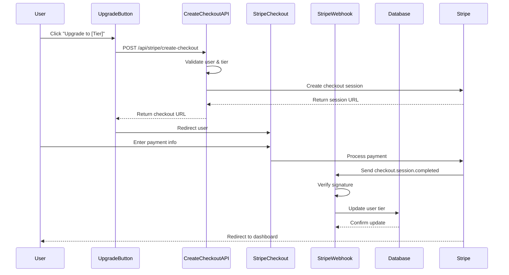

# Stripe Integration - Technical Reference

## Overview

This document provides technical reference for the Stripe payment integration in LUGX.

## Architecture

### Payment Flow



## Core Components

### 1. Stripe Library (`src/lib/stripe/`)

#### `index.ts`
Main Stripe operations wrapper.

**Functions:**

```typescript
// Get or create Stripe customer
getOrCreateStripeCustomer(
    userId: string,
    email: string,
    name?: string
): Promise<string>

// Create checkout session
createCheckoutSession(
    customerId: string,
    priceId: string,
    userId: string,
    tier: TierName
): Promise<Stripe.Checkout.Session>

// Verify webhook signature
constructWebhookEvent(
    body: string,
    signature: string
): Stripe.Event

// Get customer details
getStripeCustomer(
    customerId: string
): Promise<Stripe.Customer>

// Cancel subscription
cancelStripeSubscription(
    subscriptionId: string
): Promise<Stripe.Subscription>
```

#### `config.ts`
Price ID configuration and validation.

```typescript
export const STRIPE_PRICE_IDS: Record<'pro' | 'ultra', string>

export function getStripePriceId(tier: TierName): string
export function isValidStripeTier(tier: unknown): tier is 'pro' | 'ultra'
```

### 2. API Routes

#### POST `/api/stripe/create-checkout`

**Request:**
```json
{
  "tier": "pro" | "ultra"
}
```

**Response (Success):**
```json
{
  "success": true,
  "url": "https://checkout.stripe.com/...",
  "sessionId": "cs_test_..."
}
```

**Response (Error):**
```json
{
  "error": "Error message",
  "details": "Detailed error info"
}
```

**Status Codes:**
- `200` - Success
- `400` - Invalid request (bad tier, same tier, downgrade attempt)
- `401` - Unauthorized (not logged in)
- `500` - Server error

#### POST `/api/stripe/webhook`

**Headers Required:**
- `stripe-signature` - Webhook signature for verification

**Supported Events:**
- `checkout.session.completed` - Payment successful
- `customer.subscription.updated` - Subscription status changed
- `customer.subscription.deleted` - Subscription cancelled

**Response:**
```json
{
  "received": true
}
```

### 3. Server Actions

#### `updateUserTier(userId, tier)`
Updates user's subscription tier in database.

```typescript
await updateUserTier('user-uuid', 'pro');
// Returns: { success: true } | { success: false, error: string }
```

#### `upsertSubscription(userId, subscriptionData)`
Creates or updates subscription record.

```typescript
await upsertSubscription('user-uuid', {
  stripeSubscriptionId: 'sub_xxx',
  tier: 'pro',
  status: 'active',
  currentPeriodStart: new Date(),
  currentPeriodEnd: new Date(),
  cancelAtPeriodEnd: false
});
```

### 4. React Components

#### `<UpgradeButton>`

**Props:**
```typescript
interface UpgradeButtonProps {
  tier: 'pro' | 'ultra';
  currentTier: string;
  disabled?: boolean;
}
```

**Usage:**
```tsx
<UpgradeButton 
  tier="pro" 
  currentTier={user.tier} 
/>
```

**States:**
- Loading: Shows spinner while creating checkout session
- Disabled: Based on tier hierarchy logic
- Error: Shows toast notification on failure

## Tier Hierarchy

```typescript
const tierHierarchy = {
  free: 0,
  pro: 1,
  ultra: 2
};
```

**Upgrade Rules:**
- Can only upgrade to higher tier (higher number)
- Cannot upgrade to same tier
- Cannot downgrade (lower number)

## Environment Variables

### Required Variables

```bash
# Stripe API Keys
STRIPE_SECRET_KEY=sk_test_...
NEXT_PUBLIC_STRIPE_PUBLISHABLE_KEY=pk_test_...
STRIPE_WEBHOOK_SECRET=whsec_...

# Price IDs
STRIPE_PRO_PRICE_ID=price_...
STRIPE_ULTRA_PRICE_ID=price_...

# App URL (for redirects)
NEXT_PUBLIC_APP_URL=http://localhost:3000
```

### Creating Price IDs

1. Go to Stripe Dashboard → Products
2. Create product for each tier:
   - **LUGX Pro**: $12/month recurring
   - **LUGX Ultra**: $120/month recurring
3. Copy the Price ID for each (starts with `price_`)
4. Update `.env` file

## Security

### PCI-DSS Compliance
- ✅ No card data is stored in our database
- ✅ All payment processing handled by Stripe
- ✅ HTTPS required for production

### Webhook Security
- ✅ Signature verification on every webhook request
- ✅ Rejects requests without valid signature
- ✅ Uses `STRIPE_WEBHOOK_SECRET` for verification

### Input Validation
- ✅ User authentication required
- ✅ Tier validation (only 'pro' or 'ultra')
- ✅ Business logic validation (prevent invalid upgrades)
- ✅ Server-side validation (never trust client)

## Error Handling

### Client-Side
```typescript
try {
  // Create checkout session
} catch (error) {
  toast({
    title: 'Upgrade Failed',
    description: error.message,
    variant: 'destructive'
  });
}
```

### Server-Side
```typescript
try {
  // Process webhook
} catch (error) {
  console.error('Webhook error:', error);
  return NextResponse.json({ error }, { status: 500 });
}
```

## Testing

### Local Development

1. **Start development server:**
```bash
npm run dev
```

2. **Start Stripe CLI (webhook forwarding):**
```bash
stripe listen --forward-to http://localhost:3000/api/stripe/webhook
```

3. **Test card numbers:**
- Success: `4242 4242 4242 4242`
- Decline: `4000 0000 0000 0002`
- Authentication: `4000 0025 0000 3155`

### Test Scenarios

#### Scenario 1: Free → Pro
```bash
# User: Free tier
# Action: Click "Upgrade to Pro"
# Expected: Redirect to Stripe, payment success, tier = 'pro'
```

#### Scenario 2: Pro → Ultra
```bash
# User: Pro tier
# Action: Click "Upgrade to Ultra"
# Expected: Redirect to Stripe, payment success, tier = 'ultra'
```

## Monitoring

### Stripe Dashboard
- Monitor Events → Check webhook deliveries
- Monitor Logs → View API request logs
- Monitor Subscriptions → Track active subscriptions

### Application Logs
```bash
# Webhook events
🔵 [WEBHOOK] Event type received: checkout.session.completed
✅ [WEBHOOK] Tier updated successfully!

# Database operations
🔵 [DB] updateUserTier called - userId: xxx tier: pro
✅ [DB] User tier updated successfully!
```

## Troubleshooting

### Issue: Webhook not receiving events

**Check:**
1. Is Stripe CLI running?
2. Is the endpoint correct? (`/api/stripe/webhook`)
3. Does webhook secret match CLI output?

**Solution:**
```bash
stripe listen --forward-to http://localhost:3000/api/stripe/webhook
```

### Issue: "Invalid tier" error

**Check:**
1. Are Price IDs set in `.env`?
2. Are they real Price IDs from Stripe?

**Solution:**
Update `.env` with actual Price IDs from Stripe Dashboard.

### Issue: Tier not updating after payment

**Check:**
1. Look for webhook logs in terminal
2. Check Stripe Dashboard → Events

**Solution:**
Ensure webhook is configured correctly and receiving events.

## Production Deployment

### Checklist

1. **Create Live Mode Products**
   - Switch to Live Mode in Stripe Dashboard
   - Create same products as Test Mode
   - Copy Live Price IDs

2. **Update Environment Variables**
   ```bash
   STRIPE_SECRET_KEY=sk_live_...
   NEXT_PUBLIC_STRIPE_PUBLISHABLE_KEY=pk_live_...
   STRIPE_PRO_PRICE_ID=price_live_...
   STRIPE_ULTRA_PRICE_ID=price_live_...
   ```

3. **Configure Production Webhook**
   - Go to Stripe Dashboard → Webhooks
   - Add endpoint: `https://yourdomain.com/api/stripe/webhook`
   - Select events:
     - `checkout.session.completed`
     - `customer.subscription.updated`
     - `customer.subscription.deleted`
   - Copy webhook secret → Update `STRIPE_WEBHOOK_SECRET`

4. **Test in Staging**
   - Use real card (small amount)
   - Verify webhook delivery
   - Check database updates

5. **Deploy to Production**
   - Deploy code
   - Monitor Stripe Dashboard
   - Monitor application logs

---

**Last Updated:** 2026-01-27  
**Version:** 1.0.0
