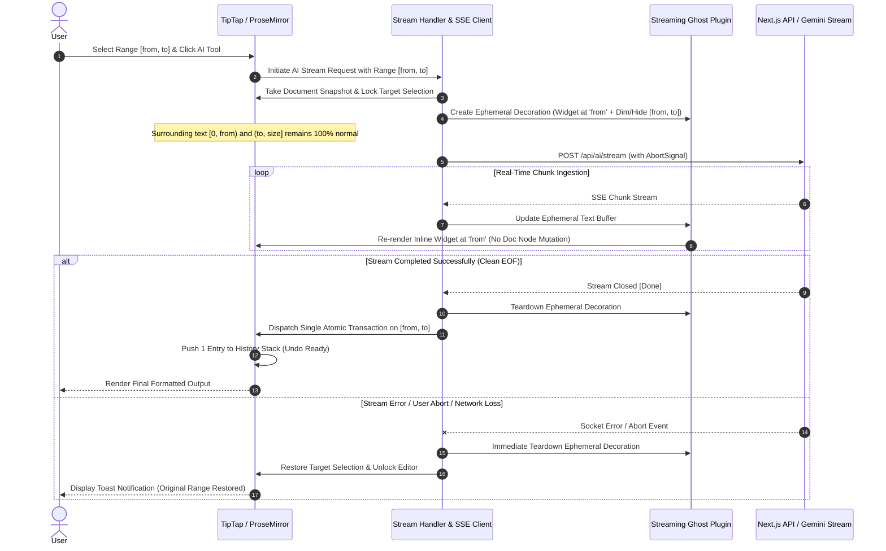

# Architectural Specification: Resilient UI Streaming & Atomic Undo in LUGX Editor

## 1. Executive Summary & Objective

This specification details the architectural design and execution strategy for re-enabling **Real-Time UI Streaming** for AI-assisted editing in the LUGX platform while enforcing **zero data loss**, **uncompromised auto-save isolation**, **granular range selection support**, and **single-action atomic rollback (Single Ctrl+Z undo)**.

---

## 2. Problem Statement & Invariant Guarantees

### 2.1 The Legacy Trade-Off
In previous iterations, real-time UI streaming was replaced with an off-screen buffering pattern (`collectedText` accumulator) due to risks of partial state corruption during mid-stream network aborts or SSE socket disconnects. While this guaranteed data integrity, it imposed a severe UX penalty by inflating the perceived latency.

### 2.2 System Invariants
Any acceptable architectural solution must rigorously satisfy the following five invariants:

1. **Auto-Save Invariance:** The live ProseMirror document state (`editor.state.doc`) MUST NOT be mutated during active streaming **or while a completed result awaits an explicit user decision** (`preview_ready`). No intermediate chunk shall trigger debounced auto-save mutations to IndexedDB or the remote database (Supabase).
2. **Partial Selection & Scope Invariance:** When an operation targets a specific sub-range $[from, to]$ within the document, the preceding content $[0, from)$ and subsequent content $(to, \text{doc.content.size}]$ MUST remain in their normal, unaffected layout and state. Streaming occurs strictly at the anchor point $from$.
3. **Atomic Commit Invariance (Acceptance-Triggered):** Stream completion does NOT mutate the document. The sanitized output is parked in `preview_ready`, and only an explicit user **Accept** applies the AI transformation in exactly ONE atomic ProseMirror transaction targeting $[from, to]$ (server-first commit confirmed before the local write). **Reject** and **Retry** leave the document fully untouched.
4. **Single-Action Undo Invariance:** Exactly one history entry is produced. A single `Ctrl+Z` (or undo command) restores the original document state and selection range prior to the AI invocation.
5. **Deterministic Rollback Invariance:** If the stream fails, times out, is aborted by the user, or encounters an API error (429/500/503), the ephemeral visual state is purged in $O(1)$ time with zero side effects on the document content.
6. **Explicit Settlement Invariance (v1.6.0):** Quota refunds apply ONLY to system failures (stream errors, startup errors, 412 conflicts). User-driven outcomes — Reject, Retry, Stop-mid-generation, or abandoning a completed preview — settle the reservation as consumed (`commitAIReservation`, idempotent, no document write) and are never refunded.

---

## 3. Architecture Design: Ephemeral Decoration Layer Pattern



### 3.1 ProseMirror Ephemeral Decoration
Rather than modifying the ProseMirror Node tree, the stream is rendered through a dedicated `ProseMirror Plugin` leveraging `DecorationSet.create()`.
* **Rendering Strategy:** 
  - `Decoration.inline(from, to, { class: 'opacity-40 line-through select-none' })` dims the selected range being replaced, giving clear visual context.
  - `Decoration.widget(from, domWidget, { side: -1 })` mounts the live streaming text preview directly before or in place of the target range with an animated cursor.
* **Storage Isolation:** Because `DecorationSet` is purely view-layer metadata maintained by the plugin state, `doc.descendants` and `editor.getHTML()` remain pristine throughout the stream lifecycle.

---

### 3.2 Granular Range Handling (Partial Selection vs Full Document)

```
Document Model:
+------------------------------------+-----------------------------+------------------------------------+
|  Preceding Text [0, from)          | Target Selection [from, to] | Subsequent Text (to, size]         |
|  (Untouched & Rendered Normally)   | (Dimmed via Decoration)     | (Untouched & Rendered Normally)    |
+------------------------------------+-----------------------------+------------------------------------+
                                      |
                                      +--> Widget Decoration at 'from':
                                           [ Live Streaming AI Text... | ]
```

1. **When text IS selected ($from \neq to$):**
   - The stream targets exactly $[from, to]$.
   - The text preceding $from$ and following $to$ remains rendered completely as-is in the normal editor flow.
   - The streaming widget renders in-place starting at index $from$.
   - On commit, `editor.chain().setTextSelection({ from, to }).deleteSelection().insertContent(html).run()` modifies only that slice.
2. **When NO text is selected (Full Document Operation, $from = to = 0$):**
   - The target spans $[0, \text{doc.content.size}]$.
   - The entire document is dimmed and the streaming widget previews the replacement starting from top-of-document.

---

## 4. Failure & Recovery Matrix

| Failure Mode | Detection Mechanism | Immediate Action | Recovery State | User Feedback |
| :--- | :--- | :--- | :--- | :--- |
| **Network Disconnection** | `ReadableStream` reader error or `TypeError: Failed to fetch` | Close stream reader, invoke `abortController.abort()` | Document retains 100% of pre-operation text; ghost decoration dismantled | Toast notification: *"Connection interrupted. Original content preserved."* with a Retry action |
| **Server / AI Model Error (429/500/503)** | Non-200 HTTP status or error event chunk | Terminate reader loop; do not invoke `applyAITransaction` | Document untouched; lock released | Localized banner / error message detailing error category |
| **Client-Side Explicit Abort** | User clicks *"Stop Generation"* or presses `Escape` | Trigger `abortController.abort()` | Instantly remove ghost decoration; re-enable editor interaction | Stream cancelled gracefully; zero leftover artefacts |
| **Tab Closing / Browser Crash** | Browser `beforeunload` or sudden process kill | N/A (Client ceases execution) | IndexedDB and Remote DB retain last clean auto-saved snapshot (unaffected by stream) | Upon next load, document is in clean pre-operation state |
| **Empty or Malformed Stream** | Sanitizer / Parser validation yields empty string or corrupted markup | Reject transaction dispatch | Document remains in pre-operation state | Error toast: *"AI produced an invalid response. No changes applied."* |

---

## 5. Architectural Comparison Matrix

| Evaluation Dimension | Ephemeral Decoration Layer (Selected) | Direct Mutation with History Squashing | Shadow DOM / Offscreen Editor | CRDT / Yjs Ephemeral Branching |
| :--- | :--- | :--- | :--- | :--- |
| **Partial Selection Isolation** | **Native & Seamless**: Scoped strictly to $[from, to]$ via Decoration coordinates | **Risky**: Document splices can corrupt adjacent node offsets | **Complex**: Requires mapping offsets between two editors | **Complex**: Branch slicing required |
| **Rendering Performance** | **High (60 FPS)**: Minimal DOM repaint scoped to decoration widget | **Medium**: Reparsing ProseMirror nodes on each chunk | **Low**: Overhead of maintaining dual editor instances | **Medium**: Branch merge overhead |
| **Auto-Save Safety** | **Absolute (100%)**: Zero change events dispatched during streaming | **Vulnerable**: Requires dangerous global auto-save suppression flags | **High**: Isolated to offscreen instance | **High**: Isolated to virtual branch |
| **Undo Stack Determinism** | **Deterministic**: Single atomic ProseMirror step | **Fragile**: Requires internal history filter manipulation | **Deterministic**: Single patch application | **Complex**: Requires multi-layer rollback |
| **Code Footprint & Maintenance** | **Low**: Single lightweight TipTap extension (~120 LOC) | **High**: Entangled with core editor transaction pipeline | **High**: Synchronization glue code between instances | **Very High**: Heavy CRDT dependencies |

---

## 6. Implementation Modules & Phased Delivery

1. **`src/lib/extensions/streaming-ghost-extension.ts`**:
   - Implements ProseMirror plugin with dynamic `DecorationSet` scoped to $[from, to]$.
   - Supports live Markdown-to-HTML formatting for incoming text chunks.
   - Built-in bidirectional (RTL/LTR) layout adaptation.
2. **`src/lib/ai/stream-handler.ts`**:
   - Encapsulates SSE consumption, `AbortController` lifecycle, backpressure handling, and error mapping.
3. **`src/components/editor/ai-toolbar.tsx`**:
   - Active streaming state indicator with instant *"Stop Generation"* action.
4. **`src/app/workspace/editor/[fileId]/page.tsx`**:
   - Integration point connecting `stream-handler`, `streaming-ghost-extension`, and atomic transaction commits on $[from, to]$.
5. **`src/lib/ai-transaction.test.ts`**:
   - Comprehensive unit and integration test suite asserting auto-save isolation, partial range replacement, single-action undo, and failure recovery.
