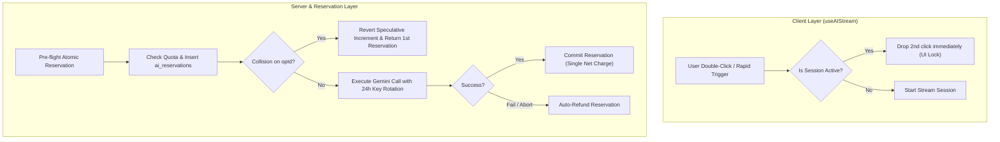

# AI Quota Reservation, Deduplication & Key Rotation Lifecycle

This document describes the technical architecture, database schema, concurrency controls, multi-key rotation algorithms, and high-load production resilience guarantees for the AI System (Phases 5 & 6).

---

## 1. System Overview & Architecture

The AI subsystem guarantees that token and word quotas are tracked deterministically and idempotently under concurrent requests, rapid user double-clicks, mid-stream failures, user cancellations, and optimistic version conflicts.



---

## 2. In-Flight Deduplication & Double-Click Protection

### A. Client-Side In-Flight Mutex (`useAIStream`)
- If an AI operation is already in an active non-terminal state (`reserved`, `streaming`, or `committing`), any subsequent rapid click or trigger is immediately dropped without making a duplicate network request.

### B. Server-Side Race Speculative Recovery (`reserveAndUpdateUsage`)
- When two concurrent requests with the same `operationId` bypass client deduplication (e.g. rapid network replay):
  1. Both requests attempt `db.update(schema.usage)`.
  2. Request 1 successfully inserts into `ai_reservations`.
  3. Request 2 fails the unique constraint on `operation_id`.
  4. **Speculative Usage Reversal:** In Request 2's catch block, the system automatically reverses the speculative increment made on `schema.usage` before returning the first reservation record.
- **Guarantee:** Under any concurrency race, the user's quota is deducted **exactly once**.

---

## 3. Distributed 24-Hour Key Rotation & Circuit Breaker (`key-rotation.ts`)

### A. Fixed 24-Hour Lifecycle Clock from First Request
- When an API key executes its **first successful request** (`count === 1` or TTL unset):
  - Redis sets a fixed TTL of exactly `86,400` seconds (24 hours).
- On all subsequent requests (`count > 1`):
  - **The TTL is NEVER refreshed or extended.** The countdown strictly continues towards the 24-hour mark from the first request.

### B. Natural Cooldown & Zero Forced Resets
- If an API key uses all 20 requests in 5 hours, the key transitions to `exhausted` state and enters a natural cooldown for the remaining 19 hours.
- **Prohibition of Blind Resets:** The system strictly prohibits forced counter clearing (`redis.set(usageKey, 0)`). Counters remain accurate and expire naturally through Redis TTL.
- When rotating, the pool skips exhausted keys and finds the next available healthy key (`usage < limit`).

### C. All Keys Exhaustion & Cooldown Estimation
- If all configured API keys reach their limit:
  - The system computes the minimum remaining TTL across the pool:
    $$\text{minRemainingTTL} = \min_{i}(\text{TTL}_i)$$
  - The system throws an `AllKeysExhaustedError` reporting the exact cooldown time remaining until the earliest key unlocks.

### D. Distributed Model Circuit Breaker
- If a model encounters consecutive 503 (Service Unavailable) or high-demand errors, the distributed Circuit Breaker trips to `OPEN` in Redis for 1 hour (`DEFAULT_CIRCUIT_TTL_SECONDS = 3600`).
- Subsequent requests take the Redis Fast-Path to immediately route to the configured fallback model without waiting for primary model timeouts.

### E. Rotatable vs Non-Rotatable Errors (Fail-Fast)
- **Rotatable Technical Errors:** 401 (Auth), 403 (Quota), 429 (Rate Limit), 500, 502, 503, 504, Transient Connection Resets.
- **Non-Rotatable User Errors (Fail-Fast):** 400 (Bad Request / Prompt Format / Safety Blocks). These fail immediately without rotating to prevent draining other API keys.

---

## 4. User Editor Data Protection & Stream Integrity

### A. Non-Destructive Ghost Decoration Layer
- Streaming text chunks are rendered into TipTap via a visual ghost decoration layer (`StreamingGhostExtension`) without mutating the actual ProseMirror document nodes until final commit.

### B. Concurrent User Edit Protection (AUD-02)
- If the user types new content into the editor while an AI stream is running, the document's `editorGeneration` increments.
- When the stream ends:
  - `assertSessionIntegrity` detects the generation mismatch.
  - The system dismantles the ghost layer (`clearStreamingGhost()`).
  - **Quota settlement:** the abort is a *user decision*, so the reservation is settled as consumed under the Explicit Settlement Policy (§4-D) — it is NOT refunded.
  - **Critical Rule:** The system **NEVER** executes `editor.setContent(session.originalHtml)`. All manual edits written by the user are preserved 100% without data loss.

### C. Server-Side Disconnect Safety Net
- In `/api/ai/stream/route.ts`, if the client tab closes or socket drops (`req.signal.aborted` or `ReadableStream.cancel()`), the server still triggers `refundAIReservation(operationId, 'stream_cancelled_by_client')` as a safety net so no quota remains locked from orphaned sessions.
- **Ordering guarantee:** when the stop is client-initiated (`stopStream`), the client FIRST settles the reservation explicitly (see §4-D) and only then aborts the stream. The later server-side refund therefore no-ops with `already_committed`, so the safety net can never reverse an intentional settlement.

### D. Explicit Settlement Policy (User Decisions) — v1.6.0
Quota refunds are reserved for **system failures**. Any outcome driven by a **user decision** consumes the reservation, because the compute cost was already spent. Settlement is performed idempotently via `commitAIReservation(operationId)` (status `reserved -> committed`, no document write), which also pins the deduction against the TTL sweeper (`expireStaleReservations`) and any stray refund call (returns `already_committed`).

| Outcome | Trigger | Quota action |
|---|---|---|
| Stream startup / mid-stream failure | System error | **Refund** (`refundAIReservation`) |
| Optimistic-lock conflict (412) at commit time | System condition | **Refund** |
| Client exception during pipeline | System error | **Refund** |
| User rejects the completed preview (`rejectPreview`) | User decision | **Settle as consumed** |
| User re-runs the operation (`retryPreview`) — old session | User decision | **Settle as consumed** (new session reserves fresh quota) |
| User stops a running generation (`stopStream`) | User decision | **Settle as consumed** before abort |
| Teardown while output awaits decision (unmount in `preview_ready`) | Undecided user teardown | **Settle as consumed** |

Rationale: the provider call completed (or partially completed) for every settled case above — the tokens were spent regardless of what the user chooses to do with the output. Refunding would allow unlimited free regeneration by reject/retry cycles.

---

## 5. Database Schema (`ai_reservations`)

Managed in `src/lib/db/schema.ts` and migration `0005_ai_reservations.sql`:

```typescript
export const aiReservationStatusEnum = pgEnum("ai_reservation_status", [
    "reserved",
    "committed",
    "refunded",
    "expired",
]);

export const aiReservations = pgTable("ai_reservations", {
    id: uuid("id").primaryKey().defaultRandom(),
    operationId: varchar("operation_id", { length: 255 }).notNull(),
    userId: uuid("user_id").notNull().references(() => users.id, { onDelete: "cascade" }),
    fileId: uuid("file_id").references(() => files.id, { onDelete: "set null" }),
    operation: varchar("operation", { length: 64 }).notNull(),
    reservedUnits: integer("reserved_units").notNull().default(0),
    committedUnits: integer("committed_units").notNull().default(0),
    refundedUnits: integer("refunded_units").notNull().default(0),
    periodKey: varchar("period_key", { length: 32 }).notNull(),
    status: aiReservationStatusEnum("status").notNull().default("reserved"),
    expiresAt: timestamp("expires_at").notNull(),
    createdAt: timestamp("created_at").notNull().defaultNow(),
    updatedAt: timestamp("updated_at").notNull().defaultNow(),
}, (table) => [
    uniqueIndex("idx_ai_reservations_user_op_period").on(table.userId, table.operationId, table.periodKey),
    uniqueIndex("idx_ai_reservations_operation_id").on(table.operationId),
    index("idx_ai_reservations_user_status").on(table.userId, table.status),
    index("idx_ai_reservations_status_expires").on(table.status, table.expiresAt),
]);
```

---

## 6. Verifiable Test Proof & Invariant Matrix

| Guarantee | Mechanism | Automated Test Reference |
| :--- | :--- | :--- |
| **Fixed 24h Window** | TTL starts on first request; never renewed | `key-rotation.test.ts` |
| **No Blind Resets** | Preserves usage counters across forced rotations | `key-rotation.test.ts` |
| **Exhaustion Guard** | Throws `AllKeysExhaustedError` with `minRemainingTTL` | `key-rotation.test.ts` |
| **Fail-Fast on 400** | Excludes 400 from `ROTATION_ERROR_CODES` | `key-rotation.test.ts` |
| **Double-Click Mutex** | In-flight session lock & speculative usage reversal | `ai-ops.integrity.test.ts` |
| **Editor Data Safety** | Preserves manual typing on generation mismatch | `ai-stream-session.test.ts` |
| **Atomic Quota Refund** | Bounded subtraction `GREATEST(col - units, 0)` | `ai-ops.refund.test.ts` |
| **Idempotent Commit** | Atomic conditional status transition to `committed` | `ai-server-atomic-commit.test.ts` |
