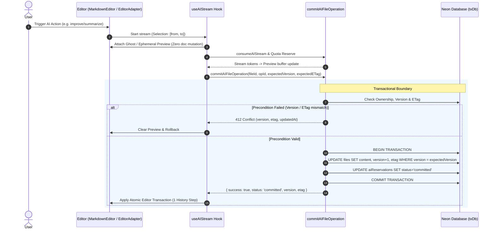

# AI Atomic Commit & Transactional Settlement Architecture

## 1. Overview & Technical Objective

This document defines the architecture, invariant guarantees, and operational hardening for **Phase 8: AI Atomic Commit Inside File**.
The goal is to ensure a strictly verified, single-transaction atomic commit mechanism that binds the AI generation result to the file state, quota reservation settlement, and expected optimistic version/ETag without allowing partial document mutations, connection leaks, or quota desynchronization.

---

## 2. Invariant Guarantees

1. **Transactional Atomicity & Production Enforcement**:
   - File content update (`files` table), version increment, ETag generation, and reservation settlement (`aiReservations` table -> `committed`) execute inside a single transactional boundary (`txDb.transaction`).
   - If reservation settlement or file update fails, the entire transaction is rolled back.
   - In production (`NODE_ENV !== "test"`), transactional support via `txDb.transaction` is strictly required; any missing transaction driver triggers a hard exception rather than silently slipping into non-atomic fallbacks.

2. **Strict Ownership & File Association**:
   - The committing user must own both the target file and the AI reservation record.
   - The reservation record's `fileId` must match the target `fileId`.

3. **Optimistic Version, ETag Preconditions & Self-Session Healing**:
   - Optimistic concurrency control is enforced both at the initial validation check and atomically inside the update statement (`WHERE version = baseVersion`).
   - **Self-Session Healing (v1.14.0)**: If `currentFile.version !== expectedVersion` (due to an in-flight background auto-save before AI launch), but the server's `currentFile.content` matches the baseline `originalContent` from which the AI stream originated, the server safely adopts the current version (`baseVersion = fileCurrentVersion`) and increments atomically, preventing false 412 conflicts.
   - **Normalized ETag Verification**: ETag comparisons normalize quotation marks and weak prefixes (`W/`) to eliminate false serialization mismatches.
   - If a true concurrent write from another session occurs, the update yields zero rows, rolling back the transaction and triggering an explicit `412 conflict` response.
   - Conflict responses return minimal metadata (`version`, `etag`, `updatedAt`) without leaking full document payloads across the network.

4. **Adaptive Multi-Driver Transaction Client & Connection Pool Bounds**:
   - The transactional client (`src/lib/db/transactional.ts`) adaptively selects the appropriate driver based on the target `DATABASE_URL`:
     - **Neon Cloud (`neon.tech`)**: Uses `@neondatabase/serverless` WebSocket Pool with bounded resource limits (`max: 5`, `connectionTimeoutMillis: 10_000`, `idleTimeoutMillis: 30_000`) to prevent orphaned transactions under cloud network latency.
     - **Local & CI PostgreSQL**: Uses `pg.Pool` (`node-postgres`) to execute native ACID transactions without WebSocket overhead or artificial mocks.
   - Evaluated dynamically via a lazy proxy singleton to support test-environment binding (`TEST_DATABASE_URL`).

5. **Idempotency via `operationId`**:
   - If a commit is retried after a network partition where the reservation was already marked `committed`, the endpoint idempotently returns the current committed version/ETag instead of applying redundant version increments or throwing unhandled errors.

6. **Server-First Commit & Markdown Source of Truth**:
   - The client editor maintains ephemeral preview buffers during generation using pure Markdown.
   - Stream completion does NOT commit: the validated Markdown output is parked in `preview_ready` until an explicit user decision.
   - On user **Accept** (`commitPreview`), the client queries the dynamically tracked range (`editor.getGhostRange()`), executes server commit on raw Markdown (`commitAIFileOperation`), and applies a single atomic replacement via `EditorAdapter.replaceRange`.
   - In case of network failure or 412 conflict, the ephemeral preview is dismantled and the document remains in its pristine state.
   - On user **Reject** or **Retry**, no document mutation occurs at all; the quota reservation is settled as consumed per the Explicit Settlement Policy ([`ai-quota-reservation-lifecycle.md`](./ai-quota-reservation-lifecycle.md) §4-D).

7. **Autosave Debounce Cancellation & Sync Isolation**:
   - Starting an AI operation immediately cancels any pending background auto-save timers (`debouncedAutoSave.cancel()`) to prevent version collisions.
   - Background autosave and cross-tab sync broadcasts are suppressed while `aiStream.isLoading` / `aiStream.isCommitting` is active **or while the session rests in `preview_ready` awaiting the user's decision**, and resume only after the editor generation and file version are updated with the server's response.

---

## 3. Component Reference & Flow

---

## 4. Verification & Test Evidence

The atomic commit guarantees are verified across the following automated test suites:
- `src/test/ai-atomic-commit.integration.test.ts`: **Real PostgreSQL Integration Test** executing the actual production actions (`commitAIFileOperation`, `refundAIReservation`) against real PostgreSQL tables, enforcing foreign keys, live interactive transactions, and rollback verification.
- `src/test/ai-server-atomic-commit.test.ts`: Covers auth verification, parameter validation, file-reservation association, idempotent retries, ETag/version conflict guards, production transaction requirement, and transactional execution/rollback.
- `src/test/editor-atomic-commit.test.ts`: Verifies partial and full replacement single undo invariants, conflict rollbacks, ephemeral ghost preview isolation, and pristine document preservation upon server failure.
- `src/test/ai-quota-idempotency.test.ts` & `src/server/actions/ai-ops.refund.test.ts` & `src/server/actions/ai-ops.integrity.test.ts`: Verifies quota reservation state machine, cross-midnight resilience, and concurrency idempotency.

---

## 5. Technical Debt & Future Considerations

1. **Transaction Pool Scaling**:
   - The current `max: 5` Pool configuration in `src/lib/db/transactional.ts` is sized for serverless container instances. Under future horizontal serverless scaling with high concurrency per instance, connection pooling may need PgBouncer / Neon connection pooling proxy integration.
2. **Conflict UI Differentiation**:
   - The conflict response intentionally omits `content` to optimize network bandwidth and prevent data leaks. If a three-way merge dialog is designed specifically for AI conflicts in the future (similar to `useSync` conflict modal), a dedicated comparison endpoint should be created rather than transmitting document payloads in all conflict error states.
3. **Driver-Level Unit Test Mocking**:
   - In `NODE_ENV === "test"`, a sequential fallback path remains to accommodate mock DB environments where interactive transactions are simulated. Full end-to-end integration tests run against real Postgres to ensure real transactional semantics.
