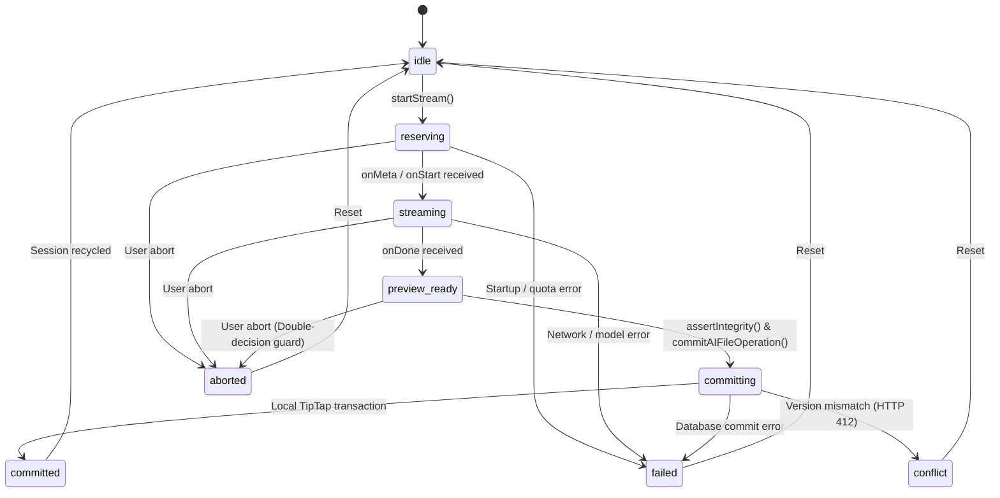

# AI NDJSON Streaming Protocol & Session State Machine Architecture

## 1. Overview & Architectural Objectives

This specification details the end-to-end NDJSON (Newline-Delimited JSON) Streaming Protocol, finite state machine (FSM), and adversarial hardening layer connecting:
- **Server Stream Handler**: `src/app/api/ai/stream/route.ts`
- **Client Protocol Parser**: `src/lib/ai/stream-handler.ts`
- **Session State Machine & Integrity**: `src/lib/ai/stream-session.ts`
- **Ephemeral Preview & Editor Extension**: `src/lib/ai/preview-buffer.ts` & `src/lib/extensions/streaming-ghost-extension.ts`
- **React Consumer Hook**: `src/hooks/use-ai-stream.ts`

### Architectural Guarantees
1. **Zero Document Model Mutation During Streaming**: Chunks stream exclusively into `EphemeralPreviewBuffer` and TipTap `StreamingGhostExtension` widget decorations. Neither ProseMirror doc state nor IndexedDB storage is modified until atomic commit.
2. **Deterministic Single-Phase Commit**: Atomic server and local transaction commits occur strictly on stream completion.
3. **Atomic Quota Reservation & Idempotent Refunds**: Automatic quota refunds occur on startup errors, mid-stream disconnects, version conflicts, or user cancellations.
4. **Multi-Byte UTF-8 & Line Boundary Preservation**: Resilient stream parsing protects against chunk slicing, surrogate splits, and network fragmentation.
5. **Adversarial Resilience**: Line buffer flooding guards (`MAX_LINE_BUFFER_CHARS = 256KB`), payload ceiling guards (`MAX_INPUT_CHARS = 100,000`), DOM XSS immunity, and dynamic ProseMirror position tracking.

---

## 2. NDJSON Message Framing Specification

Every message transmitted over the `/api/ai/stream` endpoint conforms to single-line JSON terminated by `\n` (`Content-Type: application/x-ndjson; charset=utf-8`).

### 2.1 Event Schema Definitions

| Event Type | Framing Schema | Description |
| :--- | :--- | :--- |
| `start` / `meta` | `{"type":"start","sessionId":"...","operationId":"...","reservationId":"..."}` | Handshake frame containing non-sensitive session identifiers before stream begins. |
| `chunk` / `delta` | `{"type":"chunk","text":"..."}` | Incremental delta text output generated by AI model. |
| `done` | `{"type":"done","usage":{"outputTokens":123}}` | Terminal completion marker signaling clean model EOF. |
| `error` | `{"type":"error","code":"STREAM_INTERRUPTED","message":"...","retryable":true}` | Mid-stream error frame encapsulating provider failure without abrupt socket drop. |
| `cancelled` | `{"type":"cancelled","reason":"Client aborted connection"}` | Terminal cancellation frame emitted when client aborts. |

### 2.2 Header & Transport Requirements
- `Content-Type`: `application/x-ndjson; charset=utf-8`
- `Cache-Control`: `no-cache, no-transform, no-store, must-revalidate`
- `Connection`: `keep-alive`
- `X-Content-Type-Options`: `nosniff`
- `X-Accel-Buffering`: `no` (disables reverse-proxy buffering in Nginx/Vercel)

---

## 3. Session Finite State Machine (FSM)

The streaming session lifecycle follows a strict finite state machine governed in `src/lib/ai/stream-session.ts`:



### 3.1 Allowed State Transition Matrix

```typescript
const ALLOWED_TRANSITIONS: Record<AIStreamStatus, AIStreamStatus[]> = {
    idle: ["reserving", "reserved", "failed", "aborted"],
    reserving: ["streaming", "aborting", "aborted", "failed", "conflict", "rolled_back"],
    reserved: ["streaming", "aborting", "aborted", "failed", "conflict", "rolled_back"],
    streaming: ["preview_ready", "completed", "aborting", "aborted", "failed", "conflict", "rolled_back"],
    preview_ready: ["committing", "aborting", "aborted", "failed", "conflict", "rolled_back"],
    completed: ["committing", "aborting", "aborted", "failed", "conflict", "rolled_back"],
    committing: ["committed", "failed", "conflict", "rolled_back"],
    committed: ["idle"],
    aborting: ["aborted", "conflict", "rolled_back", "failed"],
    aborted: ["idle"],
    failed: ["idle"],
    conflict: ["idle"],
    rolled_back: ["idle"],
};
```

---

## 4. Adversarial Edge Cases & Production Hardening

### 4.1 Unbounded Line Buffer Flooding (`MAX_LINE_BUFFER_CHARS`)
- **Risk**: Upstream proxy or malformed source streaming megabytes of text without a newline (`\n`), causing unbounded `lineBuffer` expansion and browser Heap Out-Of-Memory (OOM).
- **Protection**: `stream-handler.ts` enforces `MAX_LINE_BUFFER_CHARS = 256 * 1024` (256KB). If buffer length exceeds ceiling without `\n`, it terminates the stream with `stream_buffer_overflow` and releases reader locks.

### 4.2 Dynamic ProseMirror Selection Range Mapping
- **Risk**: User typing during streaming causing position drift between original selection bounds and actual document coordinates at commit time.
- **Protection**: `use-ai-stream.ts` dynamically queries `streamingGhostPluginKey.getState(editor.state)` for the mapped `from`/`to` positions updated via ProseMirror `tr.mapping.map()`, preventing destructive overwrite of shifted content.

### 4.3 Payload Validation & Size Ceiling (`MAX_INPUT_CHARS`)
- **Risk**: Massive payloads or non-string inputs causing high CPU regex evaluation during word counting and quota reservation.
- **Protection**: `route.ts` validates payload types (`typeof text === 'string'`) and enforces `MAX_INPUT_CHARS = 100_000` returning clean `400 Bad Request`.

### 4.4 Non-Abortable Committing State Guard
- **Risk**: User clicking Cancel while `commitAIFileOperation` is in-flight on the server database, leading to server-commit success but client-side rollback (causing version desynchronization and HTTP 412 conflicts).
- **Protection**: `stopStream()` strictly locks and suppresses cancellations once the session enters `committing` state.

### 4.5 DOM XSS Immunity in Ghost Extension
- **Risk**: Dynamic operation names interpolated into `innerHTML` leading to DOM injection.
- **Protection**: `StreamingGhostExtension` builds widget header nodes exclusively via `document.createElement` and `textContent`.

### 4.6 Single Terminal Callback Guarantee
- **Risk**: Concurrent abort and reader cancellation exceptions causing `onError` or `onComplete` to fire multiple times.
- **Protection**: `stream-handler.ts` employs `isTerminalCallbackEmitted` ensuring strictly one terminal callback invocation per session.

---

## 5. Verification & Test Evidence

The implementation is verified with automated tests covering all parser, FSM, and adversarial edge cases:
- `src/test/ai-stream-parser.test.ts`: 11 tests covering NDJSON framing, multi-byte UTF-8, incomplete EOF (`failed_incomplete_stream`), duplicate `done`, unknown frames, buffer overflow (`stream_buffer_overflow`), and signal aborts.
- `src/test/ai-stream-session.test.ts`: 12 tests covering canonical FSM lifecycle, terminal state identification, illegal transitions, generation/version mismatch assertions, conflict rollback, and preview buffer boundaries.
