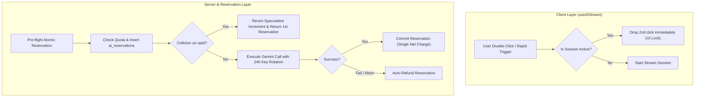
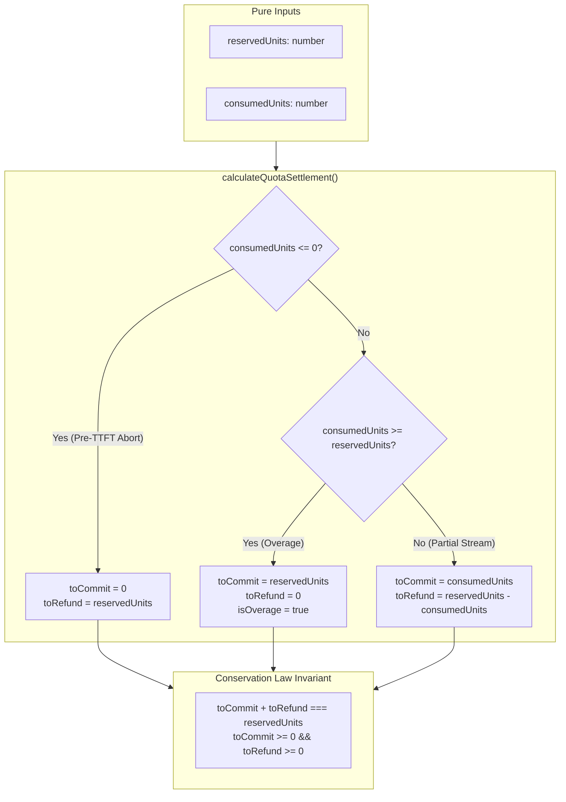

# AI Quota Reservation, Deduplication & Key Rotation Lifecycle

This document describes the technical architecture, database schema, concurrency controls, multi-key rotation algorithms, and high-load production resilience guarantees for the AI System (Phases 5 & 6).

---

## 1. System Overview & Architecture

The AI subsystem guarantees that token and word quotas are tracked deterministically and idempotently under concurrent requests, rapid user double-clicks, mid-stream failures, user cancellations, and optimistic version conflicts.



---

## 2. In-Flight Deduplication & Double-Click Protection

### A. Client-Side In-Flight Mutex (`useAIStream`)
- If an AI operation is already in an active non-terminal state (`reserved`, `streaming`, or `committing`), any subsequent rapid click or trigger is immediately dropped without making a duplicate network request.

### B. Server-Side Race Speculative Recovery (`reserveAndUpdateUsage`)
- When two concurrent requests with the same `operationId` bypass client deduplication (e.g. rapid network replay):
  1. Both requests attempt `db.update(schema.usage)`.
  2. Request 1 successfully inserts into `ai_reservations`.
  3. Request 2 fails the unique constraint on `operation_id`.
  4. **Speculative Usage Reversal:** In Request 2's catch block, the system automatically reverses the speculative increment made on `schema.usage` before returning the first reservation record.
- **Guarantee:** Under any concurrency race, the user's quota is deducted **exactly once**.

---

## 3. Distributed 24-Hour Key Rotation & Circuit Breaker (`key-rotation.ts`)

### A. Fixed 24-Hour Lifecycle Clock from First Request
- When an API key executes its **first successful request** (`count === 1` or TTL unset):
  - Redis sets a fixed TTL of exactly `86,400` seconds (24 hours).
- On all subsequent requests (`count > 1`):
  - **The TTL is NEVER refreshed or extended.** The countdown strictly continues towards the 24-hour mark from the first request.

### B. Natural Cooldown & Zero Forced Resets
- If an API key uses all 20 requests in 5 hours, the key transitions to `exhausted` state and enters a natural cooldown for the remaining 19 hours.
- **Prohibition of Blind Resets:** The system strictly prohibits forced counter clearing (`redis.set(usageKey, 0)`). Counters remain accurate and expire naturally through Redis TTL.
- When rotating, the pool skips exhausted keys and finds the next available healthy key (`usage < limit`).

### C. All Keys Exhaustion & Cooldown Estimation
- If all configured API keys reach their limit:
  - The system computes the minimum remaining TTL across the pool:
    $$\text{minRemainingTTL} = \min_{i}(\text{TTL}_i)$$
  - The system throws an `AllKeysExhaustedError` reporting the exact cooldown time remaining until the earliest key unlocks.

### D. Distributed Model Circuit Breaker & 4-Tier Model Cascade
- If a model encounters consecutive 503 (Service Unavailable) or high-demand errors, the distributed Circuit Breaker trips to `OPEN` in Redis for 10 minutes (`DEFAULT_CIRCUIT_TTL_SECONDS = 600`).
- Subsequent requests take the Redis Fast-Path to immediately bypass failing models and step through the configured **4-Tier Model Cascade** (`src/config/models.config.json` resolved via `src/lib/ai/client.ts`):

| Cascade Level | Configuration Key | Model Identifier | Role & Failover Trigger |
| :--- | :--- | :--- | :--- |
| **Tier 1 (Primary)** | `[tier]` | `gemini-3.7-flash` | Authoritative default for all user prompts; highest reasoning quality. |
| **Tier 2 (Fallback)** | `fallback` | `gemini-3.6-flash` | Automated primary failover upon 503, high load, or primary circuit trip. |
| **Tier 3 (Secondary)** | `secondaryFallback` | `gemini-3.5-flash-lite` | Ultra-fast lightweight model ensuring generation under upstream provider saturation. |
| **Tier 4 (Tertiary)** | `tertiaryFallback` | `gemini-3.1-flash-lite` | Terminal resilience fallback guaranteeing continuity before absolute exhaustion. |

### E. Rotatable vs Non-Rotatable Errors (Fail-Fast)
- **Rotatable Technical Errors:** 401 (Auth), 403 (Quota), 429 (Rate Limit), 500, 502, 503, 504, Transient Connection Resets.
- **Non-Rotatable User Errors (Fail-Fast):** 400 (Bad Request / Prompt Format / Safety Blocks). These fail immediately without rotating to prevent draining other API keys.

---

## 4. User Editor Data Protection & Stream Integrity

### A. Non-Destructive Ephemeral Preview Layer
- Streaming text chunks are rendered into the editor via an ephemeral preview buffer and overlay layer without mutating the actual document source until final commit.

### B. Concurrent User Edit Protection (AUD-02)
- If the user types new content into the editor while an AI stream is running, the document's `editorGeneration` increments.
- When the stream ends:
  - `assertSessionIntegrity` detects the generation mismatch.
  - The system dismantles the ephemeral preview overlay.
  - **Quota settlement:** the abort is a *user decision*, so the reservation is settled as consumed under the Explicit Settlement Policy (§4-D) — it is NOT refunded.
  - **Critical Rule:** The system **NEVER** silently resets user edits. All manual edits written by the user are preserved 100% without data loss.

### C. Server-Authoritative Streaming Settlement & Revocation of Client Financial Authority (Phase 11)
- **Zero Client Financial Authority:** The server actions `refundAIReservation` and `commitAIReservation` have been completely removed from client-accessible RPC entrypoints (`"use server"`). Settlement logic is strictly encapsulated inside `src/server/services/ai-settlement-service.ts` using `import "server-only"`. The client cannot manipulate reservation states via network calls.
- **Server Stream Lifecycle Settlement (`/api/ai/stream/route.ts`):**
  - **Normal Stream Completion:** The server autonomously commits the reservation (`commitAIReservation(operationId)`) *immediately prior* to enqueuing the terminal `{ type: "done" }` NDJSON frame.
  - **Pre-TTFT Failures & Aborts (`ttftMs === null`):** If upstream generation fails before any token is emitted, or if the client disconnects before the first chunk, the server issues an atomic refund (`refundAIReservation(operationId, 'mid_stream_failure_pre_ttft' | 'disconnect_pre_generation')`).
  - **Post-TTFT Failures & Aborts (`ttftMs !== null`):** If tokens have already been delivered across the wire and the connection is aborted or interrupted, the server commits the reservation to account for consumed upstream compute.
- **Zero-Latency Client Stop:** The client hook (`useAIStream`) executes `abortController.abort()` with 0ms client-side latency, without dispatching any RPC settlement calls. The server stream handler (`cancel()` and `req.signal.aborted`) settles the state autonomously.

### D. Replay Attack Defense & Request Fingerprint Validation (Phase 11)
- **Deterministic Payload Fingerprinting:**
  $$\text{requestHash} = \text{SHA-256}(\text{userId} : \text{operation} : \text{fileId} : \text{text})$$
- **Integrity Validation:** When `reserveAIQuota` is called with an existing `operationId`:
  1. The existing reservation's `requestHash` is verified against the incoming payload's fingerprint.
  2. The reservation's `userId` is verified against the authenticated session.
  3. If `operationId` is reused with divergent parameters, the reservation is rejected with `isReplayConflict: true`, and the stream endpoint returns **HTTP 409 Conflict**.

### E. Explicit Settlement Policy (User Decisions) — v1.6.0 & Phase 11
Quota refunds are reserved strictly for **system failures** occurring pre-TTFT. Any outcome driven by a **user decision** (accept, reject, retry, or post-TTFT stop) settles the reservation as consumed, as upstream AI tokens were already generated. Settlement is performed idempotently via `commitAIReservation(operationId)`.

| Outcome | Trigger | Quota action |
|---|---|---|
| Stream startup / upstream error pre-TTFT | System error | **Refund** (`refundAIReservation` on server) |
| Client disconnect pre-TTFT (`ttftMs === null`) | Client disconnect | **Refund** (`refundAIReservation` on server) |
| Upstream error post-TTFT (`ttftMs !== null`) | Mid-stream failure | **Settle as consumed** (`commitAIReservation` on server) |
| Client disconnect post-TTFT (`ttftMs !== null`) | Client abort | **Settle as consumed** (`commitAIReservation` on server) |
| Stream successfully finished | Successful completion | **Settle as consumed** (Committed before `done` frame) |
| User accepts preview (`commitPreview`) | User decision | **Document committed** (`commitAIFileOperation` updates file) |
| User rejects preview (`rejectPreview`) | User decision | **Settle as consumed** (Reservation committed; doc unchanged) |
| User retries preview (`retryPreview`) | User decision | **Settle as consumed** (New session reserves fresh quota) |

---

## 5. Database Schema (`ai_reservations`)

Managed in `src/server/db/schema/ai-reservations.ts` and migration `src/server/db/migrations/0005_ai_reservations.sql`:

```typescript
export const aiReservationStatusEnum = pgEnum("ai_reservation_status", [
    "reserved",
    "committed",
    "refunded",
    "expired",
]);

export const aiReservations = pgTable("ai_reservations", {
    id: uuid("id").primaryKey().defaultRandom(),
    operationId: varchar("operation_id", { length: 255 }).notNull(),
    userId: uuid("user_id").notNull().references(() => users.id, { onDelete: "cascade" }),
    fileId: uuid("file_id").references(() => files.id, { onDelete: "set null" }),
    operation: varchar("operation", { length: 64 }).notNull(),
    reservedUnits: integer("reserved_units").notNull().default(0),
    committedUnits: integer("committed_units").notNull().default(0),
    refundedUnits: integer("refunded_units").notNull().default(0),
    periodKey: varchar("period_key", { length: 32 }).notNull(),
    status: aiReservationStatusEnum("status").notNull().default("reserved"),
    expiresAt: timestamp("expires_at").notNull(),
    createdAt: timestamp("created_at").notNull().defaultNow(),
    updatedAt: timestamp("updated_at").notNull().defaultNow(),
}, (table) => [
    uniqueIndex("idx_ai_reservations_user_op_period").on(table.userId, table.operationId, table.periodKey),
    uniqueIndex("idx_ai_reservations_operation_id").on(table.operationId),
    index("idx_ai_reservations_user_status").on(table.userId, table.status),
    index("idx_ai_reservations_status_expires").on(table.status, table.expiresAt),
]);
```

---

## 6. Verifiable Test Proof & Invariant Matrix

| Guarantee | Mechanism | Automated Test Reference |
| :--- | :--- | :--- |
| **Fixed 24h Window** | TTL starts on first request; never renewed | `key-rotation.test.ts` |
| **No Blind Resets** | Preserves usage counters across forced rotations | `key-rotation.test.ts` |
| **Exhaustion Guard** | Throws `AllKeysExhaustedError` with `minRemainingTTL` | `key-rotation.test.ts` |
| **Fail-Fast on 400** | Excludes 400 from `ROTATION_ERROR_CODES` | `key-rotation.test.ts` |
| **Double-Click Mutex** | In-flight session lock & speculative usage reversal | `ai-ops.integrity.test.ts` |
| **Editor Data Safety** | Preserves manual typing on generation mismatch | `ai-stream-session.test.ts` |
| **Atomic Quota Refund** | Bounded subtraction `GREATEST(col - units, 0)` | `ai-ops.refund.test.ts` |
| **Idempotent Commit** | Atomic conditional status transition to `committed` | `ai-server-atomic-commit.test.ts` |

---

## 7. Architectural Decisions & Quota Settlement Trade-offs

### Decision TR-09: Two-Phase Quota Reservation (Hold & Commit) vs. Optimistic Post-Settlement

- **Context:** Preventing concurrent subscription tier quota abuse (e.g. an automated script firing 10 parallel 5,000-word requests simultaneously when the user only has 5,000 words remaining).
- **Chosen Architecture:** Two-Phase Quota Reservation (`src/server/actions/ai-ops.ts`):
  1. **Phase 1 (Hold):** Atomically creates an `ai_reservations` row with status `reserved` and decrements available balance before establishing the LLM stream.
  2. **Phase 2 (Settle):** Atomically transitions the reservation to `committed` upon user acceptance or `refunded` / `expired` upon rejection/abandonment.
- **Rejected Alternatives:**
  1. **Optimistic Post-Settlement:** Deducting quota only after the LLM completes generation and the user accepts.
  2. **Immediate Debit with Best-Effort Refund:** Fully burning quota immediately upon request and issuing refund credits if generation fails.
- **Trade-off Analysis:**
  | Evaluation Criteria | Chosen Solution (Two-Phase Hold) | Alternative #1 (Optimistic Post-Settlement) | Alternative #2 (Immediate Debit) |
  | :--- | :--- | :--- | :--- |
  | **Concurrency Overdraft Protection** | **100% Guaranteed**: Second parallel request finds zero remaining quota and is immediately rejected (402). | **Zero**: An adversary can burst $10 \times$ their quota in parallel before any post-settlement runs. | **100% Guaranteed**: Balance drops on first request. |
  | **Database Write Amplification** | **High**: 2–3 database write transactions per generation (`reserve` + `commit/refund`). | **Lowest**: Exactly 1 database write per successful generation. | **Moderate**: 1 write on success, 2 writes on failure refund. |
  | **Abandonment & Orphan Risk** | **Handled by Sweeper**: Requires periodic cron (`/api/cron/expire-reservations`) to sweep abandoned holds. | **Zero**: No reservation records created to orphan. | **High Customer Friction**: Users temporarily lose quota on dropped connections until refunded. |

- **Migration Trigger (When to Switch to Optimistic Post-Settlement):**
  Transitioning to optimistic post-settlement is triggered **if Postgres transaction write IOPS becomes a primary cost bottleneck AND AI model inference costs drop to near-zero commodity pricing**, where the financial cost of database write amplification exceeds the monetary risk of occasional client concurrency overdraft.

---

## 8. Pure Quota Settlement Reducer & Conservation Invariants (Phase 6)

In Phase 6 (v1.34.0), quota difference calculations and reservation lifecycle transitions were formalized into pure functions (`src/lib/ai/quota-settlement-reducer.ts`), eliminating client-driven calculation drift (remediating LUGX-001 and LUGX-115).



### 8.1 Mathematical Conservation & Sanitation Invariants
1. **Conservation Law:** For all non-overage scenarios (`consumedUnits <= reservedUnits`), the sum of units committed and refunded strictly matches the units reserved:
   $$\text{toCommit} + \text{toRefund} \equiv \text{reservedUnits}$$
2. **Deterministic Input Sanitation:** Negative, `NaN`, non-finite, and fractional inputs are quantized to safe non-negative integers via `Math.max(0, Math.floor(...))`.
3. **Pure Reservation State Machine (`reduceQuotaReservationState`):**
   - States: `idle | reserved | committed | refunded | expired`.
   - Transitions from `committed` to `refunded` or from `refunded` to `committed` are forbidden and throw `QuotaStateConflictError`.
   - Idempotent replays of identical events return the same immutable state object without secondary side-effects.
