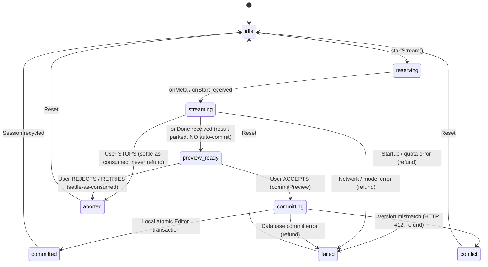

# AI NDJSON Streaming Protocol & Session State Machine Architecture

## 1. Overview & Architectural Objectives

This specification details the end-to-end NDJSON (Newline-Delimited JSON) Streaming Protocol, finite state machine (FSM), and adversarial hardening layer connecting:
- **Server Stream Handler**: `src/app/api/ai/stream/route.ts`
- **Client Protocol Parser**: `src/lib/ai/stream-handler.ts`
- **Session State Machine & Integrity**: `src/lib/ai/stream-session.ts`
- **Ephemeral Preview & Editor Plugin**: `src/lib/ai/preview-buffer.ts` & `src/components/editor/markdown/streaming-ghost.ts`
- **React Consumer Hook**: `src/hooks/use-ai-stream.ts`

### Architectural Guarantees
1. **Zero Document Model Mutation During Streaming**: Chunks stream exclusively into `EphemeralPreviewBuffer` and UI preview overlays. Neither document source state nor IndexedDB storage is modified until atomic commit.
2. **Deterministic Single-Phase Commit**: Atomic server and local transaction commits occur strictly on stream completion.
3. **Atomic Quota Reservation & Idempotent Settlement**: Automatic quota refunds occur on startup errors, pre-TTFT disconnects (`ttftMs === null`), or version conflicts. Post-TTFT disconnects (`ttftMs !== null`) and user-initiated stops (`stopStream`) or rejections settle quota as consumed without refund under the Dual-Side Inversion Protocol (TD-05 & Explicit Settlement Policy §4-D).
4. **Multi-Byte UTF-8 & Line Boundary Preservation**: Resilient stream parsing protects against chunk slicing, surrogate splits, and network fragmentation.
5. **Adversarial Resilience**: Line buffer flooding guards (`MAX_LINE_BUFFER_CHARS = 256KB`), payload ceiling guards (`MAX_INPUT_CHARS = 100,000`), DOM XSS immunity, and dynamic position tracking.

---

## 2. NDJSON Message Framing Specification

Every message transmitted over the `/api/ai/stream` endpoint conforms to single-line JSON terminated by `\n` (`Content-Type: application/x-ndjson; charset=utf-8`).

### 2.1 Event Schema Definitions

| Event Type | Framing Schema | Description |
| :--- | :--- | :--- |
| `start` / `meta` | `{"type":"start","sessionId":"...","operationId":"...","reservationId":"...","correlationId":"..."}` | Handshake frame containing non-sensitive session identifiers and correlation ID before stream begins. |
| `chunk` / `delta` | `{"type":"chunk","text":"..."}` | Incremental delta text output generated by AI model. |
| `done` | `{"type":"done"}` | Terminal completion marker signaling clean model EOF. |
| `error` | `{"type":"error","code":"STREAM_INTERRUPTED","message":"...","retryable":true,"operationId":"...","correlationId":"..."}` | Mid-stream error frame encapsulating provider failure without abrupt socket drop, bound to correlation ID. |
| `cancelled` | `{"type":"cancelled","reason":"Client aborted connection","correlationId":"..."}` | Terminal cancellation frame emitted when client aborts. |

### 2.2 Header & Transport Requirements
- `Content-Type`: `application/x-ndjson; charset=utf-8`
- `Cache-Control`: `no-cache, no-transform, no-store, must-revalidate`
- `Connection`: `keep-alive`
- `X-Content-Type-Options`: `nosniff`
- `X-Accel-Buffering`: `no` (disables reverse-proxy buffering in Nginx/Vercel)
- `X-Correlation-ID`: Authoritative request correlation identifier (UUID v4) for distributed tracing
- `X-RateLimit-Limit`, `X-RateLimit-Remaining`, `X-RateLimit-Reset`: Rate limiter headers (`aiStreamRateLimiter`: 30 req/60s)

---

## 3. Session Finite State Machine (FSM)

The streaming session lifecycle follows a strict finite state machine governed in `src/lib/ai/stream-session.ts`:



### 3.0 Explicit Decision Model & Unified Inline Widget (v1.14.0)

Stream completion (`onDone`) does **not** commit anything. The validated Markdown output is parked
in `pendingPreviewRef` while the session rests in `preview_ready`. All decision controls are unified
and embedded directly inside the inline `CMStreamingGhostWidget` at the document mutation coordinates:

- **Accept (`commitPreview`)** — `preview_ready -> committing`: server-first atomic commit
  (`commitAIFileOperation`) followed by one atomic Editor transaction replacing the dynamically tracked range `[from, to]` via `EditorAdapter.replaceRange`.
- **Reject (`rejectPreview`)** — `preview_ready -> aborted`: ephemeral preview dismantled, document untouched,
  reservation settled as consumed (never refunded).
- **Retry (`retryPreview`)** — old session settled exactly like a rejection, then a brand-new
  `startStream` runs with identical inputs (fresh quota reservation).
- **Stop Generation (`stopStream`)** — `streaming -> aborted`: user halts in-flight streaming directly from the inline card with instant (< 50ms) client abort and ghost teardown, while the server autonomously commits post-TTFT token consumption in the background.

The legacy top fixed preview panel has been completely eliminated in favor of this single, cohesive inline interactive card.
Quota rule of thumb: **system failures refund; user decisions settle-as-consumed.**
See [`ai-quota-reservation-lifecycle.md`](./ai-quota-reservation-lifecycle.md) §4-D for the full settlement matrix.

### 3.1 Allowed State Transition Matrix

```typescript
const ALLOWED_TRANSITIONS: Record<AIStreamStatus, AIStreamStatus[]> = {
    idle: ["reserving", "reserved", "failed", "aborted"],
    reserving: ["streaming", "aborting", "aborted", "failed", "conflict", "rolled_back"],
    reserved: ["streaming", "aborting", "aborted", "failed", "conflict", "rolled_back"],
    streaming: ["preview_ready", "completed", "aborting", "aborted", "failed", "conflict", "rolled_back"],
    preview_ready: ["committing", "aborting", "aborted", "failed", "conflict", "rolled_back"],
    completed: ["committing", "aborting", "aborted", "failed", "conflict", "rolled_back"],
    committing: ["committed", "failed", "conflict", "rolled_back"],
    committed: ["idle"],
    aborting: ["aborted", "conflict", "rolled_back", "failed"],
    aborted: ["idle"],
    failed: ["idle"],
    conflict: ["idle"],
    rolled_back: ["idle"],
};
```

---

## 4. Adversarial Edge Cases & Production Hardening

### 4.1 Unbounded Line Buffer Flooding (`MAX_LINE_BUFFER_CHARS`)
- **Risk**: Upstream proxy or malformed source streaming megabytes of text without a newline (`\n`), causing unbounded `lineBuffer` expansion and browser Heap Out-Of-Memory (OOM).
- **Protection**: `stream-handler.ts` enforces `MAX_LINE_BUFFER_CHARS = 256 * 1024` (256KB). If buffer length exceeds ceiling without `\n`, it terminates the stream with `stream_buffer_overflow` and releases reader locks.

### 4.2 Collision-Aware Dynamic Selection Range Mapping (`codeMirrorStreamingGhostField`)
- **Risk**: User typing elsewhere in the document during streaming causing position drift between original selection bounds and actual document coordinates at commit time, or user editing directly into the generation slice causing text corruption.
- **Protection**: `codeMirrorStreamingGhostField` inspects every transaction via `tr.changes.iterChanges`:
  - **Non-colliding edits** (edits occurring outside `[from, to]`): dynamically shift the ghost preview decoration and queryable range via `tr.changes.mapPos(from, 1)` and `mapPos(to, -1)`, allowing the user to type elsewhere in the document without aborting AI generation.
  - **Colliding edits** (direct mutations overlapping the target range): dismiss the ghost decoration and trigger `onStop()` to safely abort generation and prevent document corruption.

### 4.3 High-Frequency Streaming Performance (`updateDOM` at 60fps)
- **Risk**: High-speed token stream (50+ tokens/sec) causing DOM destruction and recreation on every chunk, leading to layout thrashing and stutter.
- **Protection**: `CMStreamingGhostWidget` implements `updateDOM(dom)` to update the live preview text node and action states in-place, achieving 60fps render stability.

### 4.4 Payload Validation & Size Ceiling (`MAX_INPUT_CHARS`)
- **Risk**: Massive payloads or non-string inputs causing high CPU regex evaluation during word counting and quota reservation.
- **Protection**: `route.ts` validates payload types (`typeof text === 'string'`) and enforces `MAX_INPUT_CHARS = 100_000` returning clean `400 Bad Request`.

### 4.5 Non-Abortable Committing State Guard
- **Risk**: User clicking Cancel while `commitAIFileOperation` is in-flight on the server database, leading to server-commit success but client-side rollback (causing version desynchronization and HTTP 412 conflicts).
- **Protection**: `stopStream()` strictly locks and suppresses cancellations once the session enters `committing` state.

### 4.6 DOM XSS Immunity in Ghost Widget
- **Risk**: Dynamic operation names interpolated into `innerHTML` leading to DOM injection.
- **Protection**: `CMStreamingGhostWidget` builds widget header nodes and buttons exclusively via DOM APIs (`document.createElement`, `textContent`) and sanitized SVG nodes with strict event isolation (`ignoreEvent: () => true`).

### 4.7 Single Terminal Callback Guarantee
- **Risk**: Concurrent abort and reader cancellation exceptions causing `onError` or `onComplete` to fire multiple times.
- **Protection**: `stream-handler.ts` employs `isTerminalCallbackEmitted` ensuring strictly one terminal callback invocation per session.

### 4.8 Zero-Knowledge AI Gatekeeper & User Privacy Opt-In (`allowAIOnEncryptedFiles`)
- **Risk**: Automated or accidental invocation of external AI models on end-to-end encrypted files, breaching Zero-Knowledge guarantees and leaking private plaintext.
- **Protection**:
  - **Server Route Gatekeeper (`/api/ai/stream`)**: When `targetFile.isEncrypted === true`, checks `userVaultProfiles.allowAIOnEncryptedFiles`. If `false` (default) or profile missing: immediately rejects with HTTP 403 `AI_PROHIBITED_ON_ENCRYPTED_FILES` prior to token consumption or quota reservation.
  - **Strict Transport Isolation**: When user explicitly opts in, decrypted plaintext in browser RAM is streamed over TLS directly to the AI provider without server persistence.
  - **Re-Encryption on Commit**: `commitAIFileOperation` strictly rejects plaintext commits to encrypted files if `encryptionMetadata.iv` is omitted. The editor orchestrator re-encrypts generated Markdown in browser RAM with the Master Key before committing over the network.
  - **UI Shield Badge**: `AIToolbar` renders an amber privacy badge (`data-testid="ai-encrypted-badge"`) disabling AI actions when opting in is disabled on encrypted files.

### 4.9 Information Disclosure Prevention & Graceful Overload Handling (Phase 17 & v1.31.3)
- **Risk**: Unhandled database, network, or provider driver exceptions propagating raw error strings (`detail`) containing database connection strings, credentials, or internal file paths to the user interface, or failing to inform clients when AI capacity is overloaded.
- **Protection**:
  - **Graceful Upstream Overload Handling (HTTP 503)**: When all primary and fallback AI models are exhausted or overloaded (e.g., Google GenAI 503 / `UNAVAILABLE`), the route returns `HTTP 503 Service Unavailable` with a `Retry-After: 30` header and a clear user-facing guidance message (`"AI service is temporarily unavailable due to high demand. Please retry in a few moments."`), preserving client trust without leaking internal traces.
  - **Sanitized Client 500 Response**: Generic unhandled route exceptions return a safe generic string (`"An unexpected error occurred while processing your request. Please try again."`) with the `X-Correlation-ID` header.
  - **Sanitized Server Telemetry**: Raw exception messages are sanitized with `sanitizeLogMessage(detail)` before structured `console.info` emission, ensuring prompt text and API credentials never reach logs.

---

## 5. Verification & Test Evidence

The implementation is verified with automated tests covering all parser, FSM, and adversarial edge cases:
- `src/test/ai/ai-stream-parser.test.ts`: 9 tests covering NDJSON framing, multi-byte UTF-8, incomplete EOF (`failed_incomplete_stream`), duplicate `done`, unknown frames, buffer overflow (`stream_buffer_overflow`), and signal aborts.
- `src/test/ai/ai-stream-session.test.ts`: 12 tests covering canonical FSM lifecycle, terminal state identification, illegal transitions, generation/version mismatch assertions, conflict rollback, and preview buffer boundaries.
- `src/test/ai/ai-client.test.ts`: 11 tests covering multi-tier cascading fallback hierarchy (`getModelHierarchy`), in-flight model failover on 503 overload, and HTTP 503 service unavailable response generation with `Retry-After: 30`.
- `src/test/vault/vault-sync-ai-gate.test.ts`: 28 tests verifying Zero-Knowledge AI route rejection, atomic commit re-encryption guard, user vault setting updates, syntax validator, non-blocking sync conflict isolation, and adversarial multi-device edge cases.
- `src/test/infrastructure/rate-limit.test.ts`: 7 tests verifying `aiStreamRateLimiter` sliding window, fail-open degradation, and `Retry-After >= 1`.
- `src/test/auth/correlation.test.ts`: 5 tests verifying correlation ID generation, CRLF sanitization, and header injection.
- `src/test/ai/ai-stream-abort-latency.test.ts`: 2 tests verifying zero-latency client stop execution (< 50ms) and server-side disconnect settlement invariants.

---

## 6. Architectural Decisions & Protocol Trade-offs

### Decision TR-08: Custom NDJSON over ReadableStream vs. Server-Sent Events (SSE) vs. WebSockets

- **Context:** Streaming real-time AI linguistic edits (token-by-token deltas) from Google Gemini LLM via Next.js Route Handlers to CodeMirror 6 inline ghost widgets.
- **Chosen Architecture:** Custom line-delimited JSON (NDJSON) over standard HTTP/2 `ReadableStream` (`fetch` body stream).
- **Rejected Alternatives:**
  1. **Server-Sent Events (`text/event-stream` / EventSource):** Standard browser SSE API.
  2. **WebSockets (`ws://` / `wss://`):** Persistent full-duplex TCP socket connections.
- **Trade-off Analysis:**
  | Evaluation Criteria | Chosen Solution (NDJSON / Fetch) | Alternative #1 (SSE / EventSource) | Alternative #2 (WebSockets) |
  | :--- | :--- | :--- | :--- |
  | **Serverless & Edge Affinity** | **Native**: Direct Next.js App Router Route Handler response streaming; zero socket server infrastructure. | **Moderate**: Requires specialized buffering headers (`X-Accel-Buffering: no`). | **Poor**: Serverless lambda runtimes cannot sustain persistent long-lived TCP state. |
  | **Custom Request Headers** | **Full Support**: Transmits standard `Authorization: Bearer`, custom correlation IDs, and CSRF tokens. | **Severely Restricted**: Native browser `EventSource` cannot send custom HTTP authorization headers. | **Moderate**: Initial handshake only; requires subprotocol workarounds for headers. |
  | **Connection Pool Limits** | **Multiplexed**: Operates over multiplexed HTTP/2 or HTTP/3 connections. | **Vulnerable**: Under HTTP/1.1, browsers enforce a strict limit of 6 open SSE connections per domain. | **Resource-Intensive**: Each socket holds a persistent port/descriptor. |
  | **Cancellation & Abort** | **Instant**: Direct `AbortController.abort()` cleanly severs the socket and triggers server-side cleanup. | **Moderate**: Requires explicit `.close()` call on EventSource instance. | **Heavy**: Custom application-level heartbeat and disconnect framing. |

- **Migration Trigger (When to Switch to WebSockets):**
  Migrating AI streaming to WebSockets is triggered **if the application introduces bidirectional interactive multi-modal AI sessions** (e.g., continuous live audio dictation or video frame streaming alongside generation), where client-to-server data must be pushed continuously into the active LLM context without round-trip HTTP overhead.


