# TipTap Editor, Auto-Save & Sync Orchestration Architecture

**Phase ID:** Phase 9 / Gate G9
**Status:** CLOSED · Amended in v1.5.0 with the Local-First Reconciliation policy
(Section 6a) and the AI streaming programmatic-transaction guard (Section 6b);
amended again post-Phase-11 with the Hydration Lifecycle, the closed cold-start
decision matrix and the offline-first contract (Sections 6a2 / 6c)
**Authoritative Module:** `src/hooks/use-editor-orchestrator.ts`
**Consuming Page:** `src/app/workspace/editor/[fileId]/page.tsx`

---

## 1. Executive Summary & Objective

In multi-channel editing environments (combining human typing, AI streaming generation, background offline/online synchronization, and cross-tab broadcasts), uncoordinated write operations cause race conditions, version overwrites, ghost preview corruptions, and invalid precondition states.

Phase 9 unifies all manual editing, AI streaming and atomic commit, auto-save debounce timers, IndexedDB caching, and conflict resolution into a single centralized **Editor Write & Sync Controller** (`useEditorOrchestrator`), establishing strict state isolation and write gating.

---

## 2. Six Separated State Slices

The orchestrator decomposes page state into 6 isolated, deterministic state slices:

| State Slice | Responsibilities & Invariants |
| :--- | :--- |
| **1. Document State** | Document content (HTML) and document title. Protected against silent race overwrites. |
| **2. Preview State** | Ephemeral AI streaming preview buffer, operation type, active tokens, and finite session status (`idle`, `reserving`, `reserved`, `streaming`, `preview_ready`, `committing`, `committed`, `aborted`, `failed`, `conflict`). |
| **3. Dirty State** | Boolean flag tracking unsaved local changes, timestamp of last successful save, and active saving indicators. |
| **4. Server Version** | Authoritative server version number and ETag precondition anchor received from PostgreSQL / Supabase. |
| **5. Conflict State** | Active `SyncConflict` descriptor, modal visibility toggle, resolution strategy payload, and in-flight resolution locks. |
| **6. Write State** | Mutex controller tracking the active writing channel (`idle`, `saving`, `ai_committing`, `resolving_conflict`, `syncing`, `stopped`). |
| **7. Hydration State** | Initial-load lifecycle for the mounted file (`hydrating`, `ready`, `fatal`). While not `ready` the TipTap surface is frozen (`setEditable(false)`) and every autosave/input gate short-circuits — writing before the load pipeline settles is structurally impossible. |

---

## 3. AutoSave Suspension Invariants Gate

AutoSave is strictly suspended whenever any of the following invariants evaluate to `true`:


```typescript
const canAutoSave = useCallback((): boolean => {
    if (isProgrammaticUpdateRef.current) return false;
    // SYNC-BEFORE-WRITE: nothing may autosave until the initial load
    // pipeline settled (see Section 6c).
    if (hydratedRef.current !== true) return false;
    if (aiStream.isLoading || aiStream.isStreaming || aiStream.isCommitting) return false;
    // preview_ready: a completed AI output is parked awaiting the user's
    // Accept / Reject / Retry decision — autosave must not race it.
    if (
        aiStream.status === "reserved" ||
        aiStream.status === "streaming" ||
        aiStream.status === "preview_ready" ||
        aiStream.status === "committing"
    ) {
        return false;
    }
    if (activeConflictRef.current !== null) return false;
    if (isResolvingConflictRef.current) return false;
    if (syncHook.status === "stopped") return false;
    return true;
}, [aiStream.isLoading, aiStream.isStreaming, aiStream.isCommitting, aiStream.status, syncHook.status]);
```

---

## 4. Target-Scoped Manual Edit During AI Streaming Policy

When the user types or alters text while an AI stream is actively generating:
1. **Target-Scoped Overlap Check:** The orchestrator checks whether the user's cursor / modification intersects with the active AI selection target range `[ghostState.from, ghostState.to]`:
   - **Edits Outside Target Range (e.g. Other Paragraphs):** Allowed without interruption. ProseMirror's `tr.mapping` automatically maps and shifts the ghost preview coordinates forward/backward, and the AI streaming continues smoothly.
   - **Edits Inside Target Range:** If the user alters text inside the paragraph/selection being actively generated or modified:
     1. **Instant Abort:** The orchestrator signals the active `AbortController` in `useAIStream`.
     2. **Quota Settlement (Explicit Settlement Policy):** Overwriting the AI target range is a *user decision*, so the reservation is settled as consumed via `commitAIReservation` (`stopStream` settles before aborting) — it is NOT refunded. See [`ai-quota-reservation-lifecycle.md`](./ai-quota-reservation-lifecycle.md) §4-D.
     3. **Ghost Dismantled:** TipTap's `StreamingGhostExtension` decoration is immediately removed, leaving the underlying ProseMirror document model pristine.
     4. **Editor Generation Advance:** `editorGenerationRef` increments, preventing any stale in-flight AI chunks or delayed commit responses from applying to the altered document.
     5. **Debounced AutoSave:** The user's manual modification proceeds cleanly without silent corrupt merges.

---

## 5. Single-Action Atomic Undo (Ctrl+Z)

Local application of committed AI results executes as a single, indivisible ProseMirror transaction:

```typescript
editor.chain()
    .setTextSelection({ from: targetFrom, to: targetTo })
    .deleteSelection()
    .insertContent(safeHtml)
    .run();
```

- **Invariant:** Pressing `Ctrl+Z` reverses the entire AI change back to the pre-operation document snapshot in one history step, rather than undoing individual streamed chunks.

---

## 6. Sibling Tab & Navigation Invariants

- **Clean Tab Sync:** Sibling tab save broadcasts (`file_saved`) advance the local `serverVersion` reference if the local document is clean (`isDirty: false`).
- **Dirty Tab Optimistic Lock:** If the local tab is dirty or has an active conflict, external version advances are suppressed, ensuring that subsequent local saves condition against the local base version and trigger a 412 Conflict modal instead of silently overwriting sibling changes.
- **Navigation Guard:** `window.onbeforeunload` triggers if `isDirty`, `isSaving`, `isCommitting`, **or an undecided AI preview is parked (`preview_ready`)** — abandoning an undecided preview silently consumes quota (Explicit Settlement Policy), so navigation must be acknowledged. A TRANSPORT failure during the initial load never freezes the editor (offline-first, Section 6c); only a server-ANSWERED missing-file response with no local snapshot and no eager edits is fatal.

---

## 6a. Initial Load & Local-First Reconciliation (v1.5.0 Amendment)

### 6a.1 Problem Statement

The initial load pipeline previously re-executed on **every render**: the inline
`onNavigate: (path) => router.push(path)` arrow produced a fresh dependency identity per
render cycle, and the effect dependencies included it. Each re-execution performed a full
`getFile()` round-trip and force-applied the server payload via `setContent()` whenever it
differed from the live document. While background sync was running, this visibly wiped
in-progress typing; the text reappeared only after the next sync cycle restored it.
Beyond the lifecycle bug, the decision rule itself was wrong: a raw content inequality
between editor HTML and server HTML cannot distinguish a legitimate remote advance from a
divergent history or from unsaved local work.

### 6a.2 Deterministic Decision Matrix (`src/lib/sync/reconciliation.ts`)

`classifyRemoteUpdate(params)` is a pure function over a **closed five-action matrix**.
The caller passes the REAL captured baseline — `localBaseline: LocalBaseline | null`
(last-synced `version` / `etag` / sanitized `content`) or `null` when no IndexedDB
snapshot exists (cold start). Fabricating a baseline is forbidden: a lost local record
must never masquerade as `v1/null` and poison the comparison. Freshness is decided by
the per-file MONOTONIC server version counter corroborated by an effective ETag change
(normalized weak validators `W/` and quotes stripped) — wall-clock timestamps play no
role.

| # | Action | Reason Code | Preconditions & Effect |
|---|--------|-------------|------------------------|
| 0a | `bootstrap_server` | `no_local_baseline_clean` | **Cold start, clean editor.** No baseline exists to reconcile against — the server document is the ONLY truth. Painted verbatim under the programmatic guard and persisted as a clean local baseline so the next open has a real ancestor. This closes the owner-reported defect where a locally-lost file sitting at server v1 stayed empty with a red save dot forever. |
| 0b | `adopt_metadata_keep_edits` | `no_local_baseline_eager` | **Cold start with eager in-flight edits** typed while the fetch was in flight: ONLY the version/ETag anchors are adopted; the user's unsaved text is sacred and kept dirty (never wiped, never persisted over). |
| A | `apply` (Fast-Forward) | `fast_forward_clean` | Baseline present, local **clean**, remote verified-newer: `remoteVersion > localVersion` AND effective ETags differ. Because a clean snapshot *is* the last-synced ancestor, any strictly newer revision is by construction built on top of it. Editor receives `setContent(sanitizedRemote)` under the programmatic guard; IndexedDB + anchors advance; `markServerPersisted(updatedAt)` turns the save dot green. |
| B | `adopt_metadata` | `identical_content_metadata_drift` | Contents byte-identical; only `version`/`etag` drifted. Anchors adopted silently; document and user untouched; save dot green (the server already persists this payload). |
| C | `keep_local` | `dirty_local_divergent` \| `remote_not_newer` | Dirty divergence over a superseded base, or the remote is not ahead of local (equal/regressed version, or version bumped without an ETag change). Local truth keeps rendering; anchors intentionally NOT advanced so the next optimistic write surfaces a genuine `412 Precondition Failed` routing into the explicit three-way conflict flow (`ConflictDialog`) instead of silent loss. |

### 6a.3 Invariants

1. **No silent overwrite of unsaved work.** Dirty local state can never be replaced by a
   remote payload through this policy; divergence is escalated via optimistic locking.
2. **The baseline is never fabricated.** With no local snapshot the matrix routes to
   `bootstrap_server` / `adopt_metadata_keep_edits`; classification over invented anchors
   (v1/null) is structurally unreachable.
3. **ETag change is mandatory for advancement.** A version bump without an ETag mutation is
   treated as non-newer to guard against metadata-only churn.
4. **Programmatic containment.** Every `apply` writes through `isProgrammaticUpdateRef`,
   so TipTap's `update` event never misclassifies the reconciliation write as a manual edit
   (no spurious autosave, no spurious generation bump).
5. **Single-flight per file identity.** The initial load pipeline is keyed on file identity
   via `loadedFileIdRef` with unmount cancellation guards (`cancelled = true`), ensuring
   seamless file switching without re-triggering redundant fetches or leaking post-unmount
   state updates.

### 6a.4 Reconciliation Flow

```mermaid
sequenceDiagram
    autonumber
    participant E as Editor (TipTap)
    participant O as Orchestrator
    participant R as classifyRemoteUpdate
    participant S as Server API
    participant I as IndexedDB

    O->>I: loadLocal(fileId) [instant paint; captures REAL baseline or null]
    O->>S: getFile(fileId) [background]
    S-->>O: { content, version, etag, updatedAt }
    O->>R: classify(baseline ?? null, isDirty, remoteState)
    alt baseline = null AND clean (cold start)
        R-->>O: no_local_baseline_clean
        O->>E: setContent(sanitizedRemote) [bootstrap_server]
        O->>I: saveLocal(isDirty: false) [clean ancestor persisted]
        Note over O: markServerPersisted -> save dot GREEN
    else baseline = null AND eager edits (cold start)
        R-->>O: no_local_baseline_eager
        Note over O: adopt anchors ONLY; eager text kept dirty
    else action = apply (clean + verified-newer)
        R-->>O: fast_forward_clean
        O->>E: setContent(sanitizedRemote) [programmatic guard]
        O->>I: saveLocal(isDirty: false)
        Note over O: anchors advanced; markServerPersisted
    else action = adopt_metadata (identical payload)
        R-->>O: identical_content_metadata_drift
        Note over O: adopt version/ETag anchors only; markServerPersisted
    else action = keep_local (dirty / not-newer)
        R-->>O: retain local truth
        Note over O: anchors unchanged; next write yields real 412 -> ConflictDialog
    end
```

### 6a.5 Verification

| Suite | Coverage |
|-------|----------|
| `src/lib/sync/reconciliation.test.ts` (10 tests) | Closed matrix incl. cold-start rows (`bootstrap_server`, `adopt_metadata_keep_edits`); fast-forward on clean+newer; metadata adoption on identical payloads (precedence over dirty); dirty-divergent retention; non-newer retention (equal version, regressed version, version-without-ETag); weak-validator normalization (`W/`, quotes) derived from the REAL baseline |
| `src/test/editor-orchestration.integration.test.ts` (15 tests) | Orchestrator integration vs mocked `fileOps`: suspension gates, committing exclusivity, unload warnings (dirty / committing / parked preview), PLUS cold-start painting of a server-v1 file with a lost local snapshot, and sync-before-write anchor ordering |

---

## 6b. AI Streaming Programmatic Transaction Guard (v1.5.0 Amendment)

Every document mutation performed by `useAIStream` — the atomic AI commit transaction, the
conflict rollback (`setContent(originalHtml)`), and the exception rollback — is routed
through the new `UseAIStreamOptions.onProgrammaticTransaction` hook. The orchestrator
raises `isProgrammaticUpdateRef` around it, so TipTap's `update` event can no longer
classify these writes as manual edits.

**Defect closed:** previously the post-commit ProseMirror transaction fired
`handleEditorChange`, marking the freshly committed document dirty and scheduling a
redundant debounced server write with a racing `expectedVersion` immediately after a
successful AI commit.

---

## 6c. Hydration Lifecycle & Offline-First Contract (Phase 11 amendment)

The mounted file goes through an explicit three-state lifecycle owned by the orchestrator:

```mermaid
stateDiagram-v2
    [*] --> hydrating : mount / fileId change
    hydrating --> ready : pipeline settled with usable content or anchors
    hydrating --> fatal : server ANSWERED missing-file AND no local snapshot AND no eager edits
    ready --> [*] : unmount
    fatal --> [*] : unmount (error surfaced; editor stays frozen)
```



Invariants:

1. **Sync-before-write is structural.** The TipTap surface starts frozen
   (`editor.setEditable(false)`) and is released only on `ready`. Input events are
   additionally dropped in `handleEditorChange`, and `executeServerWrite` defers while
   `hydrating` — three layers, one source of truth (`hydration`).
2. **Transport failure is NEVER fatal.** If `getFile` cannot be reached, the pipeline still
   settles `ready`: offline-first lets the user compose locally, every autosave attempt
   honestly targets the server and, on failure, persists durable **dirty IndexedDB
   snapshots** for later reconciliation through the normal optimistic-locking path.
3. **Fatal requires a server ANSWER.** Only a responded missing-file result with no local
   snapshot and no eager edits freezes permanently, with an Arabic error banner.
4. **Green save dot = server truth.** `markServerPersisted(serverUpdatedAt)` fires on
   `bootstrap_server`, `apply`, and genuine `adopt_metadata`; eager-cold adoption leaves
   the dot red while user text remains dirty.
5. **Hard-reload recovery.** A sessionStorage registry
   (`src/lib/ai/pending-operation-store.ts`) tracks pending AI operations (ids + phase
   only). On next mount, orphaned records are settled against
   `getAIReservationStatus(operationId)` (`src/server/actions/ai-ops.ts`, session-derived
   and ownership-filtered): completed previews consume quota idempotently, lost
   generations refund as `reload_recovery`; the abandoned preview is NEVER applied to
   the document nor treated as committed. See
   [`reference/phase-11-editor-orchestration-closure.md`](../reference/phase-11-editor-orchestration-closure.md).
6. **UI layer integration (`page.tsx`).** During `hydrating` on an empty document, an animated
   backdrop overlay (`Loader2`) informs the user of active synchronization. When `fatal`,
   a dedicated error recovery card is presented with a direct action to return to `/workspace`.
   The status bar reflects `Syncing...` while hydration is active.

---

## 7. Verification Proof

- Automated Tests (current):
  - `src/test/editor-orchestration.integration.test.ts` (15/15 passing)
  - `src/test/editor-recovery-reload.test.ts` (5/5 passing)
  - `src/test/editor-atomic-commit.test.ts` (4/4 passing)
  - `src/lib/sync/reconciliation.test.ts` (10/10 passing)
  - `src/hooks/use-sync.test.ts` (13/13 passing)
  - LIVE bucket (isolated Neon branch, `npm run test:live`):
    `src/test/editor-orchestration.live.test.ts`,
    `src/test/conflict-resolution.integration.test.ts`,
    `src/test/ai-reservation-status.live.test.ts` — all green on
    `ep-soft-glade-b1hdcbwm-pooler`.
