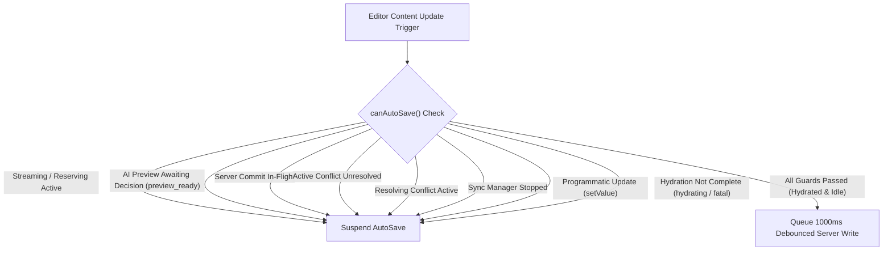

# Editor, Auto-Save & Sync Orchestration Architecture

**Phase ID:** Phase 9 / Gate G9
**Status:** CLOSED · Amended in v1.5.0 with the Local-First Reconciliation policy
(Section 6a) and the AI streaming programmatic-transaction guard (Section 6b);
amended post-Phase-11 with the Hydration Lifecycle, the closed cold-start
decision matrix and the offline-first contract (Sections 6a2 / 6c);
amended in Markdown Migration Phase 2 & 3 with the standalone MarkdownEditor
and engine-agnostic `EditorAdapter` contract;
amended in Vault Phase 3 with Zero-Knowledge Vault gating (`vault_locked`),
pre-save Web Worker envelope encryption, and offline-first dynamic file conversion (Section 6e).
**Authoritative Module:** `src/hooks/use-editor-orchestrator.ts`
**Consuming Page:** `src/app/workspace/editor/[fileId]/page.tsx`

---

## 1. Executive Summary & Objective

In multi-channel editing environments (combining human typing, AI streaming generation, background offline/online synchronization, and cross-tab broadcasts), uncoordinated write operations cause race conditions, version overwrites, ghost preview corruptions, and invalid precondition states.

Phase 9 unifies all manual editing, AI streaming and atomic commit, auto-save debounce timers, IndexedDB caching, and conflict resolution into a single centralized **Editor Write & Sync Controller** (`useEditorOrchestrator`), establishing strict state isolation and write gating.

---

## 2. Seven Separated State Slices

The orchestrator decomposes page state into 7 isolated, deterministic state slices:

| State Slice | Responsibilities & Invariants |
| :--- | :--- |
| **1. Document State** | Document content (`MarkdownSource` - normalized UTF-8 Markdown text) and document title. Protected against silent race overwrites. |
| **2. Preview State** | Ephemeral AI streaming preview buffer, operation type, active tokens, and finite session status (`idle`, `reserving`, `reserved`, `streaming`, `preview_ready`, `committing`, `committed`, `aborted`, `failed`, `conflict`). |
| **3. Dirty State** | Boolean flag tracking unsaved local changes, timestamp of last successful save, and active saving indicators. |
| **4. Server Version** | Authoritative server version number and ETag precondition anchor received from PostgreSQL. |
| **5. Conflict State** | Active `SyncConflict` descriptor, modal visibility toggle, resolution strategy payload, and in-flight resolution locks. |
| **6. Write State** | Mutex controller tracking the active writing channel (`idle`, `saving`, `ai_committing`, `resolving_conflict`, `syncing`, `stopped`). |
| **7. Hydration State** | Initial-load lifecycle for the mounted file (`hydrating`, `ready`, `vault_locked`, `fatal`). While not `ready` the editor surface is frozen (`adapter.setEditable(false)`) and every autosave/input gate short-circuits — writing before the load pipeline settles is structurally impossible. When encountering an encrypted file without the Master Key present in memory, hydration settles on `vault_locked` to suspend painting and prompt the user for vault authentication. |

---

## 3. AutoSave Suspension Invariants Gate

AutoSave is strictly suspended whenever any of the following invariants evaluate to `true`:



```typescript
const canAutoSave = useCallback((): boolean => {
    if (isProgrammaticUpdateRef.current) return false;
    // SYNC-BEFORE-WRITE: nothing may autosave until the initial load
    // pipeline settled (see Section 6c).
    if (hydratedRef.current !== true) return false;
    if (aiStream.isLoading || aiStream.isStreaming || aiStream.isCommitting) return false;
    // preview_ready: a completed AI output is parked awaiting the user's
    // Accept / Reject / Retry decision — autosave must not race it.
    if (
        aiStream.status === "reserved" ||
        aiStream.status === "streaming" ||
        aiStream.status === "preview_ready" ||
        aiStream.status === "committing"
    ) {
        return false;
    }
    if (activeConflictRef.current !== null) return false;
    if (isResolvingConflictRef.current) return false;
    if (syncHook.status === "stopped") return false;
    return true;
}, [aiStream.isLoading, aiStream.isStreaming, aiStream.isCommitting, aiStream.status, syncHook.status]);
```

---

## 4. Manual Edit During AI Streaming Policy

When the user types or modifies text while an AI stream or generation is active:
1. **Instant Abort:** The orchestrator detects manual changes via `handleEditorChange` and immediately aborts the active stream via `aiStream.stopStream()`.
2. **Quota Settlement (Explicit Settlement Policy):** Stopping an active generation is a *user decision*, so the reservation is settled as consumed via `commitAIReservation` (`stopStream` settles before aborting) — it is NOT refunded. See [`ai-quota-reservation-lifecycle.md`](./ai-quota-reservation-lifecycle.md) §4-D.
3. **Editor Generation Advance:** `editorGenerationRef` increments immediately, preventing any stale in-flight AI chunks or delayed commit responses from applying to the altered document.
4. **Debounced AutoSave:** The user's manual modification proceeds cleanly without silent corrupt merges.

---

## 5. Single-Action Atomic Undo (Ctrl+Z)

Local application of committed AI results executes as a single, indivisible transaction via the editor adapter:

```typescript
adapter.replaceRange(selectionStart, selectionEnd, previewText);
```

- **Invariant:** Pressing `Ctrl+Z` reverses the entire AI change back to the pre-operation document snapshot in one history step, rather than undoing individual streamed chunks.

---

## 6. Sibling Tab & Navigation Invariants

- **Clean Tab Sync:** Sibling tab save broadcasts (`file_saved`) advance the local `serverVersion` reference if the local document is clean (`isDirty: false`).
- **Dirty Tab Optimistic Lock:** If the local tab is dirty or has an active conflict, external version advances are suppressed, ensuring that subsequent local saves condition against the local base version and trigger a 412 Conflict modal instead of silently overwriting sibling changes.
- **Navigation Guard:** `window.onbeforeunload` triggers if `isDirty`, `isSaving`, `isCommitting`, **or an undecided AI preview is parked (`preview_ready`)** — abandoning an undecided preview silently consumes quota (Explicit Settlement Policy), so navigation must be acknowledged. A TRANSPORT failure during the initial load never freezes the editor (offline-first, Section 6c); only a server-ANSWERED missing-file response with no local snapshot and no eager edits is fatal.

---

## 6a. Initial Load & Local-First Reconciliation (v1.5.0 Amendment)

### 6a.1 Problem Statement

The initial load pipeline previously re-executed on **every render**: the inline
`onNavigate: (path) => router.push(path)` arrow produced a fresh dependency identity per
render cycle, and the effect dependencies included it. Each re-execution performed a full
`getFile()` round-trip and force-applied the server payload via `setContent()` whenever it
differed from the live document. While background sync was running, this visibly wiped
in-progress typing; the text reappeared only after the next sync cycle restored it.
Beyond the lifecycle bug, the decision rule itself was wrong: a raw content inequality
between editor Markdown and server Markdown cannot distinguish a legitimate remote advance from a
divergent history or from unsaved local work.

### 6a.2 Deterministic Decision Matrix (`src/lib/sync/reconciliation.ts`)

`classifyRemoteUpdate(params)` is a pure function over a **closed five-action matrix**.
The caller passes the REAL captured baseline — `localBaseline: LocalBaseline | null`
(last-synced `version` / `etag` / sanitized `content`) or `null` when no IndexedDB
snapshot exists (cold start). Fabricating a baseline is forbidden: a lost local record
must never masquerade as `v1/null` and poison the comparison. Freshness is decided by
the per-file MONOTONIC server version counter corroborated by an effective ETag change
(normalized weak validators `W/` and quotes stripped) — wall-clock timestamps play no
role.

| # | Action | Reason Code | Preconditions & Effect |
|---|--------|-------------|------------------------|
| 0a | `bootstrap_server` | `no_local_baseline_clean` | **Cold start, clean editor.** No baseline exists to reconcile against — the server document is the ONLY truth. Painted verbatim under the programmatic guard and persisted as a clean local baseline so the next open has a real ancestor. This closes the owner-reported defect where a locally-lost file sitting at server v1 stayed empty with a red save dot forever. |
| 0b | `adopt_metadata_keep_edits` | `no_local_baseline_eager` | **Cold start with eager in-flight edits** typed while the fetch was in flight: ONLY the version/ETag anchors are adopted; the user's unsaved text is sacred and kept dirty (never wiped, never persisted over). |
| A | `apply` (Fast-Forward) | `fast_forward_clean` | Baseline present, local **clean**, remote verified-newer: `remoteVersion > localVersion` AND effective ETags differ. Because a clean snapshot *is* the last-synced ancestor, any strictly newer revision is by construction built on top of it. Editor receives `setContent(sanitizedRemote)` under the programmatic guard; IndexedDB + anchors advance; `markServerPersisted(updatedAt)` turns the save dot green. |
| B | `adopt_metadata` | `identical_content_metadata_drift` | Contents byte-identical; only `version`/`etag` drifted. Anchors adopted silently; document and user untouched; save dot green (the server already persists this payload). |
| C | `keep_local` | `dirty_local_divergent` \| `remote_not_newer` | Dirty divergence over a superseded base, or the remote is not ahead of local (equal/regressed version, or version bumped without an ETag change). Local truth keeps rendering; anchors intentionally NOT advanced so the next optimistic write surfaces a genuine `412 Precondition Failed` routing into the explicit three-way conflict flow (`ConflictDialog`) instead of silent loss. |

### 6a.3 Invariants

1. **No silent overwrite of unsaved work.** Dirty local state can never be replaced by a
   remote payload through this policy; divergence is escalated via optimistic locking.
2. **The baseline is never fabricated.** With no local snapshot the matrix routes to
   `bootstrap_server` / `adopt_metadata_keep_edits`; classification over invented anchors
   (v1/null) is structurally unreachable.
3. **ETag change is mandatory for advancement.** A version bump without an ETag mutation is
   treated as non-newer to guard against metadata-only churn.
4. **Programmatic containment.** Every `apply` writes through `isProgrammaticUpdateRef`,
   so the editor's `onChange` event never misclassifies the reconciliation write as a manual edit
   (no spurious autosave, no spurious generation bump).
5. **Single-flight per file identity.** The initial load pipeline is keyed on file identity
   via `loadedFileIdRef` with unmount cancellation guards (`cancelled = true`), ensuring
   seamless file switching without re-triggering redundant fetches or leaking post-unmount
   state updates.

### 6a.4 Reconciliation Flow

```mermaid
sequenceDiagram
    autonumber
    participant E as Editor (MarkdownEditor / EditorAdapter)
    participant O as Orchestrator
    participant R as classifyRemoteUpdate
    participant S as Server API
    participant I as IndexedDB

    O->>I: loadLocal(fileId) [instant paint; captures REAL baseline or null]
    O->>S: getFile(fileId) [background]
    S-->>O: { content, version, etag, updatedAt }
    O->>R: classify(baseline ?? null, isDirty, remoteState)
    alt baseline = null AND clean (cold start)
        R-->>O: no_local_baseline_clean
        O->>E: setValue(sanitizedRemote) [bootstrap_server]
        O->>I: saveLocal(isDirty: false) [clean ancestor persisted]
        Note over O: markServerPersisted -> save dot GREEN
    else baseline = null AND eager edits (cold start)
        R-->>O: no_local_baseline_eager
        Note over O: adopt anchors ONLY; eager text kept dirty
    else action = apply (clean + verified-newer)
        R-->>O: fast_forward_clean
        O->>E: setValue(sanitizedRemote) [programmatic guard]
        O->>I: saveLocal(isDirty: false)
        Note over O: anchors advanced; markServerPersisted
    else action = adopt_metadata (identical payload)
        R-->>O: identical_content_metadata_drift
        Note over O: adopt version/ETag anchors only; markServerPersisted
    else action = keep_local (dirty / not-newer)
        R-->>O: retain local truth
        Note over O: anchors unchanged; next write yields real 412 -> ConflictDialog
    end
```

### 6a.5 Verification

| Suite | Coverage |
|-------|----------|
| `src/lib/sync/reconciliation.test.ts` (10 tests) | Closed matrix incl. cold-start rows (`bootstrap_server`, `adopt_metadata_keep_edits`); fast-forward on clean+newer; metadata adoption on identical payloads (precedence over dirty); dirty-divergent retention; non-newer retention (equal version, regressed version, version-without-ETag); weak-validator normalization (`W/`, quotes) derived from the REAL baseline |
| `src/test/editor-orchestration.integration.test.ts` (15 tests) | Orchestrator integration vs mocked `fileOps`: suspension gates, committing exclusivity, unload warnings (dirty / committing / parked preview), PLUS cold-start painting of a server-v1 file with a lost local snapshot, and sync-before-write anchor ordering |

---

## 6b. AI Streaming Programmatic Transaction Guard (v1.5.0 Amendment)

Every document mutation performed by `useAIStream` — the atomic AI commit transaction, the
conflict rollback (`setValue(originalMarkdown)`), and the exception rollback — is routed
through the new `UseAIStreamOptions.onProgrammaticTransaction` hook. The orchestrator
raises `isProgrammaticUpdateRef` around it, so the editor's update event can no longer
classify these writes as manual edits.

**Defect closed:** previously the post-commit transaction fired
`handleEditorChange`, marking the freshly committed document dirty and scheduling a
redundant debounced server write with a racing `expectedVersion` immediately after a
successful AI commit.

---

## 6c. Hydration Lifecycle & Offline-First Contract (Phase 11 amendment)

The mounted file goes through an explicit three-state lifecycle owned by the orchestrator:

```mermaid
stateDiagram-v2
    [*] --> hydrating : mount / fileId change
    hydrating --> ready : pipeline settled with usable content or anchors
    hydrating --> fatal : server ANSWERED missing-file AND no local snapshot AND no eager edits
    ready --> [*] : unmount
    fatal --> [*] : unmount (error surfaced; editor stays frozen)
```



Invariants:

1. **Sync-before-write is structural.** The editor surface starts frozen
   (`adapter.setEditable(false)`) and is released only on `ready`. Input events are
   additionally dropped in `handleEditorChange`, and `executeServerWrite` defers while
   `hydrating` — three layers, one source of truth (`hydration`).
2. **Transport failure is NEVER fatal.** If `getFile` cannot be reached, the pipeline still
   settles `ready`: offline-first lets the user compose locally, every autosave attempt
   honestly targets the server and, on failure, persists durable **dirty IndexedDB
   snapshots** for later reconciliation through the normal optimistic-locking path.
3. **Fatal requires a server ANSWER.** Only a responded missing-file result with no local
   snapshot and no eager edits freezes permanently, with an Arabic error banner.
4. **Green save dot = server truth.** `markServerPersisted(serverUpdatedAt)` fires on
   `bootstrap_server`, `apply`, and genuine `adopt_metadata`; eager-cold adoption leaves
   the dot red while user text remains dirty.
5. **Hard-reload recovery.** A sessionStorage registry
   (`src/lib/ai/pending-operation-store.ts`) tracks pending AI operations (ids + phase
   only). On next mount, orphaned records are settled against
   `getAIReservationStatus(operationId)` (`src/server/actions/ai-ops.ts`, session-derived
   and ownership-filtered): completed previews consume quota idempotently, lost
   generations refund as `reload_recovery`; the abandoned preview is NEVER applied to
   the document nor treated as committed. See
   [`reference/phase-11-editor-orchestration-closure.md`](../reference/phase-11-editor-orchestration-closure.md).
6. **UI layer integration (`page.tsx`).** During `hydrating` on an empty document, an animated
   backdrop overlay (`Loader2`) informs the user of active synchronization. When `fatal`,
   a dedicated error recovery card is presented with a direct action to return to `/workspace`.
   The status bar reflects `Syncing...` while hydration is active.

---

## 6d. Pure Markdown Sync, Diff3 Conflict Resolution & Syntax Integrity (Phase 4 Amendment)

In Phase 4 of the Markdown migration roadmap, all synchronization channels, conflict detection, three-way merge algorithms, and conflict dialogs were transitioned from legacy HTML parsing to pure, engine-agnostic Markdown.

### 6d.1 Remote Update Event Pipeline
1. When background sync pulls clean updates from the server via `SyncManager.pullFile()`, it dispatches typed `RemoteUpdateEvent` payloads to registered listeners.
2. `useSync` subscribes to `SyncManager.onRemoteUpdate` and forwards events to `useEditorOrchestrator.handleRemoteUpdate`.
3. `useEditorOrchestrator` runs invariant guards (verifies document is clean, no active conflict, no active AI streaming, and hydration is complete) and uses `classifyRemoteUpdate` to safely fast-forward the editor (`adapter.setValue(event.content)`) under programmatic protection without creating phantom dirty states.

### 6d.2 Markdown Structural Syntax Integrity Guard
1. Automatic Diff3 merging can textually succeed on disjoint line ranges yet produce syntactically corrupt Markdown (e.g. unclosed code fences ``` or broken GFM table delimiter rows).
2. `validateMarkdownSyntaxIntegrity(content)` inspects the merged document to guarantee balanced fenced code blocks and valid GFM table column alignments.
3. If an automatic three-way merge results in corrupted Markdown syntax, the merge is automatically rejected (`status: 'conflict_overlaps'`, `hasOverlaps: true`) and routed to the visual `ConflictDialog` for explicit manual resolution.

### 6d.3 Native Markdown Conflict Dialog
- `ConflictDialog` (`src/components/sync/conflict-dialog.tsx`) operates exclusively on raw UTF-8 Markdown text with monospace diff highlighting, eliminating legacy HTML converters (`htmlToPlainText`, `convertTextToHTML`, `sanitizeHtml`).

---

## 6e. AI Launch Auto-Save Debounce Cancellation & Live Version Resolution (Phase 5 Amendment)

To prevent race conditions where a pending debounced auto-save executes in the background while an AI stream is starting (which would advance the server version and cause a 412 conflict on user commit):

1. **Auto-Save Debounce Cancellation (`startAIOperation`):** Starting an AI operation immediately invokes `debouncedAutoSaveRef.current?.cancel?.()`, clearing any queued timers before capturing the initial version.
2. **Live Version Resolution at Commit Time:** `useAIStream` accepts `getLatestVersion` and `getLatestETag` getters connecting directly to `fileVersionRef` and `fileEtagRef`, resolving the most up-to-date local orchestrator version at the moment of commit rather than relying on a stale start snapshot.
3. **Self-Session Healing in Server Commit:** If `commitAIFileOperation` detects that the database version advanced due to an in-flight background save, but `currentFile.content` is identical to `originalContent`, the server automatically self-heals by adopting the current version without disrupting the user.

---

## 6f. Non-Colliding Manual Edit Stream Tolerance (Phase 6 Amendment)

To preserve uninterrupted user workflow when writing with AI assistance:
1. **Dynamic Shift on Non-Overlapping Edits:** When the user types or edits elsewhere in the document while an AI stream or ephemeral ghost preview is active, `codeMirrorStreamingGhostField` uses `tr.changes.mapPos(from, 1)` and `mapPos(to, -1)` to dynamically reposition the active target range `[from, to]` in CodeMirror 6.
2. **Orchestrator Manual Edit Policy (`handleEditorChange`):** When an active AI stream is running, `handleEditorChange` checks `adapter.getGhostRange()`. Because non-colliding edits dynamically preserve a valid shifted ghost range, the active stream is **not** aborted; the orchestrator flags `isDirty` without interrupting generation.
---

## 6g. Bidirectional & Text Direction Architecture (Bidi Engine Amendment)

To support multilingual and bidirectional authoring without performance regression or layout shifting:
1. **Line-Level Bidi Isolation (`bidiLinePlugin`):** CodeMirror 6 viewport virtualization creates DOM elements only for visible lines. Setting `dir="auto"` on `.cm-content` causes dynamic layout inversion when top Arabic lines are unmounted on scroll. `bidiLinePlugin` applies `Decoration.line({ attributes: { dir: "auto" } })` or `dir="rtl"` / `dir="ltr"` directly per visible line, making each line evaluate its direction independently from DOM virtualization.
2. **Explicit Direction Modes:** The orchestrator and editor support three modes:
   - `auto`: In-memory stable document base direction with per-line evaluation.
   - `rtl`: Globally enforced right-to-left layout.
   - `ltr`: Globally enforced left-to-right layout.
3. **Fenced Code Blocks LTR Locking:** When `lockCodeBlocksLTR` is enabled in `DirectionSettings`, `FencedCode` lines are locked to `dir="ltr"` and left alignment even in global RTL mode.
4. **State & Shortcut Synchronization:** `directionSettings` are synced through `directionSettingsState` (StateField), persisted in `localStorage` (`lugx_editor_direction_pref`), and wired to the global `Ctrl + Alt + D` keyboard shortcut and toolbar `DirectionMenu`.

---

## 6h. Tab Wakeup Auto-Healing & Local IndexedDB Durability Guarantee (v1.23.3 Amendment)

To prevent local data desynchronization and unhandled rejections when browser tabs are throttled or suspended during long-running background tasks (such as extended AI streaming operations):

1. **Deferred Local Persistence Flag (`pendingLocalSyncRef`):**
   - When an AI commit succeeds (`onCommitSuccess`) or an auto-save fails to persist to IndexedDB due to a temporary storage or cryptographic stall, `pendingLocalSyncRef.current` is flagged as `true`.
   - The document's dirty status is deliberately preserved (`setIsDirty(true)`), preventing silent offline divergence where the user believes changes are persisted.

2. **Tab Wakeup Auto-Healing (`visibilitychange` & `focus`):**
   - The orchestrator registers listeners for both `visibilitychange` (when document returns to `visible`) and `focus` (window gains user focus).
   - Upon wakeup, if `pendingLocalSyncRef.current` is active and the sync hook is initialized, the orchestrator triggers an automatic recovery write:
     ```typescript
     // Synchronously consume flag before await to eliminate dual-event burst race conditions
     pendingLocalSyncRef.current = false;
     try {
         await syncHookRef.current.saveLocal({
             id: fileId,
             content: adapterRef.current.getValue(),
             title,
             version: fileVersionRef.current,
             etag: fileEtagRef.current || "",
             isDirty: isDirtyRef.current,
         });
     } catch (err) {
         pendingLocalSyncRef.current = true; // Revert flag on failure for subsequent retry
     }
     ```

3. **Dual-Event Burst Race Elimination (Anti-Overengineering):**
   - In Chromium engines, switching back to a suspended tab fires both `visibilitychange` and `focus` within 1–3ms.
   - By synchronously consuming `pendingLocalSyncRef.current = false` immediately before the asynchronous `await saveLocal(...)` call, the second event finds the flag already cleared and exits immediately. This eliminates redundant cryptographic operations without requiring complex mutex lock states.

4. **Preservation of Cloud Dirtiness (Zero UI Deception):**
   - The wakeup handler strictly persists the current dirty state (`isDirty: isDirtyRef.current`) without calling `setIsDirty(false)`. Local IndexedDB persistence guarantees offline crash resilience, but clearing `isDirty` is exclusively reserved for positive server responses in `executeServerWrite`. This ensures visual save indicators and `beforeunload` navigation guards remain truthful.

---

## 6e. Zero-Knowledge Vault Integration & Dynamic File Conversion Engine (Phase 3)

The editor write and sync pipeline transparently integrates client-side end-to-end encryption with Zero-Knowledge invariants:

1. **Vault Access Gating (`vault_locked`):**
   - When mounting an encrypted file (`isEncrypted === true`), the orchestrator inspects `sessionKeyStore.hasMasterKey()`.
   - If the Master Key is absent from ephemeral RAM, `hydration` transitions to `vault_locked`. The CodeMirror editing surface remains completely unpainted and non-editable (`adapter.setEditable(false)`), preventing ciphertext leakage to the viewport, DOM, or clipboard.
   - The UI displays the locked shield view or mounts `<VaultUnlockModal />`. Upon successful password unwrap or BIP-39 mnemonic recovery, `handleVaultUnlocked(unwrappedKey)` stores the key in `sessionKeyStore`, decrypts the ciphertext envelope via `CryptoWorkerBridge`, mounts the plaintext in the editor, and transitions `hydration` to `ready`.

2. **Pre-Save Envelope Encryption (`executeServerWrite`):**
   - When saving an encrypted file (`isEncrypted === true`), `executeServerWrite` intercepts the plaintext from the editor adapter before network dispatch.
   - The plaintext is encrypted using AES-GCM-256 inside the Web Worker (`cryptoWorkerBridge.encryptAESGCM`).
   - The resulting `ciphertextBase64` is sent as `content` alongside the `encryptionMetadata` envelope in the PUT request to `/api/files/[id]` or `toggleFileEncryption`.
   - In IndexedDB, `IDBFile` stores the `ciphertextBase64` in `content` with `encryptionMetadata`, ensuring that **zero plaintext** ever touches local storage or network pipelines (Zero Plaintext Invariant).
   - If the Master Key is absent during a write attempt, the orchestrator triggers a fail-closed circuit: the save is aborted immediately, preserving encrypted integrity without leaking plaintext.

3. **Offline-First Dynamic File Conversion Engine & Zero Plaintext Invariant:**
   - Files can be converted between plaintext and encrypted states directly via `<FileContextMenu />` or `toggleFileEncryption`.
   - If the device is offline, conversion executes locally against `IndexedDB`:
     - Plaintext is encrypted into ciphertext using the local Master Key.
     - `IDBFile` is saved with `content: ciphertextBase64`, `isEncrypted: true`, `encryptionMetadata: metadata`, and `isDirty: true`.
     - `syncManager` automatically pushes the encrypted payload to the cloud once network connectivity is restored.
   - If the device is online, `toggleFileEncryption` executes an atomic database update with optimistic concurrency (`expectedVersion`, `expectedETag`), returning the updated file metadata and ETag to the client, while local IDB is marked clean (`isDirty: false`).
   - Server-side guard: `updateFileContent` strictly rejects unencrypted plaintext writes to any file marked `is_encrypted: true`.

4. **Cross-File Save Race Condition Invariant & Unmount Flush (AUD-01):**
   - In fast workspace navigation across files, pending debounced autosaves for file A could inadvertently overwrite file B if `debouncedAutoSave` closures capture stale references.
   - The orchestrator parameterizes `debouncedAutoSaveRef` and `executeServerWrite` with `targetFileId`.
   - When switching routes or unmounting the component, the orchestrator immediately cancels pending debounce timers (`debouncedAutoSaveRef.current?.cancel?.()`) and flushes any uncommitted dirty edits to local IndexedDB (`saveLocal`) with `isDirty: true`, ensuring zero data loss and complete cross-file save isolation.

5. **Client-Side Re-Encrypted Copy Engine (AUD-02):**
   - Copying an encrypted file cannot be performed blindly by the server because reusing the same ciphertext with a different file ID violates AAD integrity bindings (`vault:file:${userId}:${fileId}`).
   - The copy engine decrypts the source file locally in volatile RAM, prompts the user with an advisory dialog for large files, generates a new UUID (`newFileId`) and a fresh random 12-byte IV, and re-encrypts the payload with the target AAD (`vault:file:${userId}:${newFileId}`).
   - The resulting `encryptedOverride` is passed to `copyFile`, and server-side `copyFile` strictly rejects copying encrypted files without valid client-side re-encryption.

6. **Conflict 412 Metadata Propagation & Double-Encryption Guard (AUD-03):**
   - When an auto-save or manual save encounters HTTP 412 Precondition Failed, the server returns `isEncrypted` and `encryptionMetadata` inside the `serverVersion` payload.
   - If the user selects the server version during conflict resolution, the orchestrator inspects the content: if the payload begins with `gcm:v1:...` (already authenticated ciphertext), it bypasses re-encryption entirely, preventing double-encryption corruption loops.
   - If the user provides merged plaintext, the orchestrator re-encrypts it with the volatile Master Key and a fresh random IV before dispatching `toggleFileEncryption`.

7. **Inactivity Timer Local Activity Touch (AUD-04):**
   - To prevent unexpected vault auto-locks during active composition, editor keystroke events in CodeMirror trigger `sessionKeyStore.touch()`, extending the 1-hour inactivity timeout seamlessly without requiring background timers or intrusive prompts.

---

## 7. Verification Proof

- **Automated Test Execution Evidence:**
  - `src/lib/sync/conflict-resolver.test.ts` (32/32 passing)
  - `src/lib/sync/sync-manager.test.ts` (36/36 passing)
  - `src/test/editor-orchestration.integration.test.ts` (12/12 passing)
  - `src/hooks/use-sync.test.ts` (14/14 passing)
  - `src/test/editor-recovery-reload.test.ts` (5/5 passing)
  - `src/test/editor-atomic-commit.test.ts` (4/4 passing)
  - `src/lib/sync/reconciliation.test.ts` (10/10 passing)
  - `src/test/ai-preview-decision.test.ts` (8/8 passing)
  - `src/test/ai-server-atomic-commit.test.ts` (13/13 passing)
  - `src/test/markdown-exporters.test.ts` (6/6 passing)
  - `src/test/markdown-editor.test.ts` (21/21 passing)
  - `src/test/markdown-editor-e2e.test.ts` (9/9 passing)
  - **Vault Cryptographic & Orchestration Subsystem Suites:**
    - `src/test/vault-crypto.test.ts` (31/31 passing - W3C chunking, timeout & circuit-breaker queue draining)
    - `src/test/vault-storage.test.ts` (15/15 passing - transparent IndexedDB encryption & raw store inspection)
    - `src/test/vault-orchestration.test.ts` (29/29 passing - dual wrapping, seed recovery, 6-digit PIN, AAD re-encryption, double-encryption guards)
    - `src/test/vault-actions.unit.test.ts` (20/20 passing - server actions CRUD, validation, 401/404/409 guards, device trust revocation)
    - `src/test/file-ops-vault.unit.test.ts` (10/10 passing - encryption toggle, optimistic concurrency, copy with re-encrypted override)
    - `src/test/vault-crypto-resilience.unit.test.ts` (17/17 passing - 6-digit PIN, tampering detection, RAM wipeBuffer, SessionKeyStore auto-lock & touch)
    - `src/test/vault-cross-module.integration.test.ts` (5/5 passing - E2E zero-knowledge lifecycle, re-encrypted copy, AI commit, conflict 412, epoch invalidation)
  - **Vault Subsystem Total:** 9/9 test files, 148/148 tests passing (100% success rate).
  - **Project Full Test Suite:** 44/44 test files, 617/617 tests passing (100% success rate) via `vitest.config.mts`.
  - **TypeScript Typecheck:** `npx tsc --noEmit` exits with code 0 (zero errors).


