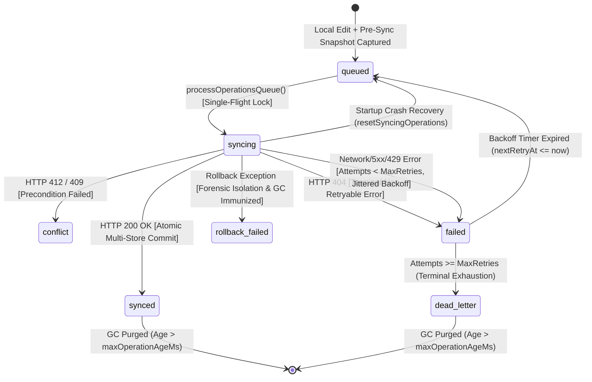

# Synchronization Operations Queue, State-Safe Garbage Collection (GC), and Rollback Architecture

## 1. Executive Summary & Architectural Scope

This document represents the complete technical specification, architectural blueprint, and execution record for **Phase 2: Complete Operations Queue, State-Safe Garbage Collection (GC), and Failure-Isolated Rollback Subsystem** of the LUGX synchronization engine, as defined in Phase 2 of the original pre-implementation technical roadmap.

The primary objective of Phase 2 is transforming local offline edits and synchronization tasks from unmanaged pending logs into a **deterministic, transactional, crash-resilient, and state-aware operations queue** with bounded exponential retry backoff, multi-store atomic commits, forensic rollback isolation, and immune garbage collection.

---

## 2. Operation Lifecycle & State Machine Contract

Every local document modification, user edit, and background synchronization task is persisted in IndexedDB under the `operations` store using the extended `IDBOperation` contract:



### Operation States Specifications

| State | Description | GC Immunity | Retry Policy |
| :--- | :--- | :---: | :--- |
| `queued` | Pending deterministic execution in the queue. | **YES** | Ready for immediate/next consumption. |
| `syncing` | Currently in-flight across the network payload channel. | **YES** | Reverted to `queued` on crash/restart recovery. |
| `synced` | Successfully acknowledged by server and committed atomically. | No (after `maxAge`) | Completed; terminal success. |
| `failed` | Transient failure with scheduled backoff or terminal 404. | Conditional | Retryable if `attempts < maxRetries` and error is retryable. |
| `conflict` | Precondition failed (HTTP 412/409); awaiting user or algorithmic resolution. | **YES** | Held until explicit resolution callback commits. |
| `rollback_failed` | Rollback encountered an exception; frozen for forensic inspection. | **YES** | Frozen permanently; never deleted by GC. |
| `dead_letter` | Maximum retry threshold (default: 5) exhausted. | No (after `maxAge`) | Terminal failure; held for retention duration. |

---

## 3. Schema & Data Structures (`src/lib/sync/idb-types.ts`)

### 3.1. `OperationStatus`
```typescript
export type OperationStatus =
    | 'queued'
    | 'syncing'
    | 'synced'
    | 'failed'
    | 'conflict'
    | 'rollback_failed'
    | 'dead_letter';
```

### 3.2. Extended `IDBOperation` Interface
```typescript
export interface IDBOperation {
    id: string;
    operationId?: string;
    userId?: string;
    fileId: string;
    baseVersion?: number;
    status?: OperationStatus;
    attempts?: number;
    nextRetryAt?: number;
    lastError?: string;
    operationType: 'insert' | 'delete' | 'replace' | 'update';
    position: number;
    content: string;
    timestamp: number;
    synced: boolean;
    snapshot?: {
        content: string;
        etag?: string;
        version?: number;
    };
}
```

### 3.3. IndexedDB Object Stores & Index Schema
- **`files` Store:** Key: `id` (string), Indexes: `lastModified`, `isDirty`.
- **`operations` Store:** Key: `id` (string), Indexes: `fileId`, `timestamp`, `status`, `nextRetryAt`.
- **`sync_metadata` Store:** Key: `id` (string).

---

## 4. Multi-Store Transactional Atomicity (`src/lib/sync/indexeddb.ts`)

### 4.1. The Atomic Commit Invariant
When an operation succeeds on the server with HTTP 200 OK, updating the file state and operation record in separate transactions introduces a vulnerability window: if the browser terminates between the two writes, the file is clean but the operation remains `syncing` (later re-queued on startup).

To guarantee strict ACID compliance, `IndexedDBManager` provides `commitFileAndOperationSync`:

```typescript
async commitFileAndOperationSync(
    fileId: string,
    newEtag: string,
    opId: string,
    attempts: number
): Promise<void> {
    const db = await this.getDB();
    return new Promise((resolve, reject) => {
        const tx = db.transaction([IDB_CONFIG.STORES.FILES, IDB_CONFIG.STORES.OPERATIONS], 'readwrite');
        const filesStore = tx.objectStore(IDB_CONFIG.STORES.FILES);
        const opsStore = tx.objectStore(IDB_CONFIG.STORES.OPERATIONS);

        const fileReq = filesStore.get(fileId);
        fileReq.onsuccess = () => {
            const file = fileReq.result as IDBFile;
            if (file) {
                file.isDirty = false;
                file.etag = newEtag;
                file.lastSyncedAt = Date.now();
                filesStore.put(file);
            }
        };

        const opReq = opsStore.get(opId);
        opReq.onsuccess = () => {
            const op = opReq.result as IDBOperation;
            if (op) {
                op.status = 'synced';
                op.synced = true;
                op.attempts = attempts;
                op.lastError = undefined;
                opsStore.put(op);
            }
        };

        tx.oncomplete = () => resolve();
        tx.onerror = () => reject(tx.error);
        tx.onabort = () => reject(tx.error || new Error('Atomic sync transaction aborted'));
    });
}
```

---

## 5. Queue Engine, Scheduling & Backoff (`src/lib/sync/sync-manager.ts`)

### 5.1. Single-Flight Consumer Guard
To prevent concurrency hazards when multiple events trigger sync simultaneously (online detector, auto-sync timer, local save):
- `isQueueProcessing` flag ensures only a single queue consumer executes at any point in time.
- `concurrencyManager.withLock(fileId)` ensures per-file mutual exclusion during API execution.

### 5.2. Due Operations Querying
`IndexedDBManager.getDueOperations(now, maxRetries)` queries the `operations` store deterministically:
1. Filters for operations with `status === 'queued'` OR (`status === 'failed'` AND `attempts < maxRetries` AND `nextRetryAt <= now`).
2. Sorts operations in strictly ascending order by `timestamp ASC` to maintain chronological causality.

### 5.3. Bounded Exponential Backoff with Randomized Jitter
When a retryable network error, rate limit (HTTP 429), or server error (HTTP 5xx) occurs:

$$\text{baseDelay} = \min\left(\text{baseBackoffMs} \times 2^{\text{attempts} - 1}, \text{maxBackoffMs}\right)$$
$$\text{jitterMultiplier} = 0.85 + 0.30 \times \text{Random}() \quad (\text{when } \text{enableJitter}=\text{true})$$
$$\text{delay} = \text{round}(\text{baseDelay} \times \text{jitterMultiplier})$$
$$\text{nextRetryAt} = \text{Date.now}() + \text{delay}$$

- **Defaults:** $\text{baseBackoffMs} = 1000\text{ ms}$, $\text{maxBackoffMs} = 30000\text{ ms}$, $\text{maxRetries} = 5$.
- **Thundering Herd Protection:** Jitter prevents simultaneous retries across thousands of clients after network or server recovery.

### 5.4. Double-Push Elimination
`SyncManager.pushDirtyFiles()` queries active queued and syncing operations:
```typescript
const queuedOps = await this.idb.getOperationsByStatus('queued');
const syncingOps = await this.idb.getOperationsByStatus('syncing');
const pendingFileIds = new Set([...queuedOps, ...syncingOps].map(o => o.fileId));
const filesToPush = dirtyFiles.filter(f => !pendingFileIds.has(f.id));
```
Files with active queue items are never pushed via the fallback dirty push loop, eliminating payload duplication and lock contention.

---

## 6. Server Tombstones & Reconciliation (`src/lib/sync/sync-manager.ts`)

In `SyncManager.pullFile()`:
- When a server file entry has `deletedAt !== null`:
  1. The local file is deleted immediately from IndexedDB (`idb.deleteFile(id)`).
  2. Any local pending operations for that file (`status: 'queued' | 'syncing'`) are transitioned to `status: 'failed'` with `lastError: 'File deleted on server (tombstone received)'`.
  3. Prevents deleted server files from resurfacing locally or causing stale write loops.

---

## 7. Crash Recovery Protocol

Upon browser restart or ungraceful tab termination mid-sync:
```typescript
await this.idb.resetSyncingOperations();
```
- Invoked automatically during `SyncManager.init()`.
- Queries all operations with `status === 'syncing'` and resets them to `status = 'queued'`.
- Guarantees that in-flight operations stranded by crashes are automatically re-processed upon connection availability.

---

## 8. Rollback Subsystem & Persistent Snapshot Fallback (`src/lib/sync/rollback.ts`)

### 8.1. Checkpoints and Snapshot Restoration
1. **Pre-Sync Checkpoints:** Captures in-memory state before API calls (`createCheckpoint(fileId, 'pre_sync', opId)`).
2. **Persistent Snapshot Fallback:** If the in-memory checkpoint was destroyed by a crash or page refresh, `rollback(checkpointId, operationId)` falls back to `IDBOperation.snapshot` (`{ content, etag, version }`) stored in IndexedDB:
   ```typescript
   if (!checkpoint && targetOpId) {
       const op = await this.idb.getOperation(targetOpId);
       if (op?.snapshot) {
           return this.rollbackOperation(op);
       }
   }
   ```
3. **Forensic Isolation:** If rollback fails due to storage error or missing state, the operation is updated to `status = 'rollback_failed'` in IndexedDB. This flags the error and permanently prevents GC deletion until inspected.

---

## 9. Error Classification Subsystem (`src/lib/sync/error-handler.ts`)

### 9.1. Error Classification Rules

| HTTP Status / Exception | Error Type | Classification | Recoverable? |
| :--- | :--- | :--- | :---: |
| `TypeError('Failed to fetch')` | `NETWORK_ERROR` | Retryable with Backoff | **Yes** |
| `HTTP 401 / 403` | `AUTH_ERROR` | Terminal (Non-retryable) | **No** |
| `HTTP 404` | `NOT_FOUND_ERROR` | Terminal (Non-retryable) | **No** |
| `HTTP 409 / 412` | `CONFLICT_ERROR` | Precondition Conflict | **No** (Direct resolution required) |
| `HTTP 429` | `RATE_LIMIT_ERROR` | Retryable with `Retry-After` | **Yes** |
| `HTTP 500 / 502 / 503 / 504` | `SERVER_ERROR` | Retryable with Backoff | **Yes** |
| Max Retries Exceeded | `DEAD_LETTER_ERROR` | Terminal Exhaustion | **No** |
| Rollback Exception | `ROLLBACK_ERROR` | Terminal Forensic | **No** |

### 9.2. `isRetryableError` Helper
Exported helper function evaluating whether an exception or `SyncError` is safe for backoff retrying.

---

## 10. State-Safe Garbage Collection (`src/lib/sync/operations-gc.ts`)

### 10.1. GC Safety Invariants
1. **Strict Immunity:** Operations with `status: 'syncing'`, `status: 'conflict'`, `status: 'rollback_failed'`, or `status: 'queued'` are **NEVER DELETED**, regardless of age.
2. **Selective Pruning:** Only operations with `synced: true` OR `status: 'dead_letter'` exceeding `maxOperationAgeMs` (default: 7 days) are purged.
3. **Controllable Clock:** `OperationsGarbageCollector.setClock(clockFn)` and `gc.run(force, customNow)` enable deterministic, sub-millisecond unit testing without fake timer drift.

---

## 11. Verification and Comprehensive Test Matrix

A total of **169 automated unit and integration tests** across 11 test suites verified all Phase 2 guarantees with a **100% PASS rate** at delivery time
(the per-suite breakdown below is a point-in-time snapshot — e.g. `sync-manager.test.ts`
has since grown to 33 tests; re-run the suite for current totals):

```
========================================================================================
Test Suite Execution Matrix:
========================================================================================
 1. src/lib/sync/sync-manager.test.ts          -> 31 tests  [ PASSED ]
 2. src/lib/sync/error-handler.test.ts         -> 26 tests  [ PASSED ]
 3. src/lib/sync/rollback.test.ts              -> 22 tests  [ PASSED ]
 4. src/lib/sync/connection-detector.test.ts   -> 17 tests  [ PASSED ]
 5. src/lib/sync/conflict-resolver.test.ts     -> 14 tests  [ PASSED ]
 6. src/lib/sync/indexeddb.test.ts             -> 13 tests  [ PASSED ]
 7. src/lib/sync/etag-generator.test.ts        -> 13 tests  [ PASSED ]
 8. src/hooks/use-sync.test.ts                 -> 13 tests  [ PASSED ]
 9. src/lib/sync/concurrency-manager.test.ts    ->  9 tests  [ PASSED ]
10. src/lib/sync/parallel.test.ts               ->  6 tests  [ PASSED ]
11. src/lib/sync/operations-gc.test.ts          ->  5 tests  [ PASSED ]
----------------------------------------------------------------------------------------
Total Automated Tests:                         169 tests  [ 100% PASS RATE ]
========================================================================================
```

---

## 12. File Modification Audit (Zero Scope Drift)

All codebase modifications for Phase 2 are strictly confined within the permitted sync subsystem:
- `src/lib/sync/idb-types.ts`
- `src/lib/sync/indexeddb.ts`
- `src/lib/sync/sync-manager.ts`
- `src/lib/sync/rollback.ts`
- `src/lib/sync/operations-gc.ts`
- `src/lib/sync/error-handler.ts`
- `src/lib/sync/index.ts`
- Associated unit and integration test suites in `src/lib/sync/*.test.ts`.

Zero files outside the Phase 2 boundary were altered.
