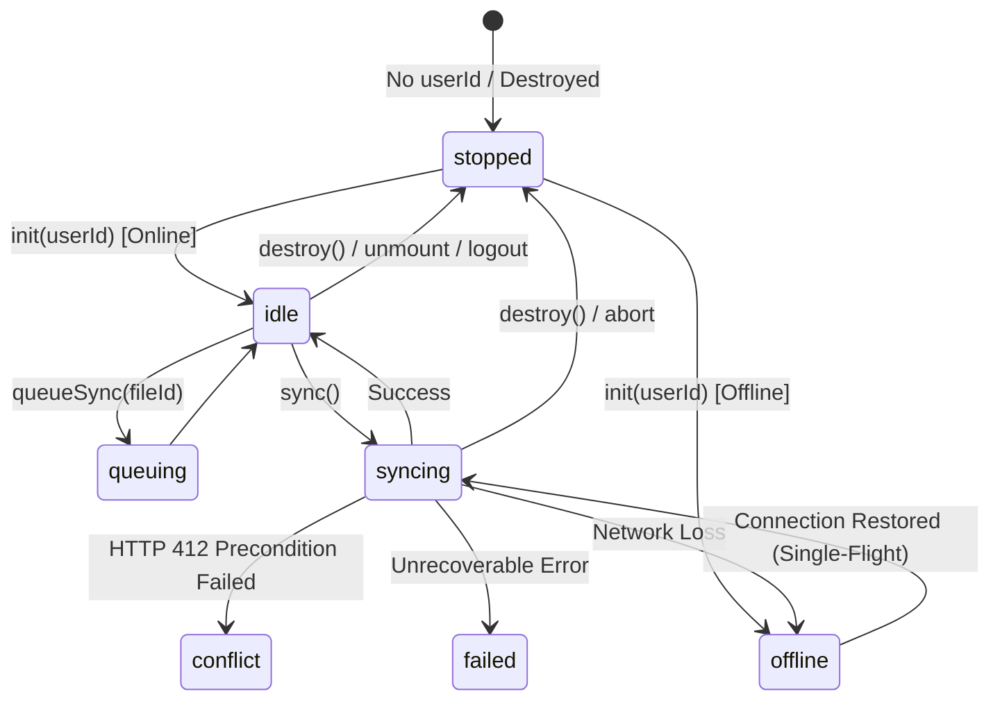

# Offline Sync Lifecycle & User Scoping Architecture

## Overview

The Offline Sync system provides offline-first editing, deterministic queueing, ETag-based conflict detection, and cloud synchronization for workspace documents. In Phase 1, the sync layer was migrated from an unconstrained global singleton model to a strictly scoped, user-partitioned lifecycle architecture.

---

## 1. Scoping & Lifecycle Principles

### 1.1 User-Scoped Partitioning
Every sync resource is partitioned by `userId`. An explicit, non-empty `userId` is required for:
1. Opening and querying IndexedDB databases (`textai_db_${userId}`).
2. Instantiating and running `SyncManager`.
3. Managing dirty queues, conflict states, and garbage collection.

If `userId` is missing, `null`, `undefined`, or empty (`""`), the sync layer halts in a displayable `'stopped'` state without acquiring database locks, allocating timers, or initiating network requests.

### 1.2 Deterministic Teardown
When a user logs out, switches accounts, or when UI components unmount:
- Active network requests are immediately terminated via `AbortController`.
- Background auto-sync and polling intervals are cleared.
- Garbage collection scheduling is stopped via tracked cleanup callbacks.
- Database connections to IndexedDB are safely closed.
- State listeners and conflict callbacks are detached to prevent memory leaks.

---

## 2. Explicit State Machine

The sync status transitions through deterministic, explicit states:

### State Definitions
| State | Description |
| :--- | :--- |
| `stopped` | Sync manager is uninitialized, destroyed, or logged out. No-op mode. |
| `idle` | Connected and in sync with server; awaiting changes or triggers. |
| `loading` | Loading local files or bootstrapping metadata. |
| `queued` | Local operations or files are queued and awaiting synchronization. |
| `syncing` | Active push/pull HTTP pipeline is executing. |
| `conflict` | Version conflict detected (HTTP 412); resolution callback required. |
| `failed` | Non-recoverable error encountered during sync pipeline. |
| `offline` | Device is disconnected from internet. Local edits are stored in IndexedDB. |

---

## 3. Storage Isolation & Database Namespacing

IndexedDB databases are physically partitioned by user ID:
- Database Name: `textai_db_${userId}`
- Schema Version: 1
- Object Stores:
  - `files`: Scoped document snapshots with `id`, `etag`, `content`, `isDirty`, `lastModified`.
  - `operations`: Fine-grained edit delta logs for rollback and compaction.
  - `sync_metadata`: User sync timestamps and pagination cursors.

This ensures zero cross-user data bleeding when multiple users access the application on the same client machine.

---

## 4. Single-Flight Online Consumer Gate

To prevent "thundering herd" issues and duplicate synchronization cycles when network connectivity fluctuates:
- `ConnectionDetector` enforces idempotent state transitions.
- `SyncManager` implements a single-flight execution gate (`isConsumerRunning` and `hasPendingOnlineConsumer`).
- Multiple overlapping `online` events only initiate a single active consumer task, with at most one subsequent pass queued if new edits arrived during execution.

---

## 5. File-Level Concurrency Control

`ConcurrencyManager` guarantees sequential, deterministic execution of push operations on a per-file basis using in-memory promise locks:
- Prevents interleaved or out-of-order pushes for the same document.
- Retains distinct execution paths for independent files to maximize throughput.
- Safely releases locks and cleans up rollback checkpoints on failure or cancellation.
