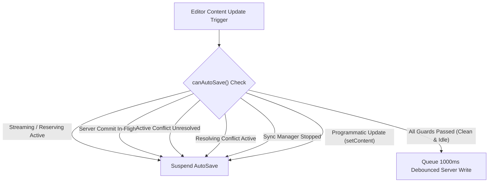

# TipTap Editor, Auto-Save & Sync Orchestration Architecture

**Phase ID:** Phase 9 / Gate G9
**Status:** CLOSED · Amended in v1.5.0 with the Local-First Reconciliation policy
(Section 6a) and the AI streaming programmatic-transaction guard (Section 6b)
**Authoritative Module:** `src/hooks/use-editor-orchestrator.ts`
**Consuming Page:** `src/app/workspace/editor/[fileId]/page.tsx`

---

## 1. Executive Summary & Objective

In multi-channel editing environments (combining human typing, AI streaming generation, background offline/online synchronization, and cross-tab broadcasts), uncoordinated write operations cause race conditions, version overwrites, ghost preview corruptions, and invalid precondition states.

Phase 9 unifies all manual editing, AI streaming and atomic commit, auto-save debounce timers, IndexedDB caching, and conflict resolution into a single centralized **Editor Write & Sync Controller** (`useEditorOrchestrator`), establishing strict state isolation and write gating.

---

## 2. Six Separated State Slices

The orchestrator decomposes page state into 6 isolated, deterministic state slices:

| State Slice | Responsibilities & Invariants |
| :--- | :--- |
| **1. Document State** | Document content (HTML) and document title. Protected against silent race overwrites. |
| **2. Preview State** | Ephemeral AI streaming preview buffer, operation type, active tokens, and finite session status (`idle`, `reserving`, `reserved`, `streaming`, `preview_ready`, `committing`, `committed`, `aborted`, `failed`, `conflict`). |
| **3. Dirty State** | Boolean flag tracking unsaved local changes, timestamp of last successful save, and active saving indicators. |
| **4. Server Version** | Authoritative server version number and ETag precondition anchor received from PostgreSQL / Supabase. |
| **5. Conflict State** | Active `SyncConflict` descriptor, modal visibility toggle, resolution strategy payload, and in-flight resolution locks. |
| **6. Write State** | Mutex controller tracking the active writing channel (`idle`, `saving`, `ai_committing`, `resolving_conflict`, `syncing`, `stopped`). |

---

## 3. AutoSave Suspension Invariants Gate

AutoSave is strictly suspended whenever any of the following invariants evaluate to `true`:



```typescript
const canAutoSave = useCallback((): boolean => {
    if (isProgrammaticUpdateRef.current) return false;
    if (aiStream.isLoading || aiStream.isStreaming || aiStream.isCommitting) return false;
    if (aiStream.status === "reserved" || aiStream.status === "streaming" || aiStream.status === "committing") return false;
    if (activeConflictRef.current !== null) return false;
    if (isResolvingConflictRef.current) return false;
    if (syncHook.status === "stopped") return false;
    return true;
}, [aiStream.isLoading, aiStream.isStreaming, aiStream.isCommitting, aiStream.status, syncHook.status]);
```

---

## 4. Target-Scoped Manual Edit During AI Streaming Policy

When the user types or alters text while an AI stream is actively generating:
1. **Target-Scoped Overlap Check:** The orchestrator checks whether the user's cursor / modification intersects with the active AI selection target range `[ghostState.from, ghostState.to]`:
   - **Edits Outside Target Range (e.g. Other Paragraphs):** Allowed without interruption. ProseMirror's `tr.mapping` automatically maps and shifts the ghost preview coordinates forward/backward, and the AI streaming continues smoothly.
   - **Edits Inside Target Range:** If the user alters text inside the paragraph/selection being actively generated or modified:
     1. **Instant Abort:** The orchestrator signals the active `AbortController` in `useAIStream`.
     2. **Quota Refund:** The backend reservation is refunded (`refundAIReservation`).
     3. **Ghost Dismantled:** TipTap's `StreamingGhostExtension` decoration is immediately removed, leaving the underlying ProseMirror document model pristine.
     4. **Editor Generation Advance:** `editorGenerationRef` increments, preventing any stale in-flight AI chunks or delayed commit responses from applying to the altered document.
     5. **Debounced AutoSave:** The user's manual modification proceeds cleanly without silent corrupt merges.

---

## 5. Single-Action Atomic Undo (Ctrl+Z)

Local application of committed AI results executes as a single, indivisible ProseMirror transaction:

```typescript
editor.chain()
    .setTextSelection({ from: targetFrom, to: targetTo })
    .deleteSelection()
    .insertContent(safeHtml)
    .run();
```

- **Invariant:** Pressing `Ctrl+Z` reverses the entire AI change back to the pre-operation document snapshot in one history step, rather than undoing individual streamed chunks.

---

## 6. Sibling Tab & Navigation Invariants

- **Clean Tab Sync:** Sibling tab save broadcasts (`file_saved`) advance the local `serverVersion` reference if the local document is clean (`isDirty: false`).
- **Dirty Tab Optimistic Lock:** If the local tab is dirty or has an active conflict, external version advances are suppressed, ensuring that subsequent local saves condition against the local base version and trigger a 412 Conflict modal instead of silently overwriting sibling changes.
- **Navigation Guard:** `window.onbeforeunload` triggers if `isDirty`, `isSaving`, or `isCommitting` is active, preventing accidental tab closure.

## 6a. Initial Load & Local-First Reconciliation (v1.5.0 Amendment)

### 6a.1 Problem Statement

The initial load pipeline previously re-executed on **every render**: the inline
`onNavigate: (path) => router.push(path)` arrow produced a fresh dependency identity per
render cycle, and the effect dependencies included it. Each re-execution performed a full
`getFile()` round-trip and force-applied the server payload via `setContent()` whenever it
differed from the live document. While background sync was running, this visibly wiped
in-progress typing; the text reappeared only after the next sync cycle restored it.
Beyond the lifecycle bug, the decision rule itself was wrong: a raw content inequality
between editor HTML and server HTML cannot distinguish a legitimate remote advance from a
divergent history or from unsaved local work.

### 6a.2 Deterministic Decision Matrix (`src/lib/sync/reconciliation.ts`)

`classifyRemoteUpdate(local, remote)` is a pure function returning exactly one of three
actions. It compares monotonic versions, normalized ETags (weak validators `W/` and quotes
stripped), optional server/local timestamps as corroborating evidence, dirty state, and
content equality.

| # | Action | Reason Code | Preconditions & Effect |
|---|--------|-------------|------------------------|
| A | `apply` (Fast-Forward) | `fast_forward_clean` | Local is **clean** (`isDirty === false`) **and** the remote revision is verified-newer: `remoteVersion > localVersion`, effective ETags differ, and timestamps corroborate (when both sides provide them, remote `updatedAt >= localLastModified`). Because a clean local copy *is* the last-synced ancestor, any strictly newer server revision is by construction built on top of it. The editor receives `setContent(serverContent)` inside the programmatic-update guard; IndexedDB and version/ETag anchors are advanced with the decision. |
| B | `adopt_metadata` | `identical_content_metadata_drift` | Contents are byte-identical; only `version`/`etag` drifted (e.g. another tab committed identical content). Server metadata is adopted silently; the document and the user are untouched. |
| C | `keep_local` | `dirty_local_divergent` \| `remote_not_newer` | Either the local document carries unsaved edits over a superseded base, or the remote is not ahead of local (stale pull, clock-skewed replica, or version advanced without an ETag change). The editor keeps rendering local truth. Version anchors are intentionally **not** advanced, so the next optimistic write surfaces a genuine `412 Precondition Failed` and routes the case through the explicit three-way conflict flow (`ConflictDialog`) instead of silent loss. |

### 6a.3 Invariants

1. **No silent overwrite of unsaved work.** Dirty local state can never be replaced by a
   remote payload through this policy; divergence is escalated via optimistic locking.
2. **Timestamps corroborate, they do not govern.** Client clocks drift; the timestamp check
   is a veto on the version ladder, never a substitute for it.
3. **ETag change is mandatory for advancement.** A version bump without an ETag mutation is
   treated as non-newer to guard against metadata-only churn.
4. **Programmatic containment.** Every `apply` writes through `isProgrammaticUpdateRef`,
   so TipTap's `update` event never misclassifies the reconciliation write as a manual edit
   (no spurious autosave, no spurious generation bump).
5. **One-shot pipeline.** The initial load pipeline runs exactly once per mounted `fileId`
   (`initialLoadDoneRef`); unstable callback identities can no longer multiply fetch cycles.

### 6a.4 Reconciliation Flow

```mermaid
sequenceDiagram
    autonumber
    participant E as Editor (TipTap)
    participant O as Orchestrator
    participant R as classifyRemoteUpdate
    participant S as Server API
    participant I as IndexedDB

    O->>I: loadLocal(fileId) [instant offline-first paint]
    O->>S: getFile(fileId) [background]
    S-->>O: { content, version, etag, updatedAt }
    O->>R: classify(localState, remoteState)
    alt action = apply (clean + verified-newer)
        R-->>O: fast_forward_clean
        O->>E: setContent(sanitizedRemote) [programmatic guard]
        O->>I: saveLocal(isDirty: false)
        Note over O: advance version/ETag anchors
    else action = adopt_metadata (identical payload)
        R-->>O: identical_content_metadata_drift
        Note over O: adopt version/ETag anchors only
    else action = keep_local (dirty / not-newer)
        R-->>O: retain local truth
        Note over O: anchors unchanged; next write yields real 412 -> ConflictDialog
    end
```

### 6a.5 Verification

| Suite | Coverage |
|-------|----------|
| `src/lib/sync/reconciliation.test.ts` (8 tests) | Fast-forward on clean+newer; timestamp corroboration and veto; metadata adoption on identical payloads; dirty-divergent retention; non-newer retention (equal version, regressed version); ETag-change requirement; weak-validator normalization (`W/`, quotes) |
| `src/test/editor-orchestration.integration.test.ts` | Orchestrator integration against mocked `fileOps` with complete Drizzle row shape |

---

## 6b. AI Streaming Programmatic Transaction Guard (v1.5.0 Amendment)

Every document mutation performed by `useAIStream` — the atomic AI commit transaction, the
conflict rollback (`setContent(originalHtml)`), and the exception rollback — is routed
through the new `UseAIStreamOptions.onProgrammaticTransaction` hook. The orchestrator
raises `isProgrammaticUpdateRef` around it, so TipTap's `update` event can no longer
classify these writes as manual edits.

**Defect closed:** previously the post-commit ProseMirror transaction fired
`handleEditorChange`, marking the freshly committed document dirty and scheduling a
redundant debounced server write with a racing `expectedVersion` immediately after a
successful AI commit.

---

## 7. Verification Proof

- Automated Integration Tests:
  - `src/test/editor-orchestration.integration.test.ts` (6/6 passing)
  - `src/test/editor-atomic-commit.test.ts` (4/4 passing)
  - `src/hooks/use-sync.test.ts` (13/13 passing)
  - `src/test/conflict-resolution.integration.test.ts` (3/3 passing)
  - Total: 48/48 related tests passing with zero mock bypasses for integration lifecycle.
