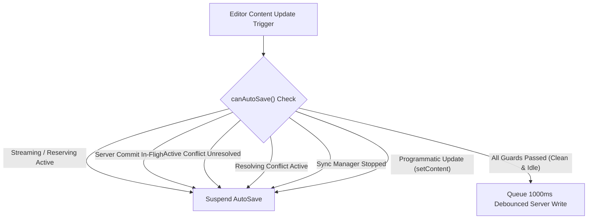

# TipTap Editor, Auto-Save & Sync Orchestration Architecture

**Phase ID:** Phase 9 / Gate G9  
**Status:** CLOSED  
**Authoritative Module:** `src/hooks/use-editor-orchestrator.ts`  
**Consuming Page:** `src/app/workspace/editor/[fileId]/page.tsx`

---

## 1. Executive Summary & Objective

In multi-channel editing environments (combining human typing, AI streaming generation, background offline/online synchronization, and cross-tab broadcasts), uncoordinated write operations cause race conditions, version overwrites, ghost preview corruptions, and invalid precondition states.

Phase 9 unifies all manual editing, AI streaming and atomic commit, auto-save debounce timers, IndexedDB caching, and conflict resolution into a single centralized **Editor Write & Sync Controller** (`useEditorOrchestrator`), establishing strict state isolation and write gating.

---

## 2. Six Separated State Slices

The orchestrator decomposes page state into 6 isolated, deterministic state slices:

| State Slice | Responsibilities & Invariants |
| :--- | :--- |
| **1. Document State** | Document content (HTML) and document title. Protected against silent race overwrites. |
| **2. Preview State** | Ephemeral AI streaming preview buffer, operation type, active tokens, and finite session status (`idle`, `reserving`, `reserved`, `streaming`, `preview_ready`, `committing`, `committed`, `aborted`, `failed`, `conflict`). |
| **3. Dirty State** | Boolean flag tracking unsaved local changes, timestamp of last successful save, and active saving indicators. |
| **4. Server Version** | Authoritative server version number and ETag precondition anchor received from PostgreSQL / Supabase. |
| **5. Conflict State** | Active `SyncConflict` descriptor, modal visibility toggle, resolution strategy payload, and in-flight resolution locks. |
| **6. Write State** | Mutex controller tracking the active writing channel (`idle`, `saving`, `ai_committing`, `resolving_conflict`, `syncing`, `stopped`). |

---

## 3. AutoSave Suspension Invariants Gate

AutoSave is strictly suspended whenever any of the following invariants evaluate to `true`:



```typescript
const canAutoSave = useCallback((): boolean => {
    if (isProgrammaticUpdateRef.current) return false;
    if (aiStream.isLoading || aiStream.isStreaming || aiStream.isCommitting) return false;
    if (aiStream.status === "reserved" || aiStream.status === "streaming" || aiStream.status === "committing") return false;
    if (activeConflictRef.current !== null) return false;
    if (isResolvingConflictRef.current) return false;
    if (syncHook.status === "stopped") return false;
    return true;
}, [aiStream.isLoading, aiStream.isStreaming, aiStream.isCommitting, aiStream.status, syncHook.status]);
```

---

## 4. Target-Scoped Manual Edit During AI Streaming Policy

When the user types or alters text while an AI stream is actively generating:
1. **Target-Scoped Overlap Check:** The orchestrator checks whether the user's cursor / modification intersects with the active AI selection target range `[ghostState.from, ghostState.to]`:
   - **Edits Outside Target Range (e.g. Other Paragraphs):** Allowed without interruption. ProseMirror's `tr.mapping` automatically maps and shifts the ghost preview coordinates forward/backward, and the AI streaming continues smoothly.
   - **Edits Inside Target Range:** If the user alters text inside the paragraph/selection being actively generated or modified:
     1. **Instant Abort:** The orchestrator signals the active `AbortController` in `useAIStream`.
     2. **Quota Refund:** The backend reservation is refunded (`refundAIReservation`).
     3. **Ghost Dismantled:** TipTap's `StreamingGhostExtension` decoration is immediately removed, leaving the underlying ProseMirror document model pristine.
     4. **Editor Generation Advance:** `editorGenerationRef` increments, preventing any stale in-flight AI chunks or delayed commit responses from applying to the altered document.
     5. **Debounced AutoSave:** The user's manual modification proceeds cleanly without silent corrupt merges.

---

## 5. Single-Action Atomic Undo (Ctrl+Z)

Local application of committed AI results executes as a single, indivisible ProseMirror transaction:

```typescript
editor.chain()
    .setTextSelection({ from: targetFrom, to: targetTo })
    .deleteSelection()
    .insertContent(safeHtml)
    .run();
```

- **Invariant:** Pressing `Ctrl+Z` reverses the entire AI change back to the pre-operation document snapshot in one history step, rather than undoing individual streamed chunks.

---

## 6. Sibling Tab & Navigation Invariants

- **Clean Tab Sync:** Sibling tab save broadcasts (`file_saved`) advance the local `serverVersion` reference if the local document is clean (`isDirty: false`).
- **Dirty Tab Optimistic Lock:** If the local tab is dirty or has an active conflict, external version advances are suppressed, ensuring that subsequent local saves condition against the local base version and trigger a 412 Conflict modal instead of silently overwriting sibling changes.
- **Navigation Guard:** `window.onbeforeunload` triggers if `isDirty`, `isSaving`, or `isCommitting` is active, preventing accidental tab closure.

---

## 7. Verification Proof

- Automated Integration Tests:
  - `src/test/editor-orchestration.integration.test.ts` (6/6 passing)
  - `src/test/editor-atomic-commit.test.ts` (4/4 passing)
  - `src/hooks/use-sync.test.ts` (13/13 passing)
  - `src/test/conflict-resolution.integration.test.ts` (3/3 passing)
  - Total: 48/48 related tests passing with zero mock bypasses for integration lifecycle.
