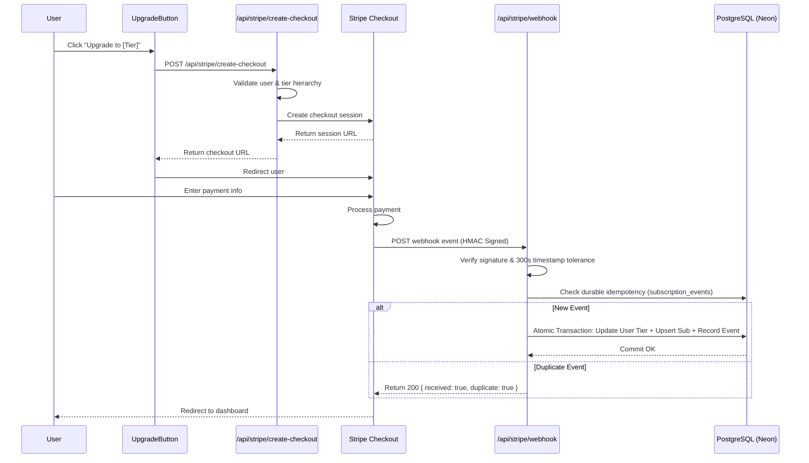

# Stripe Integration — Technical Reference

## Overview

This document provides technical reference for the Stripe payment and subscription lifecycle integration in LUGX.

---

## Architecture & Payment Flow



---

## Core Components

### 1. Stripe Library (`src/lib/stripe/`)

#### `index.ts`
Main Stripe operations wrapper:

```typescript
// Get or create Stripe customer
getOrCreateStripeCustomer(
    userId: string,
    email: string,
    name?: string
): Promise<string>

// Create checkout session
createCheckoutSession(
    customerId: string,
    priceId: string,
    userId: string,
    tier: TierName
): Promise<Stripe.Checkout.Session>

// Verify webhook signature
constructWebhookEvent(
    body: string,
    signature: string
): Stripe.Event

// Get customer details
getStripeCustomer(
    customerId: string
): Promise<Stripe.Customer>

// Cancel subscription
cancelStripeSubscription(
    subscriptionId: string
): Promise<Stripe.Subscription>
```

#### `config.ts`
Price ID configuration and validation:

```typescript
export const STRIPE_PRICE_IDS: Record<'pro' | 'ultra', string>

export function getStripePriceId(tier: TierName): string
export function isValidStripeTier(tier: unknown): tier is 'pro' | 'ultra'
```

---

### 2. API Routes

#### POST `/api/stripe/create-checkout`
- **Request:** `{ "tier": "pro" | "ultra" }`
- **Status Codes:**
  - `200` - Success (returns `{ "success": true, "url": "...", "sessionId": "..." }`)
  - `400` - Invalid tier, same-tier, or downgrade attempt
  - `401` - Unauthorized (no active session)
  - `500` - Server error

#### POST `/api/stripe/webhook` (Canonical Handler)
Authoritative webhook ingestion endpoint with alias re-export at `/api/webhooks/stripe`.

**Security & Invariants:**
- **HMAC Signature Verification:** Verified against `STRIPE_WEBHOOK_SECRET` with `MAX_TIMESTAMP_AGE_SECONDS = 300` before JSON parsing or DB operations.
- **Two-Tiered Idempotency:** In-memory Set fast-path + Authoritative `subscription_events` database ledger.
- **Atomic ACID Transitions:** Encapsulated in `executeSubscriptionTransition(tx)`.
- **Terminal State Protection:** A subscription in `canceled` state rejects stale `customer.subscription.updated` events attempting to set it back to `active`.
- **Accurate Period Derivation:** Derives periods from `SubscriptionItem` or `Invoice.lines`, guaranteeing `currentPeriodEnd > currentPeriodStart`.

**Supported Events:**
- `checkout.session.completed` — Upgrades tier and records subscription upon confirmed payment.
- `customer.subscription.updated` — Updates tier and subscription status (fail-closed on unmapped statuses).
- `customer.subscription.deleted` — Downgrades user to `free` and marks subscription `canceled`.
- `customer.subscription.trial_will_end` — Informational notice; preserves user tier.
- `invoice.payment_failed` — Immediately downgrades tier to `free` and reconciles subscription status locally.

---

### 3. Server Actions (`src/server/actions/subscription-actions.ts`)

- `executeSubscriptionTransition(operation)`: Executes DB mutations within an atomic transaction.
- `getUserSubscription(userId, client?)`: Queries user subscription from local PostgreSQL state.
- `isSubscriptionEventProcessed(eventId, client?)`: Checks durable idempotency in `subscription_events`.
- `recordSubscriptionEvent(eventData, client?)`: Persists webhook event ID and processing status.
- `updateUserTier(userId, tier, client?)`: Updates user's subscription tier.
- `upsertSubscription(userId, subscriptionData, client?)`: Creates or updates subscription row.
- `cancelUserSubscription(userId, client?)`: Downgrades user to free and cancels subscription record.

---

### 4. React Components & Tier Hierarchy

#### `<UpgradeButton>`
```tsx
<UpgradeButton 
  tier="pro" 
  currentTier={user.tier} 
/>
```

#### Tier Hierarchy:
```typescript
const tierHierarchy = {
  free: 0,
  pro: 1,
  ultra: 2
};
```
- Can only upgrade to a higher tier.
- Cannot upgrade to the same tier or downgrade through checkout.

---

### 5. Verification & Testing

#### Unit Tests:
```bash
npx vitest run src/app/api/stripe/webhook/route.test.ts
```

#### Live Integration Tests (Isolated Neon Branch):
```bash
npx vitest run --config vitest.live.config.ts src/app/api/stripe/webhook/route.live.test.ts
```

---

**Last Updated:** 2026-08-26  
**Version:** 1.9.0  
**Status:** ✅ Phase 13 Hardened & Closed
