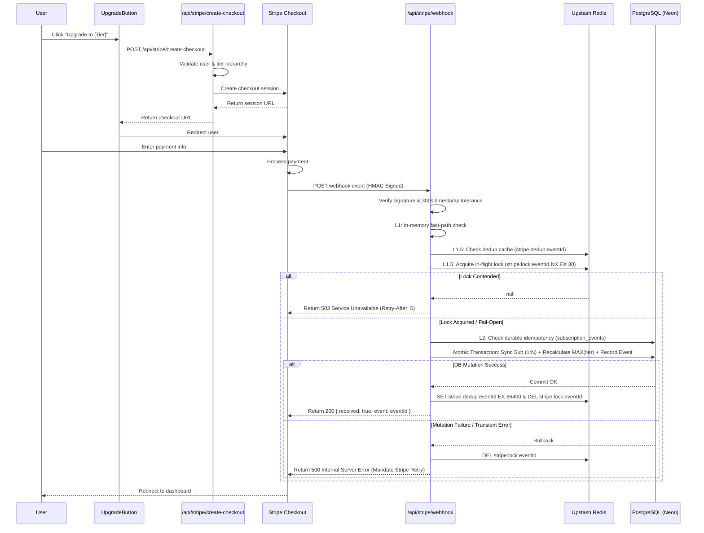

# Stripe Integration — Technical Reference

## Overview

This document provides technical reference for the Stripe payment and subscription lifecycle integration in LUGX.

---

## Architecture & Payment Flow



---

## Core Components

### 1. Stripe Library (`src/lib/stripe/`)

#### `index.ts`
Main Stripe operations wrapper:

```typescript
// Get or create Stripe customer
getOrCreateStripeCustomer(
    userId: string,
    email: string,
    name?: string
): Promise<string>

// Create checkout session
createCheckoutSession(
    customerId: string,
    priceId: string,
    userId: string,
    tier: TierName
): Promise<Stripe.Checkout.Session>

// Verify webhook signature
constructWebhookEvent(
    body: string,
    signature: string
): Stripe.Event

// Get customer details
getStripeCustomer(
    customerId: string
): Promise<Stripe.Customer>

// Cancel subscription
cancelStripeSubscription(
    subscriptionId: string
): Promise<Stripe.Subscription>
```

#### `config.ts`
Price ID configuration and validation:

```typescript
export const STRIPE_PRICE_IDS: Record<'pro' | 'ultra', string>

export function getStripePriceId(tier: TierName): string
export function isValidStripeTier(tier: unknown): tier is 'pro' | 'ultra'
```

#### `webhook-dedupe.ts`
In-memory fast-path deduplication cache and Next.js App Router route isolation:

```typescript
export function isEventProcessedInMemory(eventId: string): boolean
export function markEventProcessedInMemory(eventId: string): void
export function __resetProcessedEventIds(): void
export interface HandlerResult { success: boolean; userId?: string; subscriptionId?: string; error?: string; }
```

#### `webhook-event-reducer.ts` (Phase 6)
Pure state machine governing subscription lifecycles and enforcing **Terminal State Protection** (remediating LUGX-025 and LUGX-135):

```typescript
export function reduceSubscriptionState(
    currentState: SubscriptionState,
    event: StripeWebhookEvent,
    options?: WebhookReducerOptions
): SubscriptionTransitionResult;

export function isTerminalSubscriptionStatus(status: SubscriptionStatus): boolean;
```

**Core Invariants:**
- **Terminal State Freeze:** Subscriptions in terminal `canceled` or `incomplete_expired` state freeze out-of-order or replayed `customer.subscription.updated` events with `action: 'ignored_stale'`.
- **Payment Privilege Coupling:** Only genuine `active` and `trialing` statuses retain paid tiers. Unpaid checkouts fail-closed with `action: 'noop'`.

---

### 2. API Routes

#### POST `/api/stripe/create-checkout`
- **Request:** `{ "tier": "pro" | "ultra" }`
- **Status Codes:**
  - `200` - Success (returns `{ "success": true, "url": "...", "sessionId": "..." }`)
  - `400` - Invalid tier, same-tier, or downgrade attempt
  - `401` - Unauthorized (no active session)
  - `500` - Server error

#### POST `/api/stripe/webhook` (Canonical Handler)
Authoritative webhook ingestion endpoint with alias re-exports at `/api/webhooks/stripe` and `/api/billing/webhook`.

**Security & Invariants:**
- **HMAC Signature Verification:** Verified against `STRIPE_WEBHOOK_SECRET` with `MAX_TIMESTAMP_AGE_SECONDS = 300` before JSON parsing or DB operations.
- **Multi-Tiered Idempotency & Distributed Lock (Phase 12 & Phase 21):**
  - **L1 (Memory):** In-memory Set fast-path check.
  - **L1.5 (Redis Dedup):** `stripe:dedup:${eventId}` cache check with 24h TTL (shields PostgreSQL).
  - **L1.5 (Redis Lock):** In-flight distributed concurrency lock via `stripe:lock:${eventId}` (`NX EX 30`). Returns `503 Service Unavailable` with `Retry-After: 5` header on contention so Stripe retries automatically.
  - **L2 (DB Ledger):** Authoritative `subscription_events` database query & atomic ACID insertion. Re-throws DB errors to trigger HTTP 500 retries.
- **Strict Error Handling & Retry Mandate (LUGX-025, LUGX-148):** Transient database errors, lock contention, or unhandled failures return HTTP 500/503. Webhook returns HTTP 200 ONLY on successful transaction commit or genuine idempotent duplicates.
- **1:N Multi-Subscriptions & Dynamic MAX(tier) (LUGX-027):** Users can hold multiple active subscriptions indexed by `stripe_subscription_id`. The user's tier is dynamically derived via `BillingService.calculateEffectiveTier` (`MAX(tier)` where ultra > pro > free).
- **Grace Period Preservation (LUGX-026):** On `invoice.payment_failed`, the subscription status is marked `past_due` without immediately wiping user tier, allowing smart retries.
- **Terminal State Protection (LUGX-069):** A subscription in `canceled` state rejects stale `customer.subscription.updated` events, while `paused` status is non-terminal.

**Supported Events:**
- `checkout.session.completed` — Upgrades tier and records subscription upon confirmed payment.
- `customer.subscription.updated` — Updates tier and subscription status (fail-closed on unmapped statuses; supports `paused`).
- `customer.subscription.deleted` — Cancels subscription and recalculates tier from remaining active subscriptions.
- `customer.subscription.trial_will_end` — Informational notice; preserves user tier.
- `invoice.payment_failed` — Marks subscription `past_due` during grace period without premature tier wipe.

---

### 3. Billing Service (`src/server/services/billing-service.ts`)

- `calculateEffectiveTier(userId, client?)`: Computes `MAX(tier)` among all active/trialing subscriptions.
- `resolveUserId(options, client?)`: Resolves `userId` across metadata, customer ID lookup, and subscription records.
- `syncSubscription(data, client?)`: Upserts subscription row (1:N) and recalculates effective tier atomically.
- `handleCancellation(subId, fallbackUserId?, client?)`: Cancels specific subscription and recalculates remaining tier.
- `handleInvoicePaymentFailed(options, client?)`: Sets subscription to `past_due` without destroying other active tiers.
- `createCustomerPortalSession(userId, returnUrl?)`: Generates Stripe Customer Portal session URL.
- `getUserSubscriptions(userId, client?)`: Returns all subscriptions held by a user.

---

### 4. React Components & Tier Hierarchy

#### `<UpgradeButton>`
```tsx
<UpgradeButton 
  tier="pro" 
  currentTier={user.tier} 
/>
```

#### Tier Hierarchy:
```typescript
const tierHierarchy = {
  free: 0,
  pro: 1,
  ultra: 2
};
```
- Can only upgrade to a higher tier.
- Cannot upgrade to the same tier or downgrade through checkout.

---

### 5. Verification & Testing

#### Webhook Route Unit Tests:
```bash
npx vitest run src/test/api/stripe-webhook.test.ts
```

#### BillingService Domain Logic Unit Tests (1:N & MAX(tier)):
```bash
npx vitest run src/test/server/billing-service.test.ts
```

#### Redis Live Integration & Lock Contention Tests (In-Memory REST Mock):
```bash
npx vitest run --config vitest.live.config.mts src/test/infrastructure/redis-live-integration.test.ts
```

#### Live Integration Tests (Isolated Neon Branch):
```bash
npx vitest run --config vitest.live.config.mts src/test/api/stripe-webhook.live.test.ts
```

---

**Last Updated:** 2026-10-02  
**Version:** 1.40.0  
**Status:** ✅ Phase 12 Hardened & Synchronized

