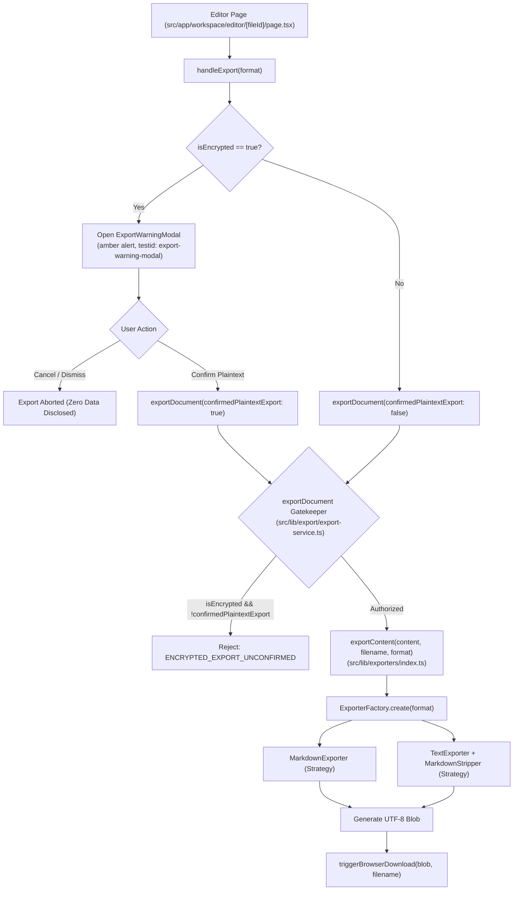

# Data Export & Governance Architecture Guide

## 1. Overview

The LUGX data export subsystem provides multi-format document serialization (Markdown `.md` and plain text `.txt`) coupled with a fail-closed **Zero-Knowledge Encrypted Content Governance Barrier**. It ensures that decrypted vault documents cannot be accidentally or silently written to unencrypted local disk storage without explicit user confirmation.

---

## 2. Subsystem Architecture

The export pipeline decouples security governance from format transformation strategies using a layered architecture:



---

## 3. Directory & File Organization

```
src/
├── components/
│   └── export/
│       ├── index.ts                     # Barrel export for export UI components
│       └── export-warning-modal.tsx     # Plaintext confirmation modal for encrypted files
├── lib/
│   ├── export/
│   │   └── export-service.ts            # High-level governed export service & download trigger
│   └── exporters/
│       ├── index.ts                     # Strategy factory & core format facade
│       ├── types.ts                     # Interfaces, error codes, and format types
│       ├── strategies/
│       │   ├── markdown-exporter.ts     # Markdown (.md) preservation strategy
│       │   └── text-exporter.ts         # Clean plain text (.txt) stripping strategy
│       └── utils/
│           ├── validator.ts             # Content & filename sanitization
│           └── markdown-stripper.ts     # Markdown syntax removal regex pipeline
└── test/
    └── export/
        ├── export-governance.test.ts    # Unit tests for export-service governance
        └── export-warning-modal.test.tsx # Component tests for ExportWarningModal
```

---

## 4. Component Contracts & Interfaces

### 4.1 Governed Export Service (`src/lib/export/export-service.ts`)

Provides the authoritative entry point for document export operations, enforcing Zero-Knowledge isolation:

```typescript
export interface ExportDocumentOptions {
    content: string;
    filename: string;
    format: ExportFormat;
    isEncrypted?: boolean;
    confirmedPlaintextExport?: boolean;
}

export async function exportDocument(options: ExportDocumentOptions): Promise<ExportResult>;
export function triggerBrowserDownload(blob: Blob, filename: string): void;
```

#### Behavior & Security Invariants:
1. **Fail-Closed Encryption Guard:** If `isEncrypted === true` and `confirmedPlaintextExport !== true`, execution halts immediately returning:
   ```typescript
   {
       success: false,
       error: "Export of encrypted document as unencrypted plaintext requires explicit user confirmation.",
       errorCode: "ENCRYPTED_EXPORT_UNCONFIRMED"
   }
   ```
2. **Deterministic Delegation:** Once cleared, passes execution to `exportContent(content, filename, format)`.
3. **Browser Download Trigger:** `triggerBrowserDownload(blob, filename)` manages object URL creation, temporary anchor invocation, and scheduled URL revocation (`setTimeout(..., 1000)`).

### 4.2 UI Plaintext Warning Dialog (`src/components/export/export-warning-modal.tsx`)

A keyboard-accessible, focus-trapped dialog alerting users before saving decrypted vault data to local storage.

#### Component Props:
```typescript
interface ExportWarningModalProps {
    isOpen: boolean;
    onClose: () => void;
    onConfirm: () => void;
    fileName: string;
    format: "md" | "txt";
}
```

#### Accessible Test Identifiers:
- `data-testid="export-warning-modal"`: Dialog overlay container
- `data-testid="confirm-export-button"`: High-visibility confirmation button
- `data-testid="cancel-export-button"`: Cancel dismissal button

### 4.3 Strategy Factory & Format Exporters (`src/lib/exporters/`)

#### Types (`src/lib/exporters/types.ts`):
```typescript
export type ExportFormat = 'md' | 'txt';

export type ExportErrorCode =
    | 'FILE_PERMISSION'
    | 'DISK_SPACE'
    | 'ENCODING_ERROR'
    | 'INVALID_CONTENT'
    | 'ENCRYPTED_EXPORT_UNCONFIRMED'
    | 'UNKNOWN';

export interface ExportResult {
    success: boolean;
    error?: string;
    errorCode?: ExportErrorCode;
    filename?: string;
    blob?: Blob;
}

export interface IExporter {
    export(content: string, filename: string): Promise<ExportResult>;
}
```

#### Implemented Strategies:
- **MarkdownExporter (`strategies/markdown-exporter.ts`):** Preserves raw Markdown AST syntax verbatim with MIME type `text/markdown;charset=utf-8`.
- **TextExporter (`strategies/text-exporter.ts`):** Strips headers, code blocks, links, emphasis, and blockquotes via `stripMarkdownSyntax()` with MIME type `text/plain;charset=utf-8`.

---

## 5. Usage in Editor Workspace

### Implementation in `src/app/workspace/editor/[fileId]/page.tsx`:

```typescript
// State initialization
const [isExportWarningOpen, setIsExportWarningOpen] = useState(false);
const [pendingExportFormat, setPendingExportFormat] = useState<"md" | "txt">("txt");

// Governed execution handler
const executeExport = useCallback(
    async (format: "md" | "txt", confirmedPlaintext: boolean) => {
        if (!adapter) return;

        try {
            const { exportDocument, triggerBrowserDownload } = await import("@/lib/export/export-service");
            const content = adapter.getValue();
            const result = await exportDocument({
                content,
                filename: title || "document",
                format,
                isEncrypted,
                confirmedPlaintextExport: confirmedPlaintext,
            });

            if (result.success && result.blob && result.filename) {
                triggerBrowserDownload(result.blob, result.filename);
            } else {
                setError(result.error || "Export failed");
            }
        } catch (err) {
            console.error("Export error:", err);
        }
    },
    [adapter, title, isEncrypted, setError]
);

// User-facing trigger checking encryption boundary
const handleExport = useCallback(
    async (format: "md" | "txt" = "txt") => {
        if (!adapter) return;

        if (isEncrypted) {
            setPendingExportFormat(format);
            setIsExportWarningOpen(true);
            return;
        }

        await executeExport(format, false);
    },
    [adapter, isEncrypted, executeExport]
);
```

---

## 6. Verification & Automated Test Coverage

The export subsystem and governance gates are verified by dedicated test suites:
- `src/test/export/export-governance.test.ts`:
  - Enforces `ENCRYPTED_EXPORT_UNCONFIRMED` error on unconfirmed encrypted export attempts.
  - Verifies successful export and download blob generation upon explicit user confirmation (`confirmedPlaintextExport: true`).
  - Verifies normal plaintext export behavior when `isEncrypted: false`.
  - Verifies invalid/empty content rejection (`INVALID_CONTENT`).
- `src/test/export/export-warning-modal.test.tsx`:
  - Verifies dialog visibility and content based on `isOpen` prop.
  - Verifies confirmation callback invocation on button click.
  - Verifies cancellation callback invocation on close button and Escape key press.
- `src/test/parsers/markdown-exporters.test.ts`:
  - Verifies Markdown content preservation.
  - Verifies Markdown syntax stripping in plain text export.
  - Verifies filename sanitization and extension enforcement.

---

**Documentation Version**: 1.38.0  
**Last Updated**: 2026-10-02  

