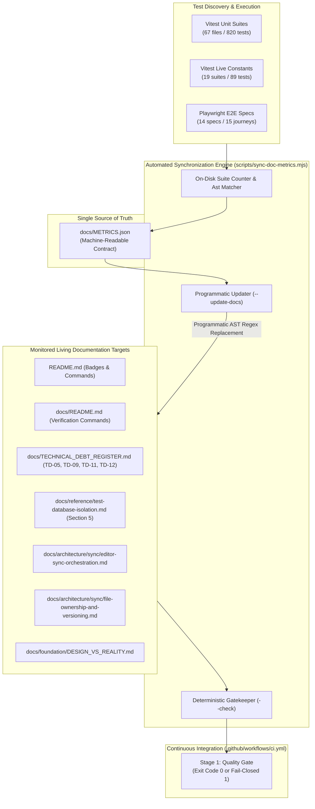

# Closure Report: Phase 1 — Documentation Metrics Unification, SSOT JSON Contract & Automated Debt Synchronization

**Milestone:** Pre-Phase 2 Core Hardening (`core-hardening`)  
**Phase:** Phase 1: Unification of Documentation Metrics, Automated Badges & Technical Debt Register  
**Status:** CLOSED ✅  
**Date:** 2026-09-25  
**Authoritative Artifacts:** `docs/METRICS.json`, `scripts/sync-doc-metrics.mjs`, `.github/workflows/ci.yml`, `docs/TECHNICAL_DEBT_REGISTER.md`, `docs/reference/test-database-isolation.md`, `docs/architecture/sync/editor-sync-orchestration.md`, `docs/README.md`.  
**Verification Baseline:** 67 Unit Suites / 820 Tests (100% Pass), 19 Live Suites / 89 Tests (100% Pass), 14 E2E Specs / 15 Journeys (100% Pass).  

---

## 1. Executive Summary & Problem Solved

Prior to Phase 1, repository documentation suffered from **Documentation Drift**: test counts and suite quantities were manually maintained across disparate markdown files (`TECHNICAL_DEBT_REGISTER.md`, `test-database-isolation.md`, `editor-sync-orchestration.md`, `README.md`). As new test suites were introduced (e.g. `ai-stream-abort-latency.test.ts`), legacy numbers (such as 812 tests, 797 tests, and 66 suites) lingered in various sections, creating discrepancies against active test execution.

Phase 1 establishes a deterministic, automated regime:
1. **Single Source of Truth (SSOT):** Centralized all test execution metrics into `docs/METRICS.json`.
2. **Deterministic CLI Engine:** Constructed `scripts/sync-doc-metrics.mjs` supporting both verification (`--check`) and programmatic file mutation (`--update-docs`).
3. **Number-Agnostic Contextual Scanning:** Replaced brittle literal-number matching with structural regexes across 8 monitored living documentation targets.
4. **CI Stage 1 Quality Gate:** Integrated `node scripts/sync-doc-metrics.mjs --check` into `.github/workflows/ci.yml`, guaranteeing that any future documentation drift fails the pipeline immediately (`Fail-Closed`).

---

## 2. Architecture & Data Flow



---

## 3. Verifiable Evidence

### 3.1 On-Disk Suite Count Verification
```text
All test files in src/test: 87
Live test files (vitest.constants.mts): 19
Cloud E2E files (vitest.constants.mts): 1
Active Unit & Contract test files: 67
Playwright E2E spec files (e2e/specs): 14
```

### 3.2 Programmatic Update Execution
```text
$ node scripts/sync-doc-metrics.mjs --update-docs
[sync-doc-metrics] Synchronized D:\Projects\LUGX\docs\METRICS.json contract with disk.
[sync-doc-metrics] Programmatically verified/updated 3 documentation file(s):
  ✔ docs\TECHNICAL_DEBT_REGISTER.md
  ✔ docs\reference\test-database-isolation.md
  ✔ docs\architecture\sync\editor-sync-orchestration.md
```

### 3.3 Zero-Drift Gatekeeper Audit
```text
$ node scripts/sync-doc-metrics.mjs --check
[sync-doc-metrics] Running deterministic documentation metrics verification...
[sync-doc-metrics] Active Metrics Contract:
  - Unit Suites: 67 (Disk: 67)
  - Unit Tests:  820
  - Live Suites: 19 (Constants: 19)
  - Live Tests:  89
  - E2E Specs:   14 (Disk: 14)
  - E2E Tests:   15

[sync-doc-metrics] SUCCESS: All documentation metrics and SSOT contracts are 100% synchronized.
Exit Code: 0
```

---

## 4. Scope Diff & File Modification Audit

| File Path | Classification | Change Description |
| :--- | :--- | :--- |
| `scripts/sync-doc-metrics.mjs` | `CODE EXCLUSIVE (TOOLING)` | Built automated verification, report ingestion, and programmatic multi-document updater. |
| `docs/METRICS.json` | `LIVING CONTRACT (SSOT)` | Created machine-readable single source of truth for repository test metrics. |
| `.github/workflows/ci.yml` | `CI PIPELINE` | Added `Verify Documentation Metrics & SSOT Sync` step under Stage 1 Quality Gate. |
| `docs/TECHNICAL_DEBT_REGISTER.md` | `LIVING REGISTER` | Replaced stale 812 and 797 figures across TD-05, TD-09, TD-11, and TD-12 with active 820 baseline via script. |
| `docs/reference/test-database-isolation.md` | `LIVING CONTRACT` | Purged confusing legacy Phase 10 figures; elevated active 67 suites / 820 tests baseline in Section 5. |
| `docs/architecture/sync/editor-sync-orchestration.md` | `LIVING SPEC` | Updated line 440 to match 820/820 tests passing via script. |
| `docs/README.md` | `STRUCTURAL INDEX` | Registered `METRICS.json` under Central Registers and added `core-hardening/` to closures tree. |
| `docs/records/closures/core-hardening/phase-01-doc-metrics-and-debt-sync-closure.md` | `PERMANENT HISTORY` | Authoritative closure dossier for Phase 1. |

---

## 5. Architectural Invariants Enforced

1. **Zero Manual Number Updates:** Any future change to test numbers must be propagated via `node scripts/sync-doc-metrics.mjs --update-docs` or `--report=<path>`. Manual edits to metrics strings in living docs are strictly deprecated.
2. **Fail-Closed CI Enforcement:** The CI pipeline cannot pass Stage 1 if any living document diverges from `docs/METRICS.json` or if disk test suites differ from documented contracts.
3. **Purity of Records:** Historical changelogs (`docs/CHANGELOG.md`) and prior phase closures (`docs/records/closures/`) remain immutable archives and are intentionally exempted from retroactive overwriting.
