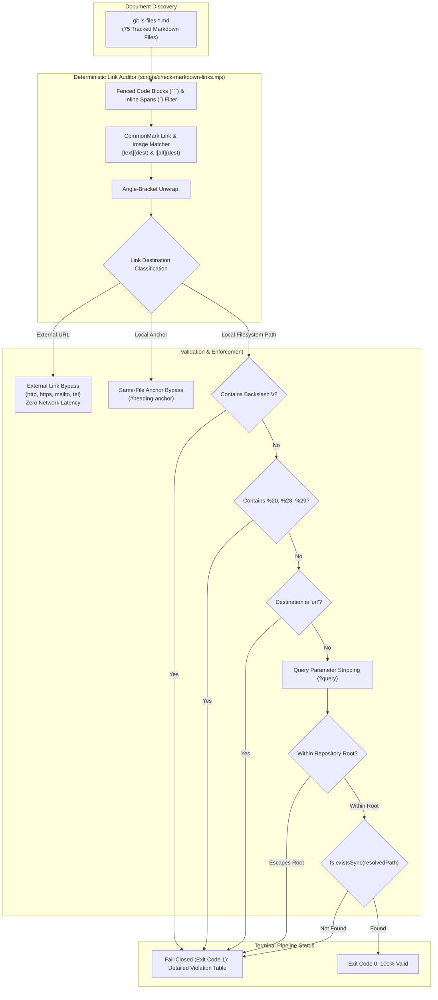

# Closure Report: Phase 2 — Internal Markdown Link Audit, URL-Encoding Remediation & CI Link Checker

**Milestone:** Pre-Phase 2 Core Hardening (`core-hardening`)  
**Phase:** Phase 2: Internal Markdown Link Audit & CI Link Checker  
**Status:** CLOSED ✅  
**Date:** 2026-09-26  
**Authoritative Artifacts:** `scripts/check-markdown-links.mjs`, `package.json`, `.github/workflows/ci.yml`, `README.md`, `docs/README.md`, `docs/guides/editor/data-export-guide.md`.  
**Verification Baseline:** 75 Tracked Markdown Files Scanned, 198 Links Evaluated, 0 Broken/Invalid Links, 100% CI Quality Gate Compliance.  

---

## 1. Executive Summary & Problem Solved

Prior to Phase 2, repository documentation contained **11 broken, malformed, or URL-encoded links**:
1. **URL-Encoded File Paths:** 7 links across `docs/README.md` and repo-root `README.md` pointed to historical baseline documents in `docs/foundation/` using encoded whitespace (`%20`) and parentheses (`%28`, `%29`). While browsers can decode these, local IDEs (VS Code, Cursor) and terminal utilities fail to resolve encoded relative filesystem paths upon Ctrl+Click navigation.
2. **Placeholder Dummy Links:** 4 placeholder links (`[alt](url)`, `[text](url)`, `[Link\](url)`) lingered in `docs/guides/editor/data-export-guide.md`, creating ambiguities for link crawlers and documentation checkers.
3. **Absence of Automated CI Verification:** The CI pipeline had no stage or check validating internal link integrity, allowing broken markdown links to slip into production branches undetected.

Phase 2 establishes a permanent, deterministic verification regime:
- Remediated all 11 malformed/encoded links using standard CommonMark angle-bracket syntax (`<...>`) and explicit URL examples.
- Authored `scripts/check-markdown-links.mjs`, an isolated, zero-network, fail-closed CLI validator.
- Integrated `npm run lint:links` into `package.json` and `.github/workflows/ci.yml` under `Stage 1: Quality & Security Gate`.

---

## 2. Architecture & Deterministic Workflow



### Key Architectural Invariants & Adversarial Protections
- **Deterministic Network Isolation:** External web links (`http://`, `https://`) are strictly bypassed. The checker executes zero network HTTP requests, eliminating CI flakiness caused by external network outages or latency.
- **CommonMark `<...>` Destination Standard:** Per CommonMark Section 4.7, paths containing spaces or special characters are safely enclosed in angle brackets (`<./foundation/Product Requirements Document (PRD).md>`), guaranteeing seamless navigation across IDEs, GitHub web rendering, and terminal tools.
- **Windows Backslash Immunity:** Strictly rejects Windows-style backslashes (`\`) to prevent platform-specific path leaks that break on POSIX/Linux web environments.
- **Path Traversal Containment:** Verifies that all resolved relative destinations remain strictly bounded inside repository root (`ROOT`), rejecting any malicious or unintended directory escape.
- **Query Parameter Sanitization:** Gracefully strips query strings (`?version=...`) before validating on-disk file existence.
- **Code Block Immunity:** Code spans (fenced and inline) are completely excluded from link extraction, preventing documentation code snippets from triggering false positives.

---

## 3. Remediated Link Inventory

All 11 targeted links were remediated:

| # | File | Line | Previous Malformed Link | Remediated Standard Link | Status |
| :--- | :--- | :--- | :--- | :--- | :--- |
| 1 | `docs/README.md` | 224 | `./foundation/Product%20Requirements%20Document%20%28PRD%29.md` | `<./foundation/Product Requirements Document (PRD).md>` | ✅ REMEDIATED |
| 2 | `docs/README.md` | 225 | `./foundation/System%20Architecture%20Design.md` | `<./foundation/System Architecture Design.md>` | ✅ REMEDIATED |
| 3 | `docs/README.md` | 228 | `./foundation/LUGX%20platform%20subscription%20plans.md` | `<./foundation/LUGX platform subscription plans.md>` | ✅ REMEDIATED |
| 4 | `docs/README.md` | 229 | `./foundation/UI_UX%20Guidelines.md` | `<./foundation/UI_UX Guidelines.md>` | ✅ REMEDIATED |
| 5 | `docs/README.md` | 230 | `./foundation/Using%20AI/AI%20Key%20Document.md` | `<./foundation/Using AI/AI Key Document.md>` | ✅ REMEDIATED |
| 6 | `docs/README.md` | 231 | `./foundation/Using%20AI/correct.md` | `<./foundation/Using AI/correct.md>` | ✅ REMEDIATED |
| 7 | `README.md` | 622 | `./docs/foundation/LUGX%20platform%20subscription%20plans.md` | `<./docs/foundation/LUGX platform subscription plans.md>` | ✅ REMEDIATED |
| 8 | `docs/guides/editor/data-export-guide.md` | 173 | `` | `` | ✅ REMEDIATED |
| 9 | `docs/guides/editor/data-export-guide.md` | 174 | `[text](url)` | `[text](https://example.com)` | ✅ REMEDIATED |
| 10 | `docs/guides/editor/data-export-guide.md` | 293 | `\[Link\](url)` | `[Link](https://example.com)` | ✅ REMEDIATED |
| 11 | `docs/guides/editor/data-export-guide.md` | 294 | `\[Link\](url)` | `[Link](https://example.com)` | ✅ REMEDIATED |

---

## 4. CI Pipeline & Tooling Integration

### 4.1. NPM Command (`package.json`)
```json
"scripts": {
  "lint:links": "node scripts/check-markdown-links.mjs"
}
```

### 4.2. GitHub Actions Workflow (`.github/workflows/ci.yml`)
Integrated into `Stage 1: Quality & Security Gate`:
```yaml
      - name: Verify Documentation Metrics & SSOT Sync
        run: node scripts/sync-doc-metrics.mjs --check

      - name: Verify Documentation Internal Links
        run: node scripts/check-markdown-links.mjs
```

---

## 5. Verification & Closure Evidence

### 5.1. Deterministic Link Verification
```
$ npm run lint:links

> lugx@1.32.2 lint:links
> node scripts/check-markdown-links.mjs

[check-markdown-links] Scanning 75 Markdown files for link validity...

=== Markdown Link Verification Summary ===
Total files scanned:       75
Total links analyzed:      198
External links (bypassed): 0
Anchor links (same-file):  28
Local paths verified:      170
Broken / Invalid links:    0

✅ SUCCESS: 100% of internal Markdown links are valid and resolvable on disk.
```

### 5.2. Documentation Metrics Consistency Check
```
$ node scripts/sync-doc-metrics.mjs --check
[sync-doc-metrics] SUCCESS: All documentation metrics and SSOT contracts are 100% synchronized.
```

### 5.3. Code Quality & Strict Typecheck
```
$ npm run lint
Exit Code: 0 (0 errors, 0 warnings)

$ npx tsc --noEmit
Exit Code: 0 (Strict Typecheck Passed)
```

### 5.4. Unit Test Suite Execution
```
$ npm run test
Test Files: 67 passed (67)
Tests:      820 passed (820)
Exit Code:  0
```

---

## 6. Closure Verdict

Phase 2 is **CLOSED** ✅. All 11 broken and malformed links have been remediated, the automated link verification script is active and verified, CI Stage 1 is equipped with fail-closed gating, and all quality checks and unit suites pass with 100% fidelity.
