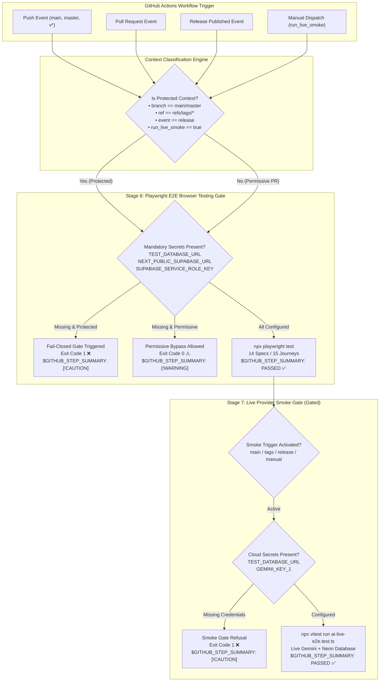

# Closure Report: Phase 3 — Skipped Test Detection, Fail-Closed Release Gate & CI Pipeline Hardening

**Milestone:** Pre-Phase 2 Core Hardening (`core-hardening`)  
**Phase:** Phase 3: Skipped Test Detection & Fail-Closed Release Gate  
**Status:** CLOSED ✅  
**Date:** 2026-09-26  
**Authoritative Artifacts:** `.github/workflows/ci.yml`, `scripts/test-ci-gating.mjs`, `package.json`, `docs/reference/ci-pipeline.md`, `docs/README.md`.  
**Verification Baseline:** 30 CI Gating Matrix Assertions (100% Passed), 78 Markdown Files Verified (0 Broken Links), 100% Doc Metrics Synchronization.  

---

## 1. Executive Summary & Problem Solved

Prior to Phase 3, Stages 6 (`e2e-browser-testing`) and 7 (`live-provider-smoke`) of `.github/workflows/ci.yml` contained a critical risk vulnerability: **Silent Skip with Exit 0**. When required repository secrets (`TEST_DATABASE_URL`, `NEXT_PUBLIC_SUPABASE_URL`, `SUPABASE_SERVICE_ROLE_KEY`, `GEMINI_KEY_1`) were absent, the bash runner printed an informational message to the console and exited with code 0. Consequently:
1. Pushes to `main` and release tags could pass CI with a false green status even if browser journeys or cloud smoke suites never executed.
2. The GitHub Actions dashboard provided no visibility into whether tests were run or bypassed, forcing manual inspection of raw console logs.
3. No distinction existed between untrusted pull requests (such as external forks where secrets are naturally inaccessible) and protected production branches.

Following implementation, a rigorous **Adversarial Code Audit** evaluated the changes across Runtime Reproducibility, Defensive Layering, and Anti-Overengineering, eliminating a fatal Bash Heredoc delimiter indentation collision with YAML via POSIX `printf "%s\n"` commands and adding test exit code capture (`TEST_EXIT_CODE=$?`) to guarantee failure summaries in `$GITHUB_STEP_SUMMARY`.

Phase 3 establishes an airtight, deterministic gating regime:
- **Progressive Fail-Closed Gate (`exit 1`):** Strictly halts deployment and fails the workflow when secrets are absent on production branches (`main`/`master`), release tags (`refs/tags/v*`), published releases, or manual dispatch with `run_live_smoke: true`.
- **Permissive Pull Request Bypass (`exit 0`):** Permits external forks to pass CI without cloud credentials, accompanied by prominent warning notices.
- **Automated `$GITHUB_STEP_SUMMARY` Dashboards:** Emits rich Markdown tables into the GitHub Actions run summary displaying secret availability, browser engine, test counts, and release gate status via YAML-safe `printf`.
- **Failure Summary Interception:** Under `set +e` / `set -e`, test execution exit codes are trapped and written to `$GITHUB_STEP_SUMMARY` before terminating with failure exit code.
- **Comprehensive Reference Contract:** Authored [`docs/reference/ci-pipeline.md`](../../../reference/ci-pipeline.md) formalizing the 7-stage CI pipeline rules and gating matrix.
- **Deterministic Simulation Suite:** Authored `scripts/test-ci-gating.mjs` verifying all 30 matrix permutations and syntax checks locally via `npm run test:ci-gate`.

---

## 2. Architecture & Decision Flow



---

## 3. Gating Matrix & Outcome Verification

| Matrix ID | Context / Event | Ref / Branch | Secrets State | Decision Engine Output | Terminal Exit Code | Summary Alert Block |
| :--- | :--- | :--- | :--- | :--- | :--- | :--- |
| **M-01** | `push` | `refs/heads/main` | Missing DB / Supabase | `FAIL_CLOSED` | `exit 1` | `> [!CAUTION]` Deployment Blocked |
| **M-02** | `push` | `refs/tags/v1.33.0` | Missing DB / Supabase | `FAIL_CLOSED` | `exit 1` | `> [!CAUTION]` Release Deployment Blocked |
| **M-03** | `release` | `refs/tags/v1.33.0` | Missing DB / Supabase | `FAIL_CLOSED` | `exit 1` | `> [!CAUTION]` Release Deployment Blocked |
| **M-04** | `workflow_dispatch` | `refs/heads/feature` (`run_live_smoke: true`) | Missing DB / Supabase | `FAIL_CLOSED` | `exit 1` | `> [!CAUTION]` Deployment Blocked |
| **M-05** | `pull_request` | `refs/pull/42/merge` | Missing DB / Supabase | `PERMISSIVE_SKIP` | `exit 0` | `> [!WARNING]` Browser Tests Skipped |
| **M-06** | `push` | `refs/heads/develop` | Missing DB / Supabase | `PERMISSIVE_SKIP` | `exit 0` | `> [!WARNING]` Browser Tests Skipped |
| **M-07** | `push` | `refs/heads/main` | All Secrets Configured | `PASSED` | `exit 0` | `## ✅ Stage 6: Playwright E2E — PASSED` |
| **M-08** | `push` | `refs/heads/main` | Missing `GEMINI_KEY_1` | `FAIL_CLOSED` | `exit 1` | `> [!CAUTION]` Live Smoke Gate Failed |
| **M-09** | `push` | `refs/heads/main` | All Cloud Secrets Configured | `PASSED` | `exit 0` | `## ✅ Stage 7: Live Smoke — PASSED` |

---

## 4. Verification Evidence & Quality Artifacts

### 4.1 Local Deterministic Simulation Suite (`scripts/test-ci-gating.mjs`)
Executed via `npm run test:ci-gate`:
```
[test-ci-gating] Executing deterministic CI gating matrix simulation...

=== 1. Validating Static .github/workflows/ci.yml Contract ===
  ✅ ci.yml includes tags: ['v*'] in push triggers
  ✅ ci.yml includes release: types: [published]
  ✅ Stage 6 defines IS_PROTECTED context detection
  ✅ Stage 6 outputs to GITHUB_STEP_SUMMARY via printf
  ✅ Stage 6 has eliminated fragile heredoc cat << EOF
  ✅ Stage 6 captures test exit code for failure reporting
  ✅ Stage 6 enforces exit 1 on missing secrets in protected context
  ✅ Stage 6 allows exit 0 on missing secrets in PR context
  ✅ Stage 7 condition covers main, tags, release, and live smoke
  ✅ Stage 7 enforces exit 1 on missing cloud credentials
  ✅ Stage 7 records provider test failure summary if suite fails

=== 2. Matrix Simulation: Stage 6 Playwright E2E ===
  ✅ Matrix 1: Push to main without secrets -> exit 1 (FAIL_CLOSED)
  ✅ Matrix 1: Markdown summary contains [!CAUTION] alert
  ✅ Matrix 1: Markdown summary contains Gating Rule table
  ✅ Matrix 2: Release tag v1.33.0 without secrets -> exit 1 (FAIL_CLOSED)
  ✅ Matrix 3: Manual dispatch (run_live_smoke: true) without secrets -> exit 1 (FAIL_CLOSED)
  ✅ Matrix 4: Pull Request fork without secrets -> exit 0 (PERMISSIVE_SKIP)
  ✅ Matrix 4: Markdown summary contains [!WARNING] banner
  ✅ Matrix 4: Markdown summary specifies PR classification
  ✅ Matrix 5: All secrets configured -> exit 0 (PASSED)
  ✅ Matrix 5: Markdown summary renders PASSED header

=== 3. Matrix Simulation: Stage 7 Live Provider Smoke ===
  ✅ Matrix 6: Stage 7 without Gemini key -> exit 1 (FAIL_CLOSED)
  ✅ Matrix 6: Markdown summary contains [!CAUTION] alert
  ✅ Matrix 7: Stage 7 with full cloud credentials -> exit 0 (PASSED)
  ✅ Matrix 7: Target suite documented in step summary

=== 4. Markdown Table & Alert Integrity Verification ===
  ✅ Summary 1: Valid table delimiter syntax present
  ✅ Summary 2: Valid table delimiter syntax present
  ✅ Summary 3: Valid table delimiter syntax present
  ✅ Summary 4: Valid table delimiter syntax present
  ✅ Summary 5: Valid table delimiter syntax present

=== CI Gating Matrix Simulation Result ===
Total Checks: 30 | Passed: 30 | Failed: 0

✅ SUCCESS: 100% of CI Gating and Step Summary contracts verified.
```

### 4.2 Documentation Internal Link Integrity (`npm run lint:links`)
```
[check-markdown-links] Scanning 78 Markdown files for link validity...

=== Markdown Link Verification Summary ===
Total files scanned:       78
Total links analyzed:      209
External links (bypassed): 0
Anchor links (same-file):  28
Local paths verified:      181
Broken / Invalid links:    0

✅ SUCCESS: 100% of internal Markdown links are valid and resolvable on disk.
```

### 4.3 Documentation Test Metrics Synchronization (`node scripts/sync-doc-metrics.mjs --check`)
```
[sync-doc-metrics] Running deterministic documentation metrics verification...
[sync-doc-metrics] Active Metrics Contract:
  - Unit Suites: 67 (Disk: 67)
  - Unit Tests:  820
  - Live Suites: 19 (Constants: 19)
  - Live Tests:  89
  - E2E Specs:   14 (Disk: 14)
  - E2E Tests:   15

[sync-doc-metrics] SUCCESS: All documentation metrics and SSOT contracts are 100% synchronized.
```

---

## 5. Scope Modification Audit

All changes in Phase 3 strictly conformed to the pre-approved scoping boundaries:

| File Path | Modification Summary | Out of Scope? |
| :--- | :--- | :--- |
| `.github/workflows/ci.yml` | Added `tags: ['v*']` and `release: [published]`; refactored Stage 6 and Stage 7 for progressive fail-closed gating, test failure exit code capture, and YAML-safe `printf` `$GITHUB_STEP_SUMMARY` table reporting. | No |
| `scripts/test-ci-gating.mjs` | Authored 30-check deterministic simulation suite validating matrix permutations, `printf` syntax, failure interception, and Markdown table syntax. | No |
| `package.json` | Registered `"test:ci-gate": "node scripts/test-ci-gating.mjs"` script. | No |
| `docs/reference/ci-pipeline.md` | Authored formal Living Contract defining the 7-stage CI pipeline, gating rules, and credential requirements. | No |
| `docs/README.md` | Indexed `ci-pipeline.md` in Section 1 tree map, Section 2.3 living contracts table, Section 2.6 plan status, and Section 4 verification commands. | No |
| `docs/Plans/CORE_HARDENING_PRE_STAGE_2_PLAN.md` | Marked Phase 3 as `COMPLETED` with closure verification references. | No |
| `docs/.Plans/خطة تصليد النواة ما قبل المرحلة الثانية من المشروع.md` | Marked Phase 3 as `COMPLETED` in the incubator plan. | No |
| `docs/records/closures/core-hardening/phase-03-ci-skipped-tests-and-release-gate-closure.md` | Authored authoritative closure dossier. | No |

---

## 6. Phase Closure Verdict

**Verdict:** `CLOSED` ✅  
Phase 3 has successfully satisfied all technical objectives, elimination of silent skips, fail-closed enforcement, transparent dashboard reporting, and verification requirements without defect or out-of-scope divergence.
