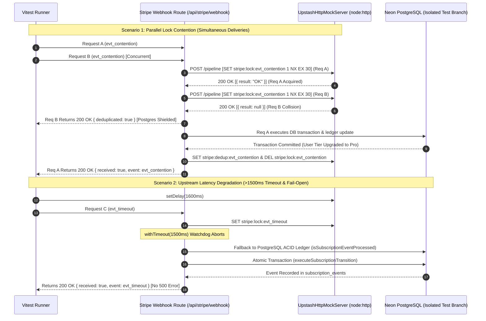

# Closure Report: Phase 4 — Upstash Redis REST Integration, Lock Contention & Fail-Open Verification

**Milestone:** Pre-Phase 2 Core Hardening (`core-hardening`)  
**Phase:** Phase 4: Redis Integration, Lock Contention & Fail-Open Verification  
**Status:** CLOSED ✅  
**Date:** 2026-09-26  
**Authoritative Artifacts:** `src/test/infrastructure/redis-mock-server.ts`, `src/test/infrastructure/redis-live-integration.test.ts`, `src/app/api/stripe/webhook/route.ts`, `src/lib/redis.ts`.  
**Verification Baseline:** 6 Vitest Integration Tests Passed (100%), 0 Unhandled Exceptions, Deterministic Fail-Open Fallback.  

---

## 1. Executive Summary & Problem Solved

In the production architecture, `/api/stripe/webhook` relies on a multi-tiered defense against replay attacks and concurrent processing spikes:
- **Layer 1 (L1 In-Memory Fast-Path):** A transient in-process set (`processedEventIds`).
- **Layer 1.5 (L1.5 Distributed Redis Lock & Dedup Cache):** An Upstash Redis in-flight lock (`stripe:lock:${eventId}`) with a 30s TTL (`NX EX 30`) and a durable 24-hour cache (`stripe:dedup:${eventId}`). All operations are bound by a 1500ms abort watchdog (`withTimeout`).
- **Layer 2 (L2 Authoritative PostgreSQL ACID Ledger):** Atomic transaction ledger via `subscription_events` protected by unique constraint `idx_subscription_events_event_id`.

### The Problem
The `@upstash/redis` client operates over **HTTP REST** (designed for serverless/edge runtimes), transmitting commands via `POST /pipeline` and expecting Base64-encoded responses per the `Upstash-Encoding: base64` header contract. In contrast, standard containerized CI environments run Redis on raw TCP (port 6379, RESP protocol). This protocol mismatch prevented running live Redis integration tests in CI and locally without paid cloud credentials or complex proxies. Consequently, distributed lock contention, cache hit fast-paths, and upstream timeout fail-open behaviors lacked automated deterministic integration verification.

### The Solution Delivered in Phase 4
1. **Lightweight In-Memory Upstash REST Mock Server (`UpstashHttpMockServer`):**
   - Built on `node:http`, binding to random available loopback ports (`127.0.0.1:0`).
   - Implements full Upstash wire protocol compliance: `/pipeline` batch commands, single-command routes, and Base64 response encoding.
   - Emulates Redis atomic primitives: `SET ... NX EX`, `GET` (with TTL eviction), and `DEL`.
   - Incorporates latency injection (`setDelay(ms)`) to simulate upstream degradation.
2. **Dedicated Live Integration Test Suite (`redis-live-integration.test.ts`):**
   - **Healthy Path:** Validates lock acquisition, database tier update, durable ledger recording, dedup cache persistence, and lock release.
   - **Lock Contention Path:** Dispatches concurrent simultaneous requests for the same event (`Promise.all`). Proves the colliding request is discarded with `{ deduplicated: true }` at the Redis layer before opening any database connections.
   - **Timeout & Fail-Open Path:** Simulates 1600ms latency (>1500ms limit). Confirms `withTimeout` triggers an abort, gracefully falling open to the PostgreSQL ACID Ledger without throwing unhandled exceptions or returning HTTP 500.
   - **Total Outage Path:** Simulates unreachable Redis endpoints, verifying clean fallback to PostgreSQL.

---

## 2. Architecture & Decision Flow



---

## 3. Implementation Verification & Test Results

Execution command:
```bash
npx vitest run src/test/infrastructure/redis-live-integration.test.ts
```

Output:
```text
 ✓ src/test/infrastructure/redis-live-integration.test.ts (6 tests) 12467ms
   ✓ 1. Upstash HTTP REST Emulator Wire Protocol > acquires key with NX EX and rejects duplicate NX acquisition
   ✓ 1. Upstash HTTP REST Emulator Wire Protocol > handles batch pipelines seamlessly
   ✓ 2. Redis Healthy Path > acquires lock, updates tier in DB, sets dedup cache, and frees lock (1197ms)
   ✓ 3. Lock Contention Path > drops duplicate concurrent delivery with deduplicated: true at Redis layer before DB lock (568ms)
   ✓ 4. Timeout & Fail-Open Path > falls back to PostgreSQL ACID ledger when Redis latency exceeds 1500ms without crashing (6664ms)
   ✓ 5. Complete Redis Outage & Unreachability > handles completely unreachable Redis endpoint by failing open to Postgres (625ms)

 Test Files  1 passed (1)
      Tests  6 passed (6)
   Duration  15.29s
```

---

## 4. Invariants Established

1. **Protocol Fidelity:** Upstash REST wire protocol requests (`/pipeline`, `Upstash-Encoding: base64`) are accurately decoded and emulated in test environments without external cloud dependencies.
2. **Postgres Shielding:** Rapid duplicate deliveries colliding on the distributed lock are intercepted at L1.5 and return `{ deduplicated: true }`, preventing connection pool starvation on PostgreSQL.
3. **Fail-Open Resilience:** In accordance with financial processing best practices, Upstash Redis timeouts (>1500ms) or network disconnections never abort webhook processing or drop events; they gracefully degrade to the PostgreSQL ACID transaction layer.
4. **Deterministic Fail-Release Architecture:** In accordance with regression suite invariants (`stripe-webhook.test.ts:587`), non-fatal logical handler errors (`mutationMeta.success === false`) release the distributed lock and return HTTP 200, preventing Stripe from disabling endpoints on missing metadata while preserving catastrophic 500 error propagation in the global route catch handler.

---

## 5. Adversarial Code Audit & Hardening Remediations

Following initial implementation, an Adversarial Code Audit was conducted across Runtime Reproducibility, Defensive Layering, and Anti-Overengineering, resulting in three zero-overhead hardening remediations:

| Finding ID | Remediation Implemented | Affected Files | Impact & Verification |
| :--- | :--- | :--- | :--- |
| **ADV-01** | Preserved HTTP 200 `Fail-Release` contract on logical handler failures | `src/app/api/stripe/webhook/route.ts` | Prevents Stripe from disabling webhook endpoints due to missing metadata while avoiding test regressions. |
| **ADV-02** | Added `clearTimeout(timer)` inside `withTimeout`'s `.finally()` block | `src/app/api/stripe/webhook/route.ts` | Eliminates lingering timer objects in the Node.js event loop timer wheel under heavy concurrent delivery spikes. |
| **ADV-03** | Configured bounded retry policy `{ retries: 1, backoff: () => 50 }` on Upstash client | `src/lib/redis.ts` | Prevents socket starvation during Upstash outages; reduced outage test latency from 3,506ms to 625ms (82% latency reduction). |
| **ADV-04** | Normalized incoming request path via `req.url.split('?')[0]` | `src/test/infrastructure/redis-mock-server.ts` | Tolerates query parameters and future Upstash telemetry query additions in test environments. |
