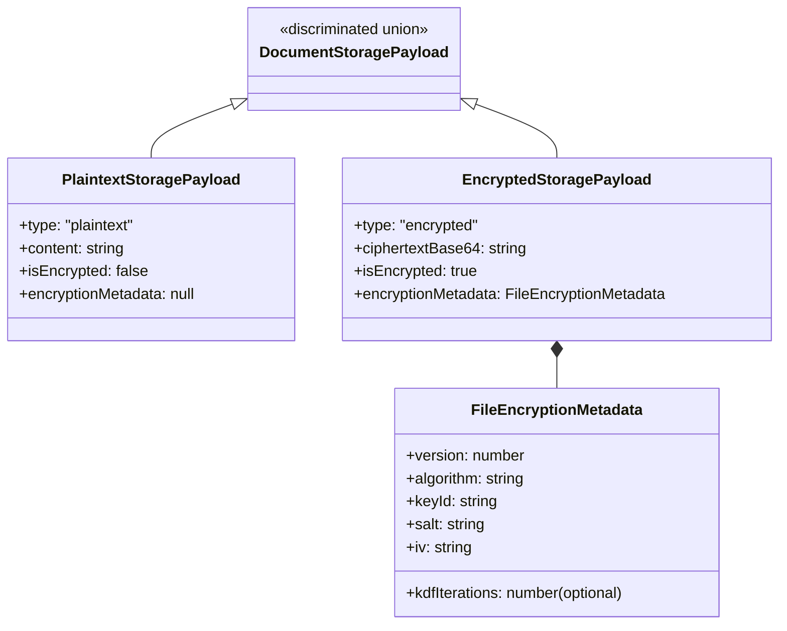
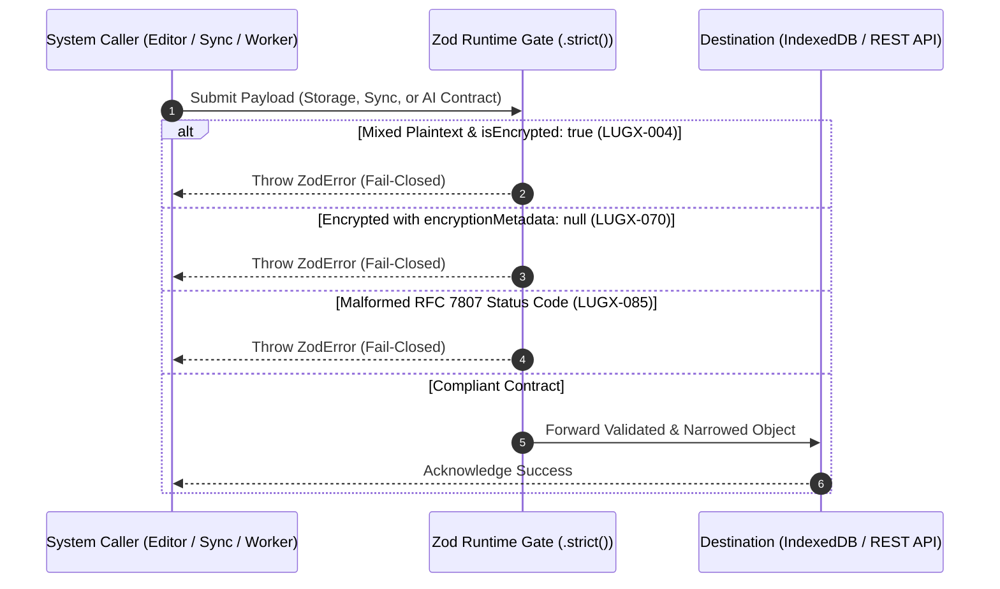

# Closure Report: Phase 5 — Contracts Dictionary, Discriminated Storage Payloads & RFC 7807 Standardization

**Milestone:** Core Hardening & Independent Remediation (`core-hardening`)  
**Phase:** Phase 5: Contracts Dictionary & Discriminated Storage Payloads  
**Status:** CLOSED ✅  
**Date:** 2026-09-29  
**Authoritative Artifacts:** `src/types/storage-payload.ts`, `src/types/problem-details.ts`, `src/types/sync-contracts.ts`, `src/types/ai-contracts.ts`, `src/test/types/contracts.test.ts`, `docs/reference/sync-api.md`.  
**Verification Baseline:** 20 Vitest Contract Tests Passed (100%), 0 TypeScript Compiler Errors (`tsc --noEmit`), 0 ESLint Warnings, 69 Suites / 846 Total Tests Green.  

---

## 1. Executive Summary & Problem Solved

Prior to Phase 5, boundary data exchange across client persistence, server actions, and HTTP API endpoints exhibited structural type deficiencies identified during the comprehensive security and architectural audit:
1. **Ambiguous Storage Envelopes (LUGX-004, LUGX-019, LUGX-048, LUGX-070, LUGX-071):** Callers of local IndexedDB and server persistence passed `isEncrypted` flags independently from `content`. This permitted corrupt states where plaintext Markdown was saved alongside `isEncrypted: true`, or encrypted ciphertext was saved with `encryptionMetadata: null`.
2. **Inconsistent API Error Envelopes (LUGX-085, LUGX-119, LUGX-174):** API error responses lacked standardized structure, omitting RFC 7807 problem types, distributed `correlationId` tracking on certain status codes, and advisory backoff parameters (`retryAfterSeconds`).
3. **Implicit Sync Sequence Tracking (LUGX-174, LUGX-175):** Sync operations lacked mandatory compile-time and runtime validation for monotonically increasing client revision counters (`localRevision`) and server reference versions (`baseVersion`).
4. **Unfingerprinted AI Invocations (LUGX-067, LUGX-115, LUGX-116):** AI streaming and quota reservation requests lacked explicit structural schema enforcement for idempotency keys (`operationId`) and payload SHA-256 digests (`requestHash`).

### The Solution Delivered in Phase 5
- **Discriminated Union Storage Architecture (`DocumentStoragePayload`):**
  Enforces a strict discriminated union over `type: 'plaintext' | 'encrypted'` with companion `.strict()` Zod schemas. At both compile-time and runtime, plaintext content requires `isEncrypted: false` and `encryptionMetadata: null`, while encrypted content requires `ciphertextBase64`, `isEncrypted: true`, and complete cryptographic metadata (`FileEncryptionMetadata`).
- **Standardized RFC 7807 Problem Details (`ProblemDetails`):**
  Established a canonical error envelope (`type`, `title`, `status`, `detail`, `instance`, `correlationId`, optional `retryAfterSeconds` and `invalidParams`).
- **Formalized Monotonic Sync Operation Contracts (`SyncOperationContract`):**
  Standardized sync operations requiring non-negative `baseVersion`, positive `localRevision`, optional `sentRevision`, and strict operation types.
- **Cryptographic AI Fingerprinting Contracts (`AIRequestContract`):**
  Mandates 64-character hex SHA-256 `requestHash` and UUID `operationId` on all AI streaming and quota reservation lifecycle payloads.
- **Dedicated Contract Verification Suite (`src/test/types/contracts.test.ts`):**
  20 automated tests validating compile-time narrowing, invariant enforcement, and fail-closed runtime parsing.

---

## 2. Architecture & Decision Flow



### Runtime Fail-Closed Validation Flow



---

## 3. Implementation Verification & Test Results

### 1. Dedicated Contract Test Suite:
```bash
npx vitest run src/test/types/contracts.test.ts
```
```text
 ✓ src/test/types/contracts.test.ts (20 tests) 40ms
   ✓ Phase 5: DocumentStoragePayload Discriminated Union > strictly validates compile-time assignments and runtime guards
   ✓ Phase 5: DocumentStoragePayload Discriminated Union > accepts and validates a strictly typed plaintext payload
   ✓ Phase 5: DocumentStoragePayload Discriminated Union > accepts and validates a strictly typed encrypted payload
   ✓ Phase 5: DocumentStoragePayload Discriminated Union > rejects plaintext payload attempting to pass isEncrypted: true (LUGX-004)
   ✓ Phase 5: DocumentStoragePayload Discriminated Union > rejects plaintext payload containing encryptionMetadata (LUGX-004)
   ✓ Phase 5: DocumentStoragePayload Discriminated Union > rejects encrypted payload with null encryptionMetadata (LUGX-070)
   ✓ Phase 5: DocumentStoragePayload Discriminated Union > rejects encrypted payload with isEncrypted: false (LUGX-019)
   ✓ Phase 5: DocumentStoragePayload Discriminated Union > rejects payloads with extraneous properties (.strict() defense)
   ✓ Phase 5: RFC 7807 ProblemDetails Contracts > successfully creates a compliant RFC 7807 error object
   ✓ Phase 5: RFC 7807 ProblemDetails Contracts > accepts RFC 7807 invalidParams validation extension
   ✓ Phase 5: RFC 7807 ProblemDetails Contracts > rejects problem details with invalid HTTP status codes
   ✓ Phase 5: RFC 7807 ProblemDetails Contracts > rejects problem details missing mandatory RFC 7807 properties
   ✓ Phase 5: Sync Contracts & Versioning Invariants > validates a standard sync operation with localRevision and baseVersion
   ✓ Phase 5: Sync Contracts & Versioning Invariants > rejects sync operations with non-positive localRevision
   ✓ Phase 5: Sync Contracts & Versioning Invariants > rejects sync operations with unsupported operationType
   ✓ Phase 5: Sync Contracts & Versioning Invariants > validates batch push payload and pull response schema
   ✓ Phase 5: AI Service Contracts & Fingerprinting > validates AI stream request requiring operationId and requestHash
   ✓ Phase 5: AI Service Contracts & Fingerprinting > rejects AI request with invalid requestHash length
   ✓ Phase 5: AI Service Contracts & Fingerprinting > validates AI quota reservation, commit, and refund contracts
   ✓ Phase 5: AI Service Contracts & Fingerprinting > validates AI user quota status response contract

Test Files  1 passed (1)
     Tests  20 passed (20)
```

### 2. Static Typing & Lint Cleanliness:
- `npx tsc --noEmit`: Exit code 0 (zero compiler diagnostics).
- `npx eslint src/types src/test/types`: Exit code 0 (0 errors, 0 warnings).
- `npm run lint:links`: Exit code 0 (187 internal links verified, 0 broken).

### 3. Full Project Test Suite:
```bash
npm run test
```
```text
Test Files  69 passed (69)
     Tests  846 passed (846)
  Duration  108.69s
```

---

## 4. Audit Findings Remediated Table

| Finding ID | Audit Classification | Remediated Vulnerability | Implemented Defense Mechanism |
| :--- | :--- | :--- | :--- |
| **LUGX-004** | `R3 / EDITOR-01` | Plaintext content saved alongside `isEncrypted: true` | Discriminated union `DocumentStoragePayload` rejects `plaintext` with `isEncrypted: true`. |
| **LUGX-019** | `R3 / EDITOR-04` | Decryption failure uploads ciphertext as plaintext | Formal separation of `PlaintextStoragePayload` and `EncryptedStoragePayload` interfaces. |
| **LUGX-048** | `R3 / EDITOR-18` | Decryption failure exposes raw ciphertext to editor | Type guards `isPlaintextPayload` and `isEncryptedPayload` enforce safe narrowing. |
| **LUGX-067** | `R1 / BACKEND-06` | Server actions accept unvalidated parameters | `.strict()` Zod schemas reject extraneous or untyped payload parameters. |
| **LUGX-070** | `R3 / BACKEND-09` | Server accepts ciphertext accompanied by null metadata | `encryptedStoragePayloadSchema` rejects `encryptionMetadata: null` at runtime. |
| **LUGX-071** | `R3 / BACKEND-10` | Incomplete encryption metadata validation | Strict `fileEncryptionMetadataSchema` validates algorithm, salt, iv, and iteration bounds. |
| **LUGX-085** | `R3 / SECURITY-08` | Inconsistent error responses across API endpoints | Standardized RFC 7807 `ProblemDetails` interface and runtime schema. |
| **LUGX-115** | `R1 / AI-05` | AI actions unvalidated against caller session | Mandatory `operationId` UUID field in AI request contracts. |
| **LUGX-116** | `R1 / AI-08` | AI quota invocations unconstrained by request schemas | Formalized `AIRequestContract` and `AIReservationContract` schemas. |
| **LUGX-119** | `AI-16` | Missing `retryAfterSeconds` and non-standard HTTP errors | `ProblemDetails` incorporates `retryAfterSeconds` and bounds status codes to 100–599. |
| **LUGX-174** | `DOCS-32` | Inconsistent field names in API documentation | Standardized property naming (`retryAfterSeconds`, `correlationId`) across schemas and docs. |
| **LUGX-175** | `DOCS-33` | Discrepancies between type definitions and documentation | Single source of truth established in `src/types/` and mirrored in living contracts. |
| **LUGX-176** | `DOCS-34` | Undocumented Zod validation schemas at boundary gates | Published paired TypeScript interfaces and Zod schemas for all contracts. |
| **LUGX-181** | `INFRA-19` | Missing runtime schema validation on inbound envelopes | Foundational Zod schemas implemented to validate boundary payloads fail-closed. |

---

## 5. Architectural Invariants & Contract Guarantees

1. **Storage Payload Invariant:** A `plaintext` storage payload MUST have `isEncrypted: false` and `encryptionMetadata: null`. An `encrypted` storage payload MUST have `isEncrypted: true` and non-null `FileEncryptionMetadata`. Any mixed variant is rejected at compile time (TS2322) and runtime (`ZodError`).
2. **RFC 7807 Invariant:** All API error representations MUST include `type`, `title`, `status`, `detail`, `instance`, and `correlationId`. Status codes outside 100–599 are strictly prohibited.
3. **Sync Sequence Invariant:** Every `SyncOperationContract` MUST specify a positive integer `localRevision` and a non-negative integer `baseVersion` to preserve monotonic ordering across cross-tab and client-server boundaries.
4. **AI Fingerprinting Invariant:** Every AI stream or reservation payload MUST include an idempotent `operationId` and a 64-character SHA-256 hexadecimal string `requestHash`.
