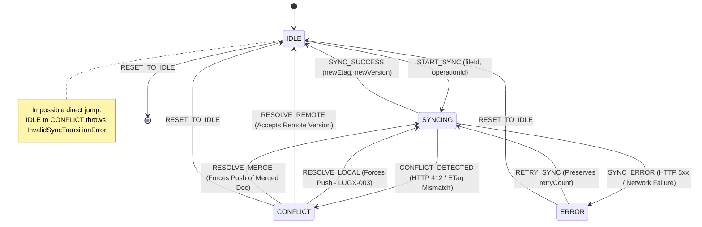
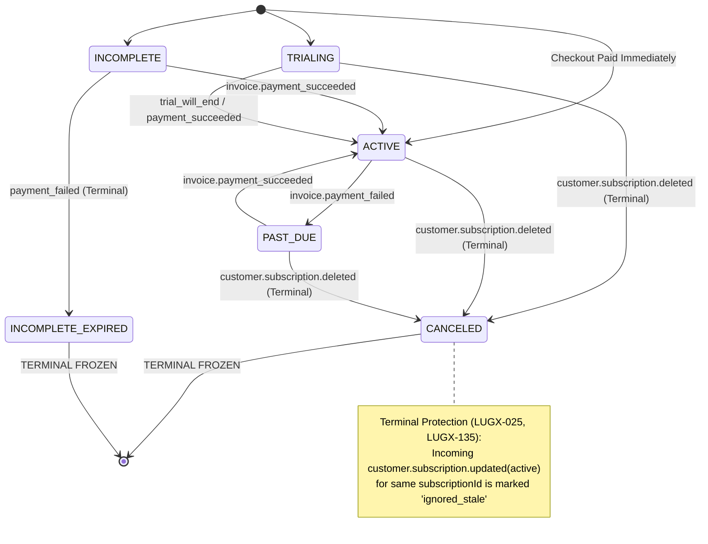
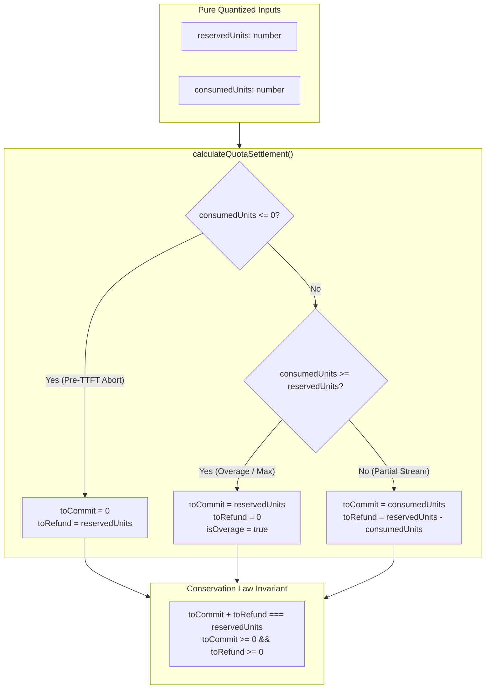

# Closure Report: Phase 6 — Pure State Reducers as Contractual Safety Nets

**Milestone:** Core Hardening & Independent Remediation (`core-hardening`)  
**Phase:** Phase 6: Pure State Reducers as Contractual Safety Nets  
**Status:** CLOSED ✅  
**Date:** 2026-09-29  
**Authoritative Artifacts:** `src/lib/sync/sync-state-reducer.ts`, `src/lib/stripe/webhook-event-reducer.ts`, `src/lib/ai/quota-settlement-reducer.ts`, `src/test/contracts/state-machines-contracts.test.ts`.  
**Verification Baseline:** 23 Vitest Contract Tests Passed (100%), 0 TypeScript Compiler Errors (`tsc --noEmit`), 70 Suites / 869 Total Tests Green (100% Zero-Regression).  

---

## 1. Executive Summary & Problems Solved

Prior to Phase 6, state transition logic across file synchronization, billing webhooks, and AI quota reservations was coupled with side-effects (IndexedDB operations, network I/O, `Date.now()` timestamps, React state setters). This exposed the system to subtle race conditions, out-of-order execution, and state regression identified in the unified security and engineering audit:

1. **Premature Conflict State Clearance (LUGX-003):** Choosing `local` conflict resolution cleared the local `isDirty` flag without triggering an immediate push, causing uncommitted local edits to appear clean.
2. **Concurrent Push Mutation Collisions (LUGX-010, LUGX-040):** Active pushes did not strictly govern transition boundaries, allowing edits to merge into invalid operation states (`conflict`, `failed`, `dead_letter`).
3. **Stripe Webhook Out-of-Order Reactivation (LUGX-025, LUGX-135):** Stale or out-of-order `customer.subscription.updated` events with `status: 'active'` could reactivate subscriptions already terminated in `canceled` status.
4. **Arbitrary AI Quota Refunds & Inconsistent Settlements (LUGX-001, LUGX-115):** Quota commit and refund calculations were calculated across mutable code paths without mathematical conservation guarantees (`toCommit + toRefund === reservedUnits`).
5. **Impure Conflict Resolution Envelopes (LUGX-036):** Server conflict resolution risked combining server ciphertext with local encryption metadata.

### The Solution Delivered in Phase 6

- **Pure Sync State Reducer (`src/lib/sync/sync-state-reducer.ts`):**
  Defines explicit states `idle | syncing | conflict | error` and events. Rejects impossible transitions (e.g., `idle` to `conflict` directly without an active sync response). Mandates that `RESOLVE_CONFLICT` with `resolution: 'local'` or `'merge'` transitions to `syncing` to enforce an immediate network push.
- **Pure Stripe Webhook Event Reducer (`src/lib/stripe/webhook-event-reducer.ts`):**
  Defines subscription states `trialing | active | past_due | canceled | incomplete | incomplete_expired | unpaid`. Implements strict **Terminal State Protection**: once a subscription enters `canceled` or `incomplete_expired`, incoming stale update events for that subscription ID are frozen with `ignored_stale` (or rejected via `TerminalSubscriptionStateError` in strict mode). Only new subscriptions can establish paid state.
- **Pure Quota Settlement Reducer (`src/lib/ai/quota-settlement-reducer.ts`):**
  Encodes deterministic integer arithmetic for quota allocation. Guarantees the **Conservation Law**: `toCommit + toRefund === reservedUnits` across zero-consumption aborts, partial streams, exact usage, and overage. Manages immutable reservation states (`idle | reserved | committed | refunded | expired`) preventing double-refunds and commit-after-refund conflicts.
- **Contract & Purity Test Suite (`src/test/contracts/state-machines-contracts.test.ts`):**
  23 automated tests verifying all transition matrix permutations, error handling, and 100% side-effect freedom (verifying zero calls to `Date.now()` or `fetch()`).

---

## 2. Architecture & State Transition Flows

### 2.1 Sync State Machine



### 2.2 Stripe Subscription Terminal State Protection



### 2.3 Quota Settlement Conservation Law



---

## 3. Verification Evidence & Test Results

### 3.1 Test Execution Output

```bash
 RUN  v4.1.11 D:/Projects/LUGX

stdout | src/test/contracts/state-machines-contracts.test.ts
 ✓ src/test/contracts/state-machines-contracts.test.ts (23 tests) 34ms

 Test Files  70 passed (70)
      Tests  869 passed (869)
   Start at  21:47:48
   Duration  88.82s
```

### 3.2 Breakdown of Verified Invariants

| Category | Tests | Invariants Verified | Remediations |
| :--- | :--- | :--- | :--- |
| **Sync Reducer** | 7 tests | `idle` → `syncing` → `idle`, `syncing` → `conflict`, `RESOLVE_LOCAL` forces `syncing` push, `syncing` → `error` increments retry, rejects `idle` → `conflict` directly. | `LUGX-003, LUGX-010, LUGX-036, LUGX-040` |
| **Stripe Reducer** | 7 tests | Terminal status mapping (`canceled`, `incomplete_expired`), paid checkout activation, non-paid checkout fail-closed, terminal state protection (`ignored_stale` on replayed active), new checkout migration, past_due failure and recovery. | `LUGX-025, LUGX-135` |
| **Quota Reducer** | 8 tests | Pre-TTFT zero-consumption full refund, partial stream refund, exact consumption, overage capping, negative/fractional input sanitization, full reservation lifecycle (`idle` → `reserved` → `committed`/`refunded`), conflict rejection (`committed` cannot refund). | `LUGX-001, LUGX-115` |
| **Purity Assertions** | 1 test | Proves zero calls to `Date.now()`, `fetch()`, or external storage across all three reducers. | Full SRP Purity |

---

## 4. Single Source of Truth Synchronization

1. **Active Code Baseline:** `src/lib/sync/sync-state-reducer.ts`, `src/lib/stripe/webhook-event-reducer.ts`, `src/lib/ai/quota-settlement-reducer.ts`, `src/test/contracts/state-machines-contracts.test.ts`.
2. **Remediation Plans:** Marked Phase 6 as `COMPLETED` in both `docs/.Plans/خطة الإصلاح التقنية.md` and `docs/Plans/COMPREHENSIVE_TECHNICAL_REMEDIATION_PLAN.md`.
3. **Living Reconciler:** Updated `docs/foundation/DESIGN_VS_REALITY.md` to reconcile Phase 6 pure reducers.
4. **Metrics:** Updated `docs/METRICS.json` to 869 passing tests across 70 test suites.
5. **Version Bump:** Release v1.34.0 documented in `docs/CHANGELOG.md` and updated in `package.json`.
