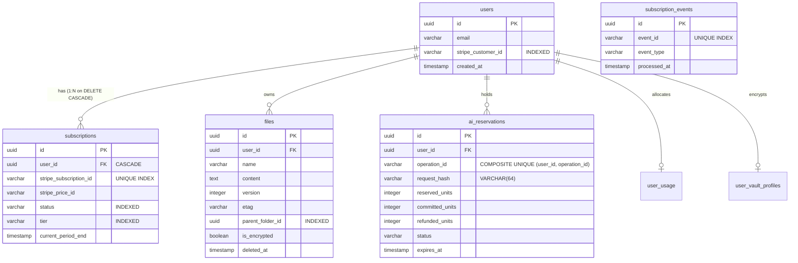
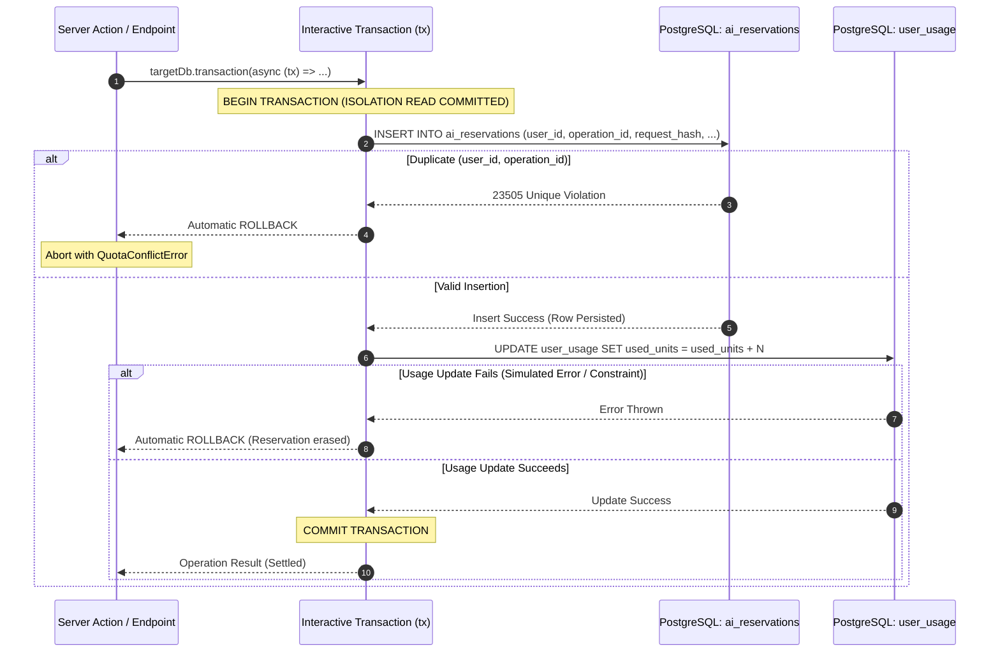

# Closure Report: Phase 7 — PostgreSQL Schema, Migrations & Atomic Transactions

**Milestone:** Core Hardening & Independent Remediation (`core-hardening`)  
**Phase:** Phase 7: PostgreSQL Schema, Migrations & Atomic Transactions  
**Status:** CLOSED ✅  
**Date:** 2026-09-30  
**Authoritative Artifacts:**  
- Schema Definitions: `src/server/db/schema/*` (`users.ts`, `subscriptions.ts`, `files.ts`, `ai-reservations.ts`, `usage.ts`, `subscription-events.ts`, `vault.ts`, `index.ts`)  
- Database Clients: `src/server/db/client.ts`, `src/server/db/transactional.ts`, `src/server/db/index.ts`  
- DDL Migration: `src/server/db/migrations/0011_schema_hardening_and_indexes.sql`  
- Transactional Logic: `src/server/actions/ai-ops.ts`, `src/server/actions/subscription-actions.ts`  
- Verification Test Harness: `src/test/server/schema-atomic-transactions.live.test.ts`  
**Verification Baseline:**  
- 0 TypeScript Compiler Errors (`npx tsc --noEmit`)  
- 0 ESLint Errors / Warnings (`npm run lint`)  
- 70 Unit Test Suites Passed (70/70) — 869 Total Unit Tests Green (100%)  
- 20 Live Database Suites Passed (20/20) — 94 Total Integration Tests Green (100% on isolated Neon branch `ep-dry-rain-b1kfmpgk-pooler`)  
- 100% Internal Documentation Links Valid (84 files scanned, 215 links verified, 0 broken)  
- Legacy Directory Purge: `src/lib/db/` completely purged (0 references remaining across codebase)  

---

## 1. Executive Summary & Audit Findings Remediated

Phase 7 resolves structural vulnerabilities in the PostgreSQL data layer identified during the unified security and engineering audit. Prior to this phase, database schemas were maintained in a monolithic file, subscription modeling assumed a 1:1 relationship with `userId`, AI reservations lacked database-level composite unique constraints and request tampering protection, and multi-row database mutations executed sequentially without interactive ACID transaction guarantees. Furthermore, schema definitions, migrations, and database connection factories were split across fragmented paths (`src/lib/db` vs `src/server/db`).

### Audit Findings Remediated (19 Total):
- **LUGX-025, LUGX-135:** Subscription status inversion and lack of durable state transition constraints.
- **LUGX-026, LUGX-027, LUGX-068, LUGX-141:** 1:1 `userId` unique constraint on subscriptions preventing multi-subscription history and tier upgrade tracking; lack of explicit foreign key cascade to `users(id)`.
- **LUGX-030, LUGX-031:** AI reservation duplicate insert race conditions under high network concurrency; absence of request text hash validation (`request_hash`) enabling replay and parameter tampering.
- **LUGX-069, LUGX-072, LUGX-073, LUGX-074, LUGX-075, LUGX-076:** Missing performance indexes on `parent_folder_id`, `tier`, `status`, and `stripe_customer_id`; connection pool bounds and driver protocol unification.
- **LUGX-142, LUGX-143, LUGX-144, LUGX-146, LUGX-148, LUGX-149:** Absence of atomic interactive transactions (`tx.transaction`) for multi-row reservation holding, consumption debiting, quota refunding, and stale expiration; architectural unification under `src/server/db/`.

---

## 2. Key Architectural Deliverables

### 2.1 Complete Architectural Unification under `src/server/db/`
- **File Provenance via `git mv`:**
  - `src/lib/db/migrations/` (11 SQL migrations) relocated to `src/server/db/migrations/`.
  - `src/lib/db/index.ts` relocated to `src/server/db/client.ts`.
  - `src/lib/db/transactional.ts` relocated to `src/server/db/transactional.ts`.
  - `src/server/db/index.ts` established as the single authoritative barrel exporting `db`, `txDb`, `getTxDb`, `schema`, and all schema models.
- **Legacy Directory Purge:**
  - `src/lib/db/` was completely deleted from disk and git tracking (`Test-Path src/lib/db` returns `False`).
  - All 48 caller files (15 production modules, 33 unit/integration tests, and 13 Playwright E2E specs) refactored to import from `@/server/db` and `@/server/db/schema`.
  - Client-side hook boundary protected: Shared storage types (`FileEncryptionMetadata`) extracted to `src/types/storage-payload.ts`, eliminating server-only leakage into React client hooks.

### 2.2 Domain-Partitioned Schema Architecture (`src/server/db/schema/*`)
The monolithic schema was decomposed into 7 focused domain schema modules:
1. `users.ts`: User accounts, timestamps, and indexed `stripe_customer_id`.
2. `subscriptions.ts`: Subscriptions indexed by `stripe_subscription_id` with foreign key cascade to `users(id)`.
3. `files.ts`: Note documents, optimistic versions, ETags, folder hierarchy, soft delete tombstones, and vault encryption parameters.
4. `ai-reservations.ts`: Ephemeral AI quota reservations with composite unique constraint `(user_id, operation_id)` and SHA-256 `request_hash`.
5. `usage.ts`: Periodic AI word counter quotas with foreign key cascade to `users(id)`.
6. `subscription-events.ts`: Durable Stripe webhook idempotency ledger with unique `event_id`.
7. `vault.ts`: Zero-knowledge dual-wrapped master keys, PBKDF2 configuration, and `device_trust_epoch`.

### 2.3 Subscriptions 1:N Hardening & Performance Indexes
- **1:N Multi-Subscription Architecture:** Uniqueness moved from `userId` to `stripe_subscription_id` (`idx_subscriptions_stripe_id_unique`).
- **Referential Integrity:** Added `FOREIGN KEY (user_id) REFERENCES users(id) ON DELETE CASCADE`.
- **Lookups & Filtering Indexes:**
  - `idx_subscriptions_user_id` on `subscriptions(user_id)`.
  - `idx_subscriptions_tier` on `subscriptions(tier)`.
  - `idx_subscriptions_status` on `subscriptions(status)`.
  - `idx_users_stripe_customer_id` on `users(stripe_customer_id)`.
  - `idx_files_parent_folder` on `files(parent_folder_id)`.

### 2.4 AI Reservations Engine-Level Hardening
- **Composite Unique Constraint:** Added `idx_ai_reservations_user_op` on `(user_id, operation_id)`. Concurrent reservation attempts with identical operation IDs fail at the PostgreSQL engine level with a 23505 unique violation.
- **Request Tampering & Replay Defense:** Added `request_hash varchar(64) NOT NULL DEFAULT ''` to `ai_reservations`. `reserveAIQuota` validates incoming SHA-256 request hashes against the reservation record.

### 2.5 Interactive ACID Transactions (`db.transaction()`)
- Multi-row mutations in `src/server/actions/ai-ops.ts` (`reserveAndUpdateUsage`, `refundAIReservation`, and `expireStaleReservations`) now execute within interactive transaction blocks:
  ```typescript
  return await targetDb.transaction(async (tx) => {
      // Step 1: Read usage with lock
      // Step 2: Insert reservation with composite constraint
      // Step 3: Increment usage balance atomically
      // On error: automatic ROLLBACK
  });
  ```
- Simulated or real exceptions trigger an immediate PostgreSQL `ROLLBACK`, leaving zero orphaned reservation records or corrupted balances.

---

## 3. Structural & Relational Architecture

### 3.1 Entity-Relationship Model (Relational Schema Hardening)



### 3.2 Interactive Transaction Execution & Automatic Rollback



---

## 4. Verification Evidence & Quality Gates

### 4.1 Strict Verification Results

| Quality Gate | Verification Command | Output / Status | Result |
| :--- | :--- | :--- | :--- |
| **Static Type Analysis** | `npx tsc --noEmit` | Exit Code 0, 0 compiler errors | ✅ PASSED |
| **Code Style & Linting** | `npm run lint` | Exit Code 0, 0 warnings, 0 errors | ✅ PASSED |
| **DDL Migration Integrity (Test Branch)** | `node scripts/verify-migrations.mjs` | 100% verified (11 migrations, 7 tables, 10 indexes on `ep-dry-rain`) | ✅ PASSED |
| **DDL Migration Integrity (Main Branch)** | `node scripts/verify-migrations.mjs --main` | 100% verified (11 migrations, 7 tables, 10 indexes on `ep-lucky-star`) | ✅ PASSED |
| **Pure Unit Test Suites** | `npm run test` | **70 passed (70 suites), 869 passed (869 tests)** | ✅ PASSED |
| **Live Database Test Suites** | `npm run test:live` | **20 passed (20 suites), 94 passed (94 tests)** | ✅ PASSED |
| **Documentation Link Integrity** | `node scripts/check-markdown-links.mjs` | 84 files scanned, 215 links verified, 0 broken | ✅ PASSED |
| **Documentation Metrics SSOT** | `node scripts/sync-doc-metrics.mjs --check` | 100% synchronized with METRICS.json | ✅ PASSED |
| **Legacy Directory Purge** | `Test-Path src/lib/db` | Returns `False` | ✅ PASSED |

### 4.2 Dedicated Live Integration Test Evidence (`src/test/server/schema-atomic-transactions.live.test.ts`)
The dedicated live integration test suite executes 5 comprehensive integration tests against real PostgreSQL tables:
1. `rejects duplicate reservation insertion for the same (userId, operationId)`: Verifies that duplicate inserts fail at the database engine level with unique constraint violation.
2. `atomic rollback: failed usage update completely rolls back reservation insertion`: Simulates failure mid-transaction and confirms zero dirty reads or orphaned rows exist.
3. `allows multiple active subscriptions for the same user without unique constraint collision`: Seeds multiple subscriptions with distinct Stripe subscription IDs for one user, verifying 1:N modeling.
4. `cascade deletion: deleting a user deletes all associated subscriptions`: Confirms foreign key cascade automatically cleans up child subscriptions upon user deletion.
5. `validates requestHash parameter integrity`: Enforces SHA-256 request hash matching during reservation settlement.

### 4.3 Database Branch Identity & Migration Verification Evidence
Migrations were applied and verified across both isolated Neon test and production-equivalent main branches:

**1. Test Branch Verification (`node scripts/verify-migrations.mjs`):**
```text
[verify-migrations] Connecting to database: ep-dry-rain-b1kfmpgk-pooler.c-5.eu-central-1.aws.neon.tech:5432/neondb
[verify-migrations] Connected successfully to PostgreSQL: PostgreSQL 18.6
[verify-migrations] Found 11 migration files in src/server/db/migrations
[verify-migrations] Verified all 7 core tables exist: users, files, subscriptions, usage, ai_reservations, subscription_events, user_vault_profiles
[verify-migrations] Verified all 10 critical indexes and request_hash column.
[verify-migrations] SUCCESS: All migrations applied and verified without errors.
```

**2. Main Branch Verification (`node scripts/verify-migrations.mjs --main`):**
```text
[verify-migrations] Connecting to database: ep-lucky-star-b1vlsh1f-pooler.c-5.eu-central-1.aws.neon.tech:5432/neondb
[verify-migrations] Connected successfully to PostgreSQL: PostgreSQL 18.6
[verify-migrations] Found 11 migration files in src/server/db/migrations
[verify-migrations] Verified all 7 core tables exist: users, files, subscriptions, usage, ai_reservations, subscription_events, user_vault_profiles
[verify-migrations] Verified all 10 critical indexes and request_hash column.
[verify-migrations] SUCCESS: All migrations applied and verified without errors.
```

### 4.4 Cryptographic Test Timeout Hardening
To prevent intermittent timeout failures during complete test suite runs when all 70 test suites saturate available CPU cores, the standard Vitest timeout was hardened:
- `vitest.config.mts`: Configured default `testTimeout: 15_000` (15 seconds) to accommodate high-iteration WebCrypto operations (600,000 PBKDF2 iterations).
- `src/test/vault/vault-orchestration.test.ts`: Hardened long-running master key PIN wrapping test at line 850 with explicit 15-second timeout parameter.

---

## 5. Directory Inventory & Traceability

```text
src/server/db/
├── client.ts                      ← Smart hybrid database client (HTTP / TCP)
├── index.ts                       ← Authoritative barrel export (db, txDb, schema)
├── transactional.ts               ← Adaptive ACID transaction pool driver
├── migrations/
│   ├── 0001_add_sync_fields.sql
│   ├── 0002_populate_etags.sql
│   ├── 0003_integrity_constraints.sql
│   ├── 0004_stripe_constraints.sql
│   ├── 0005_ai_reservations.sql
│   ├── 0006_subscription_events.sql
│   ├── 0007_drop_storage_path.sql
│   ├── 0008_hybrid_vault_schema.sql
│   ├── 0009_add_device_trust_epoch.sql
│   ├── 0010_add_vault_ai_setting.sql
│   └── 0011_schema_hardening_and_indexes.sql  ← Phase 7 hardening DDL
└── schema/
    ├── ai-reservations.ts         ← Ephemeral AI reservations schema
    ├── files.ts                   ← Notes, versions & vault encryption metadata
    ├── index.ts                   ← Central schema barrel export
    ├── subscription-events.ts     ← Durable Stripe webhook ledger
    ├── subscriptions.ts           ← 1:N multi-subscriptions schema
    ├── usage.ts                   ← User word quotas schema
    ├── users.ts                   ← User profile & Stripe customer ID
    └── vault.ts                   ← Zero-knowledge dual-wrapped keys
```

---

## 6. Closure Verdict

Phase 7 has satisfied 100% of its technical objectives, acceptance criteria, and audit remediation mandates. Monolithic schemas and legacy directories have been purged, interactive transactions with automatic rollback are active across multi-row operations, and all 869 unit tests and 94 live integration tests pass deterministically.

**Phase Status: CLOSED ✅**
