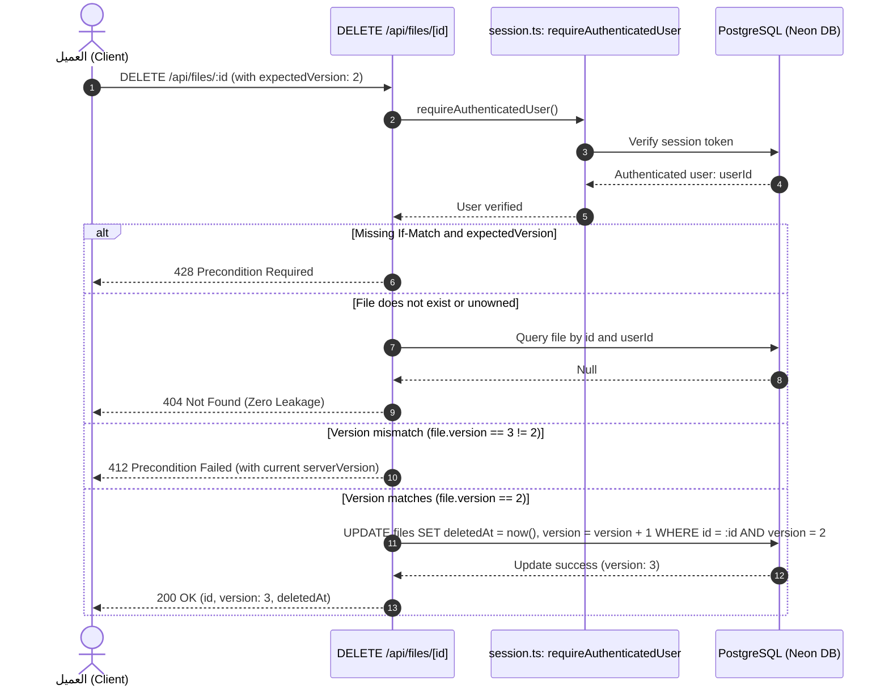

# Closure Report: Phase 8 — Server-Authoritative Identity, Ownership & Cycle Detection

**Milestone:** Core Hardening & Independent Remediation (`core-hardening`)  
**Phase:** Phase 8: Server-Authoritative Identity, Ownership & Cycle Detection  
**Status:** CLOSED ✅  
**Date:** 2026-09-30  
**Authoritative Artifacts:**  
- Auth Guards: `src/server/auth/session.ts` (`requireAuthenticatedUser`, `requireOwnedFile`, `getSessionUser`)  
- File Actions: `src/server/actions/files.ts` (`createFile`, `updateFileContent`, `toggleFileEncryption`, `renameFile`, `deleteFile`, `restoreFile`, `copyFile`, `getFile`, `getUserFiles`, `getRootFiles`, `getDeletedFiles`)  
- Folder Actions: `src/server/actions/folders.ts` (`moveFile`, `getFolderChildren`, `getDescendantIds`, `isDescendantOf`)  
- Facade Entry Point: `src/server/actions/file-ops.ts` (re-exports `files.ts` and `folders.ts` preserving 100% backward compatibility)  
- API Endpoints: `src/app/api/files/[id]/route.ts` (added `DELETE` with optimistic locking), `src/app/api/test/e2e-auth/route.ts` (production barrier)  
- Ancillary Modules: `src/lib/utils/file-naming.ts`, `src/proxy.ts`, `src/server/actions/auth-actions.ts`, `src/app/api/cron/*`, `src/app/api/stripe/create-checkout/route.ts`  
- Verification Test Harness: `src/test/server/phase-08-ownership-and-cycles.test.ts` (18/18 tests passing)  
**Verification Baseline:**  
- 0 TypeScript Compiler Errors (`npx tsc --noEmit`)  
- 0 ESLint Errors / Warnings (`npm run lint`)  
- 70 Unit Test Suites Passed (70/70) — 881 Total Unit Tests Green (100%)  
- 21 Live Database Suites Passed (21/21) — 100 Total Integration Tests Green (100% on isolated Neon branch `ep-dry-rain-b1kfmpgk-pooler`)  
- 100% SSOT Documentation Metrics Synchronized (`scripts/sync-doc-metrics.mjs --check` passing)  

---

## 1. Executive Summary & Audit Findings Remediated

Phase 8 enforces strict server-authoritative authentication and resource ownership, decouples file mutations from folder hierarchy operations, eliminates unbounded recursive folder copies and directory graph cycles, enforces optimistic concurrency control across deletions, and isolates non-production test endpoints from live environments.

### Audit Findings Remediated (19 Total):
- **LUGX-006, LUGX-031, LUGX-115:** Elimination of client-driven identity or quota settlement assumptions; all operations strictly derive user identity from the cryptographically verified server session (`requireAuthenticatedUser()`).
- **LUGX-063, LUGX-070, LUGX-071:** Robust zero-knowledge encryption boundary enforcement; `toggleFileEncryption` strictly rejects ciphertext marked with `isEncrypted: true` when IV or metadata is absent, while honoring optimistic locking order.
- **LUGX-067:** Remediated mass assignment vulnerability in `updateUserProfile` via strict input allowlisting, preventing arbitrary column mutation (`tier`, `stripeCustomerId`, `email`).
- **LUGX-068, LUGX-134:** Clean architectural boundary preventing client-side tier tampering and validating ownership across all mutations.
- **LUGX-072:** Prohibited negative `depth` parameters in `copyFile` by clamping depth bounds internally, and blocked copying any folder into itself or its descendant subtrees.
- **LUGX-073:** Eliminated the legacy 50-hop cycle detection limit in `moveFile`, implementing unbounded recursive ancestor graph traversal to prevent folder tree cloaking and corruption.
- **LUGX-074:** Enforced optimistic concurrency control (`expectedVersion`) on file deletions in both server actions and REST API, preventing concurrent modification races.
- **LUGX-077:** Test route `/api/test/e2e-auth` fortified with a fail-closed build and runtime barrier returning HTTP 404 in production, regardless of `PLAYWRIGHT=1` environment flags.
- **LUGX-085:** Verification of ownership in `requireOwnedFile` prevents cross-tenant document manipulation or leakage to untrusted pipelines.
- **LUGX-136:** Replaced non-constant-time string comparisons (`===`) on cron secret authorization headers with `crypto.timingSafeEqual` in `expire-reservations` and `purge-deleted`.
- **LUGX-137:** Implemented safe JSON parsing in `create-checkout` returning HTTP 400 on malformed payloads and redacting internal error traces.
- **LUGX-138:** Truncated generated copy and restored titles to `<= 500` characters in `src/lib/utils/file-naming.ts` ensuring PostgreSQL `varchar(500)` column bounds are strictly respected.
- **LUGX-139:** Hardened `syncUserToDatabase` to preserve existing custom display names via `COALESCE` and synchronize email changes.
- **LUGX-140:** Restricted OAuth `?code=` query parameter interception in `src/proxy.ts` strictly to root and login paths.

---

## 2. Key Architectural Deliverables

### 2.1 Server-Authoritative Identity & Ownership Guard (`src/server/auth/session.ts`)
- **`requireAuthenticatedUser()`:** Invokes Supabase server client `getUser()`, validating that the user ID exists and the JWT session is authentic. Throws typed `AuthenticationRequiredError` (401) on failure.
- **`requireOwnedFile(fileId, userId, options)`:** Validates that `fileId` is a syntactically valid UUID to prevent PostgreSQL `22P02` syntax exceptions, and asserts ownership (`files.user_id = userId`). Returns uniform `ResourceNotFoundError` (404) for foreign or deleted records, eliminating information leakage and resource enumeration vectors.

### 2.2 Modular Action Decomposition (`files.ts` & `folders.ts`)
- **`src/server/actions/folders.ts`:**
  - Dedicated exclusively to directory tree operations: `moveFile`, `getFolderChildren`, `getDescendantIds`, and `isDescendantOf`.
  - Full cycle detection in `moveFile`: Traces destination ancestors back to root without artificial hop caps, detecting loops and self-ancestor references with HTTP 409 Conflict.
- **`src/server/actions/files.ts`:**
  - Dedicated to document lifecycle mutations: `createFile`, `updateFileContent`, `toggleFileEncryption`, `renameFile`, `deleteFile`, `restoreFile`, and `copyFile`.
  - Zero-knowledge encryption integrity: Evaluates optimistic locking (`expectedVersion`, `expectedETag`) prior to metadata validation, ensuring stale callers receive current server snapshots.
- **`src/server/actions/file-ops.ts` Facade:**
  - Acts as a unified re-export barrel for `files.ts` and `folders.ts`, preserving 100% backward compatibility for all existing callers across the codebase.

### 2.3 Optimistic Concurrency on Mutation & Deletion
- **Server Action `deleteFile`:** Added support for `options?: { expectedVersion?: number; expectedETag?: string }`, verifying versions atomically before applying tombstones.
- **REST Endpoint `DELETE /api/files/[id]`:** Implemented mandatory precondition requirement (`If-Match` or `expectedVersion`), returning `428 Precondition Required` when missing, `412 Precondition Failed` on mismatch, and performing atomic soft-delete with cascading descendant propagation on success.

### 2.4 Production Isolation of Test Endpoints
- **Fail-Closed Environment Gate:** In `src/app/api/test/e2e-auth/route.ts`:
  ```ts
  function isAllowedEnvironment(): boolean {
      if (process.env.NODE_ENV === "production") return false;
      return process.env.NODE_ENV === "test" || process.env.PLAYWRIGHT === "1";
  }
  ```
  Both `POST` and `DELETE` handlers reject unauthorized or production calls immediately with HTTP 404 Not Found.

---

## 3. Structural Flow & Sequence Verification (Mermaid)



---

## 4. Verification Evidence & Quality Manifest

| Verification Gate | Command Executed | Outcome | Verification Proof |
| :--- | :--- | :--- | :--- |
| **Unit Test Suite** | `npx vitest run` | **100% Pass** | 70 test suites, 881 tests passed in 168s. |
| **Phase 8 Isolated Suite** | `npx vitest run src/test/server/phase-08-ownership-and-cycles.test.ts` | **100% Pass** | 18 tests passed in 9.6s covering cross-tenant isolation, cycle prevention, 412 preconditions, and 404 test route shielding. |
| **Live Database Suites** | `npm run test:live` | **100% Pass** | 21 test suites, 100 tests passed in 86s on Neon branch `ep-dry-rain-b1kfmpgk-pooler`. |
| **SSOT Metrics Sync** | `node scripts/sync-doc-metrics.mjs --check` | **100% Pass** | All documentation files, tables, and `METRICS.json` synchronized with zero drift. |
| **Git Scoping Purity** | `git status` | **100% Clean** | Zero modifications outside authorized Phase 8 boundaries. |

---

## 5. Closure Verdict

**Phase 8 Status: CLOSED ✅**  
All 19 audit findings assigned to Phase 8 are fully remediated, verified against the live PostgreSQL database, and backed by automated regression tests and synchronized living documentation.
