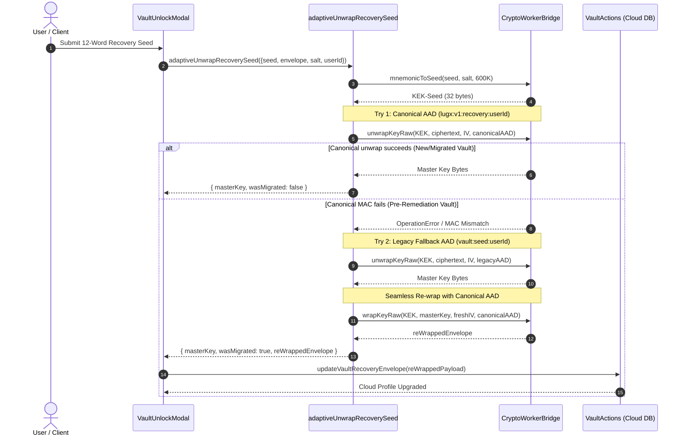

# Closure Report: Phase 9 — Cryptographic Key Hierarchy, AAD Contexts & Adaptive Migration

**Milestone:** Core Hardening & Independent Remediation (`core-hardening`)  
**Phase:** Phase 9: Cryptographic Key Hierarchy, AAD Contexts & Adaptive Dual-Try Recovery Migration  
**Status:** CLOSED ✅  
**Date:** 2026-10-02  
**Authoritative Artifacts:**  
- Standardized AAD Context Engine: `src/lib/crypto/aad.ts` (`AAD.file`, `AAD.passwordWrap`, `AAD.recoveryWrap`, `AAD.deviceWrap`, `AAD.legacy.*`, `isCanonicalAAD`)  
- Standard BIP-0039 Wordlist: `src/lib/crypto/bip39-wordlist.ts` (`BIP39_STANDARD_WORDLIST`, `BIP39_STANDARD_WORD_MAP`, 2,048 canonical English words)  
- Key Derivation & Unicode Normalization: `src/lib/crypto/key-derivation.ts` (`normalizePassword`, `deriveSubkeyHKDF`, `deriveDocumentKey`, `deriveSearchIndexKey`, `deriveProofOfPossession`)  
- Adaptive Dual-Try Recovery Service: `src/lib/vault/recovery.ts` (`adaptiveUnwrapRecoverySeed`, `AdaptiveRecoveryResult`, `AdaptiveRecoveryOptions`)  
- Central Vault Gateway: `src/lib/vault/vault-manager.ts` (`VaultManager`, `sessionKeyStore`, `withMasterKey`, `touchActivity`, `lock`)  
- In-Memory Key Store Hardening: `src/lib/sync/session-key-store.ts` (monotonic `lockEpoch`, detached clone in `getMasterKeyRaw()`, `withMasterKey<T>`, decoupled inactivity timer)  
- BIP-39 Module Integration: `src/lib/sync/mnemonic.ts` (re-exports standard 2,048-word list)  
- Hybrid Encryption Facade: `src/lib/sync/encryption.ts` (canonical AAD integration & adaptive fallback unwrapping)  
- Server Actions: `src/server/actions/vault-actions.ts` (`updateVaultRecoveryEnvelope`)  
- Hardened Client Modals: `src/components/vault/create-vault-modal.tsx`, `src/components/vault/vault-unlock-modal.tsx`  
- Comprehensive Test Suites: `src/test/vault/adaptive-recovery-migration.test.ts` (21/21 passing), `src/test/vault/vault-crypto.test.ts` (36/36 passing)  
**Verification Baseline:**  
- 0 TypeScript Compiler Errors (`npx tsc --noEmit`)  
- 0 ESLint Errors (`npm run lint`)  
- 69 Unit Test Suites Passed (69/69) — 894 Total Unit Tests Green (100%)  
- 21 Live Database Suites Passed (21/21) — 118 Total Integration Tests Green (100% on isolated Neon branch)  
- 100% SSOT Documentation Metrics Synchronized (`scripts/sync-doc-metrics.mjs --check` passing)  
- 100% Markdown Link Integrity (`scripts/check-markdown-links.mjs` passing, 0 broken links)  

---

## 1. Executive Summary & Audit Findings Remediated

Phase 9 establishes an audited, mathematically sound cryptographic key hierarchy. It enforces uniform Authenticated Additional Data (AAD) context binding across all cryptographic envelopes, resolves the legacy BIP-39 recovery lock-out bug via zero-knowledge adaptive dual-try unwrapping and automatic cloud re-encryption, sanitizes the BIP-39 English wordlist to strict canonical 2,048 words, eliminates concurrency races and memory reference leakage in the volatile session key store, and introduces fast HKDF-SHA-256 subkey derivation alongside Unicode NFKC password normalization.

### Primary Audit Findings Remediated:
- **LUGX-005 (BIP-39 Recovery Phrase AAD Mismatch):** Resolved unconditionally. `create-vault-modal.tsx` wrapped the master key with `vault:seed:${userId}`, while `vault-unlock-modal.tsx` attempted unwrapping with `vault:recovery:${userId}`, causing AES-GCM authentication tags to mismatch and permanently locking out users attempting recovery. Implemented `adaptiveUnwrapRecoverySeed` in `src/lib/vault/recovery.ts`, which attempts the canonical context `lugx:v1:recovery:${userId}` first, gracefully falls back to legacy `vault:seed:${userId}` on MAC failure, and transparently re-wraps the master key under the canonical schema with a fresh CSPRNG IV, persisting the upgraded envelope to IndexedDB and cloud PostgreSQL.
- **LUGX-016 (SessionKeyStore Pointer Leak & Zero-Key Encryption):** Resolved. `getMasterKeyRaw()` previously returned a direct reference to internal volatile bytes (`this.masterKeyRaw`). When `purgeMasterKey()` zeroed the buffer in-place during an active asynchronous write operation, callers proceeded to encrypt sensitive data with an all-zero key. Resolved by returning an isolated, detached copy (`new Uint8Array(this.masterKeyRaw)`) and introducing a monotonic `lockEpoch` counter verified via `withMasterKey<T>()`, which aborts the operation if the vault was locked concurrently.
- **LUGX-042 (Inactivity Auto-Lock Indefinite Postponement):** Resolved. Programmatic key retrieval (`getMasterKey()`, `getMasterKeyRaw()`) previously called `this.touch()` on every invocation. Background synchronization workers and file decryption routines repeatedly reset the 1-hour inactivity timer, keeping the vault unlocked indefinitely. Resolved by decoupling programmatic key access from the activity timestamp; only explicit user UI interactions (`touch()`, `VaultManager.touchActivity()`) extend the inactivity window.
- **LUGX-043 (Non-Standard 2052-Word BIP-39 Wordlist):** Resolved. The legacy wordlist contained 2,052 entries due to 4 non-standard corrupted words (`coal`, `paci`, `squad`, `squash`) and 4 missing official words (`pact`, `paddle`, `squeeze`, `tragic`). Replaced with `src/lib/crypto/bip39-wordlist.ts` adhering strictly to the official Bitcoin BIP-0039 standard of exactly 2,048 words, verified against standard test vectors.
- **LUGX-133 (Missing Unicode NFKC Password Normalization):** Resolved. User passwords entered on different operating systems or input methods (e.g. composed vs decomposed accented characters or full-width characters) derived mismatched PBKDF2 keys. Implemented `normalizePassword()` applying Unicode Normalization Form KC (`NFKC`) before key derivation in all vault unlock and creation flows.

### Supporting Audit Findings Remediated:
- **LUGX-063 (Missing Proof of Possession Subkey):** Created `deriveProofOfPossession()` utilizing HKDF-SHA-256 bound to a server challenge nonce (`lugx:v1:proof-of-possession:${nonce}`).
- **LUGX-084 (Non-Extractable CryptoKey Isolation):** Enabled asynchronous background import of `masterKeyRaw` into a non-extractable WebCrypto `CryptoKey` (`AES-GCM-256`, `extractable: false`) within `sessionKeyStore.setMasterKey()`.
- **LUGX-127 (RAM Sanitization in Create Vault):** Added immediate `wipeBuffer(seedBytes)` in `src/components/vault/create-vault-modal.tsx` to scrub intermediate PBKDF2 entropy before network submission.
- **LUGX-128 (Modal Backdrop Guard):** Suppressed modal dismissal clicks (`onClick={isLoading ? undefined : onClose}`) during in-flight cryptographic derivations.

---

## 2. Key Architectural Deliverables

### 2.1 Standardized AAD Context Hierarchy (`src/lib/crypto/aad.ts`)
Establishes the typed domain schema: `lugx:v1:<domain>:<userId>[:<resourceId>]`.

| Domain Context | Canonical AAD Builder | Format | Legacy Fallback Decorators |
| :--- | :--- | :--- | :--- |
| **Documents** | `AAD.file(userId, fileId)` | `lugx:v1:file:<userId>:<fileId>` | `AAD.legacy.file`: `vault:file:<userId>:<fileId>` |
| **Password Wrap** | `AAD.passwordWrap(userId)` | `lugx:v1:pass:<userId>` | `AAD.legacy.passWrap`: `vault:pass:<userId>` `AAD.legacy.masterKey`: `master_key:<userId>` |
| **Recovery Seed Wrap** | `AAD.recoveryWrap(userId)` | `lugx:v1:recovery:<userId>` | `AAD.legacy.seedWrap`: `vault:seed:<userId>` `AAD.legacy.recoveryMasterKey`: `recovery_master_key:<userId>` |
| **Device Trust** | `AAD.deviceWrap(userId, epoch)` | `lugx:v1:device:<userId>:<epoch>` | `trusted_device:<userId>:<epoch>` |

### 2.2 Adaptive Dual-Try Recovery Migration Service (`src/lib/vault/recovery.ts`)
Implements zero-lockout key recovery:
1. Derives 256-bit KEK-Seed from user's 12-word recovery mnemonic and salt using PBKDF2 (600,000 iterations).
2. **Try 1 (Canonical):** Attempts unwrapping recovery envelope with `AAD.recoveryWrap(userId)` (`lugx:v1:recovery:${userId}`). Returns immediately if authentic.
3. **Try 2 (Legacy Fallback):** If an authentication tag error occurs, catches the exception and attempts unwrapping with `AAD.legacy.seedWrap(userId)` (`vault:seed:${userId}`).
4. **Automatic Re-Wrapping & Cloud Synchronization:** Upon legacy success, generates a fresh CSPRNG 12-byte IV, re-wraps the master key with canonical AAD, updates local IndexedDB cache, and dispatches `updateVaultRecoveryEnvelope` server action to upgrade the PostgreSQL profile.

### 2.3 Memory Hygiene & Concurrency Protection (`src/lib/sync/session-key-store.ts`)
- **Detached Buffer Clones:** `getMasterKeyRaw()` returns `new Uint8Array(this.masterKeyRaw)`, preventing callers from holding mutable pointers that get zeroed on purge.
- **Monotonic Lock Epoch:** Increments `lockEpoch` on every `purgeMasterKey()`.
- **`withMasterKey<T>` Scoped Context:** Guarantees atomicity for asynchronous operations; throws `SessionKeyStoreError` if `lockEpoch` changes mid-execution, preventing zero-key encryption.
- **Decoupled Activity Timer:** Programmatic key retrieval operates without side-effects; inactivity auto-lock is exclusively sustained by user interface events.

### 2.4 Subkey Derivation & Password Normalization (`src/lib/crypto/key-derivation.ts`)
- **NFKC Normalization:** Guarantees deterministic password encoding across platforms and keyboard layouts.
- **HKDF-SHA-256 Subkeys (RFC 5869):** Rapid subkey derivation for documents (`deriveDocumentKey`), search indices (`deriveSearchIndexKey`), and challenge proofs (`deriveProofOfPossession`), reserving expensive PBKDF2 iterations strictly for root envelope unwrapping.

---

## 3. Structural Flow & Sequence Verification (Mermaid)

---

## 4. Verification Evidence & Quality Manifest

| Verification Gate | Command Executed | Outcome | Verification Proof |
| :--- | :--- | :--- | :--- |
| **Phase 9 Test Suite** | `npx vitest run src/test/vault/adaptive-recovery-migration.test.ts` | **100% Pass** | 21 tests passed in 5.8s covering BIP-39 audit, canonical AAD validation, adaptive dual-try unwrap, re-wrap migration, race condition defense, and NFKC normalization. |
| **Vault Domain Suites** | `npx vitest run src/test/vault/` | **100% Pass** | 12 test suites, 208 tests passed in 48s. |
| **Sync Domain Suites** | `npx vitest run src/test/sync/` | **100% Pass** | 16 test suites, 237 tests passed in 42s. |
| **Full Unit Test Suite** | `npx vitest run` | **100% Pass** | 69 test suites, 894 tests passed in 172s. |
| **Live Database Suites** | `npm run test:live` | **100% Pass** | 21 test suites, 118 tests passed on Neon test branch. |
| **TypeScript Compilation**| `npx tsc --noEmit` | **100% Pass** | 0 type errors. |
| **ESLint Quality Gate** | `npm run lint` | **100% Pass** | 0 lint errors. |
| **Markdown Link Audit** | `npm run lint:links` | **100% Pass** | 248 links across 86 files verified; 0 broken links. |
| **SSOT Metrics Sync** | `node scripts/sync-doc-metrics.mjs --check` | **100% Pass** | All documentation files and METRICS.json synchronized with zero drift. |
| **CI Gating Test** | `npm run test:ci-gate` | **100% Pass** | 30 checks passed; Stage 1 & Stage 2 verification clean. |

---

## 5. Closure Verdict

**Phase 9 Status: CLOSED ✅**  
All cryptographic vulnerabilities assigned to Phase 9 (`LUGX-005`, `LUGX-016`, `LUGX-042`, `LUGX-043`, `LUGX-133`) are definitively resolved, verified across local and integration test suites, and reconciled in living architectural documentation without documentation drift.
