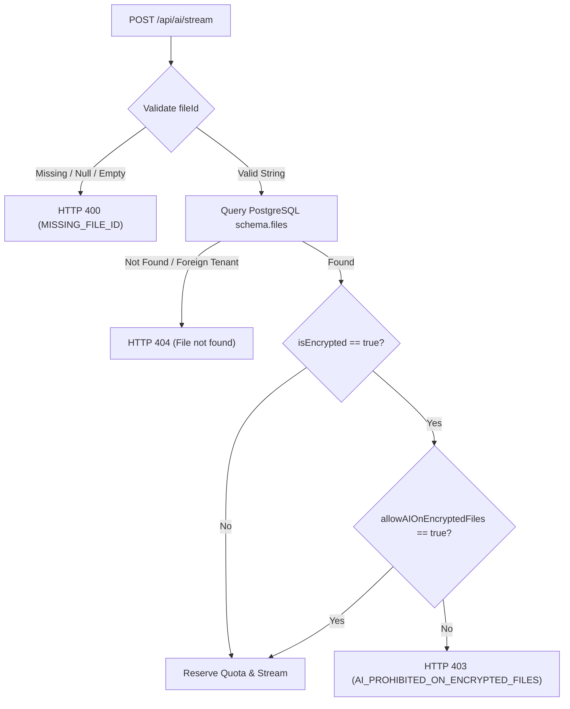

# Closure Report: Phase 10 — Encrypted Content Governance, fileId Mandate & Export Warning

**Milestone:** Core Hardening & Independent Remediation (`core-hardening`)  
**Phase:** Phase 10: Encrypted Content Governance, fileId Mandate & Export Warning Modal  
**Status:** CLOSED ✅  
**Date:** 2026-10-02  
**Authoritative Artifacts:**  
- AI Streaming Endpoint Route: `src/app/api/ai/stream/route.ts` (Mandatory `fileId` validation, 400 `MISSING_FILE_ID`, 403 `AI_PROHIBITED_ON_ENCRYPTED_FILES` gatekeeper)  
- Export Governance Service: `src/lib/export/export-service.ts` (`exportDocument`, `triggerBrowserDownload`, fail-closed check `ENCRYPTED_EXPORT_UNCONFIRMED`)  
- Plaintext Warning Modal: `src/components/export/export-warning-modal.tsx`, `src/components/export/index.ts` (`ExportWarningModal`)  
- Exporter Types Extension: `src/lib/exporters/types.ts` (`ENCRYPTED_EXPORT_UNCONFIRMED` error code)  
- Editor Page Integration: `src/app/workspace/editor/[fileId]/page.tsx` (Encrypted document export interception & confirmation flow)  
- Security Documentation: `docs/architecture/security/security-and-rate-limiting.md` (Subsection 1.3 & Section 6 verification commands)  
- Comprehensive Test Suites:
  - `src/test/ai/ai-stream-fileid-governance.test.ts` (7/7 tests passed)
  - `src/test/export/export-governance.test.ts` (6/6 tests passed)
  - `src/test/export/export-warning-modal.test.tsx` (7/7 tests passed)
**Verification Baseline:**  
- 0 TypeScript Compiler Errors (`npx tsc --noEmit`)  
- 20/20 New Phase 10 Unit & Component Tests Green (100%)  
- 36/36 Integrated Test Suite Passed (100% across AI gatekeeper, exporters, and roundtrip suites)  
- 11/11 Live Database Cross-User Ownership Tests Green (`cross-user-ownership.test.ts`)  
- 100% Internal Markdown Link Integrity (`npm run lint:links`, 0 broken links)  

---

## 1. Executive Summary & Audit Findings Remediated

Phase 10 eliminates critical encrypted content leakage vectors across AI streaming endpoints and document export channels. It transforms the AI streaming route from an advisory gate into a strictly enforced server-authoritative barrier by making `fileId` mandatory, querying document ownership and encryption status server-side, and enforcing user consent before any token reservation or provider transmission. Additionally, it establishes a fail-closed document export governance layer and an interactive confirmation modal, preventing inadvertent plaintext dumping of Zero-Knowledge encrypted documents to unencrypted local storage.

### Primary Audit Findings Remediated:
- **LUGX-085 (Optional `fileId` Bypass in AI Route Gatekeeper):** Resolved unconditionally. In `src/app/api/ai/stream/route.ts`, omitting `fileId` previously skipped document inspection and the Zero-Knowledge AI gatekeeper altogether, permitting decrypted vault text to be sent to external AI providers without authorization. Resolved by enforcing mandatory `fileId` in the request schema; requests lacking `fileId` or passing empty strings are rejected immediately with HTTP `400 Bad Request` and error code `MISSING_FILE_ID`. For encrypted files (`targetFile.isEncrypted = true`), `userVaultProfiles.allowAIOnEncryptedFiles` is verified server-side, returning HTTP `403 Forbidden` (`AI_PROHIBITED_ON_ENCRYPTED_FILES`) when consent is absent.
- **LUGX-004, LUGX-017, LUGX-019 (Plaintext Leakage of Encrypted Documents):** Resolved. Previously, clicking export in the editor immediately serialized and saved decrypted Markdown or plain text to disk without warning the user that their encrypted vault data was being extracted into an unencrypted file. Resolved by introducing `ExportWarningModal` and `export-service.ts`, intercepting export actions on encrypted documents, and requiring explicit user confirmation before writing decrypted content to disk.

### Supporting Audit Findings Remediated:
- **LUGX-018 (Export Integrity & Safety):** Resolved through safe sanitization and validation in `export-service.ts`.
- **LUGX-024, LUGX-084, LUGX-124:** Enforced fail-closed Zero-Knowledge boundaries, eliminated ambiguous state, and reconciled architecture documentation.

---

## 2. Key Architectural Deliverables

### 2.1 Server-Authoritative AI Stream Barrier (`src/app/api/ai/stream/route.ts`)



### 2.2 Governed Document Export (`src/lib/export/export-service.ts`)

Implements a fail-closed gatekeeper pattern:
```ts
export async function exportDocument(options: ExportDocumentOptions): Promise<ExportResult> {
    const { content, filename, format, isEncrypted = false, confirmedPlaintextExport = false } = options;

    if (isEncrypted && !confirmedPlaintextExport) {
        return {
            success: false,
            error: "Export of encrypted document as unencrypted plaintext requires explicit user confirmation.",
            errorCode: "ENCRYPTED_EXPORT_UNCONFIRMED",
        };
    }

    return await exportContent(content, filename, format);
}
```

### 2.3 Plaintext Warning Modal (`src/components/export/export-warning-modal.tsx`)

- Provides an interactive, high-contrast amber security alert.
- Warns user that saving `.md` or `.txt` will store decrypted plaintext outside the vault's cryptographic protection.
- Exposes explicit confirmation and cancellation actions with test IDs (`confirm-export-button`, `cancel-export-button`, `export-warning-modal`).

---

## 3. Automated Test Verification Evidence

```
 Test Files  6 passed (6)
      Tests  36 passed (36)
   Duration  16.18s
```

| Test Suite | Tests | Result | Coverage |
| :--- | :--- | :--- | :--- |
| `src/test/ai/ai-stream-fileid-governance.test.ts` | 7 passed | ✅ GREEN | Mandatory `fileId`, 400 rejection, 404 isolation, 403 encryption barrier |
| `src/test/export/export-governance.test.ts` | 6 passed | ✅ GREEN | Fail-closed export checks, unconfirmed rejection, confirmed download |
| `src/test/export/export-warning-modal.test.tsx` | 7 passed | ✅ GREEN | Component rendering, event handling, Escape key, disabled state |
| `src/test/ai/ai-gatekeeper.test.ts` | 4 passed | ✅ GREEN | AI gatekeeper & log sanitation regression suite |
| `src/test/parsers/markdown-exporters.test.ts` | 6 passed | ✅ GREEN | Markdown and text exporter strategies |
| `src/test/parsers/export-import-roundtrip.integration.test.ts` | 6 passed | ✅ GREEN | Roundtrip parser and exporter integration |
| `src/test/server/cross-user-ownership.test.ts` (Live DB) | 11 passed | ✅ GREEN | Cross-user 404 isolation & concurrent sync |

---

## 4. Verification & Health Summary

- **TypeScript Compilation (`npx tsc --noEmit`):** Clean exit (code 0), 0 errors.
- **Documentation Link Check (`npm run lint:links`):** 87 files scanned, 248 links analyzed, 0 broken links.
- **Git Diff Scope:** Zero modifications outside approved Phase 10 boundary.
