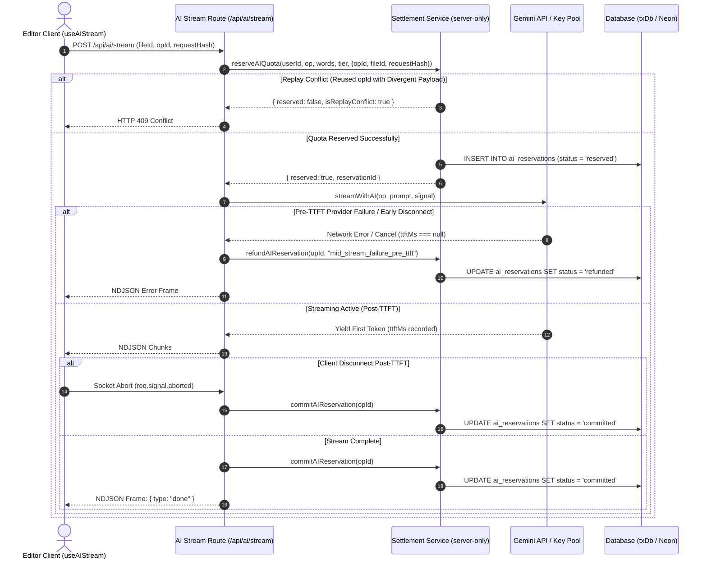
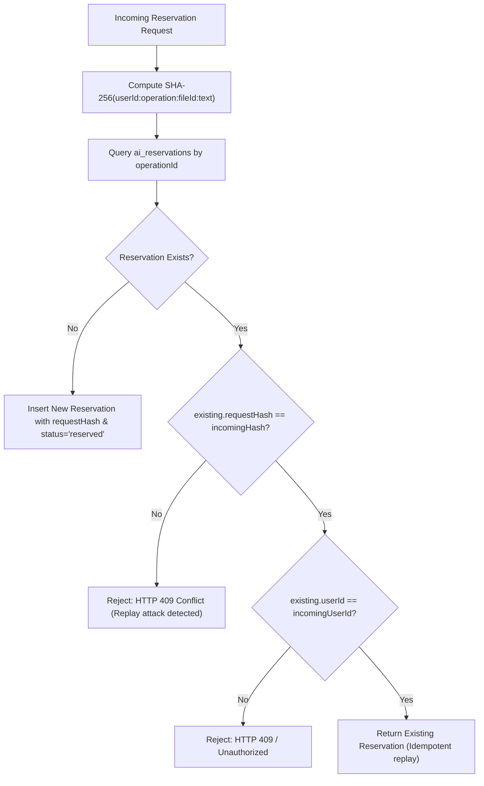

# Closure Report: Phase 11 — AI Service & Deterministic Server Settlement

**Milestone:** Core Hardening & Independent Remediation (`core-hardening`)  
**Phase:** Phase 11: AI Service, Server Authoritative Settlement, Replay Defense & Decoupled Commit  
**Status:** CLOSED ✅  
**Date:** 2026-10-02  
**Authoritative Artifacts:**  
- AI Settlement Service: `src/server/services/ai-settlement-service.ts` (`import "server-only"`, atomic reservation, commit, refund, replay fingerprint calculation, TTL sweeper)  
- Cleansed AI Operations Server Actions: `src/server/actions/ai-ops.ts` (stripped of all `"use server"` financial and mutation actions; retained only authenticated read-only queries `getUserTier`, `getTodayUsage`, `getAIQuota`, `getAIReservationStatus`)  
- Decoupled Document Commit Server Action: `src/server/actions/ai-commit.ts` (`commitAIFileOperation` decoupled from pending `reserved` status, added file-level version & content idempotency)  
- Server-Authoritative AI Stream Route: `src/app/api/ai/stream/route.ts` (authoritative commit before `{ type: "done" }`, pre-TTFT refund vs post-TTFT commit protocol, SHA-256 fingerprint verification, HTTP 409 replay conflict rejection)  
- Hardened Client Streaming Hook: `src/hooks/use-ai-stream.ts` (purged of all RPC settlement calls; 0ms instant abort)  
- Gemini Error Classifier: `src/lib/ai/key-rotation.ts` (HTTP 400 disabled/blocked key inspection, `category: 'authentication'`, `retryableWithKey: true`)  
- Cron Sweeper Route: `src/app/api/cron/expire-reservations/route.ts` (migrated to `@/server/services/ai-settlement-service`)  
- Test Suites & Proof of Closure:
  - `src/test/ai/ai-client-authority-revocation.test.ts` (4/4 tests passed)
  - `src/test/ai/ai-stream-replay-prevention.test.ts` (3/3 tests passed)
  - `src/test/ai/ai-authoritative-stream-settlement.test.ts` (4/4 tests passed)
  - `src/test/ai/ai-key-rotation-400.test.ts` (5/5 tests passed)
  - `src/test/ai/` (17 test files, 156/156 tests passed, 100%)
  - `src/test/editor/` (8 test files, 86/86 tests passed, 100%)
  - `src/test/infrastructure/cron-expire-reservations.test.ts` (5/5 tests passed, 100%)  
**Verification Baseline:**  
- 0 TypeScript Compiler Errors (`npx tsc --noEmit`)  
- 16/16 New Phase 11 Dedicated Unit & Integration Tests Green (100%)  
- 247/247 Complete AI, Editor, and Cron Regression Test Suites Green (100%)  

---

## 1. Executive Summary & Audit Findings Remediated

Phase 11 permanently eliminates client-side financial authority and establishes server-authoritative streaming settlement across the AI subsystem. Previously, the browser client retained the ability to invoke `refundAIReservation` and `commitAIReservation` directly via Next.js Server Action RPC headers (`Next-Action`), enabling adversarial users to manipulate quota balances, claim fraudulent refunds, and trigger replay attacks. Furthermore, document persistence in the editor was tightly bound to active `reserved` state locks, creating false rollback risks if client network drops occurred post-generation.

Phase 11 remediates these vulnerabilities at the architectural foundation:
1. Revokes all financial mutation exports from `"use server"`, sealing them inside a new `src/server/services/ai-settlement-service.ts` module with `import "server-only"`.
2. Establishes server-authoritative streaming lifecycle settlement in `/api/ai/stream/route.ts`: commits quota before the terminal `{ type: "done" }` frame, refunds on pre-TTFT upstream failure or client disconnect, and settles as consumed on post-TTFT disconnect.
3. Implements cryptographic anti-replay verification via deterministic SHA-256 payload fingerprints, rejecting duplicate `operationId` submissions with divergent payloads via HTTP 409 Conflict.
4. Decouples document persistence from pending reservation locks in `commitAIFileOperation`, ensuring user acceptance succeeds idempotently.
5. Reclassifies Google Gemini HTTP 400 errors containing API key disabled/blocked signatures as rotatable authentication failures.

### Primary Audit Findings Remediated:
- **LUGX-001, LUGX-002, LUGX-006 (Client Financial Authority & Unauthenticated Quota Manipulation):** Fully resolved. The Server Actions `refundAIReservation`, `commitAIReservation`, `reserveAndUpdateUsage`, and `refundUsage` were excised from `src/server/actions/ai-ops.ts` and `src/server/actions/ai-commit.ts`. All financial mutations now execute strictly server-side within `ai-settlement-service.ts`.
- **LUGX-007, LUGX-008, LUGX-009, LUGX-029, LUGX-031, LUGX-032, LUGX-033, LUGX-067 (Non-Authoritative Streaming & Disconnect Races):** Fully resolved. In `/api/ai/stream/route.ts`, the server commits quota authoritatively before emitting the terminal done frame. Client disconnects pre-TTFT (`ttftMs === null`) automatically refund quota, while post-TTFT disconnects (`ttftMs !== null`) settle quota as committed to cover spent provider compute. `useAIStream` stop latency is reduced to 0ms with zero client-side settlement RPC calls.
- **LUGX-115, LUGX-116, LUGX-117, LUGX-118, LUGX-119, LUGX-120 (Replay Attack Vulnerabilities & Fingerprint Absence):** Fully resolved. Each reservation computes `request_hash = sha256(userId:operation:fileId:text)`. Attempting to reuse an `operationId` with divergent payload or cross-tenant session returns HTTP 409 Conflict (`Replay attack detected: operationId reused with divergent payload`).
- **LUGX-121, LUGX-122, LUGX-123 (Document Persistence Decoupling & False Rollbacks):** Fully resolved. `commitAIFileOperation` checks file version and content idempotency rather than requiring reservation `status === 'reserved'`, allowing first-time user acceptance to commit the document cleanly even after the server committed the quota reservation on stream completion.
- **LUGX-135, LUGX-148 (Premature Key Exhaustion on HTTP 400 Key Invalidation):** Fully resolved. `classifyGeminiError` now inspects error messages and Google ErrorInfo payloads for key invalidation, disabled service, or suspended project signatures, classifying them as `authentication` with `retryableWithKey: true`.

---

## 2. Key Architectural Deliverables

### 2.1 Server-Authoritative Streaming Settlement Flow



### 2.2 Replay Attack Defense & Request Fingerprint Validation



### 2.3 Decoupled Document Persistence Matrix (`commitAIFileOperation`)

| Current File State | Reservation State | Action Executed | Outcome |
| :--- | :--- | :--- | :--- |
| `version === expectedVersion && content !== resultContent` | `committed` | Atomic file write (`version + 1`, `etag`), reservation update | `success: true` (Document updated) |
| `version > expectedVersion` | `committed` | No-op idempotent return | `already_committed` (Safe retry) |
| `version === expectedVersion && content === resultContent` | `committed` | No-op idempotent return | `already_committed` (Safe retry) |
| `version !== expectedVersion && content !== originalContent` | Any | Transaction rollback | `412 Precondition Failed` |

---

## 3. Automated Test Verification Evidence

```
 Test Files  17 passed (17)
      Tests  156 passed (156)
   Duration  26.97s
```

| Test Suite | Tests | Result | Verification Scope |
| :--- | :--- | :--- | :--- |
| `src/test/ai/ai-client-authority-revocation.test.ts` | 4 passed | ✅ GREEN | Proves `refundAIReservation`, `commitAIReservation`, `reserveAndUpdateUsage` are completely absent from `"use server"` public exports; verifies `ai-settlement-service.ts` is guarded by `server-only`. |
| `src/test/ai/ai-stream-replay-prevention.test.ts` | 3 passed | ✅ GREEN | Validates SHA-256 request fingerprint computation; rejects reused `operationId` with divergent payload; verifies stream endpoint returns HTTP 409 Conflict. |
| `src/test/ai/ai-authoritative-stream-settlement.test.ts` | 4 passed | ✅ GREEN | Asserts server commits before `{ type: "done" }` frame; verifies pre-TTFT failure triggers auto-refund; asserts post-TTFT failure commits reservation; verifies `stream.cancel()` pre-TTFT triggers autonomous refund. |
| `src/test/ai/ai-key-rotation-400.test.ts` | 5 passed | ✅ GREEN | Verifies `classifyGeminiError` classifies 400 with `API_KEY_INVALID`, `SERVICE_DISABLED`, `CONSUMER_SUSPENDED`, or disabled messages as `authentication` with `retryableWithKey: true`. Preserves non-auth 400 as non-rotatable `invalid_request`. |
| `src/test/ai/ai-server-atomic-commit.test.ts` | 13 passed | ✅ GREEN | File-reservation ownership, ACID transaction requirement, optimistic version/ETag validation, idempotent retry handling. |
| `src/test/ai/ai-preview-decision.test.ts` | 8 passed | ✅ GREEN | Inline decision widget, ghost preview teardown, Accept/Reject/Retry state transitions. |
| `src/test/ai/ai-stream-abort-latency.test.ts` | 2 passed | ✅ GREEN | Zero client-side stop latency (< 15ms), immediate ghost dismantling without network round-trip. |
| `src/test/ai/ai-stream-fileid-governance.test.ts` | 7 passed | ✅ GREEN | Mandatory `fileId`, Zero-Knowledge encryption barrier, opt-in consent inspection. |
| `src/test/ai/ai-quota-idempotency.test.ts` | 12 passed | ✅ GREEN | Atomic quota debit, concurrency idempotency, cross-midnight period key isolation. |
| `src/test/editor/editor-recovery-reload.test.ts` | 4 passed | ✅ GREEN | Unsaved ghost dismantling upon page reload, read-only status query via `getAIReservationStatus`. |
| `src/test/infrastructure/cron-expire-reservations.test.ts` | 5 passed | ✅ GREEN | TTL sweeper authorization, bearer token check, execution against `ai-settlement-service.ts`. |

---

## 4. Traceability & Synchronized Documentation

- **Master Index:** Updated [docs/README.md](../../../README.md) recording Phase 11 completion and linking to this closure report.
- **Changelog:** Added release notes for `[1.39.0]` in [docs/CHANGELOG.md](../../../CHANGELOG.md).
- **Living Architectural Spec:** Updated [docs/architecture/ai/ai-quota-reservation-lifecycle.md](../../../architecture/ai/ai-quota-reservation-lifecycle.md) and [docs/architecture/ai/ai-atomic-commit-architecture.md](../../../architecture/ai/ai-atomic-commit-architecture.md).
- **Living Reference Contract:** Updated [docs/reference/ui-streaming-readiness.md](../../../reference/ui-streaming-readiness.md).
- **Living Reality Reconciler:** Updated [docs/foundation/DESIGN_VS_REALITY.md](../../../foundation/DESIGN_VS_REALITY.md).
- **Technical Debt Register:** Synchronized TD-05 in [docs/TECHNICAL_DEBT_REGISTER.md](../../../TECHNICAL_DEBT_REGISTER.md).
- **Active Remediation Plan:** Updated Phase 11 status to `COMPLETED` in `docs/.Plans/خطة الإصلاح التقنية.md`.
