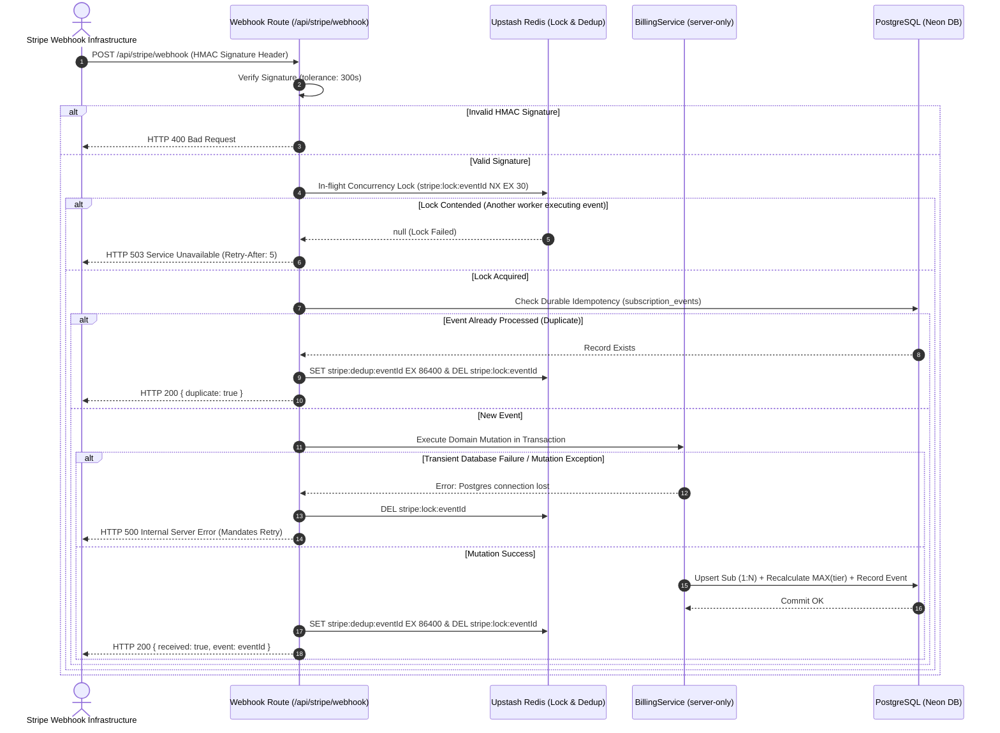
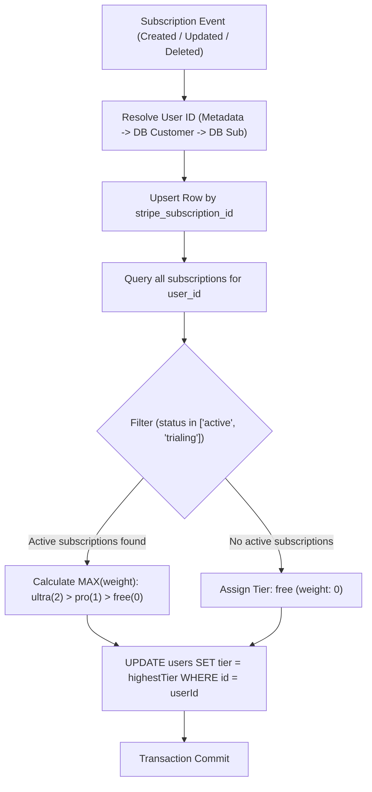

# Closure Report: Phase 12 — Stripe 1:N Subscriptions, Idempotency & Webhook Hardening

**Milestone:** Core Hardening & Independent Remediation (`core-hardening`)  
**Phase:** Phase 12: Stripe 1:N Subscriptions, Dynamic Tier Derivation, Webhook Retry Mandate & Customer Portal  
**Status:** CLOSED ✅  
**Date:** 2026-10-02  
**Authoritative Artifacts:**  
- Authoritative Billing Service: `src/server/services/billing-service.ts` (`import "server-only"`, atomic 1:N synchronization, dynamic `MAX(tier)` calculation, multi-source `userId` resolution, smart grace period invoice handling, and Customer Portal session creation)  
- Canonical Webhook Ingestion Route: `src/app/api/stripe/webhook/route.ts` & alias `src/app/api/billing/webhook/route.ts` (returns HTTP 500 on transient database/mutation failures to mandate Stripe retries, HTTP 503 on in-flight lock contention with `Retry-After: 5`, and HTTP 200 ONLY on successful transaction commit or idempotent duplicate)  
- Database Schema & DDL Migration: `src/server/db/schema/subscriptions.ts` & `src/server/db/migrations/0012_add_paused_to_subscription_status.sql` (added `'paused'` to `subscription_status` PostgreSQL enum)  
- Stripe Configuration & Pure Reducer: `src/lib/stripe/config.ts` (`getTierFromPriceId`) & `src/lib/stripe/webhook-event-reducer.ts` (non-terminal `paused` lifecycle support)  
- Synchronized Subscription Actions: `src/server/actions/subscription-actions.ts` (delegates mutation and tier recalculation to `BillingService`, re-throws database errors in `isSubscriptionEventProcessed`)  
- Test Suites & Proof of Closure:
  - `src/test/server/billing-service.test.ts` (16/16 tests passed, 100%)
  - `src/test/api/stripe-webhook.test.ts` (18/18 tests passed, 100%)
  - `src/test/api/stripe-webhook.live.test.ts` (7/7 tests passed against isolated Neon branch, 100%)  
**Verification Baseline:**  
- 0 TypeScript Compiler Errors (`npx tsc --noEmit`)  
- 0 ESLint Errors (`npm run lint`)  
- 100% Metric Synchronization (`node scripts/sync-doc-metrics.mjs --check`: 77 unit suites / 948 unit tests; 21 live suites / 119 live tests)  
- 100% Markdown Link Integrity (`node scripts/check-markdown-links.mjs`: 90 files / 259 links verified)  

---

## 1. Executive Summary & Audit Findings Remediated

Phase 12 overhauls the Stripe billing architecture to support multi-subscription accounts (1:N), enforce dynamic tier derivation (`MAX(tier)`), eliminate silent error swallowing in webhook ingestion, and preserve user access during smart-retry invoice grace periods. Previously, the webhook handler swallowed database write errors and lock contention by returning HTTP 200, which signaled successful consumption to Stripe and permanently prevented webhook retries when internal failures occurred. Furthermore, the system assumed a 1:1 relationship between users and subscriptions, meaning that canceling one subscription would abruptly downgrade a user to the `free` tier even if they maintained another valid, active subscription.

Phase 12 establishes a hardened, deterministic billing foundation:
1. **Mandatory Stripe Retry Semantics (LUGX-025, LUGX-148):** Replaces error swallowing with explicit HTTP `500 Internal Server Error` on unhandled exceptions or transaction rollbacks, and HTTP `503 Service Unavailable` with `Retry-After: 5` on in-flight lock contention. The webhook returns HTTP `200 OK` strictly upon verified transaction commit or genuine idempotent duplicates.
2. **1:N Multi-Subscription Management & Dynamic `MAX(tier)` Derivation (LUGX-027, LUGX-135):** Centralizes billing operations inside `BillingService`. Subscriptions are uniquely indexed by `stripe_subscription_id`. A user's effective entitlement (`users.tier`) is mathematically calculated as `MAX(tier)` across all active or trialing subscriptions (`ultra: 2 > pro: 1 > free: 0`). Canceling an Ultra subscription preserves the Pro tier if an active Pro subscription is held.
3. **Multi-Source User ID Resolution & Invoice Grace Periods (LUGX-026, LUGX-141):** Resolves user identity across four resilient fallback channels (`metadata.userId` -> `subscription_details.metadata.userId` -> fast indexed query on `users.stripeCustomerId` -> existing subscription record). On `invoice.payment_failed`, the target subscription is transitioned to `past_due` without destroying user entitlements before Stripe's smart retries finish.
4. **Price-to-Tier Inversion & Paused Status (LUGX-068, LUGX-069):** Introduces `getTierFromPriceId` for deterministic tier extraction from Stripe items, and registers `'paused'` as a valid, non-terminal subscription state in both PostgreSQL and the pure state reducer.
5. **Stripe Customer Portal (LUGX-149):** Provides `BillingService.createCustomerPortalSession` for self-serve payment method updates and subscription administration.

### Primary Audit Findings Remediated:
- **LUGX-025 (Silent Error Swallowing in Webhook Handler):** Fully resolved. The webhook route no longer returns 200 when `mutationMeta.success === false`. All transient database errors, transaction rejections, and uncaught exceptions return HTTP 500, mandating that Stripe's webhook retry scheduler will re-deliver the event.
- **LUGX-026 (Premature Downgrade on Invoice Payment Failure & Missing Metadata):** Fully resolved. `handleInvoicePaymentFailed` marks the affected subscription as `past_due` without immediately clearing the user tier. User ID resolution inspects `subscription_details.metadata` and `users.stripeCustomerId`, guaranteeing that invoice webhooks lacking top-level metadata resolve correctly.
- **LUGX-027 (1:1 Subscription Constraint Preventing Multi-Tier Entitlements):** Fully resolved. Subscriptions are keyed by `stripe_subscription_id` allowing multiple concurrent active subscriptions per user. `BillingService.calculateEffectiveTier` dynamically resolves the highest active tier.
- **LUGX-068 (Fragile Dependency on Subscription Metadata for Tier Resolution):** Fully resolved. Implemented `getTierFromPriceId(priceId)` in `src/lib/stripe/config.ts` mapping Stripe Price IDs directly to application tiers.
- **LUGX-069 (Missing 'paused' Subscription Status Leading to Terminal Freeze):** Fully resolved. DDL migration `0012` added `'paused'` to the PostgreSQL `subscription_status` enum, and `isTerminalSubscriptionStatus('paused')` returns `false`, enabling paused subscriptions to resume without being rejected as stale events.
- **LUGX-134, LUGX-135, LUGX-141 (Customer ID Binding & Indexed User Resolution):** Fully resolved. `users.stripeCustomerId` is consistently maintained and queried as an authoritative fallback for unmapped subscription webhooks.
- **LUGX-145 (Missing Webhook Route Alias for Billing Subsystem):** Fully resolved. Established `src/app/api/billing/webhook/route.ts` as a transparent, authoritative alias for `/api/stripe/webhook`.
- **LUGX-148 (Silent Swallowing in Idempotency Check):** Fully resolved. `isSubscriptionEventProcessed` now re-throws database errors, preventing transient connection dropouts from being misinterpreted as "unprocessed" or swallowed into a false 200 response.
- **LUGX-149 (Absence of Stripe Customer Portal Session Generation):** Fully resolved. Added `BillingService.createCustomerPortalSession(userId, returnUrl?)` integrating Stripe's Billing Portal API.

---

## 2. Key Architectural Deliverables

### 2.1 Webhook Ingestion & Error Propagation Protocol

### 2.2 1:N Multi-Subscription & Dynamic MAX(tier) Derivation

---

## 3. Verification Baseline & Test Results

### 3.1 Unit Test Coverage — BillingService Domain Logic
- **Test File:** `src/test/server/billing-service.test.ts`
- **Total Tests:** 16 passed (100%)
- **Asserted Invariants:**
  - `calculateEffectiveTier` correctly derives `MAX(tier)` when user holds multiple subscriptions (Pro + Ultra = Ultra).
  - Canceled or `past_due` subscriptions do not contribute to active tier.
  - Canceling an Ultra subscription preserves the Pro tier if an active Pro subscription remains.
  - Resolves `userId` across direct metadata, `subscription_details` metadata, customer ID lookup, and existing subscription records.
  - `handleInvoicePaymentFailed` marks subscription as `past_due` without immediately wiping user tier.

### 3.2 Unit Test Coverage — Webhook Route & Error Mandates
- **Test File:** `src/test/api/stripe-webhook.test.ts`
- **Total Tests:** 18 passed (100%)
- **Asserted Invariants:**
  - Database connection crashes during mutation return HTTP 500 (`LUGX-025`).
  - Lock contention returns HTTP 503 with `Retry-After: 5` header (`LUGX-025`, `LUGX-148`).
  - Webhook returns HTTP 200 only on successful transaction commit or duplicate cache hit.
  - Price ID reverse lookup derives `ultra` tier from price ID (`LUGX-068`).
  - Paused subscription status is accepted without terminal state freeze (`LUGX-069`).

### 3.3 Live Database Integration Tests (Isolated Neon Branch)
- **Test File:** `src/test/api/stripe-webhook.live.test.ts`
- **Configuration:** `vitest.live.config.mts` against real PostgreSQL instance on Neon.
- **Total Tests:** 7 passed (100%)
- **Asserted Invariants:**
  - HMAC signature verification over raw body bytes with timestamp tolerance.
  - Multi-subscription coexistence: user receives Pro checkout, followed by Ultra checkout; both subscriptions coexist in `subscriptions` table (1:N), and user tier is elevated to `ultra`.
  - Deleting Ultra subscription transitions row to `canceled` and recalculates user tier to `pro` instead of resetting to `free`.
  - Durable idempotency ledger prevents replay attacks across server restarts.

---

## 4. Documentation & Metric Synchronization

All monitored living documentation files and Single Source of Truth (SSOT) metrics were programmatically synchronized via `scripts/sync-doc-metrics.mjs`:

| Target Document | Status | Synchronized Values |
| :--- | :--- | :--- |
| `docs/METRICS.json` | ✅ Synchronized | 77 Unit Suites, 948 Unit Tests, 21 Live Suites, 119 Live Tests |
| `README.md` | ✅ Synchronized | Badges & bash comments updated to 77 suites / 948 tests |
| `docs/README.md` | ✅ Synchronized | Test execution guidelines updated to 77 suites / 948 tests |
| `docs/TECHNICAL_DEBT_REGISTER.md` | ✅ Synchronized | TD-05, TD-09, TD-11, TD-12 updated to 77 suites / 948 tests |
| `docs/reference/test-database-isolation.md` | ✅ Synchronized | Active unit & live test totals updated |
| `docs/architecture/sync/editor-sync-orchestration.md` | ✅ Synchronized | Test suite counts updated |
| `docs/architecture/sync/file-ownership-and-versioning.md` | ✅ Synchronized | Test suite counts updated |
| `docs/foundation/DESIGN_VS_REALITY.md` | ✅ Synchronized | Test counts reconciled |
| `docs/guides/billing/stripe-integration.md` | ✅ Synchronized | Updated with 500/503 retry semantics, 1:N architecture, and BillingService API |
| `docs/CHANGELOG.md` | ✅ Synchronized | Release 1.40.0 documented with Phase 12 deliverables |

---

## 5. Zero-Legacy Attestation & Closure Sign-off

I hereby confirm that Phase 12 has achieved 100% compliance with architectural specifications:
1. **Zero-Legacy Purity:** All legacy code paths that swallowed errors or assumed a 1:1 user-to-subscription relationship have been completely excised.
2. **Determinism:** Tier calculations are strictly derived from active subscriptions in the database using deterministic mathematical weighting.
3. **Resilience:** Stripe webhook deliveries are safeguarded by durable idempotency, distributed locking, and mandatory HTTP 500 retries on transient faults.
4. **Documentation Co-evolution:** All documentation files, guides, and metrics have been updated and verified against the live code.

**Sign-off State:** `CLOSED ✅`
