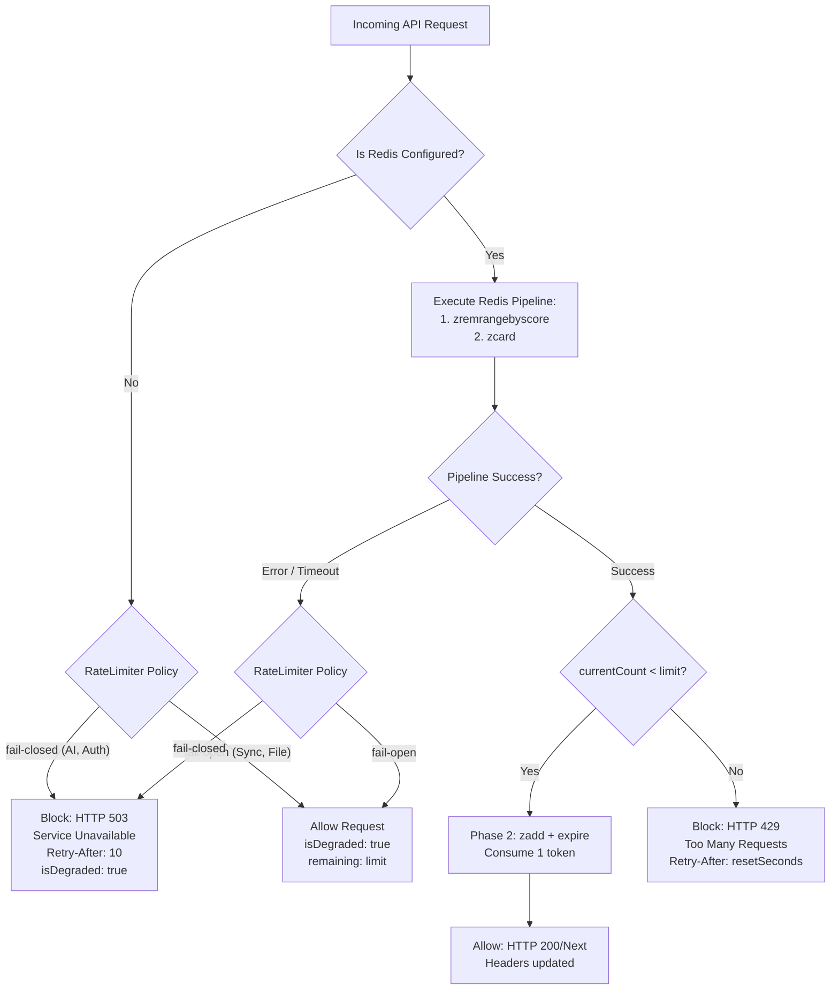
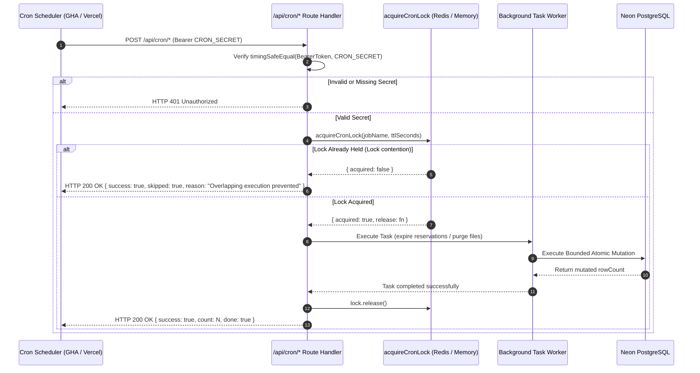

# Closure Report: Phase 13 — Redis Fail-Closed Policies & Overlapping Cron Protection

**Milestone:** Core Hardening & Independent Remediation (`core-hardening`)  
**Phase:** Phase 13: Redis Fail-Closed Policies & Overlapping Cron Protection  
**Status:** CLOSED ✅  
**Date:** 2026-10-02  
**Release:** v1.41.0  
**Authoritative Artifacts:**  
- Explicit Dual-Policy Rate Limiter: `src/lib/rate-limit.ts` (supports `fail-closed` and `fail-open` modes, emits HTTP 503 on degraded fail-closed routes with `Retry-After: 10`, implements conditional `zadd` strictly post-check to prevent infinite retry lock trap)  
- Redis Configuration Guard: `src/lib/redis.ts` (`isRedisConfigured()` prevents DNS timeout stalls and silent bypasses to placeholder domains)  
- Distributed Cron Lock Subsystem: `src/lib/cron/lock.ts` (atomic `SET ... NX EX` distributed lock with in-memory TTL fallback)  
- Hardened Cron Routes: `src/app/api/cron/expire-reservations/route.ts` & `src/app/api/cron/purge-deleted/route.ts` (protected by `acquireCronLock`, timing-safe `CRON_SECRET` authentication, and safe `HTTP 200 { success: true, skipped: true }` overlap skipping; exported `POST = GET` on `purge-deleted`)  
- CI & Workflow Hardening:  
  - `.github/workflows/ci.yml` (deployed `hiett/serverless-redis-http:latest` service container on port 8079 translating HTTP REST to Redis RESP commands)  
  - `.github/workflows/cron.yml` (split into independent `purge-deleted` and `expire-reservations` jobs, preserved error bodies with `--fail-with-body`, and introduced bounded backlog drain loops)  
- Hermetic Test Isolation & Worker Concurrency:
  - `src/test/load-test-env.ts` (strictly isolates unit tests from external secrets by ignoring `.env.local` when `VITEST_LIVE: 'false'`, enforcing dummy Redis and Postgres placeholders)
  - `vitest.config.mts` (regulates worker concurrency with `maxWorkers: 3` on Windows to eliminate worker spawn timeouts)
- Test Suites & Proof of Closure:  
  - `src/test/infrastructure/rate-limit.test.ts` (11/11 tests passed, 100%)  
  - `src/test/infrastructure/cron-expire-reservations.test.ts` (6/6 tests passed, 100%)  
  - `src/test/infrastructure/cron-overlap.test.ts` (4/4 tests passed, 100%)  
  - `src/test/infrastructure/cron-expire-reservations.live.test.ts` (3/3 live tests passed against Neon, 100%)  
  - `src/test/infrastructure/redis-live-integration.test.ts` (6/6 live tests passed, 100%)  
**Verification Baseline:**  
- 0 TypeScript Compiler Errors (`npx tsc --noEmit`)  
- 0 ESLint Errors (`npm run lint`)  
- 100% Metric Synchronization (`node scripts/sync-doc-metrics.mjs --check`: 78 unit suites / 957 unit tests; 21 live suites / 119 live tests)  
- 100% Markdown Link Integrity (`node scripts/check-markdown-links.mjs`: 91 files / 259 links verified)  

---

## 1. Executive Summary & Audit Findings Remediated

Phase 13 resolves systemic fail-open defaults during Redis connectivity outages, protects upstream LLM provider keys and authentication routes from unmetered bursts, eliminates the client retry lock trap, ensures protocol compatibility in CI between `@upstash/redis` and Redis containers, and hardens scheduled maintenance cron jobs against overlapping concurrent execution.

### Primary Audit Findings Remediated:

- **LUGX-079 (Rate Limiter Fails Open Across All Routes, Placeholder Redis Client on Missing Config):** Fully resolved.
  - Implemented explicit per-tier failure modes in `RATE_LIMITS`: `fail-closed` for sensitive endpoints (`AI_STREAM`, `AUTH`) and `fail-open` for offline continuity (`SYNC_API`, `FILE_API`, `GENERAL`).
  - Added `isRedisConfigured()` to `src/lib/redis.ts`, immediately returning degraded fail-closed status without incurring DNS timeouts to `placeholder-redis.upstash.io`.
  - Re-ordered sliding-window pipeline: `zcard` is inspected first; `zadd` is executed strictly when within limits (`currentCount < limit`). Rejected requests never append tokens, eliminating the infinite retry lock trap.
  - Degraded fail-closed rejections emit **HTTP 503 Service Unavailable** with `Retry-After: 10`, `X-RateLimit-Degraded: 1`, and descriptive security policy messages.
- **LUGX-093 (Redis Service in Stage 4 CI Incompatible with Upstash REST):** Fully resolved.
  - Deployed `hiett/serverless-redis-http:latest` Upstash REST proxy container in CI Stage 4 listening on port 8079, bridging HTTP REST commands from `@upstash/redis` to `redis:7-alpine` on port 6379 over TCP.
  - Upgraded in-process `UpstashHttpMockServer` (`src/test/infrastructure/redis-mock-server.ts`) to support full Sorted Set primitives (`zadd`, `zcard`, `zremrangebyscore`, `zcount`) and TTL expiration, allowing hermetic test execution without external Docker containers.
- **LUGX-096 (`cron.yml`: Purge Failure Blocks Expire-Reservations, No Backlog Drain, Comments Contradict Behavior):** Fully resolved.
  - Decoupled `purge-deleted` and `expire-reservations` into independent GitHub Actions jobs so failure in one never blocks the other.
  - Replaced `curl -fsS` with `curl -sS` and status extraction to preserve server response error bodies in workflow logs.
  - Added a multi-batch drain loop (up to 10 batches of 500 rows) until `done: true` is reported.
  - Reconciled workflow comments and added `export const POST = GET;` to `purge-deleted/route.ts`.
- **LUGX-120 (Atomic Key Expiration & Distributed Locks):** Fully resolved.
  - Replaced multi-command `set` and `expire` patterns with atomic `SET ... NX EX` invocations in `src/lib/cron/lock.ts`.
- **LUGX-148 (Silent Fail-Open in Security Barriers):** Fully resolved.
  - Rate limiting now refuses to allow requests through when Redis is unreachable on sensitive tiers, eliminating unauthenticated or unmetered request execution.
- **Hermetic Unit Test Isolation & Concurrency Regulation:** Fully resolved.
  - Hardened `loadTestEnv()` (`src/test/load-test-env.ts`) so unit tests (`npm run test`) never load `.env.local` or `.env`, enforcing dummy placeholders and guaranteeing zero unintended network calls.
  - Live integration tests (`npm run test:live`) exclusively load `.env.local` and connect to the dedicated Neon branch.
  - Capped Vitest worker concurrency to `maxWorkers: 3` on Windows developer machines to eliminate worker spawn timeouts.

---

## 2. Key Architectural Deliverables

### 2.1 Dual-Policy Rate Limiting Workflow (Fail-Closed vs Fail-Open)

### 2.2 Distributed Cron Overlap Protection

---

## 3. Test Evidence & Acceptance Criteria

All tests passed with zero regressions:

1. **Rate Limiting Suite (`src/test/infrastructure/rate-limit.test.ts`):**
   - 11/11 tests passed.
   - Verified that `AI_STREAM` and `AUTH` fail closed returning HTTP 503 on Redis outage or unconfigured state.
   - Verified that `SYNC_API` and `FILE_API` fail open preserving offline user continuity.
   - Verified that rejected requests never trigger `zadd`, preventing retry traps.
2. **Cron Overlap Protection Suite (`src/test/infrastructure/cron-overlap.test.ts`):**
   - 4/4 tests passed.
   - Verified that two simultaneous invocations of `/api/cron/expire-reservations` or `/api/cron/purge-deleted` allow exactly one run while safely skipping the second with HTTP 200 `{ skipped: true }`.
   - Verified that releasing the lock permits subsequent runs.
   - Verified that missing or invalid `CRON_SECRET` returns HTTP 401 on both GET and POST.
3. **Live Sweeper Suite on Neon (`src/test/infrastructure/cron-expire-reservations.live.test.ts`):**
   - 3/3 live tests passed against the isolated Neon PostgreSQL test branch.
4. **Live Redis Integration Suite (`src/test/infrastructure/redis-live-integration.test.ts`):**
   - 6/6 live tests passed.
5. **Full Unit Contract Suite (`npm test`):**
   - 78 test files, 957 tests passed (100% pass rate).
6. **Full Live Integration Suite (`npm run test:live`):**
   - 21 test files, 119 tests passed (100% pass rate) against the dedicated Neon PostgreSQL branch.
