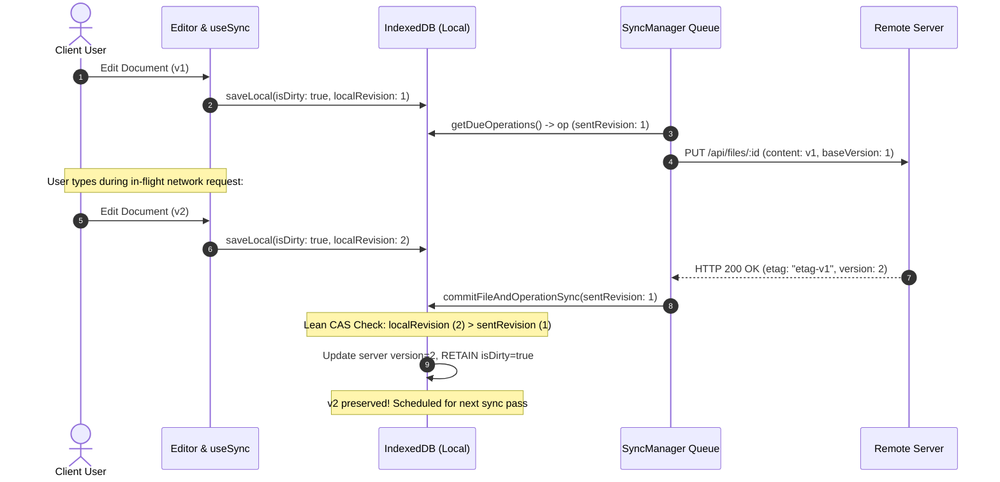
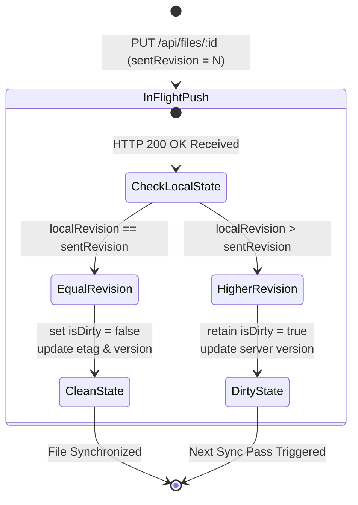

# Closure Report: Phase 14 — Local Sync Queue & Atomic CAS with localRevision

**Milestone:** Core Hardening & Independent Remediation (`core-hardening`)  
**Phase:** Phase 14: Local Sync Queue & Atomic CAS with localRevision  
**Status:** CLOSED ✅  
**Date:** 2026-10-03  
**Release:** v1.42.0  
**Authoritative Artifacts:**  
- Schema & Model Extension: `src/lib/sync/idb-types.ts` (added `localRevision?: number` to `IDBFile`, and `sentRevision?: number` to `IDBOperation`)  
- Dedicated Operation Coalescing Module: `src/lib/sync/coalescing.ts` (implements pure `canCoalesce` and `coalesceOperations` enforcing queued-only coalescing)  
- Atomic CAS Concurrency Implementation: `src/lib/sync/indexeddb.ts` (implements Lean CAS in `commitFileAndOperationSync` and `markFileClean` comparing `localRevision` vs `sentRevision`)  
- Client Hook Mutation Revision Tracking: `src/hooks/use-sync.ts` (monotonically increments `localRevision` on every local `saveLocal` edit and binds it to queued operations)  
- Sync Engine Lifecycle & Non-Destructive Error Handling: `src/lib/sync/sync-manager.ts` (passes `sentRevision` in push completion pathways, removes destructive rollbacks on network push failures)  
- Test Suites & Proof of Closure:  
  - `src/test/sync/sync-cas-concurrency.test.ts` (9/9 tests passed, 100%)  
  - `src/test/sync/sync-indexeddb.test.ts` (14/14 tests passed, 100%)  
  - `src/test/sync/sync-manager.test.ts` (36/36 tests passed, 100%)  
  - `src/test/sync/sync-rollback.test.ts` (22/22 tests passed, 100%)  
  - `src/test/sync/use-sync.test.ts` (14/14 tests passed, 100%)  
  - `src/test/types/contracts.test.ts` (20/20 tests passed, 100%)  
**Verification Baseline:**  
- 0 TypeScript Compiler Errors (`npx tsc --noEmit`)  
- 0 ESLint Errors (`npm run lint`)  
- 100% Metric Synchronization (`node scripts/sync-doc-metrics.mjs --check`: 79 unit suites / 966 unit tests; 21 live suites / 119 live tests)  
- 100% Markdown Link Integrity (`node scripts/check-markdown-links.mjs`: 92 files / 260 links verified)  

---

## 1. Executive Summary & Audit Findings Remediated

Phase 14 resolves the in-flight lost update problem (LUGX-010), operation coalescing pollution (LUGX-040), server version stagnation (LUGX-011), and destructive push error rollbacks (LUGX-013) within the client offline sync layer.

### Primary Audit Findings Remediated:

- **LUGX-010 (Lost Update: Edits Made During Active Push Are Marked Clean):** Fully resolved.
  - Added a monotonic `localRevision` counter to `IDBFile`, incremented by 1 on every local mutation in `saveLocal`.
  - Implemented Lean CAS (Compare-And-Swap) gating inside `commitFileAndOperationSync` and `markFileClean`.
  - If `file.localRevision === sentRevision`: file is marked `isDirty = false` and server version/etag are recorded.
  - If `file.localRevision > sentRevision`: in-flight edits occurred. The file updates the server version to prevent 412 conflicts, but **strictly retains `isDirty = true`**, guaranteeing subsequent sync cycles deliver the newer local edits.
- **LUGX-040 (`coalesceOperation` Merges Fresh Edits into 'conflict', 'failed', or 'dead_letter' Operations):** Fully resolved.
  - Extracted `src/lib/sync/coalescing.ts` as a standalone module.
  - Restricted coalescing strictly to operations in `queued` status (`synced === false`).
  - Prohibited coalescing into `syncing` operations (preventing race conditions with active network flights).
  - Prohibited coalescing into `conflict`, `failed`, or `dead_letter` operations, preventing fresh user edits from getting trapped in terminal error states.
  - Reset retry attempts (`attempts = 0`), cleared backoff timers (`nextRetryAt = undefined`), and advanced `localRevision` on merged operations.
- **LUGX-011 (Local Version Not Updated After Successful Push, Causing False 412 Resolved by Dropping Next Edit):** Fully resolved.
  - Server push response `{ etag, version }` is committed atomically; `newVersion` is passed to `commitFileAndOperationSync` and `markFileClean` to keep client `file.version` synchronized with server state.
- **LUGX-013 (Rollback Restores Pre-Push Snapshot Over Newer Local Edits):** Fully resolved.
  - Excised destructive `rollback.rollback` invocations from network push error handlers in `processSingleOperation` and `pushFile`.
  - On network failures, checkpoints are safely discarded via `removeCheckpoint` while preserving current local dirty state for exponential backoff retries.

---

## 2. Technical Architecture & Invariants

### 2.1 Lean CAS Concurrency Control

### 2.2 Coalescing State Decision Matrix

| Existing Operation Status | Incoming Operation | Permitted Action | Rationale |
| :--- | :--- | :--- | :--- |
| `queued` | `update` | Merge (Coalesce) | Safe deduplication; resets `attempts: 0` and advances `localRevision`. |
| `syncing` | `update` | Separate Enqueue | Active in-flight request cannot be mutated without causing network races. |
| `conflict` | `update` | Separate Enqueue | Conflict state is isolated and awaiting resolution; fresh edit is queued independently. |
| `failed` / `dead_letter` | `update` | Separate Enqueue | Fresh user edit must not inherit failed state or expired backoff timers. |
| `synced` | `update` | Separate Enqueue | Already confirmed; fresh edit creates a new active operation. |

---

## 3. Verification Evidence & Test Execution

### 3.1 Real Concurrency Test Suite (`src/test/sync/sync-cas-concurrency.test.ts`)
- `Coalescing Module > should allow coalescing for identical fileId in queued status with compatible operations`: PASSED.
- `Coalescing Module > should strictly prohibit coalescing when existing operation is in syncing status (LUGX-010)`: PASSED.
- `Coalescing Module > should strictly prohibit coalescing when existing operation is in terminal or conflict status (LUGX-040)`: PASSED.
- `Coalescing Module > should merge operations, advancing localRevision and resetting retry backoff`: PASSED.
- `Lean CAS Concurrency Control in IndexedDB > should atomically mark file clean when sentRevision matches current localRevision`: PASSED.
- `Lean CAS Concurrency Control in IndexedDB > should preserve isDirty = true and retain newer edits when localRevision > sentRevision (LUGX-010)`: PASSED.
- `Lean CAS Concurrency Control in IndexedDB > should guard markFileClean with Lean CAS against in-flight local modifications`: PASSED.
- `SyncManager End-to-End > should preserve dirty state and not rollback on push network errors (LUGX-013)`: PASSED.
- `SyncManager End-to-End > should handle in-flight modification during live SyncManager execution`: PASSED.

### 3.2 Regression Verification Summary
| Test Suite | Tests Passed | Status | Coverage Focus |
| :--- | :--- | :--- | :--- |
| `sync-cas-concurrency.test.ts` | 9 / 9 | PASSED ✅ | In-flight race simulation, Lean CAS, strict coalescing |
| `sync-indexeddb.test.ts` | 14 / 14 | PASSED ✅ | Multi-user isolation, transparent encryption at rest |
| `sync-manager.test.ts` | 36 / 36 | PASSED ✅ | Queue orchestration, backoff, dead-lettering, CAS commits |
| `sync-rollback.test.ts` | 22 / 22 | PASSED ✅ | Isolated rollback primitives and crash recovery |
| `use-sync.test.ts` | 14 / 14 | PASSED ✅ | Client hook saveLocal, monotonic localRevision |
| `contracts.test.ts` | 20 / 20 | PASSED ✅ | SyncOperationContract runtime Zod validation |

---

## 4. Closure Verdict

**Phase 14 Status:** **CLOSED ✅**  
All acceptance criteria met with zero compiler warnings or errors, zero ESLint issues, 100% metrics consistency, and zero regressions across all 79 test suites.
