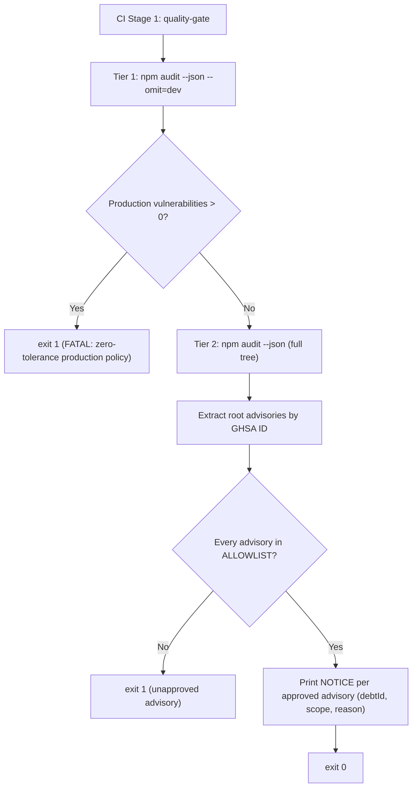

# Closure Report: Phase 15.1 — Deterministic Dependency Security Audit Gate (TD-15)

**Milestone:** Core Hardening & Independent Remediation (`core-hardening`)  
**Phase:** Phase 15.1 (Patch): Deterministic Dependency Security Audit Gate with Developer-Managed Allowlist  
**Status:** CLOSED ✅  
**Date:** 2026-10-03  
**Release:** v1.43.1  
**Decision Owner:** Project Owner & Sole Developer  
**Authoritative Artifacts:**  
- Security Audit Gate: `scripts/ci-audit.mjs` (two-tier audit: production fail-closed + full-tree allowlist comparison)  
- CI Workflow: `.github/workflows/ci.yml` (Stage 1 `quality-gate` → step `Dependency Security Audit` runs `node scripts/ci-audit.mjs`)  
- npm Script: `package.json` → `"audit:ci": "node scripts/ci-audit.mjs"`  
- Debt Registration: [`TECHNICAL_DEBT_REGISTER.md` → TD-15](../../../TECHNICAL_DEBT_REGISTER.md)  
- Living Contract: [`reference/ci-pipeline.md`](../../../reference/ci-pipeline.md)  

---

## 1. Incident Summary

| Field | Value |
| :--- | :--- |
| Advisory | `GHSA-vfj7-8cjw-p6xm` / `CVE-2026-93687` |
| Package | `braces <= 3.0.3` (`CWE-674`, uncontrolled recursion DoS) |
| Dependency Chain | `eslint-config-next@16.3.8` → `@next/eslint-plugin-next@16.3.8` → `fast-glob@3.3.1` → `micromatch@4.0.8` → `braces` |
| Scope | `devDependencies` only (lint toolchain) |
| Origin | Latent: present since project inception; newly disclosed upstream, not introduced by a code change |
| Upstream Patch | None published at closure date |
| CI Impact | `npm audit --audit-level=high` failed Stage 1, blocking all downstream stages |

### Rejected Remediations

| Option | Reason for Rejection |
| :--- | :--- |
| `npm audit fix --force` | Downgrades `eslint-config-next` to `14.2.35`; breaks Next.js 16 / React 19 / ESLint 9 compatibility |
| `overrides` to a patched `braces` | No patched version exists in the npm registry |
| Lowering threshold to `--audit-level=critical` | Silently hides all future `high` advisories, including production ones |
| `continue-on-error` on the audit step | Disables the gate entirely (fail-open) |

---

## 2. Implemented Architecture

### Gate Invariants

- **Production fail-closed:** any advisory reachable from production dependencies fails CI, regardless of allowlist.
- **Allowlist is ID-exact:** entries keyed by normalized GHSA ID; a new advisory on the same package is not covered.
- **Allowlist traceability:** each entry carries `debtId` that must exist in `TECHNICAL_DEBT_REGISTER.md`.
- **Parse failure is fatal:** non-JSON `npm audit` output throws, failing CI (no silent pass).
- **Two categories only:** production (strict) and development (strict + allowlist); no per-severity tiers.

### Allowlist State at Closure

| GHSA ID | Package | Severity | Scope | Debt ID |
| :--- | :--- | :--- | :--- | :--- |
| `GHSA-VFJ7-8CJW-P6XM` | `braces` | high | dev | TD-15 |

---

## 3. Verification Evidence

| Check | Command | Result |
| :--- | :--- | :--- |
| Security gate | `node scripts/ci-audit.mjs` | Exit 0; Tier 1: 0 production vulnerabilities; Tier 2: 1 approved advisory (TD-15), 0 unapproved |
| Documentation metrics | `node scripts/sync-doc-metrics.mjs --check` | Exit 0; 81 unit suites / 980 tests; 21 live suites / 119 tests; 14 E2E specs / 15 tests |
| Markdown links | `node scripts/check-markdown-links.mjs` | Exit 0; 94 files / 263 links; 0 broken |

### 3.1 Notes

- Source code under `src/**` was not modified in this patch; unit/live test counts remain at the Phase 15 baseline (81 suites / 980 tests; 21 live suites / 119 tests per `docs/METRICS.json`).
- Unit/live suites were not re-executed: no source or test file changed in this patch.

---

## 4. Exit Conditions for TD-15

- Upstream publishes `braces >= 3.0.4`, or `@next/eslint-plugin-next` drops the vulnerable glob chain.
- Action on trigger: upgrade dependencies, remove `GHSA-VFJ7-8CJW-P6XM` from `ALLOWLIST` in `scripts/ci-audit.mjs`, mark TD-15 resolved.

---

## 5. Closure Verdict

**Phase 15.1 Status:** **CLOSED ✅**  
CI Stage 1 unblocked without forced downgrades; production dependency tree enforced at zero vulnerabilities; latent dev-toolchain advisory formally registered and gated by an ID-exact allowlist.
