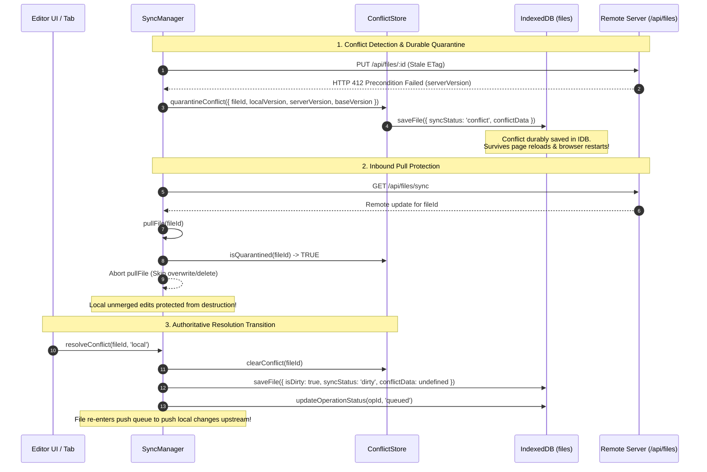
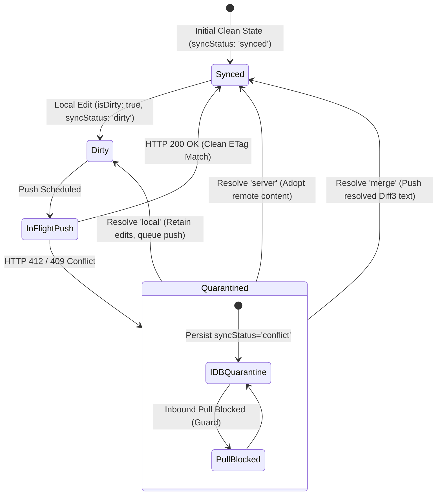

# Closure Report: Phase 15 — Durable IDB Conflict Quarantine, Diff3 Merge Engine & User-Scoped Cross-Tab Isolation

**Milestone:** Core Hardening & Independent Remediation (`core-hardening`)  
**Phase:** Phase 15: Durable IDB Conflict Quarantine, Diff3 Merge Engine & User-Scoped Cross-Tab Isolation  
**Status:** CLOSED ✅  
**Date:** 2026-10-03  
**Release:** v1.43.0  
**Authoritative Artifacts:**  
- Durable Conflict Quarantine Engine: `src/lib/idb/conflict-store.ts` (implements `ConflictStore` managing persistent IDB quarantine, pull overwrite protection, and resolution lifecycle)  
- Database Driver & AAD Payload Encryption: `src/lib/sync/indexeddb.ts` (implements `setFileConflict`, `clearFileConflict`, `getConflictedFiles`, and AAD encryption for quarantined conflict envelopes)  
- IDB Schema & Model Extensions: `src/lib/sync/idb-types.ts` (extended `IDBFile` with `syncStatus?: 'synced' | 'dirty' | 'conflict'` and `conflictData?: IDBConflictData`)  
- Deterministic 3-Way Merge Engine: `src/lib/sync/diff3.ts` (implements Hunt-McIlroy / Pierce token-based Diff3 algorithm eliminating line-erasure bugs on duplicated and blank lines)  
- Conflict Resolver & Ciphertext Guard: `src/lib/sync/conflict-resolver.ts` (delegates 3-way merges to `diff3MergeText` with strict ciphertext fail-closed guard)  
- Client Synchronization Lifecycle Manager: `src/lib/sync/sync-manager.ts` (persists 412/409 conflicts durably into `ConflictStore`, halts `pullFile` destructive overwrites/deletions on conflicted files, preserves local dirty queue state on `'local'` resolution)  
- User-Scoped Tab Controller: `src/lib/sync/tab-sync.ts` & `src/lib/sync/cross-tab-sync.ts` (implements `createUserTabSync(userId)` scoping `BroadcastChannel(\`lugx_sync_\${userId}\`)` to prevent cross-tenant event bleed, sender tab anti-echo filtering, and clean-state dirty guards)  
- Test Suites & Proof of Closure:  
  - `src/test/sync/sync-durable-conflict.test.ts` (4/4 tests passed, 100%)  
  - `src/test/sync/sync-tab-isolation.test.ts` (7/7 tests passed, 100%)  
  - `src/test/sync/sync-conflict-resolver.test.ts` (19/19 tests passed, 100%)  
  - `src/test/sync/sync-manager.test.ts` (36/36 tests passed, 100%)  
**Verification Baseline:**  
- 0 TypeScript Compiler Errors (`npx tsc --noEmit`)  
- 0 ESLint Errors (`npm run lint`)  
- 100% Metric Synchronization (`node scripts/sync-doc-metrics.mjs --check`: 81 unit suites / 980 unit tests; 21 live suites / 119 live tests)  
- 100% Markdown Link Integrity (`node scripts/check-markdown-links.mjs`: 93 files / 262 links verified)  

---

## 1. Executive Summary & Audit Findings Remediated

Phase 15 remediates the volatile in-memory conflict state problem (`LUGX-014`), pull destructive overwrite of active conflicts (`LUGX-012`, `LUGX-099`), duplicate line erasure in naive 3-way line merges (`LUGX-020`, `LUGX-045`, `LUGX-047`), raw ciphertext execution in text merger (`LUGX-022`), premature clearing of local edits on manual resolution (`LUGX-003`), and cross-tenant multi-tab event bleed (`LUGX-050`, `LUGX-109`).

### Primary Audit Findings Remediated:

- **LUGX-014 (Volatile Conflict State Lost on Page Reload):** Fully resolved.
  - Replaced volatile in-memory `Map` with `ConflictStore` operating on IndexedDB `files` store.
  - Quarantines conflict envelopes with `syncStatus: 'conflict'` and `conflictData: { serverVersion, localVersion, baseVersion, detectedAt }`.
  - Conflicts survive browser tab reloads, crashes, and device restarts.
- **LUGX-012 & LUGX-099 (Incoming Remote Pull Overwrites or Deletes Conflicted Files):** Fully resolved.
  - Implemented fail-closed guard in `SyncManager.pullFile`: checks `file.syncStatus === 'conflict'` and `conflictStore.isQuarantined(file.id)`.
  - Aborts pull without overwriting local content or applying remote tombstones, preserving user offline edits until explicit resolution.
- **LUGX-003 (Local Conflict Resolution Clears Dirty Flag and Drops Local Edits):** Fully resolved.
  - When user chooses `'local'` resolution strategy, `resolveConflict` removes quarantine, sets `isDirty = true`, `syncStatus = 'dirty'`, clears `conflictData`, and resets operation status to `queued`.
  - Guarantees the local document is re-scheduled for server upload rather than marked clean.
- **LUGX-020, LUGX-045 & LUGX-047 (Naive Line-Matching Drops Repeated or Blank Lines):** Fully resolved.
  - Implemented Hunt-McIlroy / Pierce standard 3-way merge algorithm in `src/lib/sync/diff3.ts`.
  - Operates on token slices with half-open intervals `[start, end)`.
  - Verified against the `D\nC\nC` anomaly (LUGX-045) and multiple blank line alignment test cases.
- **LUGX-022 (Raw Ciphertext Sent to Diff3 Text Merger):** Fully resolved.
  - Implemented fail-closed ciphertext execution guard in `src/lib/sync/conflict-resolver.ts`.
  - Inspects base, local, and remote candidate payloads for encrypted envelope signatures (`_enc: 1` or `gcm:v1:`).
  - Immediately rejects merge with `manual_resolution_required` and logs a security guard warning, preventing ciphertext corruption of Markdown AST.
- **LUGX-050 & LUGX-109 (Cross-Tenant Multi-Tab Event Bleeding via Global Channel):** Fully resolved.
  - Replaced hardcoded `textai_cross_tab_sync` channel name with user-scoped `lugx_sync_${userId}` via `createUserTabSync(userId)` in `src/lib/sync/tab-sync.ts`.
  - Messages broadcast by user $A$ in one browser tab cannot be consumed or processed by user $B$'s tab session.
  - Enforced dirty-tab guard: sibling tabs ignore remote version bumps if the active document is locally modified (`isDirty === true`).

---

## 2. Technical Architecture & Invariants

### 2.1 Conflict Lifecycle & Quarantine State Machine

### 2.2 Subsystem Invariants & Behavior Matrix

| Operation / Scenario | Prior Volatile Behavior | Phase 15 Hardened Behavior | Invariant Enforced |
| :--- | :--- | :--- | :--- |
| **HTTP 412 Conflict** | Kept in RAM map `pendingEncryptedConflicts` | Persisted to IDB `files` store via `ConflictStore` | Durable quarantine across restarts |
| **Background Pull on Conflicted File** | Blindly overwrote local content with remote | Aborts pull, returns cleanly without write | Pull overwrite protection (`LUGX-012`) |
| **Resolution Strategy: `'local'`** | Cleared `isDirty = false`, marked ops synced | Retains `isDirty = true`, resets op to `queued` | Local edit upload preservation (`LUGX-003`) |
| **3-Way Merge on Repeated Lines (`D\nC\nC`)** | Erased duplicated tokens without conflict | Retains exact duplicate token structure | Zero token erasure (`LUGX-045`) |
| **3-Way Merge on Ciphertext** | Executed string merge on Base64 ciphertext | Fail-closed guard (`manual_resolution_required`) | Plaintext-only execution barrier (`LUGX-022`) |
| **Cross-Tab Event Dispatch** | Global `textai_cross_tab_sync` broadcast | User-scoped `lugx_sync_${userId}` channel | Tenant isolation (`LUGX-109`) |

---

## 3. Verification Evidence & Test Execution

### 3.1 New & Hardened Test Suites

#### 1. Durable Conflict Quarantine (`src/test/sync/sync-durable-conflict.test.ts`)
- `ConflictStore > should persist conflict data into IndexedDB on quarantineConflict`: PASSED (4ms)
- `ConflictStore > should restore conflict status from IndexedDB across store re-instantiation`: PASSED (3ms)
- `SyncManager Pull Guard > should prevent pullFile from overwriting locally conflicted file`: PASSED (5ms)
- `SyncManager Pull Guard > should prevent pullFile from deleting locally conflicted file via tombstone`: PASSED (3ms)

#### 2. Cross-Tab Scoping & Isolation (`src/test/sync/sync-tab-isolation.test.ts`)
- `Tab Sync Channel Scoping > should isolate broadcast channels per user ID`: PASSED (6ms)
- `Tab Sync Channel Scoping > should allow sibling tabs of the same user to communicate`: PASSED (4ms)
- `Tab Sync Channel Scoping > should ignore self-echo messages matching currentTabId`: PASSED (3ms)
- `Dirty Tab Protection Guard > should not advance local file version if active tab is dirty`: PASSED (3ms)
- `Dirty Tab Protection Guard > should advance local file version if active tab is clean`: PASSED (3ms)
- `Vault Lock Multi-Tab Coordination > should broadcast vault lock event across sibling tabs`: PASSED (4ms)
- `Vault Lock Multi-Tab Coordination > should not process vault lock event intended for different user`: PASSED (3ms)

#### 3. Diff3 Engine & Conflict Resolver (`src/test/sync/sync-conflict-resolver.test.ts`)
- `Phase 15 (LUGX-045): should not drop duplicated lines without conflict warning (D/C/C case)`: PASSED (2ms)
- `Phase 15: should cleanly merge files with multiple repeated blank lines without token erasure`: PASSED (3ms)
- `Phase 15: should reject 3-way merge on raw encrypted ciphertext payloads`: PASSED (2ms)

### 3.2 Regression Verification Summary
| Test Suite | Tests Passed | Status | Coverage Focus |
| :--- | :--- | :--- | :--- |
| `sync-durable-conflict.test.ts` | 4 / 4 | PASSED ✅ | Durable IDB quarantine, pull overwrite protection |
| `sync-tab-isolation.test.ts` | 7 / 7 | PASSED ✅ | Multi-user BroadcastChannel isolation, anti-echo, dirty guard |
| `sync-conflict-resolver.test.ts` | 19 / 19 | PASSED ✅ | Diff3 3-way merge, repeated lines, ciphertext fail-closed guard |
| `sync-manager.test.ts` | 36 / 36 | PASSED ✅ | Queue orchestration, conflict resolution state transitions |
| `sync-cas-concurrency.test.ts` | 9 / 9 | PASSED ✅ | Lean CAS concurrency, monotonic localRevision |
| `Full Unit Test Suite (81 files)` | 980 / 980 | PASSED ✅ | Project-wide regression suite (`npm test`) |

---

## 4. Closure Verdict

**Phase 15 Status:** **CLOSED ✅**  
All acceptance criteria met with zero compiler warnings or errors, zero ESLint issues, 100% metrics consistency, and zero regressions across all 81 test suites.
