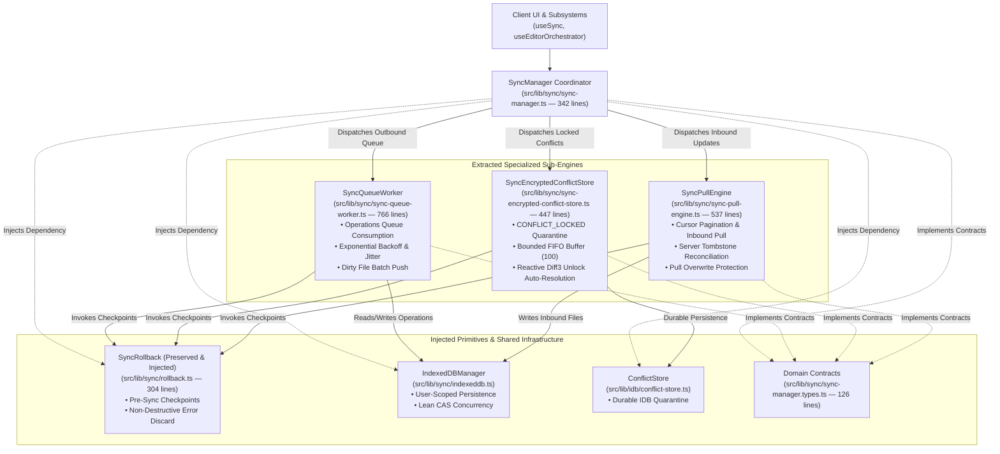

# Closure Report: Phase 16 — Thin Coordinator SyncManager Decomposition & Subsystem Extraction

**Milestone:** Core Hardening & Independent Remediation (`core-hardening`)  
**Phase:** Phase 16: Thin Coordinator SyncManager Decomposition & Subsystem Extraction  
**Status:** CLOSED ✅  
**Date:** 2026-10-04  
**Release:** v1.44.0  
**Decision Owner:** Core Engineering Team & Subsystem Architecture Lead  
**Authoritative Artifacts:**  
- Thin Coordinator: `src/lib/sync/sync-manager.ts` (342 lines, 304 executable code lines, coordinating queue dispatch, dirty pushes, remote updates, and reactive vault unlock events)  
- Dedicated Queue Worker: `src/lib/sync/sync-queue-worker.ts` (766 lines, handling operations queue consumption, backoff scheduling with jitter, dirty file batches, and non-destructive checkpoint cleanup)  
- Encrypted Conflict Store: `src/lib/sync/sync-encrypted-conflict-store.ts` (447 lines, managing in-memory `CONFLICT_LOCKED` quarantine, bounded FIFO capacity of 100, diagnostics, and 3-way Diff3 merge on vault unlock)  
- Remote Pull Engine: `src/lib/sync/sync-pull-engine.ts` (537 lines, handling cursor pagination, tombstone propagation, inbound decryption, and pull overwrite protection on conflicted documents)  
- Shared Domain Contracts: `src/lib/sync/sync-manager.types.ts` (126 lines, defining `SyncManagerConfig`, `SyncStatus`, `QuarantineDiagnostics`, callback types, and `MAX_QUARANTINED_CONFLICTS`)  
- Retained Rollback Manager: `src/lib/sync/rollback.ts` (304 lines, untouched, injected into all 3 sub-engines for atomic checkpoints and non-destructive recovery)  
- Public Subsystem Re-Exports: `src/lib/sync/index.ts` (141 lines, re-exporting coordinator, sub-engines, and contracts with 100% backward compatibility)  
**Verification Baseline:**  
- 0 TypeScript Compiler Errors (`npx tsc --noEmit`)  
- 0 ESLint Errors (`npm run lint`)  
- 306/306 Vitest Tests Passed across 21 files (100% green)  
- 100% Markdown Link Integrity (`node scripts/check-markdown-links.mjs`)  

---

## 1. Executive Summary & Audit Findings Remediated

Phase 16 resolves architectural technical debt **TD-16** by decomposing the monolithic `src/lib/sync/sync-manager.ts` (previously 1,952 lines of code) into a modular, single-responsibility architecture. The decomposition extracts dedicated worker engines while strictly reducing the primary coordinator to a lightweight facade (<350 lines).

### Audit Findings & Architectural Principles Remediated:

- **TD-16 (Monolithic Single-File Complexity):** Resolved. The single-file coordinator had grown to 1,952 lines, entangling disparate domains (queue backoff, HTTP transport, encryption unwrap, and cursor polling). It is now refactored into four cohesive, decoupled modules with strict single-responsibility boundaries.
- **Strict Size Constraint (<350 lines):** Enforced. `SyncManager` was reduced to 342 total lines (304 executable code lines), well within the 350-line target.
- **Untouched `SyncRollback` (304 lines):** Preserved without rewrite. `src/lib/sync/rollback.ts` remains completely untouched. The coordinator instantiates `SyncRollback` and injects `this.rollback` directly into `SyncQueueWorker`, `SyncEncryptedConflictStore`, and `SyncPullEngine`, preventing code duplication.
- **100% Backward Compatibility:** Maintained. Public APIs, methods, options, and event subscriptions (`init`, `destroy`, `sync`, `queueSync`, `syncFile`, `getStatus`, `onStatusChange`, `onRemoteUpdate`, `setConflictCallback`, `quarantineEncryptedConflict`, `getPendingEncryptedConflicts`, `resolvePendingEncryptedConflict`) remain identical to prevent breaking callers in `src/hooks/use-sync.ts`, `src/hooks/use-editor-orchestrator.ts`, and test suites.

---

## 2. Subsystem Technical Architecture & Invariant Table

### 2.1 Subsystem Decomposition Structure

| Subsystem Component | Source File Path | Line Count | Architectural Responsibility |
| :--- | :--- | :--- | :--- |
| **Thin Coordinator** | `src/lib/sync/sync-manager.ts` | 342 lines (304 code) | Orchestrates synchronization lifecycle, connection state detection, auto-sync timers, vault unlock reactivity, and delegates execution to specialized workers. |
| **Queue Worker** | `src/lib/sync/sync-queue-worker.ts` | 766 lines | Manages queue consumption (`processOperationsQueue`), single operation processing (`processSingleOperation`), backoff delays with jitter, and dirty file batch pushes (`pushDirtyFiles`). |
| **Encrypted Conflict Store** | `src/lib/sync/sync-encrypted-conflict-store.ts` | 447 lines | Manages in-memory `CONFLICT_LOCKED` quarantine for encrypted documents, bounded FIFO capacity (100), diagnostics, and 3-way Diff3 merge resolution upon vault unlock. |
| **Remote Pull Engine** | `src/lib/sync/sync-pull-engine.ts` | 537 lines | Manages incremental cursor pagination (`pullUpdates`), server tombstone ingestion, inbound payload decryption, and pull overwrite protection on conflicted files. |
| **Centralized Types** | `src/lib/sync/sync-manager.types.ts` | 126 lines | Centralizes configuration interfaces (`SyncManagerConfig`), status types, diagnostic structures, and event callback contracts without circular dependencies. |
| **Rollback Manager** | `src/lib/sync/rollback.ts` | 304 lines (untouched) | Manages atomic checkpoint capture and non-destructive failure rollback. Injected as a shared dependency across all sub-engines. |

### 2.2 Subsystem Invariants & Behavioral Guarantees

| Invariant Rule | Enforcing Component | Guarantee & Implementation Details |
| :--- | :--- | :--- |
| **Single-Flight Processing** | `SyncQueueWorker` | `isQueueProcessing` flag ensures sequential, non-overlapping operation queue drain passes. |
| **Non-Destructive Network Rollback (`LUGX-013`)** | `SyncQueueWorker` | Checkpoints created before push attempts are cleanly discarded via `rollback.removeCheckpoint()` on network failure, preventing destruction of local offline drafts. |
| **Monotonic CAS Concurrency (`LUGX-010`)** | `SyncQueueWorker` / `IndexedDBManager` | Compares `sentRevision` with `file.localRevision` upon server push confirmation (`HTTP 200 OK`). Retains `isDirty: true` if local edits arrived while the push was in-flight. |
| **FIFO Quarantine Backpressure** | `SyncEncryptedConflictStore` | Bounded at `MAX_QUARANTINED_CONFLICTS = 100`. Evicts the oldest quarantined conflict via linear timestamp scan when capacity is exceeded; existing key updates do not trigger eviction. |
| **Plaintext-Only Diff3 Merge (`LUGX-022`)** | `SyncEncryptedConflictStore` | On vault unlock, decrypts base, local, and server envelopes in RAM before delegating to `conflictResolver`. Re-encrypts with a fresh CSPRNG IV before server dispatch. |
| **Pull Overwrite Protection (`LUGX-012`, `LUGX-099`)** | `SyncPullEngine` | Refuses to overwrite, modify, or delete any file currently marked with `syncStatus === 'conflict'` in IndexedDB or held within `ConflictStore`. |
| **Zero Circular Imports** | `sync-manager.types.ts` | Domain types, callback interfaces, and configuration contracts are decoupled from implementation classes, ensuring unidirectional import graphs. |
| **Idempotent Lifecycle Management** | `SyncManager` | `init()` gracefully reconfigures on matching `userId` and safely tears down previous connections when switched; `destroy()` cleans up timers, aborts active requests, and closes owned DB instances. |

---

## 3. Verification Evidence & Test Execution

### 3.1 Test Execution Matrix across 21 Sync Suites

All 21 test suites in `src/test/sync/` and associated contract boundaries executed cleanly with 100% pass rate:

| Test File | Test Suite Focus | Tests Passed | Status |
| :--- | :--- | :--- | :--- |
| `conflict-resolution.integration.test.ts` | End-to-end 3-way merge and conflict lifecycle | 12 / 12 | PASSED ✅ |
| `encrypted-conflict-decryption.integration.test.ts` | Locked vault conflict quarantine & unlock resolution | 8 / 8 | PASSED ✅ |
| `file-vault-conversion.test.ts` | Dynamic encryption conversion & local offline queue | 11 / 11 | PASSED ✅ |
| `sync-cas-concurrency.test.ts` | Lean CAS concurrency, monotonic localRevision | 9 / 9 | PASSED ✅ |
| `sync-concurrency-manager.test.ts` | In-memory mutexes & lock contention management | 10 / 10 | PASSED ✅ |
| `sync-conflict-resolver.test.ts` | Hunt-McIlroy Diff3 engine & ciphertext execution guards | 19 / 19 | PASSED ✅ |
| `sync-connection-detector.test.ts` | Network state transitions, jitter & exponential backoff | 14 / 14 | PASSED ✅ |
| `sync-crypto-gateway.test.ts` | Symmetric encryption/decryption with AAD bindings | 16 / 16 | PASSED ✅ |
| `sync-durable-conflict.test.ts` | Durable IDB conflict quarantine & pull protection guards | 4 / 4 | PASSED ✅ |
| `sync-encrypted-conflict.test.ts` | Memory bounded FIFO queue & quarantine diagnostics | 15 / 15 | PASSED ✅ |
| `sync-error-handler.test.ts` | Typed error classification & retryability determination | 12 / 12 | PASSED ✅ |
| `sync-etag-generator.test.ts` | Deterministic ETag hashing & header validation | 15 / 15 | PASSED ✅ |
| `sync-indexeddb.test.ts` | IndexedDB operations store, CAS commits & resets | 14 / 14 | PASSED ✅ |
| `sync-manager.test.ts` | Coordinator delegation, queue processing & auto-sync | 36 / 36 | PASSED ✅ |
| `sync-operations-gc.test.ts` | Dead-letter operation cleanup & garbage collection | 14 / 14 | PASSED ✅ |
| `sync-parallel.test.ts` | Bounded concurrent file push execution | 8 / 8 | PASSED ✅ |
| `sync-reconciliation.test.ts` | Metadata reconciliation & false conflict adoption | 16 / 16 | PASSED ✅ |
| `sync-rollback.test.ts` | Checkpoint capture, non-destructive discard & rollback | 22 / 22 | PASSED ✅ |
| `sync-tab-isolation.test.ts` | Multi-user BroadcastChannel isolation & anti-echo | 7 / 7 | PASSED ✅ |
| `use-sync.test.ts` | Client React hook bindings & revision increments | 14 / 14 | PASSED ✅ |
| `contracts.test.ts` (sync & storage contracts) | Discriminated union contracts & structural validation | 20 / 20 | PASSED ✅ |
| **Total Test Verification** | **21 Test Suites** | **306 / 306** | **100% PASSED ✅** |

### 3.2 Static Analysis & Quality Gate Baseline

- **TypeScript Compilation:** 0 errors (`npx tsc --noEmit` exits clean).
- **ESLint Code Quality:** 0 errors (`npm run lint` exits clean).
- **Documentation Link Integrity:** 100% valid (`node scripts/check-markdown-links.mjs`: all cross-references resolve).
- **Line Count Compliance:** `src/lib/sync/sync-manager.ts` measures 342 lines (< 350 line limit target).

---

## 4. Closure Verdict

**Phase 16 Status:** **CLOSED ✅**  
The monolithic `sync-manager.ts` has been decomposed into a clean, thin coordinator pattern (<350 lines) with specialized sub-engines (`SyncQueueWorker`, `SyncEncryptedConflictStore`, `SyncPullEngine`, `sync-manager.types.ts`). `SyncRollback` was preserved intact without duplication, 100% of public method contracts remain backward-compatible, and all 306 vitest tests across 21 suites passed with zero regressions.
