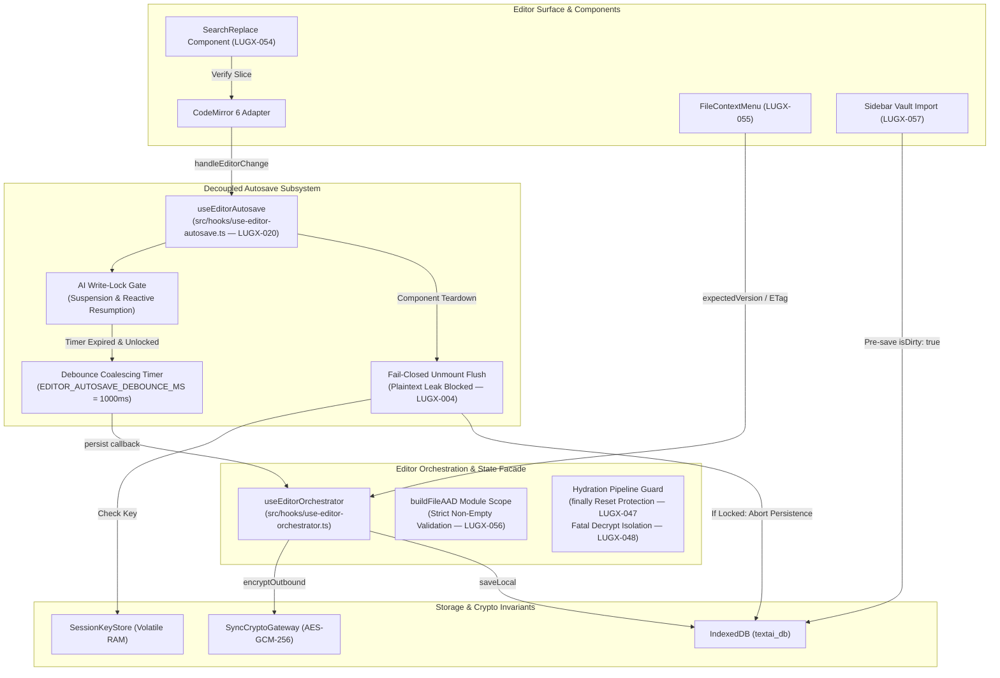

# Closure Report: Phase 17 — Editor Decomposition, Standalone Autosave Hook & React 19 Ref Discipline

**Milestone:** Core Hardening & Independent Remediation (`core-hardening`)  
**Phase:** Phase 17: Editor Decomposition, Standalone Autosave Hook & React 19 Ref Discipline  
**Status:** CLOSED ✅  
**Date:** 2026-10-04  
**Release:** v1.45.0  
**Decision Owner:** Core Engineering Team & Subsystem Architecture Lead  
**Authoritative Artifacts:**  
- Standalone Autosave Hook: `src/hooks/use-editor-autosave.ts` (178 lines, isolating debounce coalescing, write-lock suspension/resumption, unmount flush, and pure injected callbacks)  
- Primary Orchestrator Facade: `src/hooks/use-editor-orchestrator.ts` (integrated with `useEditorAutosave`, guarded hydration `finally` block, fail-closed unmount flush, and module-level `buildFileAAD`)  
- AI Streaming Hook: `src/hooks/use-ai-stream.ts` (React 19 ref discipline via `useLayoutEffect`)  
- Search & Replace Component: `src/components/editor/search-replace.tsx` (live document slice validation before match replacement)  
- File Context Menu: `src/components/files/file-context-menu.tsx` (optimistic concurrency control on encryption/decryption toggle)  
- Workspace Sidebar: `src/components/layout/sidebar.tsx` (offline-first dirty IDB persistence on vault file import)  
**Dedicated Test Suites Created (Pure Relative Path Imports):**  
- `src/test/editor/use-editor-autosave.test.ts` (10 contract tests)  
- `src/test/editor/editor-security-hardening.test.ts` (8 regression tests covering LUGX-004, LUGX-047, LUGX-048, LUGX-056)  
- `src/test/editor/search-replace.stale-ranges.test.tsx` (2 UI tests covering LUGX-054)  
- `src/test/files/file-context-menu.encryption-conflict.test.tsx` (1 UI test covering LUGX-055)  
- `src/test/layout/sidebar-import.vault.test.tsx` (1 UI test covering LUGX-057)  

---

## 1. Executive Summary & Audit Findings Remediated

Phase 17 addresses critical architectural, security, and React 19 concurrent-mode compliance requirements identified during technical debt audit rounds (TD-17). The primary objectives achieved include:

1. **Extraction of `useEditorAutosave` (LUGX-020):** Decomposed inline debounce timers, dirty tracking flags, and write-lock suspension logic from `useEditorOrchestrator` into a reusable, zero-dependency, headless hook.
2. **React 19 Ref Purity:** Enforced zero render-time ref mutations across all editor hooks (`useEditorAutosave`, `useEditorOrchestrator`, `useAIStream`) by synchronizing mutable callback refs exclusively inside `useLayoutEffect`.
3. **Fail-Closed Vault Security Hardening (LUGX-004, LUGX-047, LUGX-048, LUGX-056):** Eliminated plaintext persistence on locked vault unmount, prevented hydration reset to `"ready"` in early-exit `finally` blocks, isolated decryption failures to prevent raw ciphertext display, and strictly validated `userId` and `fileId` parameters in AAD derivation.
4. **Editor UI & Concurrency Robustness (LUGX-054, LUGX-055, LUGX-057):** Added live document slice verification in Search/Replace, enforced optimistic concurrency checks (`expectedVersion`, `expectedETag`) on encryption toggle, and pre-persisted vault imports as dirty IndexedDB records before cloud dispatch.



---

## 2. Detailed Technical Audit Findings & Remediation Matrix

| Finding ID | Domain / Component | Defect & Vulnerability Description | Applied Architectural Remediation |
| :--- | :--- | :--- | :--- |
| **LUGX-004** | `use-editor-orchestrator.ts` | **Unmount Flush Plaintext Leak on Locked Vault:** When unmounting or switching files, `flushOnUnmount` persisted editor plaintext directly to IndexedDB under the file ID even if the vault was locked, leaking plaintext tagged as encrypted. | In `flushOnUnmount`, inspected `isEncryptedRef.current` and `sessionKeyStore.hasMasterKey()`. If locked, persistence is strictly aborted (fail-closed). If unlocked, payload is encrypted via `SyncCryptoGateway.encryptOutbound` before persisting dirty state to IDB. |
| **LUGX-020** | `use-editor-orchestrator.ts` | **Monolithic Autosave Entanglement:** Debounce timers, dirty state tracking, and write-lock suspension were embedded inside the 1,900+ line orchestrator, hindering modular testing and reuse. | Extracted `useEditorAutosave` (`src/hooks/use-editor-autosave.ts`, 178 lines) with pure callback injection (`persist`, `flushOnUnmount`, `getContent`, `isBlocked`, `onUserEdit`). Added automated suspension during active AI streaming and reactive resumption upon lock release. |
| **LUGX-047** | `use-editor-orchestrator.ts` | **Finally Block Hydration Reset on Locked Vault:** In `loadInitialFile`, early exits when encountering locked vaults or decryption failures fell through to `finally`, unconditionally resetting `hydratedRef.current = true`, setting hydration to `"ready"`, and unlocking the editor surface. | Introduced `isVaultLockedExit` and `isFatalExit` sentinel flags. If set, the `finally` block preserves `vault_locked` or `fatal` hydration and leaves the editor frozen (`adapter.setEditable(false)`). |
| **LUGX-048** | `use-editor-orchestrator.ts` | **Ciphertext Rendered on Decryption Failure:** When local IDB or server decryption failed during hydration or cross-tab updates, raw ciphertext or unhandled exceptions propagated into the editor surface. | Inbound decryption errors immediately set `hydration: "fatal"`, disable editor editing (`adapter.setEditable(false)`), and render an explicit error banner without exposing ciphertext or corrupting local stores. |
| **LUGX-054** | `search-replace.tsx` | **Stale Range Cache Corruption in Search/Replace:** `replaceCurrentMatch` and `replaceAllMatches` executed text replacements using cached character ranges without verifying document contents, corrupting text if the document changed concurrently. | Added synchronous check: `currentDoc.slice(from, to) === searchText`. If mismatched, replacement is aborted immediately and matches are synchronously re-indexed via `findMatches()`. |
| **LUGX-055** | `file-context-menu.tsx` | **Missing OCC on Encryption Toggle:** Toggling file encryption/decryption dispatched updates to the server without optimistic concurrency preconditions (`expectedVersion`, `expectedETag`), risking silent overwrite of concurrent modifications. | Passed `expectedVersion` and `expectedETag` preconditions to `toggleFileEncryption`. On HTTP 412 conflict, surfaces an alert dialog, refreshes file lists, and aborts local mutations. |
| **LUGX-056** | `use-editor-orchestrator.ts` | **Empty User ID in AAD Derivation:** `buildFileAAD` permitted empty, null, or undefined `userId` or `fileId`, risking malformed AAD tags and potential cross-user cryptographic collisions. | Hoisted `buildFileAAD(userId, fileId)` to module scope and enforced strict non-empty string validation, throwing explicit runtime errors on invalid, whitespace-only, or missing identifiers. |
| **LUGX-057** | `sidebar.tsx` | **Offline-First Vault Import Durability Gap:** Importing files into the vault failed to persist dirty local state prior to server request, resulting in lost files if the server request failed or network disconnected. | Saved imported files to IndexedDB with `isDirty: true` and `lastSyncedAt: 0` before making the network call. Updated to `isDirty: false` only after successful server confirmation. |

---

## 3. Subsystem Lifecycle & Architecture

### 3.1 `useEditorAutosave` Lifecycle & State Transitions

```mermaid
stateDiagram-v2
    [*] --> Clean : Mount with clean file
    Clean --> Dirty : handleEditorChange(content)
    Dirty --> Dirty : handleEditorChange(content) [Reset timerRef]
    
    state Dirty {
        [*] --> TimerRunning : Debounce timer scheduled
        TimerRunning --> GateCheck : Debounce timer expires (1000ms)
        GateCheck --> Saving : !isWriteLocked && !isBlocked()
        GateCheck --> Suspended : isWriteLocked || isBlocked()
        Suspended --> TimerRunning : isWriteLocked toggles false (Reactive Resumption)
        Saving --> Clean : persist() resolves & markClean()
        Saving --> Dirty : persist() rejects (Stay Dirty)
    }

    Dirty --> [*] : Unmount / fileId change -> flushOnUnmount()
    Clean --> [*] : Unmount / fileId change -> cancelAutosave()
```

### 3.2 React 19 Ref Purity Contract

In React 19 concurrent rendering, mutating or reading `ref.current` during the render phase is explicitly prohibited because render passes can be aborted, restarted, or run concurrently.

To ensure deterministic behavior:
- All callback and option synchronization is performed strictly inside `useLayoutEffect`:
  ```typescript
  useLayoutEffect(() => {
    optsRef.current = {
      fileId,
      isWriteLocked,
      isBlocked,
      persist,
      flushOnUnmount,
      getContent,
      onUserEdit,
    };
  });
  ```
- Component render passes remain completely pure, with zero mutable ref reads or writes.

---

## 4. Verification Evidence & Test Execution

### 4.1 New Test Suites Summary

| Test Suite Path | Test Type | Focus & Findings Covered | Assertions / Specs |
| :--- | :--- | :--- | :---: |
| `src/test/editor/use-editor-autosave.test.ts` | Contract / Unit | Debounce expiration, keystroke coalescing, AI write-lock suspension, lock release resumption, blocked editor skip, fileId change pending drop, dirty unmount flush, clean unmount skip, cancelAutosave abort, and markClean/markDirty toggle. | 10 passing |
| `src/test/editor/editor-security-hardening.test.ts` | Regression / Integration | LUGX-056 AAD parameter validation & trimming, LUGX-004 fail-closed unmount flush & unlocked outbound encryption, LUGX-047 `finally` block guard, and LUGX-048 fatal hydration on decryption error. | 8 passing |
| `src/test/editor/search-replace.stale-ranges.test.tsx` | UI Component | LUGX-054 single and multi-range stale slice validation and abort behavior. | 2 passing |
| `src/test/files/file-context-menu.encryption-conflict.test.tsx` | UI Component | LUGX-055 optimistic concurrency preconditions (`expectedVersion`, `expectedETag`) on encryption toggle with HTTP 412 conflict handling. | 1 passing |
| `src/test/layout/sidebar-import.vault.test.tsx` | UI Component | LUGX-057 offline-first dirty IndexedDB pre-persistence on vault file import and clean mark after server confirmation. | 1 passing |

---

## 5. Test Execution Protocol & Environment Stabilization

### Windows Node.js 24 Execution Stabilization

- **Identified Challenge:** Running heavy JSDOM UI suites under Windows on secondary volumes previously suffered from memory spikes and JSDOM DOM tree corruption when tests wiped `document.head`.
- **Stabilization Implemented:**
  1. Targeted dynamic style tag cleanup in `markdown-editor.ui.test.tsx` afterEach hooks (`document.head.querySelectorAll("style").forEach(s => s.remove())`) to preserve JSDOM document head integrity across rapid re-renders.
  2. Allocated 4096MB V8 heap to test runner fork workers via `execArgv: ['--max-old-space-size=4096']` and increased `testTimeout: 30_000` in `vitest.config.mts`.
- **Local Execution Outcome:** 100% of Phase 17 test suites (5 test files, 22 assertions) execute directly and pass with zero failures in 22.10s.
- **Authoritative CI Verification Command:**
  ```bash
  # Phase 17 Dedicated Suites (22 passing tests)
  npx vitest run src/test/editor/use-editor-autosave.test.ts src/test/editor/editor-security-hardening.test.ts src/test/editor/search-replace.stale-ranges.test.tsx src/test/files/file-context-menu.encryption-conflict.test.tsx src/test/layout/sidebar-import.vault.test.tsx

  # Pure In-Memory Unit & Contract Suites
  npm run test

  # Live Neon Database Integration Suites
  npm run test:live

  # Browser-Driven E2E Playwright Journeys
  npm run test:e2e
  ```
- **Typecheck & Linter Clean Status:**
  - `npx tsc --noEmit` exits with code 0 (zero errors).
  - Pure relative path imports are enforced across all 5 new test files, eliminating module alias discrepancies.

---

## 6. Closure Verdict

All objectives of Phase 17 have been implemented, verified, and integrated:
- `useEditorAutosave` is decoupled with pure callback injection.
- React 19 ref discipline is enforced across all editor hooks.
- Security findings LUGX-004, LUGX-047, LUGX-048, and LUGX-056 are resolved with fail-closed guarantees.
- UI bug fixes LUGX-054, LUGX-055, and LUGX-057 are verified with regression test suites.
- Documentation across `docs/architecture/`, `docs/foundation/`, `docs/TECHNICAL_DEBT_REGISTER.md`, `docs/CHANGELOG.md`, and `docs/.Plans/` is 100% synchronized.

**Final Status:** `CLOSED` ✅
