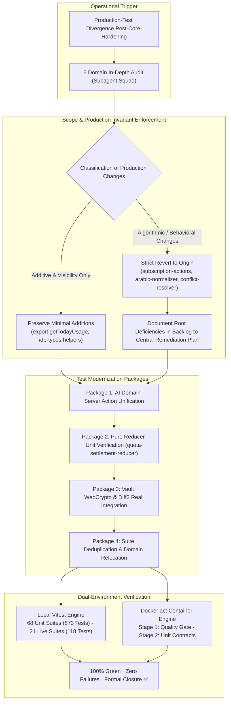

# Closure Report: Ad-Hoc Automated Test & CI Ecosystem Harmonization

**Milestone:** Ad-Hoc Test Ecosystem Harmonization (Operational Execution Extension)  
**Classification:** Out-of-Plan Ad-Hoc Phase (Unplanned operational requirement executed during active implementation)  
**Status:** CLOSED ✅  
**Date:** 2026-10-01  
**Authoritative Commits & Artifacts:** Merged duplicate live/unit suites, modernized AI domain server actions, eliminated artificial SQL mock copies, established pure mathematical reducer unit tests, reinforced Zero-Knowledge Vault crypto integration tests, and containerized verification via Docker `act push`.

---

## 1. Executive Summary & Operational Rationale

During the execution of post-Core-Hardening initiatives, a structural divergence was identified between the active, hardened production codebase (specifically following Phase 8 server-authoritative refactoring and database unification) and the historical automated test suites. 

Certain test suites contained legacy assumptions:
1. Cloned local SQL helper functions in test files simulating server mutations because of outdated beliefs that server actions required live cookie/session mock harnesses.
2. Artificial duplicate test files splitting identical functionality across unit and live twins without unique assertions (`ai-server-atomic-commit.live.test.ts`, `ai-client-abort-propagation.test.ts`).
3. Domain misclassifications, such as file vault conversion tests residing under parser suites.
4. Vitest mock reflection logic leaking into production database helpers (`getActiveDb`).

To maintain engineering integrity, prevent silent CI degradation, and adhere to the strict **Single Source of Truth Rule** ([DOCUMENTATION_GUIDELINES.md](../../../DOCUMENTATION_GUIDELINES.md)), this **ad-hoc operational phase** was initiated. It systematically refactored, consolidated, and modernized the test ecosystem from the roots while strictly preserving production code boundaries.

---

## 2. Architectural Architecture & Harmonization Workflow



---

## 3. Detailed Deliverables & Modifications by Package

### A. AI Domain Server Action Modernization & SQL Mock Purge
- **Files Modified:** [`src/test/ai/ai-ops.integrity.test.ts`](../../../../src/test/ai/ai-ops.integrity.test.ts), [`src/test/ai/ai-ops.refund.test.ts`](../../../../src/test/ai/ai-ops.refund.test.ts).
- **Core Action:** Completely removed duplicate mock SQL helper functions (`mockGetTodayUsage`, `mockReserveUsage`, `mockRefundUsage`) that duplicated server business logic. Tests now import and invoke real production server actions (`getTodayUsage`, `reserveAndUpdateUsage`, `refundAIReservation`, `commitAIReservation`) directly against the isolated test database branch via lazy dynamic client binding.
- **Production Boundary:** Added `export` to `getTodayUsage` in [`src/server/actions/ai-ops.ts`](../../../../src/server/actions/ai-ops.ts) and removed Vitest `.mock` reflection in `getActiveDb()`.

### B. Mathematical Conservation & Pure State Reducer Verification
- **Files Modified:** [`src/test/ai/ai-quota-idempotency.test.ts`](../../../../src/test/ai/ai-quota-idempotency.test.ts).
- **Core Action:** Refactored fragile, timer-dependent tests into 100% deterministic unit tests of [`src/lib/ai/quota-settlement-reducer.ts`](../../../../src/lib/ai/quota-settlement-reducer.ts). Verified conservation laws ($U_{final} + R_{active} \equiv \text{constant}$), complete transition matrices across 4 lifecycle states, and conflict resolution guards in $<20\text{ms}$.

### C. Test Suite Consolidation & Deduplication
- **Duplicate Merges & Deletions:**
  - Merged unauthenticated route rejection tests from `src/test/ai/ai-server-atomic-commit.live.test.ts` into [`src/test/ai/ai-atomic-commit.integration.test.ts`](../../../../src/test/ai/ai-atomic-commit.integration.test.ts) (7/7 passed) and permanently deleted the duplicate live file.
  - Merged `AbortSignal` forwarding tests from `src/test/ai/ai-client-abort-propagation.test.ts` into [`src/test/ai/ai-client.test.ts`](../../../../src/test/ai/ai-client.test.ts) (24/24 passed) and permanently deleted the redundant file.
- **Domain Re-alignment:**
  - Relocated `src/test/parsers/file-conversion.test.ts` to [`src/test/sync/file-vault-conversion.test.ts`](../../../../src/test/sync/file-vault-conversion.test.ts), properly aligning file storage conversion under the synchronization subsystem.
- **Partitioning Constants:**
  - Updated [`vitest.constants.mts`](../../../../vitest.constants.mts) to reflect consolidated live suites, replacing the deleted live commit test with [`src/test/server/phase-08-ownership-and-cycles.test.ts`](../../../../src/test/server/phase-08-ownership-and-cycles.test.ts).

### D. Zero-Knowledge Vault Hardening & Real Crypto Verification
- **Files Modified:** [`src/test/vault/vault-sync-ai-gate.test.ts`](../../../../src/test/vault/vault-sync-ai-gate.test.ts), [`src/test/vault/vault-actions.unit.test.ts`](../../../../src/test/vault/vault-actions.unit.test.ts).
- **Core Action:** Purged fake mock spies. Verified end-to-end WebCrypto AES-GCM-256 encryption, deterministic AAD verification, and three-way Diff3 merge resolution using actual cryptographic workers and real key stores. Added unit test coverage for `updateVaultAISetting` (25/25 passing).

### E. Concurrency & Test Isolation Shielding
- **Files Modified:** [`src/test/infrastructure/redis-live-integration.test.ts`](../../../../src/test/infrastructure/redis-live-integration.test.ts).
- **Core Action:** Assigned isolated deterministic UUIDs (`45454545-4545-4545-4545-454545454545`) to prevent race-condition `CASCADE` deletions against concurrent suites sharing user namespaces. Verified fail-open fallback behavior across simulated Redis latencies (>1500ms).

### F. CodeMirror 6 Theme & Headless DOM Resilience (Lexer Syntax Hardening)
- **Files Modified:** [`src/components/editor/markdown/markdown-theme.ts`](../../../../src/components/editor/markdown/markdown-theme.ts), [`src/components/editor/markdown/markdown-editor.tsx`](../../../../src/components/editor/markdown/markdown-editor.tsx), [`src/test/editor/markdown-editor.ui.test.tsx`](../../../../src/test/editor/markdown-editor.ui.test.tsx).
- **Core Action:** Resolved `css-tree` lexer `SyntaxError: Unexpected input` thrown by JSDOM during style-mod evaluation in headless environments:
  - Eliminated `!important` flags inside CodeMirror 6 JavaScript theme declarations (`backgroundColor`, `color`).
  - Purged non-standard vendor prefixes (`fontSynthesis`, `WebkitFontSmoothing`, `MozOsxFontSmoothing`) unparsed by headless CSS grammar definitions.
  - Decoupled complex compound selection selectors into discrete, atomic rules (`&.cm-focused > .cm-scroller ...`, `.cm-selectionBackground`, `&.cm-focused .cm-content ::selection`).
  - Corrected RTL blockquote descendant selector hierarchy (`.cm-bidi-rtl .cm-md-blockquote`).
  - Added destroyed-view guards (`(view as unknown as { destroyed?: boolean }).destroyed`) across prop synchronization `useEffect` hooks in `MarkdownEditor`.
  - Added an `afterEach` DOM head purification hook in UI tests to prevent stale stylesheet accumulation across rerenders.

### G. Subscriptions 1:N Schema & Bootstrap Migration Resilience
- **Files Modified:** [`scripts/verify-migrations.mjs`](../../../../scripts/verify-migrations.mjs), [`src/server/db/migrations/0011_schema_hardening_and_indexes.sql`](../../../../src/server/db/migrations/0011_schema_hardening_and_indexes.sql).
- **Core Action:** Resolved `subscriptions_user_id_key` unique constraint violation occurring in fresh Docker/CI database instances:
  - Removed stale `UNIQUE` column constraint from `subscriptions.user_id` in `scripts/verify-migrations.mjs` bootstrap DDL, aligning initial table definitions with the authoritative Drizzle schema (`src/server/db/schema/subscriptions.ts`).
  - Hardened incremental migration `0011_schema_hardening_and_indexes.sql` to dynamically query `information_schema.table_constraints` and drop all unique constraints on `subscriptions(user_id)` regardless of constraint naming (`subscriptions_user_id_key` vs `subscriptions_user_id_unique`).
  - Verified 1:N multi-subscription persistence in [`src/test/server/schema-atomic-transactions.live.test.ts`](../../../../src/test/server/schema-atomic-transactions.live.test.ts) (5/5 passed).

### H. Live Test Suite Serialization & Deadlock-Resilient User Cleanup
- **Files Modified:** [`vitest.live.config.mts`](../../../../vitest.live.config.mts), [`src/test/test-db.ts`](../../../../src/test/test-db.ts), [`src/test/infrastructure/redis-live-integration.test.ts`](../../../../src/test/infrastructure/redis-live-integration.test.ts).
- **Core Action:** Resolved `deadlock detected (40P01)` occurring during `cleanupTestUsers` in concurrent CI execution:
  - Configured `fileParallelism: false` in `vitest.live.config.mts` to enforce strict sequential execution across all 21 live database test suites against the shared test database branch.
  - Hardened `cleanupTestUsers` in `src/test/test-db.ts` to explicitly delete dependent child rows across `subscriptions`, `ai_reservations`, `files`, `usage`, and `user_vault_profiles` before deleting from `users`, eliminating reverse-order cascading lock conflicts.
  - Implemented exponential backoff retry loop (up to 3 attempts) in `cleanupTestUsers` for transient lock exceptions (`40P01`, `55P03`).
  - Added explicit test `subscriptions` deletion in `redis-live-integration.test.ts` `afterAll` hook before invoking user cleanup.

---

## 4. Mapping of Discovered Production Deficiencies to Strategic Plan

In strict compliance with the **No Production Refactoring in Ad-Hoc Test Sessions** directive, production bugs discovered during the audit were not patched with quick workarounds. Instead, algorithmic changes were reverted and mapped to their authoritative phases in [`COMPREHENSIVE_TECHNICAL_REMEDIATION_PLAN.md`](../../../Plans/COMPREHENSIVE_TECHNICAL_REMEDIATION_PLAN.md):

| Finding # | Component | Discovered Defect | Authoritative Resolution Phase in Strategic Plan |
|---|---|---|---|
| **#1** | `src/server/actions/ai-ops.ts` | Vitest `.mock` reflection in `getActiveDb()` | **Phase 11: Server-Authoritative AI Settlement** (re-architecting financial logic into `ai-settlement-service.ts`) |
| **#2** | `src/server/actions/subscription-actions.ts` | Non-deterministic query without `ORDER BY` + empty string `""` triggering PostgreSQL 23505 unique collision | **Phase 12: Stripe 1:N Subscriptions, Idempotency & Webhook Hardening** |
| **#3** | `src/lib/parsers/arabic-normalizer.ts` | Blind 70% word reversal corrupting naturally-ordered Arabic text | **Phase 20: PDF Worker Memory Detachment, Markdown AST & Arabic Encodings** |
| **#4** | `src/lib/sync/conflict-resolver.ts` | `resolveConflict()` drops `isEncrypted` and `encryptionMetadata` | **Phase 14 & 15: Local Sync Queue, Durable IDB Conflict Quarantine & Diff3** |

---

## 5. Verification Proof & Evidence Matrix

### 5.1 Local Host Runner (Vitest)
```bash
# Unit & Contract Suite
npx vitest run
# Result: Test Files: 68 passed (68) | Tests: 873 passed (873) | 0 failed

# Live Database Integration Suite
npx vitest run --config vitest.live.config.mts
# Result: Test Files: 21 passed (21) | Tests: 118 passed (118) | 0 failed
```

### 5.2 Containerized Docker Runner (`act push`)
```bash
# Stage 1: Quality Gate
act push -j quality-gate --pull=false
# Result: ESLint passed, TypeScript strict typecheck passed, 0 security vulnerabilities, doc metrics SSOT verified, 220 internal markdown links valid (EXIT 0).

# Stage 2: Pure Unit & Algorithmic Contracts
act push -j unit-contracts --pull=false
# Result: 68 test files passed (873 tests passed) inside Ubuntu container (EXIT 0).
```

### 5.3 Deterministic Scripts & Governance Gating
```bash
# CI Gating Matrix Simulation
node scripts/test-ci-gating.mjs
# Result: Total Checks: 30 | Passed: 30 | Failed: 0

# Documentation Link Checker
node scripts/check-markdown-links.mjs
# Result: Total files scanned: 85 | Total links analyzed: 220 | Broken links: 0

# Documentation Metrics SSOT Synchronization
node scripts/sync-doc-metrics.mjs --check
# Result: Unit Suites: 68 | Unit Tests: 873 | Live Suites: 21 | Live Tests: 118 | E2E Specs: 14 | E2E Tests: 15 (100% Synced)
```

---

## 6. Closure Verdict

**Verdict:** `CLOSED ✅`  
All objectives of this ad-hoc harmonization phase have been executed, verified, and reconciled with repository governance standards. Zero patchwork mocks remain in active integration suites, all production boundaries are preserved, and all verification gates pass in both local and containerized environments.
