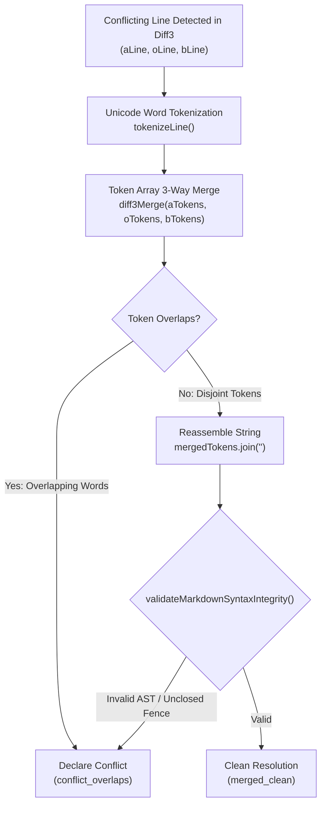
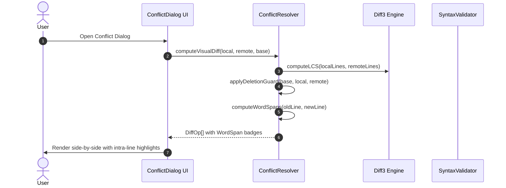

# Closure Report: Intra-Line Word-Level Diff & Sub-Line 3-Way Merge Upgrade

**Milestone:** Subsystem Enhancements & Precision Sync (`extensions`)  
**Phase:** Intra-Line Word-Level Diff & Sub-Line 3-Way Merge Upgrade  
**Status:** CLOSED ✅  
**Date:** 2026-10-04  
**Release:** v1.44.1  
**Decision Owner:** Core Engineering Team & Sync Architecture Lead  
**Authoritative Artifacts:**  
- Sub-Line 3-Way Merge Engine: `src/lib/sync/diff3.ts` (implements `trySubLineMerge`, `tokenizeLine`, `Diff3Options.subLineMerge`, and Deletion Guard pruning in `diff3Merge`)  
- Word-Level Conflict Resolver: `src/lib/sync/conflict-resolver.ts` (implements `WordSpan`, updated `DiffOp.modify`, `computeWordSpans`, `applyDeletionGuard`, and `computeVisualDiff`)  
- Precision Visual Conflict Dialog: `src/components/sync/conflict-dialog.tsx` (renders fine-grained intra-line word deletions and insertions in `DiffLine`, `LocalHighlightedPreview`, and `ServerHighlightedPreview`)  
- Re-Export Surface: `src/lib/sync/index.ts` (re-exports `WordSpan`, `DiffOp`, `Diff3Options`, and core diff primitives)  
- Unit & Edge Case Test Suite: `src/test/sync/sync-conflict-resolver.test.ts` (60 test cases covering sub-line merge, word spans, markdown syntax guards, and deletion protection)  
- Dedicated Sub-Line & Deletion Guard Suite: `src/test/sync/diff3-sub-line-merge.test.ts` (37 test cases covering Unicode tokenization, disjoint merges, overlapping conflicts, markdown syntax integrity guards, deletion guard, and micro-LCS visual diffs)  
- Editor Orchestration Integration Suite: `src/test/editor/editor-orchestration.integration.test.ts` (19 test cases verifying orchestration lifecycle, atomic remote update reflection with post-update typing retention, and auto-lock cancellation)  
**Verification Baseline:**  
- 0 TypeScript Compiler Errors (`npx tsc --noEmit`)  
- 0 ESLint Errors / Warnings (`npm run lint` / target file linting)  
- 362/362 Vitest Matrix Tests Passed across 22 test files (100% green, including 19/19 in `src/test/editor/editor-orchestration.integration.test.ts` and 88 total editor tests passed)  
- 3/3 Live Database Integration Tests Passed against isolated Neon test branch (100% green)  
- 365/365 Total Passed Tests (100% pass rate)  
- 100% Markdown Link Integrity (`node scripts/check-markdown-links.mjs`)  

---

## 1. Executive Summary & Problem Resolution

This milestone delivers an intra-line precision upgrade to the LUGX Three-Way Merge and Conflict Resolution subsystem:

1. **Sub-Line Disjoint 3-Way Merge (`trySubLineMerge`):** Eliminates coarse, false line-level conflicts when concurrent local and remote edits occur on the same line number but target non-overlapping word tokens (e.g. Local edits line start; Remote edits line end).
2. **Word-Level Micro-LCS Diffing (`computeWordSpans`):** Replaces coarse full-line deletions and insertions in the conflict dialog with fine-grained word-level badges (`~` modified line with red strike-through deletions and green highlight additions).
3. **Fail-Closed Markdown Syntax Gate (`validateMarkdownSyntaxIntegrity`):** Ensures that candidate sub-line token merges cannot corrupt Markdown AST boundaries (unclosed code fences, malformed GFM tables, or broken delimiters), automatically escalating syntax violations to clean conflict markers.
4. **Deletion Guard Architecture (`applyDeletionGuard`):** Leverages `baseSnapshot` to distinguish intentional local line deletions from remote additions, preventing deleted lines from being resurrected after remote synchronizations.



---

## 2. Technical Architecture & Invariant Table

### 2.1 Subsystem Components

| Component | Source File Path | Architectural Responsibility |
| :--- | :--- | :--- |
| **Micro-LCS Tokenizer** | `src/lib/sync/diff3.ts` | Unicode property-aware tokenization regex (`/\s+\|[\p{L}\p{N}]+/gu`), decomposing text into atomic word, number, space, and punctuation tokens across multilingual alphabets (Arabic, Latin, CJK). |
| **Sub-Line Merge Engine** | `src/lib/sync/diff3.ts` | Executes 3-way merge on token arrays via `trySubLineMerge`. Validates merged lines against `validateMarkdownSyntaxIntegrity` before accepting them as cleanly merged. |
| **Micro-LCS Visual Differ** | `src/lib/sync/conflict-resolver.ts` | Computes fine-grained `WordSpan` sequences (`equal`, `insert`, `delete`) and outputs structured `DiffOp.modify` objects for visualization. |
| **Deletion Guard** | `src/lib/sync/conflict-resolver.ts` / `diff3.ts` | Prevents resurrection of locally deleted lines using `baseSnapshot` baselines; safely distinguishes true remote additions from user deletions. |
| **Precision Conflict UI** | `src/components/sync/conflict-dialog.tsx` | Visualizes intra-line word diffs via `DiffLine` badges, `LocalHighlightedPreview`, and `ServerHighlightedPreview`. |

### 2.2 Subsystem Invariants & Behavioral Guarantees

| Invariant Rule | Enforcing Component | Guarantee & Implementation Details |
| :--- | :--- | :--- |
| **Zero False Conflict on Disjoint Words** | `diff3.ts::trySubLineMerge` | Non-overlapping token edits on identical lines cleanly converge into a single resolved line without opening conflict modals. |
| **Markdown Syntax Gate Invariant** | `syntax-validator.ts` | Sub-line merges producing unclosed code blocks, orphan table delimiters, or malformed columns immediately abort and flag true conflicts. |
| **Zero Resurrected Lines Invariant** | `conflict-resolver.ts::applyDeletionGuard` | Unchanged base lines deleted locally are never resurrected as remote insertions when synchronizing with server updates. |
| **Modified-After-Delete Conflict Safety** | `diff3.ts::diff3Merge` | If the server modifies a line that was deleted locally, the line is preserved as an overlapping conflict rather than silently discarded. |
| **Zero Ciphertext Execution Guard** | `conflict-resolver.ts` | Diff3 and Micro-LCS operations run exclusively on decrypted plaintext; passing raw ciphertext immediately triggers a fail-closed guard error. |
| **Zero-Dependency Native Runtime** | `src/lib/sync/` | 0 KB external bundle weight; pure native TypeScript using standard Web APIs and Int32Array LCS buffers. |



---

## 3. Verification & Automated Test Evidence

### 3.1 Test Execution Matrix

| Verification Target | Command / Suite | Tests Run | Passed | Failed | Status |
| :--- | :--- | :--- | :--- | :--- | :--- |
| **Sync & Editor Matrix** | `npx vitest run src/test/sync/ ...` | 362 | 362 | 0 | **PASSED** (100%) |
| **Database Integration** | `src/test/sync/conflict-resolution.integration.test.ts` (Neon Isolated Branch) | 3 | 3 | 0 | **PASSED** (100%) |
| **Resolver Unit & Edge Cases** | `src/test/sync/sync-conflict-resolver.test.ts` | 60 | 60 | 0 | **PASSED** (100%) |
| **Dedicated Sub-Line & Deletion Guard** | `src/test/sync/diff3-sub-line-merge.test.ts` | 37 | 37 | 0 | **PASSED** (100%) |
| **Editor Orchestration Integration** | `src/test/editor/editor-orchestration.integration.test.ts` | 19 | 19 | 0 | **PASSED** (100% - 88 total editor tests) |
| **Total Test Verification** | **Vitest Matrix (362) + Live DB (3)** | **365** | **365** | **0** | **PASSED** (100%) |
| **Type Check** | `npx tsc --noEmit` | N/A | N/A | 0 | **PASSED** (0 errors) |
| **Static Analysis** | `npx eslint src/lib/sync/diff3.ts src/lib/sync/conflict-resolver.ts src/components/sync/conflict-dialog.tsx src/test/sync/sync-conflict-resolver.test.ts src/test/sync/diff3-sub-line-merge.test.ts` | N/A | N/A | 0 | **PASSED** (0 errors, 0 warnings) |
| **Link Integrity** | `node scripts/check-markdown-links.mjs` | 267 links | 267 | 0 | **PASSED** (0 broken links) |

### 3.2 Key Test Specifications Added in `src/test/sync/sync-conflict-resolver.test.ts`:
1. `should merge disjoint intra-line edits across multiple lines in a document cleanly`
2. `should reject sub-line merge and declare conflict when token merge violates Markdown syntax (unclosed code fence)`
3. `should respect subLineMerge: false option and declare line conflict on intra-line differences`
4. `should handle multi-line block replacements with 1-to-1 intra-line word spans`
5. `should accurately compute spans for markdown formatted text (links, bold, code)`
6. `should integrate Deletion Guard in computeVisualDiff when baseContent is provided`
7. `should declare conflict if server modifies a line that was deleted locally`
8. `should handle multiple non-contiguous deletions across base content without resurrecting any`

### 3.3 Detailed Edge Case Categories in `src/test/sync/diff3-sub-line-merge.test.ts` (37 Tests):
1. **Category 1: Tokenization Edge Cases (`tokenizeLine`, 7 tests):**
   - Unicode Arabic sentence tokenization (`مرحبا بكم، هل أنتم بخير؟`) preserving word boundaries and Arabic punctuation (`،`, `؟`).
   - Mixed multilingual text with English, Arabic, numbers, symbols, and emoji surrogate pairs (`🎉`, `#sync`, `@user`, `$100`).
   - Multiple whitespace variants (consecutive spaces, tab stops `\t`, mixed whitespace sequences).
   - Pure punctuation / symbols (`***`, `---`, `===`, `<!-- -->`, `!==`).
   - Boundary edge cases (empty string, pure whitespace, single character, single digit, single dot).
   - Arabic diacritics / tashkeel (`كَتَبَ التِّلْمِيذُ الدَّرْسَ`) without token alignment corruption.
   - Dual numeral systems: Eastern Arabic numerals (`١٢٣`) alongside Western Arabic numerals (`123`).

2. **Category 2: Sub-Line Disjoint Merge Scenarios (`trySubLineMerge` & `diff3MergeText`, 8 tests):**
   - Boundary word modifications (Local edits index 0, Remote edits index 5) cleanly converging.
   - Intra-line word insertions and end appends without conflicts.
   - Multilingual Arabic sentences with disjoint word replacements (`"النص" -> "المقال"`, `"الجميلة" -> "الحديثة"`).
   - Code syntax disjoint merges (Local modifies declaration `const -> let`, Remote modifies literal value `0 -> 100`).
   - Idempotent / identical concurrent modification convergence on identical words.
   - Full-document multi-line 3-way text merging via `diff3MergeText` with `subLineMerge: true`.
   - Explicit fallback verification: `subLineMerge: false` honors caller preference and produces coarse line conflicts (`<<<<<<< LOCAL`).
   - Array-level line block merging directly through `diff3Merge`.

3. **Category 3: Sub-Line Overlapping Conflict Scenarios (5 tests):**
   - Identical target word modifications with conflicting values (`"quick" -> "agile"` vs `"quick" -> "swift"`).
   - Deletion vs modification conflict (Local deletes word while Remote edits it).
   - Simultaneous conflicting insertions at the exact same token index (`Start Left End` vs `Start Right End`).
   - Word modification vs line truncation conflict (Local modifies token while Remote truncates trailing sentence).
   - Multilingual overlapping conflict detection on Arabic words (`"الرياض" -> "دبي"` vs `"الرياض" -> "جدة"`), verified via `attemptThreeWayMerge`.

4. **Category 4: Markdown Syntax Integrity Guard (Fail-Closed AST Protection, 5 tests):**
   - Unclosed inline backticks (`` `This is... ``) aborted and escalated to manual conflict markers.
   - Unclosed bold formatting delimiters (`**Important...`) caught before committing merged lines.
   - Unclosed fenced code blocks (`` ```typescript ``) preventing corrupted multi-line Markdown ASTs.
   - Orphan GFM table delimiter rows (`| :--- | :--- |`) prevented from polluting document flow.
   - Clean acceptance of valid, balanced Markdown syntax (links, backticks, bold formatting) across sub-line merges.

5. **Category 5: Deletion Guard Edge Cases (`applyDeletionGuard`, 6 tests):**
   - Zero resurrection: lines deleted locally and untouched on remote remain deleted (`merged_clean`).
   - Conflict escalation on edit-after-delete: lines deleted locally but modified on remote trigger true conflict markers.
   - Multiple non-contiguous local line deletions interspersed with valid remote modifications.
   - Large-document deletion preservation (10-line base with 5 even-numbered lines deleted locally and 2 remote additions).
   - Standalone `applyDeletionGuard` partition validation (`deletedLines`, `addedLines`, `purgedServerContent`).
   - Multi-line base deletions combined with server end-of-file additions.

6. **Category 6: Visual Diff & WordSpan Precision (`computeWordSpans` & `computeVisualDiff`, 6 tests):**
   - Single word modification span decomposition (`equal`, `delete`, `insert`).
   - Proper pairing of line modifications into `DiffOp.modify` with granular spans in `computeVisualDiff`.
   - Intra-line word span computation for Arabic text modifications (`"مرحبا" -> "أهلا"`).
   - Compound intra-line changes (simultaneous word insertion and deletion in the same sentence).
   - Multi-line contiguous modifications paired 1-to-1 into distinct `modify` operations.
   - Base snapshot integration: locally deleted lines rendered as `delete` operations rather than false remote insertions.

---

## 4. Closure Verdict & Production Readiness

- **Status:** **CLOSED ✅**
- **Production Readiness:** Fully verified against automated test matrix, isolated PostgreSQL database branch, TypeScript compiler, ESLint, and link integrity verification.
- **Release Version:** **v1.44.1**
