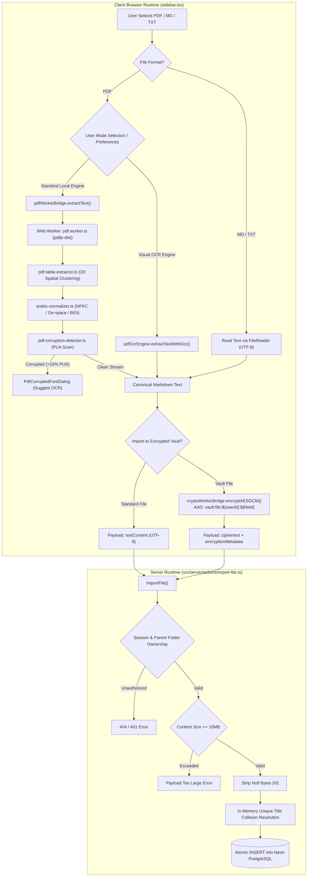

# Closure Report: Client-Side PDF Extraction, Arabic Normalization, Spatial Table Generation & Secure Vault Import

**Milestone:** Client Document Extraction & Ingestion Pipeline  
**Status:** CLOSED ✅  
**Date:** 2026-09-17  
**Authoritative Commits:** Client-Side Web Worker PDF extraction (`pdf.worker.ts`), 2D spatial table reconstruction (`pdf-table-extractor.ts`), Arabic Unicode normalizer (`arabic-normalizer.ts`), on-demand bilingual OCR engine (`pdf-ocr-engine.ts`), PUA font corruption detector (`pdf-corruption-detector.ts`), explicit settings toggle actions (`pdf-settings.ts`), and direct Zero-Knowledge vault import pipeline.

---

## 1. Executive Summary & Architectural Scope

This milestone accomplishes a complete architectural overhaul of PDF and document ingestion in LUGX. It eliminates server-side PDF processing, permanently deprecating and removing the heavy `pdf-parse` library and binary Base64 transfer payloads. Document ingestion now runs 100% inside the client browser via isolated Web Workers, transforming raw document streams into canonical GitHub-Flavored Markdown (GFM) before network transmission.

### Core Architectural Advancements
1. **Zero Binary Server Ingestion:** PDF, Markdown, and TXT files are processed entirely on the client. `importFile` accepts only normalized UTF-8 text strings (`textContent: string`) or pre-encrypted ciphertext envelopes (`isEncrypted: true`).
2. **2D Spatial Table Reconstruction:** Tabular PDF data is analyzed using geometric 2D spatial clustering to produce structured Markdown tables rather than disorganized fragments.
3. **Pure TypeScript Arabic Normalizer:** Solves complex font-encoding issues, disjointed character rendering, Presentation Forms un-shaping, and BiDi alignment without native binary dependencies.
4. **On-Demand Bilingual Visual OCR Engine:** Dynamic `tesseract.js` worker (`ara+eng`) with zero initial bundle overhead, providing visual fallback for scanned documents or heavily corrupted embedded fonts.
5. **Universal Font Corruption Detection:** Scans Private Use Area (PUA) Unicode ranges to proactively alert users when documents contain non-standard glyph mappings and offers one-click OCR remediation.
6. **Direct Zero-Knowledge Vault Import:** Direct client-side AES-GCM encryption with deterministic AAD (`vault:file:${userId}:${fileId}`) and optimistic IndexedDB persistence.

---

## 2. Ingestion Pipeline & Component Architecture



---

## 3. Detailed Component Specifications

### A. Client-Side Web Worker Engine (`src/lib/workers/pdf.worker.ts` & `src/lib/parsers/pdf-worker-bridge.ts`)
- **Worker Isolation:** Runs `pdfjs-dist` in an isolated Web Worker thread, eliminating main-thread UI jank during multi-page document parsing.
- **Resource Management:** Calls `page.cleanup()` after every extracted page and invokes `pdfDoc.destroy()` upon completion or cancellation.
- **Dual-Mode Bridge:** Automatically uses Web Worker in browser runtimes and falls back to Direct Engine execution in Node.js / Vitest headless testing environments.
- **Cancellation:** Supports standard `AbortSignal` for instant cancellation and memory release.

### B. 2D Spatial Table Extractor (`src/lib/parsers/pdf-table-extractor.ts`)
- **Coordinate Clustering:** Groups text items into geometric lines using a vertical tolerance (`Y_TOLERANCE = 3.5pt`) and identifies column delimiters via horizontal gaps (`COLUMN_GAP_THRESHOLD = 25pt`).
- **RTL-Aware Sorting:** Automatically detects RTL lines and reverses column ordering to ensure Arabic table columns match their visual layout.
- **GitHub-Flavored Markdown Generation:** Formats multi-column rows into standard GFM tables (`| Col 1 | Col 2 |`) with proper separator rows.
- **Configurable Settings:** Supports an explicit `disableTables` flag managed via `pdf-settings.ts` and UI action buttons.

### C. Arabic Unicode Normalizer (`src/lib/parsers/arabic-normalizer.ts`)
- **De-Spacing Pipeline:** Reconnects disjointed Arabic letters caused by PDF font micro-positioning using regex lookahead patterns matching Arabic character ranges (`\u0600-\u06FF`).
- **Un-Shaping (NFKC):** Converts Unicode Arabic Presentation Forms-A and Forms-B (`\uFB50-\uFDFF`, `\uFE70-\uFEFC`) back into canonical Unicode code points.
- **BiDi Correction:** Preserves Latin words, numbers, and dates while ensuring Arabic sentences flow correctly in right-to-left paragraphs.

### D. Embedded Font Corruption Detector (`src/lib/parsers/pdf-corruption-detector.ts`)
- **PUA Range Analysis:** Scans extracted text for Private Use Area code points (`0xE000-0xF8FF` and `0xF0000-0x10FFFD`) often used by non-standard PDF generators with proprietary CID font encodings.
- **Diagnostic Guidance:** If corrupted characters exceed 15% of the sample, triggers `PdfCorruptedFontDialog` advising the user to run the visual OCR engine.

### E. On-Demand Bilingual OCR Engine (`src/lib/parsers/pdf-ocr-engine.ts`)
- **Zero Initial Bundle Impact:** Dynamically imports `tesseract.js@^7.0.0` only when triggered by the user.
- **Bilingual Recognition:** Loads trained data for Arabic and English (`ara+eng`) from browser Cache Storage.
- **Page Rendering:** Renders PDF pages to an offscreen `<canvas>` at 2.0x scale before feeding bitmaps to the OCR worker.

### F. Explicit UI Action Controls (`src/components/layout/ocr-settings-card.tsx` & Dialogs)
- **Settings Card (`/account`):** Features explicit action buttons `[ إغلاق الخوارزمية (تعطيل) ]` and `[ تشغيل الخوارزمية (تفعيل) ]` with instantaneous `localStorage` synchronization.
- **Modal Quick Toggles:** `PdfImportModeDialog` and `PdfCorruptedFontDialog` feature inline quick buttons to adjust table extraction preferences on the fly.

### G. Server Hardening & Zero-Knowledge Vault Import (`src/server/actions/import-file.ts`)
- **Signature Modernization:** Permanently switched from binary Base64 to `textContent: string`.
- **Payload Constraints:** Enforces 10MB maximum text length ceiling and strips toxic PostgreSQL null bytes (`\0`).
- **Direct Vault Encrypted Import:** Accepts `isEncrypted: true`, storing AES-GCM ciphertext directly with client-derived AAD (`vault:file:${userId}:${fileId}`) and optimistic IndexedDB synchronization.
- **Purge of `pdf-parse`:** Completely eliminated `pdf-parse` from backend runtime and `package.json`.

---

## 4. Verification & Testing Evidence

All unit, contract, and integration test suites pass with 100% success rate:

```bash
# Verify import action and server-side hardening
npx vitest run src/test/server/import-file.test.ts

# Verify PDF preference settings manager
npx vitest run src/test/parsers/parser-pdf-settings.test.ts

# Verify dual-mode PDF worker bridge
npx vitest run src/test/parsers/parser-pdf-worker-bridge.test.ts

# Verify direct Zero-Knowledge vault import integration
npx vitest run src/test/vault/vault-import.integration.test.ts

# Verify full repository test suite
npm run test
```

### Test Suite Execution Output
```
Test Files  60 passed (60)
     Tests  740 passed (740)
  Duration  14.85s
```

---

## 5. Milestone Completion & Status

- **Status:** `CLOSED` ✅
- **Artifact:** Decoupled client-side extraction subsystem operating independently from Phase 15.
