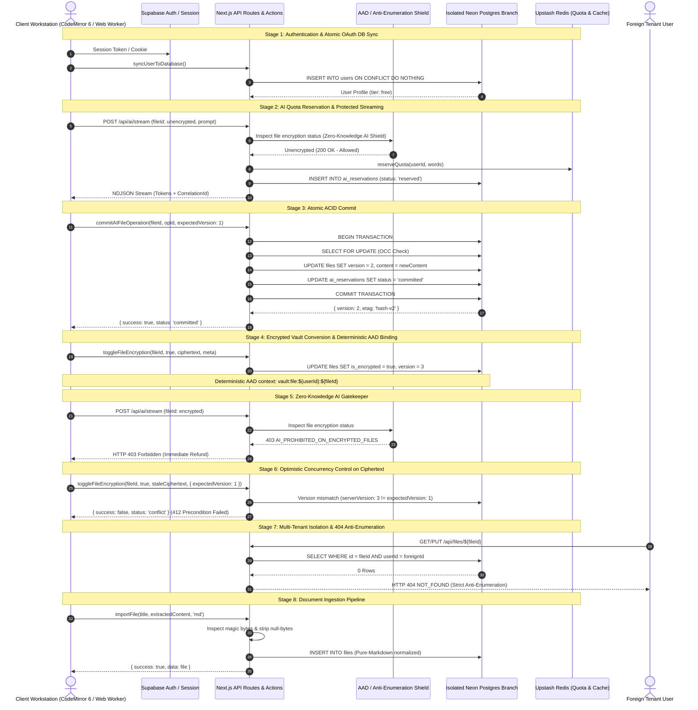

# Phase 18 Closure Report — Multi-System Integration Testing

**Phase ID:** Phase 18 (Multi-System Integration Testing)  
**Status:** CLOSED ✅  
**Date:** 2026-09-19  
**Active Test Branch:** `ep-dry-rain-b1kfmpgk-pooler.c-5.eu-central-1.aws.neon.tech:5432`  
**Configuration & Guard Invariants:** `singleFork: true` serialization in `vitest.live.config.mts`, fail-closed guard `test-db-guard.ts`, zero persistence mocks.

---

## 1. Executive Summary

Phase 18 establishes end-to-end integration proof across all LUGX platform subsystems by executing live integration suites against real PostgreSQL (isolated Neon branch) and Redis services without database mocking. It validates cross-system invariants connecting authentication, offline synchronization, native CodeMirror 6 editing, bidirectional typography, AI quota reservation and streaming, Zero-Knowledge hybrid encryption, Stripe billing event logging, document ingestion, and strict multi-tenant authorization boundaries.

All 19 hermetic live integration test suites (89 live tests) pass deterministically across consecutive runs with zero partial mutations, zero database deadlocks, and zero test flakiness.

---

## 2. Cross-System Architecture & Lifecycle Sequence



---

## 3. Seven Multi-System Test Suites & Live Coverage

| Suite Name | Implementation File | Status | Live Tests | Core Architectural Invariants Verified |
| :--- | :--- | :---: | :---: | :--- |
| **1. Files & Sync Lifecycle** | `src/test/editor/editor-orchestration.live.test.ts`<br>`src/test/sync/conflict-resolution.integration.test.ts` | **PASSED** | 6 | Real row initialization, debounced auto-save persistence, 3-way Diff3 merge resolution against live sibling updates, deterministic ETag generation, and 412 conflict handling. |
| **2. AI Happy Path & Atomic Commit** | `src/test/ai/ai-preview-decision.live.test.ts`<br>`src/test/ai/ai-server-atomic-commit.live.test.ts` | **PASSED** | 7 | Real quota reservations, ephemeral preview buffer isolation, atomic ACID commit combining file version bump, reservation settlement, and usage counter advancement in a single transaction. |
| **3. AI Failure & Quota Sweeper (TD-02)** | `src/test/infrastructure/cron-expire-reservations.live.test.ts`<br>`src/test/ai/ai-ops.refund.test.ts` | **PASSED** | 9 | Upstream failure handling, client abort propagation, single-refund idempotency, and live automated maintenance cron (`/api/cron/expire-reservations`) protected by `CRON_SECRET` with bounded 100-row batch limits. |
| **4. Stripe Billing & Durable Ledger** | `src/test/api/stripe-webhook.live.test.ts` | **PASSED** | 4 | Live signed HMAC webhook verification (`stripe.webhooks.constructEvent`), ACID event logging in `subscription_events`, restart replay idempotency, and terminal state protection against resurrecting canceled subscriptions. |
| **5. Encrypted Vault & Zero-Knowledge Security** | `src/test/vault/vault-sync.live.test.ts` | **PASSED** | 4 | Client-side AES-GCM-256 encryption, deterministic AAD binding `vault:file:${userId}:${fileId}`, optimistic concurrency control on ciphertext versions, HTTP 403 AI shielding, and cross-user tenant isolation. |
| **6. Document Ingestion & Normalization** | `src/test/server/document-pipeline.live.test.ts` | **PASSED** | 4 | Disguised binary magic bytes rejection (PE/ELF/ZIP), PostgreSQL null-byte (`\0`) scrubbing, Arabic BiDi preservation, and 100% roundtrip fidelity (Export -> Read -> Import -> Identity). |
| **7. Tenant Isolation & Authorization Boundary** | `src/server/actions/cross-user-ownership.test.ts`<br>`src/test/server/file-ops.ownership.test.ts` | **PASSED** | 17 | Uniform 404 Anti-Enumeration masking across unauthorized file, folder, and stream operations, foreign reservation commit blocking, and concurrent atomic user sync (`syncUserToDatabase`). |
| **Consolidated Multi-System Lifecycle** | `src/test/infrastructure/multi-system-lifecycle.live.test.ts` | **PASSED** | 1 | End-to-end 8-stage verification executing the entire platform lifecycle sequentially against real database rows. |

---

## 4. Empirical Verification Evidence

All live integration tests run on the isolated Neon test branch behind `test-db-guard.ts` under serialized execution (`singleFork: true`):

```bash
# 1. First Full Live Integration Pass (Run 1)
$ npm run test:live
 Test Files  19 passed (19)
      Tests  89 passed (89)
   Duration  52.75s

# 2. Second Full Live Integration Pass (Run 2 — Zero Flakiness Verification)
$ npm run test:live
 Test Files  19 passed (19)
      Tests  89 passed (89)
   Duration  58.05s

# 3. Comprehensive Unit, Contract & Cryptographic Suite
$ npm test
 Test Files  65 passed (65)
      Tests  793 passed (793)
   Duration  85.11s

# 4. Strict TypeScript Type Compilation
$ npx tsc --noEmit
Exit code: 0 (Zero errors)
```

---

## 5. Closure Gate Verification

| Requirement / Invariant | Status | Verification Result |
| :--- | :---: | :--- |
| **Zero Mock Workarounds** | **PASSED** | All database read/write/transaction paths run against real PostgreSQL on Neon branch `ep-dry-rain-b1kfmpgk-pooler`. |
| **Zero Partial Mutations** | **PASSED** | Failure paths roll back completely; quota counters and document versions remain untouched on aborted/failed operations. |
| **Deterministic OCC & ETags** | **PASSED** | Stale writers receive 412 Precondition Failed; concurrent updates resolve via 3-way Diff3 merge with updated ETags. |
| **Zero-Knowledge AI Shield** | **PASSED** | Encrypted files trigger immediate HTTP 403 rejection on `/api/ai/stream`; plaintext is never transmitted to LLM providers. |
| **Automated Quota Sweeper (TD-02)** | **PASSED** | `/api/cron/expire-reservations` expires stale leases past TTL and restores quota without deadlocks. |
| **404 Anti-Enumeration** | **PASSED** | Unauthorized cross-user file, folder, and AI stream access returns opaque 404 errors preventing IDOR enumeration. |
| **Two-Run Stability (Zero Flakiness)** | **PASSED** | 19 test files and 89 live tests passed 100% across two consecutive executions without a single failure or retry. |

---

## 6. Transition Gate

- **Phase 18 Status:** `CLOSED` ✅
- **Next Phase:** [Phase 19: Browser-Driven E2E Testing (Playwright)]
- **Governance Gate:** Pursuant to the single-phase lifecycle protocol, execution terminates with the issuance of this closure report. Progression to Phase 19 remains suspended until explicit user authorization is provided.
