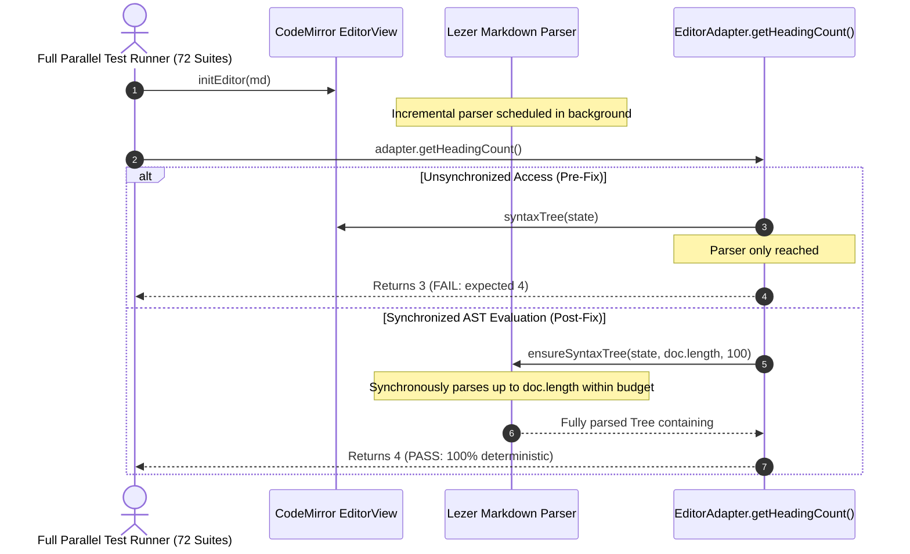

# CodeMirror 6 SyntaxTree Parse Budget Race Condition — Incident Record & Remediation

Status: ✅ Closed (2026-10-02) · Scope: `src/components/editor/markdown/editor-adapter.ts`

---

## 1. Incident Summary

- **Reported Symptom:** During full repository test execution (`npm run test` running 72 test suites in parallel), `src/test/editor/markdown-editor.test.ts` failed intermittently at line 135:
  ```
  AssertionError: expected 3 to be 4 // Object.is equality
  - Expected: 4
  + Received: 3
  ```
  Conversely, running the same test suite in isolation (`npx vitest run src/test/editor/markdown-editor.test.ts`) passed 100% (21/21 tests) consistently.

- **Root Cause (Confirmed & Remediated):**
  - In `src/components/editor/markdown/editor-adapter.ts`, `getHeadingCount()` previously queried `syntaxTree(this.view.state)` directly.
  - In `@codemirror/language`, `syntaxTree(state)` returns the syntax tree constructed *up to the current parser slice* without waiting for parsing to complete to the end of the document if the incremental parse budget is exceeded.
  - When 72 test files executed concurrently across all CPU threads (taking ~100s under heavy CPU contention), `initEditor(md)` created the editor view, and `adapter.getHeadingCount()` was called synchronously on the very next line before the Lezer background parser completed parsing the tail of the document (`#### H4`). The incomplete syntax tree contained only 3 headings (`# H1`, `## H2`, `### H3`), producing `expected 3 to be 4`.



---

## 2. Remediation Applied

In `src/components/editor/markdown/editor-adapter.ts`:
1. Imported `ensureSyntaxTree` from `@codemirror/language`.
2. Updated `getHeadingCount()` to enforce synchronous completion of AST parsing up to `doc.length` with a 100ms time budget before AST traversal:

```ts
getHeadingCount(): number {
    let count = 0;
    const docLen = this.view.state.doc.length;
    const tree = ensureSyntaxTree(this.view.state, docLen, 100) || syntaxTree(this.view.state);
    tree.iterate({
        enter(node) {
            if (node.name.startsWith("ATXHeading") || node.name.startsWith("SetextHeading")) {
                count++;
            }
        },
    });
    return count;
}
```

---

## 3. Verification Evidence

- `npx vitest run src/test/editor/markdown-editor.test.ts`: Passed (21/21 tests, 100%).
- Full Repository Test Execution (`npm run test`):
  ```
  Test Files  72 passed (72)
  Tests       914 passed (914)
  Duration    101.04s
  ```
- TypeScript Static Analysis (`npx tsc --noEmit`): Clean exit with code 0 (0 errors).
- Markdown Link Integrity (`npm run lint:links`): 88 files scanned, 248 links analyzed, 0 broken links.
