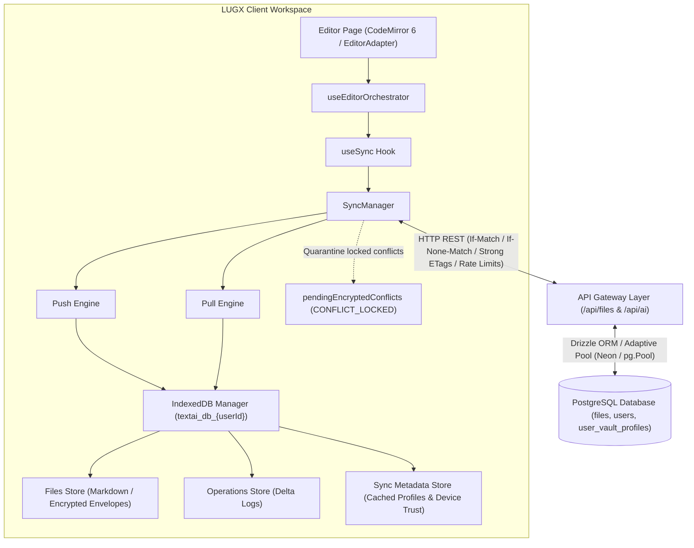
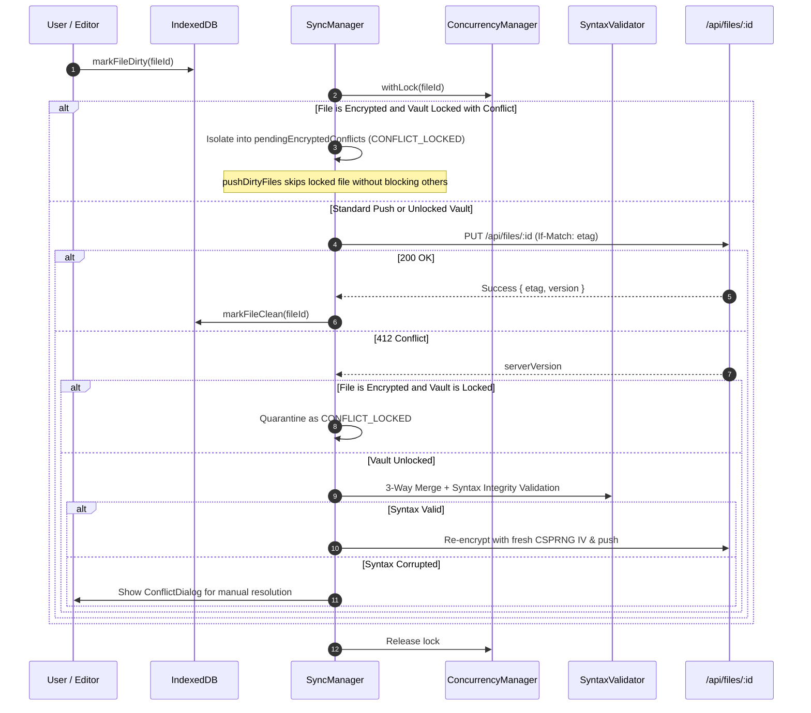
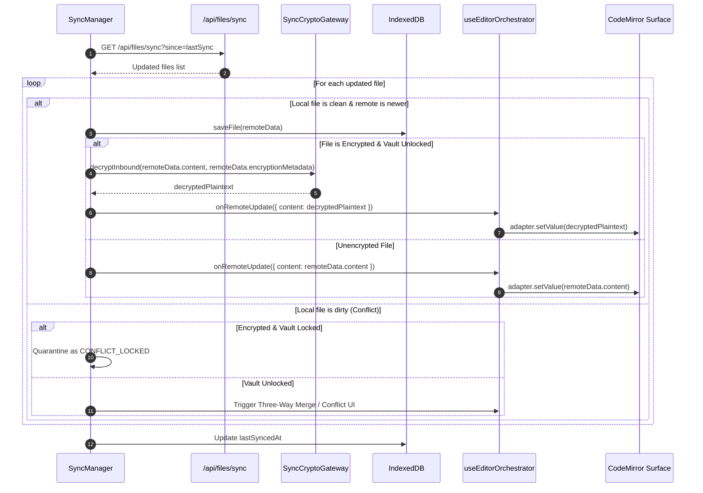
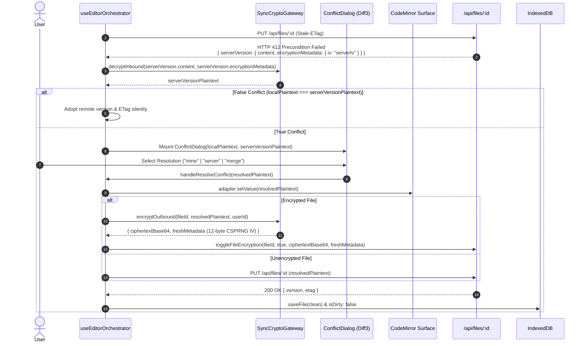

# Sync System Architecture

> Detailed architecture documentation for the synchronization system

## System Flow Diagram



---

## Layers & Components

### 1. Presentation & Orchestration Layer

| Component | Responsibility |
|-----------|----------------|
| `useEditorOrchestrator` | Centralized state controller, `vault_locked` hydration gate, pre-flight AI gating, and authoritative write gateway |
| `Editor Page` | Main user interface and Standalone Markdown Editor surface (CodeMirror 6 / EditorAdapter) |
| `AIToolbar` | Formatting tools, direction controls, and Zero-Knowledge AI shield privacy badge (`ai-encrypted-badge`) |
| `CreateVaultModal` | Zero-Knowledge vault initialization, BIP-39 mnemonic generation & 3-word challenge |
| `VaultUnlockModal` | Multi-modal unlock interface (Password, BIP-39 Seed, Hardware Biometrics PRF, 6-digit PIN) |
| `TrustDeviceModal` | Dual-mode trusted device setup (Hardware Biometrics WebAuthn PRF or 6-digit PIN) |
| `VaultSecurityCard` | Account security settings panel, AI opt-in toggle (`allowAIOnEncryptedFiles`), and device trust revocation |
| `FileContextMenu` | Dynamic encryption/decryption toggling and client-side re-encrypted copy execution |
| `useSync Hook` | Scoped React synchronization integration |
| `ConflictDialog` | Conflict resolution interactive UI with double-encryption guard (AUD-03) |
| `SyncIndicator` | Visual synchronization status indicator |

### 2. Business Layer

| Component | Responsibility |
|-----------|----------------|
| `SyncManager` | Push/Pull coordination, non-blocking sync with `CONFLICT_LOCKED` quarantine, and reactive unlock auto-resolution |
| `ConflictResolver` | Conflict detection, 3-way merge orchestration (LCS delta engine), and false conflict elimination |
| `SyntaxValidator` (`syntax-validator.ts`) | Post-merge Markdown syntax integrity verification (code fence pairing, GFM table alignment, null-byte prevention) |
| `ConcurrencyManager` | In-memory mutex promise locking per file ID |
| `ConnectionDetector` | Network monitoring with exponential backoff and jitter |
| `Vault Server Actions` (`vault-actions.ts`) | Atomic vault profile CRUD, AI setting persistence (`updateVaultAISetting`), and remote device revocation |
| `File Operations` (`file-ops.ts`) | Optimistic `toggleFileEncryption` & client-re-encrypted `copyFile` guard (AUD-02) |
| `AI Commit Action` (`ai-commit.ts`) | Transactional AI commit with Zero-Knowledge plaintext rejection and automatic reservation refunding |

### 3. Data & Cryptography Layer

| Component | Responsibility |
|-----------|----------------|
| `IndexedDBManager` | Local document & operations storage, offline vault profile caching, and device trust storage |
| `ETagGenerator` | Deterministic SHA-256 ETag generation with canonical JSON key serialization (`CANONICAL_ENVELOPE_KEYS`) |
| `SyncRollback` | State checkpoints & isolated failure recovery |
| `Encryption` (`encryption.ts`) | Dual-tier hybrid encryption orchestration (`AES-GCM-256` + AAD `vault:file:${userId}:${fileId}`) |
| `WebAuthn PRF Engine` (`webauthn-prf.ts`) | Hardware-bound biometrics key derivation via W3C Level 3 PRF extension & HKDF-SHA-256 |
| `PIN KEK Engine` (`encryption.ts`) | 6-digit PIN KEK derivation (PBKDF2 600K iterations, $1,000,000$ combinations) |
| `Device Trust Wrapping` (`encryption.ts`) | AES-GCM-256 wrapping, 30-day expiry, 5-attempt anti-brute-force lockout |
| `CryptoWorkerBridge` | Typed isomorphic RPC bridge with self-healing circuit breaker & automatic queue drain |
| `SyncCryptoGateway` (`sync-crypto-gateway.ts`) | Transparent inbound decryption (server IV + MasterKey) & fresh outbound CSPRNG IV re-encryption |
| `crypto-utils.ts` | Decoupled cryptographic primitives, W3C chunked CSPRNG & RAM sanitization (`wipeBuffer`) |
| `crypto.worker.ts` | Isolated Web Worker for PBKDF2 (600,000 iter) & heavy symmetric offloading |
| `SessionKeyStore` | Volatile RAM-only key manager with 1-hour auto-lock, unlock event subscription, and CodeMirror keystroke touch |
| `BIP39 Mnemonic` (`mnemonic.ts`) | Standard 12-word seed generation & 4-bit SHA-256 checksum verification |

---

## Sync Flows

### Push Flow (Local → Server)



### Pull Flow (Server → Local)



### Conflict Resolution Flow (HTTP 412)




---

## Protection Mechanisms

### 1. Optimistic Locking (ETags)
```http
PUT /api/files/:id
If-Match: "current-etag"

→ 200 OK (etag matched)
→ 412 Precondition Failed (conflict)
```

### 2. File-Level Locking
```typescript
await concurrencyManager.withLock(fileId, async () => {
  // Safe: only one operation at a time per file
});
```

### 3. Checkpoint/Rollback
```typescript
const checkpoint = await rollback.createCheckpoint(fileId, 'pre_sync');
try {
  await riskyOperation();
} catch {
  await rollback.rollback(checkpoint);
}
```

### 4. Tab Wakeup Auto-Healing & Local Durability (`useEditorOrchestrator`)
```typescript
// Replays pending IndexedDB persistence upon visibilitychange/focus
if (document.visibilityState === "visible" && pendingLocalSyncRef.current) {
  pendingLocalSyncRef.current = false; // Synchronous consumption prevents dual-event race
  await syncHookRef.current.saveLocal({ ... });
}
```

---

## Error Handling

| Error Type | Response |
|------------|----------|
| `NETWORK_ERROR` | Retry with exponential backoff |
| `CONFLICT_ERROR` | Show ConflictDialog |
| `RATE_LIMIT_ERROR` | Wait + Retry |
| `AUTH_ERROR` | Redirect to login |
| `QUOTA_EXCEEDED` | Alert user + cleanup |
| `STORAGE_ERROR` | Log + graceful degradation |

---

## React Integration

Actual hook contract from [`src/hooks/use-sync.ts`](../../src/hooks/use-sync.ts):

```tsx
import { useSync } from '@/hooks/use-sync';

function EditorPage({ fileId }: { fileId: string }) {
  const {
    status,           // SyncStatus: 'idle' | 'loading' | 'queued' | 'syncing' |
                      //   'conflict' | 'failed' | 'stopped' | 'offline'
    connectionState,  // ConnectionState from ConnectionDetector
    isInitialized,    // boolean
    lastSyncResult,   // SyncResult | null
    pendingCount,     // number of dirty files awaiting sync
    sync,             // () => Promise<SyncResult>
    syncFile,         // (fileId: string) => Promise<void>
    saveLocal,        // (file: Partial<IDBFile> & { id, content }) => Promise<void>
    loadLocal,        // (fileId: string) => Promise<IDBFile | null>
    markDirty,        // (fileId: string) => Promise<void>
  } = useSync({
    userId,
    autoSyncInterval: 30000,
    // Conflicts are NOT returned by the hook; they surface either through the
    // optional `onConflict` callback option or through the editor orchestrator
    // (see docs/architecture/editor-sync-orchestration.md).
    onConflict: async (conflict) => 'merge',
  });

  return (
    <>
      <SyncIndicator status={status} pending={pendingCount} />
      <Editor onSave={saveLocal} initialContent={loadLocal} />
    </>
  );
}
```

---

## Performance & Optimization

### Rate Limiting
- **Sync API:** 100 requests per user per 15-minute sliding window
- **File API:** 200 requests per user per 15-minute sliding window
- Sliding-window counters backed by Upstash Redis

### Garbage Collection
- Merge consecutive operations (compaction threshold: 1,000 operations per file — `IDB_CONFIG.MAX_OPERATIONS_PER_FILE`)
- Delete operations older than 7 days (`IDB_CONFIG.MAX_OPERATION_AGE_MS`), never touching `queued`, `syncing`, `conflict`, or `rollback_failed` entries
- Scheduled via `gc.schedule()` with a default interval of **10 minutes** (minimum spacing between runs: 5 minutes)

### Performance Monitoring
```typescript
performanceMonitor.startTiming('syncFile');
await syncFile(fileId);
performanceMonitor.endTiming('syncFile');
// Logs: [Performance] syncFile: 234ms
```
